دائرة الدعم الحكومي
DEPARTMENT OF GOVERNMENT SUPPORT

# Procurement Manual

## (SAP Ariba Aligned)

## Issued pursuant to the Abu Dhabi Procurement Standards

P.O.Box 981 Abu Dhabi, United Arab Emirates الإمارات العربية المتحدة، أبوظبي 981 ص.ب

T +971 (0)2 508 8888  F +971 (0)2 699 7420

dgs.gov.ae


---


دائرة الإسناد الحكومي
DEPARTMENT OF GOVERNMENT SUPPORT

<table>
<tr>
<td>Document Title</td>
<td>Procurement Maual (SAP Ariba Aligned)</td>
</tr>
<tr>
<td>Version</td>
<td>V 1.0</td>
</tr>
<tr>
<td>Date Published</td>
<td>18th April 2021</td>
</tr>
</table>

<table>
<thead>
<tr>
<th>Version</th>
<th>Date</th>
<th>Author</th>
<th>Approver</th>
</tr>
</thead>
<tr>
<td>V 1.0</td>
<td>24th March 2021</td>
<td>Government Procurement Office</td>
<td>Abu Dhabi Executive Council</td>
</tr>
</table>

<table>
<tr>
<td>Issued By</td>
<td>H.E. Ali Rashed Al Ketbi<br>Chairman, Department of Government Support - Abu Dhabi</td>
</tr>
</table>

1
Procurement Manual (SAP Ariba Aligned)


---


دائرة الإسناد الحكومي
DEPARTMENT OF GOVERNMENT SUPPORT

# 1. Introduction ..................................................................................................................... 5

## 1.1 Introduction to Procurement Manual .............................................................................................. 5

### 1.1.1 Purpose of the Procurement Manual .................................................................................................. 5

### 1.1.2 Scope of the Procurement Manual ..................................................................................................... 5

### 1.1.3 Structure of the Manual ...................................................................................................................... 5

## 1.2 Procurement Operating Model ......................................................................................................... 7

### 1.2.1 Category Classification ........................................................................................................................ 8

### 1.2.2 Category Taxonomy ............................................................................................................................. 8

## 1.3 Procurement Capability Model ......................................................................................................... 9

### 1.3.1 Strategic Procurement Capability (Level 1) ....................................................................................... 10

### 1.3.2 Tactical Procurement Capability (Level 1) ......................................................................................... 10

### 1.3.3 Operational Procurement Capability (Level 1) .................................................................................. 10

### 1.3.4 Supporting Capability (Level 1) .......................................................................................................... 10

## 1.4 Procurement Benefits ...................................................................................................................... 11

### 1.4.1 Definitions ......................................................................................................................................... 11

### 1.4.2 General Principles .............................................................................................................................. 12

### 1.4.3 Calculation Methodologies ................................................................................................................ 12

## 1.5 Legislations applicable for Procurement ......................................................................................... 16

### 1.5.1 Abu Dhabi Local Content (ADLC) ....................................................................................................... 16

### 1.5.2 Economic Incentives for MSMEs (Micro, Small, and Medium Enterprises) ....................................... 16

### 1.5.3 Economic Incentives for Emirati Entrepreneurs ................................................................................ 17

# 2. Procurement Processes Groups ........................................................................................... 18

## 2.1 Procurement Strategy ...................................................................................................................... 18

### 2.1.1 Overview ............................................................................................................................................ 18

### 2.1.2 RACI Matrix ........................................................................................................................................ 22

## 2.2 Demand and Category Management (DCM) .................................................................................... 22

### 2.2.1 Overview ............................................................................................................................................ 22

### 2.2.2 "SAP Ariba Modules" Overview ......................................................................................................... 23

### 2.2.3 Details of the Level 3 Processes ........................................................................................................ 24

### 2.2.4 Work Aids – Forms and Documents .................................................................................................. 43

2
Procurement Manual (SAP Ariba Aligned)


---


DEPARTMENT OF GOVERNMENT SUPPORT

2.2.5     RACI Matrix.......................................................................43

2.3       Source to Contract (S2C) ..................................................................44

2.3.1     Overview............................................................................44

2.3.2     "SAP Ariba Module" Overview ...........................................46

2.3.3     Details of the Level 3 Processes ........................................47

2.3.4     Work Aids - Forms and Documents...................................80

2.3.5     RACI Matrix........................................................................81

2.4       Contract Lifecycle Management (CLM) ...........................................82

2.4.1     Overview............................................................................82

2.4.2     "SAP Ariba Module" Overview ...........................................84

2.4.3     Details of the Level 3 Processes ........................................85

2.4.4     Work Aids – Forms and Documents.................................109

2.4.5     RACI Matrix......................................................................109

2.5       Supplier Performance and Relationship Management (SPRM) .....110

2.5.1     Overview..........................................................................110

2.5.2     "SAP Ariba Modules" Overview.......................................111

2.5.3     Details of the Level 3 Processes ......................................112

2.5.4     Work Aids – Forms and Documents................................130

2.5.5     RACI Matrix......................................................................130

2.6       Requisition to Pay (R2P) ................................................................130

2.6.1     Overview..........................................................................130

2.6.2     Details of Level 3 Processes.............................................131

2.6.3     Work aids – Forms and Documents ................................144

2.6.4     RACI Matrix......................................................................145

2.7       Risk and Regulation (R&R).............................................................145

2.7.1     Overview..........................................................................145

2.7.2     "SAP Ariba module" Overview ........................................147

2.7.3     Details of the Level 3 Processes ......................................148

2.7.4     Work Aids – Forms and Documents................................161

2.7.5     RACI Matrix......................................................................161

3
Procurement Manual (SAP Ariba Aligned)


---


دائرة الإسناد الحكومي
DEPARTMENT OF GOVERNMENT SUPPORT

## 2.8 Supplier Master Data Management ...............................................................................................................161

### 2.8.1 Overview........................................................................................................................................... 161

### 2.8.2 "SAP Ariba Module" Overview .........................................................................................................163

### 2.8.3 Details of the Level 3 Processes ....................................................................................................... 164

### 2.8.4 Work Aids – Forms and Documents .................................................................................................181

### 2.8.5 RACI Matrix....................................................................................................................................... 182

## 2.9 Item Master Data Management.....................................................................................................................182

### 2.9.1 Overview........................................................................................................................................... 182

### 2.9.2 Details of the level 3 Processes ........................................................................................................183

### 2.9.3 RACI Matrix....................................................................................................................................... 183

## 2.10 User Master Data Management.....................................................................................................................184

### 2.10.1 Overview........................................................................................................................................... 184

### 2.10.2 "SAP Ariba – Core Administration" Overview ..................................................................................184

### 2.10.3 Details of the Level 3 Processes ....................................................................................................... 184

### 2.10.4 Work Aids – Documents and "SAP Ariba" templates....................................................................... 188

### 2.10.5 RACI Matrix....................................................................................................................................... 188

# 3. Appendix............................................................................................................................189

## 3.1 Process Maps..................................................................................................................................................189

## 3.2 List of Figures..................................................................................................................................................236

## 3.3 List of Tables................................................................................................................................................... 239

## 3.4 Glossary of Terms...........................................................................................................................................242

## 3.5 Glossary of Definitions ...................................................................................................................................243

4
Procurement Manual (SAP Ariba Aligned)


---


دائرة الإسناد الحكومي
DEPARTMENT OF GOVERNMENT SUPPORT

# 1. Introduction

## 1.1 Introduction to Procurement Manual

### 1.1.1 Purpose of the Procurement Manual
The Procurement Manual provides operational procedures to the *Procurement* practitioners. It reinforces the Procurement Standards, the Procurement Charter, and the Procurement Delegation of Authority (PDoA), giving a more detailed explanation of their application.

### 1.1.2 Scope of the Procurement Manual
The Procurement Manual applies to all procurement activities conducted by the government Entities and the Government Procurement Office (GPO). The Executive Council (EC), or a relevant body authorised by the EC, may exclude an Entity from the application of the Procurement Manual. The Procurement Manual covers all relevant procurement processes and serves as the operational framework.

### 1.1.2.(I) List of Exemptions
The Procurement Manual does not apply to:
1) Staff salaries and benefits.
2) Direct employment contracts or the engagement individual experts which cannot be subject to tender.
3) General and administration expenses for non-predefined technical specifications, electricity, water, utilities, accommodation rentals provided to the employees and governed by the housing policies, professional and non-professional bodies' subscriptions, fee paid to organisers of conferences/exhibitions.
4) Agreements among government Entities or with international professional bodies for the purposes of research/collaboration/promotions.
5) Sponsorships and grants.
6) Purchase of artworks, artifacts, and associated ancillary expenses.
7) Copyrights license fees except where there is a contractual obligation to purchase goods, services or projects.
8) Reimbursement of adhoc expenses incurred during travel (below Petty Cash threshold).
9) Mandatory or Regulatory fees (such as court fees, duties and taxes, bank fees etc.)
10) Any other exceptions approved by the Executive Council (EC).

### 1.1.3 Structure of the Manual
The structure of the Procurement Manual is aligned to the Procurement Capability Model (refer to Figure 1.3.1):
1) Level 1 - Procurement capabilities are classified into Strategic, Tactical, Operational, and Support capabilities.

5
Procurement Manual (SAP Ariba Aligned)


---


دائرة الإسناد الحكومي
DEPARTMENT OF GOVERNMENT SUPPORT
[Government emblem/logo]

2) Level 2 - Each procurement capability includes one or more procurement process group.
3) Level 3 - Each procurement process group consists of procurement processes.

**Important Note: All Procurement processes must be executed in line with the Procurement Standards.**

Procurement process groups are enabled through "SAP Ariba modules". They are covered in the manual as per the following structure:

1. Overview of the Process Group
2. Overview of the "SAP Ariba module"
3. Details of level 3 Processes
   i. (B) Scope and Purpose
   ii. (B) Process Flow and Key Tasks
   iii. (S) Roles and Responsibilities
   iv. (B) Process Summary
4. Work Aids – Forms and Documents
5. RACI Matrix
6. References to 'SAP Ariba Procurement User Guide'

Sections marked with a (B)-prefix elaborate the business aspects of the procurement processes and sections marked with an (S)-prefix describe the "SAP Ariba" aspects of the procurement processes.

**References to 'SAP Ariba Procurement User Guide'** section provides reference to the section detailing the respective system tasks and functionalities in the "SAP Ariba User Guide".

Procurement process maps, lists of tables and figures, and glossary of terms and definitions are provided in the Appendix.

Procurement practitioners reading this manual should consider the following points:

1) Procurement business roles are in ***bold Italic*** (e.g., ***Sourcing Specialist***) while system roles are in "double quotes"(e.g., "Project Owner").
2) Key business terms, keywords, and documents are in 'single quotes' (e.g., 'Supplier Segmentation Report', 'Sourcing Strategy', etc.).
3) Key system terms, keywords, and documents are highlighted in "double quotes" (e.g., "Sourcing Request", "Contract Workspace" etc.).
4) Matters critical from a feasibility or compliance perspective are highlighted as **Important Note** (e.g., **Important Note: All Procurement processes must be executed in line with the Procurement Standards**).
5) Reference to other documents or sections within the Procurement Manual is highlighted as <ins>*underlined italics*</ins> (e.g., <ins>*Please refer to section 2.5.3.(II) for the details of the 'Supplier Development and Collaboration' processes*</ins>).

6
Procurement Manual (SAP Ariba Aligned)


---


دائرة الإسناد الحكومي
DEPARTMENT OF GOVERNMENT SUPPORT

## 1.2 Procurement Operating Model

The *Procurement* consists of the Government Procurement Office (GPO) and Entity *Procurement*. The Procurement Operating Model provides mandate, empowerment, and responsibilities of the Government Procurement Office (GPO) and Entity *Procurement*.

<table>
<tr>
<td rowspan="5">
■ EC<br>
■ GPO<br>
ADGEs
</td>
<td colspan="3">Government Procurement Framework</td>
<td rowspan="5">Trainings and Framework Maintenance</td>
</tr>
<tr>
<td>MDM</td>
<td>Vendor Management</td>
<td>Source to Contract</td>
</tr>
<tr>
<td colspan="3">Request to Pay</td>
</tr>
<tr>
<td rowspan="2">CAPEX Projects<br><br>Common Categories<br><br>Entity Specific Categories</td>
<td colspan="2">Government Procurement Office (GPO)</td>
</tr>
<tr>
<td colspan="2">Maintenance of the Procurement eGate</td>
</tr>
</table>

*Figure 1.2.1 Procurement Capability Model*

The Government Procurement Office (GPO) is established to fulfil the following objectives:

1) Acting on behalf of the Entities to consolidate demand for achieving economies of scale. The GPO is authorized to manage and execute sourcing for Common Categories.

2) Providing shared services such as Supplier Registration, Item Master Management, User Master Management, and Training.

3) Maintaining the Procurement Framework ensuring a standardized and efficient way of working of the *Procurement*.

4) Developing and operating the information technology platform for government procurement (eGate).

5) Running market development initiatives and managing partnerships with the private sector in coordination with the relevant authorities.

Entity *Procurement* is responsible for procurement of the Entity-Specific Categories including sourcing, contracting, ordering, and managing *Supplier* performance. The Entity *Procurement* utilizes the shared services provided by the GPO.

7
Procurement Manual (SAP Ariba Aligned)


---


DEPARTMENT OF GOVERNMENT SUPPORT

The GPO engages stakeholders from the Entities and dedicated *Finance, Legal* or other resources as needed for procuring Common Categories. The Entity *Procurement* engages *End-Users* and dedicated *Finance, Legal* or other resources for procuring Entity-Specific Categories.

## 1.2.1 Category Classification

Classification of a category as a Common Category or an Entity-Specific Category depends on the category spend value and its commonality across Entities. A category that is procured by five or more Entities may be considered as a Common Category.

<table>
<tr>
<td rowspan="2" style="writing-mode: vertical-lr; text-align: center; vertical-align: middle;"><strong>Category Spend Value</strong></td>
<td style="background-color: #4472C4; color: white; padding: 10px;">
<strong>C</strong><br>
<strong>High Value, common to few entities</strong><br>
• Owned by: Entities<br>
• Exception: Cross-Entities initiative if GPO has the expertise to coordinate
</td>
<td style="background-color: #70AD47; color: white; padding: 10px;">
<strong>A</strong><br>
<strong>High Value, common to most entities</strong><br>
• Owned by GPO<br>
• Exception: N/A
</td>
</tr>
<tr>
<td style="padding: 10px;">
<strong>D</strong><br>
<strong>Low Value, common to few entities</strong><br>
• Owned by: Entities<br>
• Exception: N/A
</td>
<td style="background-color: #4472C4; color: white; padding: 10px;">
<strong>B</strong><br>
<strong>Low Value, common to most entities</strong><br>
• Owned by GPO<br>
• Exception: GWA would not add any additional value
</td>
</tr>
<tr>
<td></td>
<td colspan="2" style="text-align: center; border-top: 2px solid black;">
<strong>Categories common to Entities</strong>
</td>
</tr>
</table>

*Figure 1.2.2 Common vs. Entity Specific Categories*

## 1.2.2 Category Taxonomy

Category taxonomy refers to a hierarchical assignment of goods/services. In line with global best practices, UNSPSC (United Nations Standard Products and Services Code) taxonomy is deployed in "SAP Ariba". It is a four-level taxonomy with each record represented with an eight-digit number and unique name, illustrated below:

8
Procurement Manual (SAP Ariba Aligned)


---


دائرة الإسناد الحكومي
DEPARTMENT OF GOVERNMENT SUPPORT

<table>
<tr>
<td>Level 1 (57)<br>Combined <em>Segment</em> Title</td>
<td>76000000<br><em>Industrial Cleaning Services</em></td>
</tr>
<tr>
<td>Level 2 (493)<br>Combined <em>Family</em> Title</td>
<td>76110000<br><em>Cleaning and janitorial services</em></td>
</tr>
<tr>
<td>Level 3 (6,482)<br>Combined <em>Class</em> Title</td>
<td>76111500<br><em>General building and office cleaning and maintenance services</em></td>
</tr>
<tr>
<td>Level 4 (80,178)<br>Combined <em>Commodity</em> Title</td>
<td>76111501<br><em>Building cleaning services</em></td>
</tr>
</table>

*Figure 1.2.3 UNSPSC Categorizations in "SAP Ariba modules"*

The four primary levels of the UNSPSC are Segment, Family, Class, and Commodity. Each level is identified by two digits, that constitute together an overall eight-digit code.

All Abu Dhabi DED activities are mapped to Level 2 UNSPSC categories. **Suppliers** are registered in the Supplier Master Database, maintained by the Department of Government Support (DGS), at Level 2 UNSPSC categories, and line items are created in "SAP Ariba" at Level 3 UNSPSC categories.

## 1.3 Procurement Capability Model

The Procurement Capability Model comprises of four types of procurement capabilities: Strategic, Tactical, Operational, and Support as illustrated below:

<table>
<tr>
<td><em>Strategic</em></td>
<td>Procurement Strategy</td>
<td colspan="2">Demand and Category Management</td>
</tr>
<tr>
<td><em>Tactical</em></td>
<td>Source to Contract</td>
<td>Contract Lifecycle Management</td>
<td>Supplier Performance and Relationship Management</td>
</tr>
<tr>
<td><em>Operational</em></td>
<td colspan="3">Requisition to Pay</td>
</tr>
<tr>
<td><em>Support</em></td>
<td>Risk and Regulation</td>
<td>Supplier Master Data Management</td>
<td>Item Master Data Management</td>
<td>User Master Data Management</td>
</tr>
</table>

*Figure 1.3.1 Procurement Capability Model*

9
Procurement Manual (SAP Ariba Aligned)


---


DEPARTMENT OF GOVERNMENT SUPPORT

### 1.3.1 Strategic Procurement Capability (Level 1)

1) **Procurement Strategy (Level 2)** process group includes procedures to develop strategy for the *Procurement* function in line with the overall strategy.

2) **Demand and Category Management (Level 2)** process group includes procedures to develop 'Category Strategy' to deliver value and drive cost savings, and 'Procurement Plan' to bridge the demand-supply gap.

### 1.3.2 Tactical Procurement Capability (Level 1)

1) **Source to Contract (Level 2)** process group includes procedures to conduct sourcing and award *Suppliers*.

2) **Contract Lifecycle Management (Level 2)** process group includes procedures to create and manage contracts.

3) **Supplier Performance and Relationship Management (Level 2)** process group includes the procedures to segment *Suppliers*, manage relationships with selected *Suppliers*, and evaluate and manage performance of *Suppliers*.

### 1.3.3 Operational Procurement Capability (Level 1)

1) **Requisition to Pay (Level 2)** process group includes procedures to create Purchase Requisition (PR), create Purchase Order (PO), receive goods/services/projects, create Goods/Services/Project Receipt, and reconcile invoice.

### 1.3.4 Supporting Capability (Level 1)

1) **Risk and Regulation (Level 2)** process group includes procedures to conduct risk profiling for *Suppliers*, identify and mitigate procurement risks, and implement regulatory changes.

2) **Supplier Master Data Management (Level 2)** process group includes procedures to register, qualify, disqualify, deactivate, and reactivate *Suppliers*.

3) **Item Master Data Management (Level 2)** process group includes procedures to add, modify, and remove goods/services from the master database.

4) **User Master Data Management (Level 2)** process group includes procedures to enable, modify, delegate and deactivate "SAP Ariba Users". It provides procedures to obtain access information and reset "SAP Ariba" password.

10
Procurement Manual (SAP Ariba Aligned)


---


DEPARTMENT OF GOVERNMENT SUPPORT

## 1.4 Procurement Benefits

This section provides the details regarding:

1) Definition of Baseline Spend and Procurement Benefits
2) General principles that apply to Baseline Spend and Procurement Benefits
3) Methodologies to calculate the Baseline Spend and Procurement Benefits

### 1.4.1 Definitions

i. **Baseline Spend**
   
   Baseline Spend is the foundation of the Procurement Benefits calculation. It is the value of addressable spend against which any benefit is measured. Establishing a baseline is the first step in the Procurement Benefits calculations process.

ii. **Classification of Procurement Benefits**
    
    Procurement Benefits can be classified into Cost Reduction, Cost Avoidance, and Cash Impact. Details of the same are provided below:

<table>
<thead>
<tr>
<th></th>
<th>Cost Reduction<br><i>'same for less'</i></th>
<th>Cost Avoidance<br><i>'avoiding future cost'</i></th>
<th>Cash Impact</th>
</tr>
</thead>
<tbody>
<tr>
<td>Definition</td>
<td>• Benefits that directly reduce the cost base compared to the baseline<br>• Costs can be one-offs or recurring/sustainable</td>
<td>• Cost was not included in the original baseline<br>• Action taken now to avoid future incremental costs<br>• Could include initiatives that lead to cost reduction in the future</td>
<td>• One - time impact of increased cash</td>
</tr>
<tr>
<td>Example</td>
<td>• Reduction in cost of software licenses resulting from optimization<br>• A one-time saving such as a rebate or volume reduction in the prior year.</td>
<td>• Consumption reduced because of increase in efficiency or optimization<br>• Price increase as a result of external factors, e.g. an increase in regulatory minimum wage, is offset by a reduced agency fee mark-up</td>
<td>• Cash impact due to outstanding payables with <i>Supplier</i> (increased 'Payment Terms')<br>• Sale or decrease of inventory</td>
</tr>
<tr>
<td>Measurement</td>
<td>• Hard benefits (savings or additional revenue) vs Baseline Spend<br>• Spend reduction year-over-year</td>
<td>• No increase in year-over-year spend particular to the relevant cost avoidance initiative (e.g., demand optimization)<br>• Cost avoidance demonstrated by comparing the variance in volume and price.</td>
<td>• One - time impact demonstrated by estimating benefits.</td>
</tr>
</tbody>
</table>

**Table 1.4.1 Procurement Benefits Classification**

11
Procurement Manual (SAP Ariba Aligned)


---


دائرة الإسناد الحكومي
DEPARTMENT OF GOVERNMENT SUPPORT

## 1.4.2 General Principles

Following general principles apply to the calculation of Baseline Spend and Procurement Benefits:

i. **Baseline principles**

1) An agreed baseline is required for Procurement Benefits calculations and must be signed-off by the relevant stakeholders from the *End-User*, the *Finance* and the *Procurement*.
2) Baseline could be historic actuals (e.g., prior year spend, budgeted spend, etc.).
3) The baseline must be supported by one or multiple data sets, such as Accounts Payable (AP) data, Purchase Orders (PO) data, Contracts data, etc.
4) An appropriate method to calculate the Baseline Spend should be determined for each type of procurement benefit.

ii. **Procurement Benefits calculation principles**

1) Procurement Benefits can be calculated after acceptance of a final, binding offer from one or more *Supplier(s)* and the acknowledgment of offer conditions (with written confirmation, Letter of Intent, contract amendment, etc.).
2) Benefits implementation costs (one-time investments) are excluded from the benefits calculation.

## 1.4.3 Calculation Methodologies

i. **Baseline Spend**

Baseline Spend is based on two parameters and is calculated as following:

*Baseline Spend = Total Volume * Baseline Unit Price*

Total volume may be known or unknown. However, two methods can be used for calculations to estimate volume, as detailed below:

<table>
<thead>
<tr>
<th>Method</th>
<th>Situation</th>
<th>Method</th>
</tr>
</thead>
<tbody>
<tr>
<td>Demand Plan Forecast Volume</td>
<td>Forecast is known</td>
<td>• 100% of forecast volume for the specific spend area</td>
</tr>
<tr>
<td>Historic forecast volume</td>
<td>Forecast is unknown</td>
<td>• 50% of historic volume + (50% of historic volume * category demand growth forecast %)<br>In general, previous year volumes are used as historic volumes; if this data is not available, the period that is used to calculate historic volume should be mentioned.</td>
</tr>
</tbody>
</table>

*Table 1.4.2 Volume Estimation Methodologies*

Baseline unit price may be estimated using one of the following methodologies:

12
Procurement Manual (SAP Ariba Aligned)


---


دائرة الإسناد الحكومي
DEPARTMENT OF GOVERNMENT SUPPORT

1) Historic price baseline
   Historic price baseline is relevant when the goods/services/projects were purchased previously (in last year). Below are the details of various methods to create a historic price baseline:

<table>
<thead>
<tr>
<th>Price Method</th>
<th>Situation</th>
<th>Method</th>
</tr>
</thead>
<tbody>
<tr>
<td>Last Price Paid</td>
<td>Used where market is not volatile (applicable for components and traded items like office furniture, etc.).</td>
<td>• Last actual paid price in the Purchase Order (PO), or<br>• Contracted price, if last actual paid price is not available</td>
</tr>
<tr>
<td>Average Price</td>
<td>Used in case of a volatile market (applicable for e.g., 100% index-based commodities)</td>
<td>• Average Price paid over the last year</td>
</tr>
<tr>
<td>Average quoted Market Price</td>
<td>Used in case of a volatile market (Commodities for which transparent and independent index are not available)</td>
<td>• Average Price of historical offers after clarification from the <em>Suppliers</em></td>
</tr>
</tbody>
</table>

*Table 1.4.3 Historic Baseline Price - Calculation Methodologies*

2) Comparable price baseline
   If a certain goods/service/projects has not been purchased previously, historic price baseline cannot be established. In such cases, the baseline price can be estimated using comparable goods/services/projects (identical or similar specifications) where the price is known. (e.g., estimating the baseline price for a car rental service by comparing it with similar services previously purchased by another Entity).

3) New price baseline
   If neither a historic nor a comparable baseline can be established, a new baseline can be developed based on the initial RFI or RFP/RFQ responses provided by the *Suppliers*. The baseline price will be calculated as an average of the approved initial quotes. Any price reductions received through follow-on RFP/ auction/negotiation is considered as benefits.

ii. Procurement Benefits
    As illustrated in Table 1.4.1, Procurement Benefits are classified into three buckets:

    1) Cost Savings
       Following are the various Cost Savings scenarios:

       a. Standard Method (last paid price – new price)
          This method is used when the savings result from the difference between baseline and negotiated price. For example, when *Suppliers* are changed or when similar goods/services are bundled, resulting in a better price per item. Savings in this scenario are calculated as follows:

          *Savings = (baseline price – negotiated price) * volume*

13
Procurement Manual (SAP Ariba Aligned)


---


دائرة الإسناد الحكومي
DEPARTMENT OF GOVERNMENT SUPPORT

b. **Free of charges Extra**
   These are the savings realized when contracts negotiated with **Suppliers** include 'extras' that have not been part of the goods/services/projects offering of past purchases. Savings in this scenario are calculated as follows:

   *Savings = Savings from free of charge 'extra' per unit * volume*

c. **Fluctuating market price with market Index**
   This method of calculation is used when the cost savings can be attributed to a changing market index that results in a better future price (with respect to the market price). This method is applicable for commodities (crude oil, metals, agri-commodities, etc.) where prices are linked to indices and change frequently. Savings in this scenario are calculated as follows:

*Savings = Forecasted spend with historical index value – forecasted spend with new index value*

d. **Fluctuating market price without market Index**
   This method of calculation is used when there are no market price references available. There may be no good benchmarks to indicate the savings w.r.t the market. Savings in this scenario are calculated as follows:

   *Savings = (Initial offer – negotiated offer) * expected volume*

e. **Volume Rebate**
   This method of calculation is used when the **Supplier** offers rebates on volume or similar incentives, which have not been included in previous purchases. Savings in this scenario are calculated as follows:

   *Savings = (new rebate per unit – old rebate per unit) * volume*

f. **Re-engineered specification (substitution) / rationalization**
   For some goods/services/projects, the specification can be changed to reduce the price. New specifications examples may include (but not limited to) using black and white printers instead of coloured printers, using standard cars instead of high-end cars for rentals, and using standard event designs instead of specialized events. Savings in this scenario are calculated as follows:

   *Savings = (Cost for original item/service – cost for substitute item/service) * volume*

g. **In-house vs. Outsourcing**
   For some categories, where services are provided in-house, outsourcing of services might be a viable option. Savings in this scenario are calculated as follows:

   *Savings = (In-house cost (i.e. labor cost + material cost + overhead cost) – purchase price) x volume*

14
Procurement Manual (SAP Ariba Aligned)


---


دائرة الإسناد الحكومي
DEPARTMENT OF GOVERNMENT SUPPORT

h. **Lease vs. Buy**
   For some categories lease of goods might be a viable alternative to buying (or vice versa).
   To compare the savings between leasing and buying options for goods, the cost per one
   unit needs to be calculated and compared. Savings in this scenario are calculated as follows:

   *Savings = (Cost of purchasing per unit - leasing cost per unit) * volume*

i. **Reduced Cost of Disposal**
   At the end of their lifetime, some goods (e.g., Laptop) may be recycled. These costs need
   to be considered to determine the actual price of a product. Savings in this scenario are
   calculated as follows:

   *Savings = Historic cost for disposal – new cost for disposal*

2) **Cost Avoidance**
   Following are various Cost Avoidance scenario:

   a. **Demand reduction/yield improvement**
      This method of calculation is used when the volume of a defined goods/service/projects has
      been reduced through active negotiations by *Procurement*, (i.e., demand control). Savings
      in this scenario are calculated as follows:

      *Savings = (Last volume – negotiated new volume) * last price*

   b. **Reduced cost of service**
      This method is used to calculate the cost reductions for service (e.g., reduced maintenance
      cost through introduction of preventive measures). Savings in this scenario are calculated as
      follows:

      *Savings = (Historic service cost – new service cost)*

3) **Cash Impact**
   Following are the various Cash Impact scenarios:

   a. **Inventory reduction**
      This method is used when the involvement of *Procurement* leads to a reduction of
      inventories (e.g., stock) and results in significant cost savings. Savings in this scenario are
      calculated as follows:

      *Savings = (Old Inventory levels – New Inventory levels) x WACC*
      (WACC – Weighted Average Cost of Capital)

15
Procurement Manual (SAP Ariba Aligned)


---


DEPARTMENT OF GOVERNMENT SUPPORT

b. **Payment term extension**
   This method is used when the involvement of *Procurement* results in a change of 'Payment Terms' and leads to a working capital improvement. Savings in this scenario are calculated as follows:

   *Savings = Working Capital Improvement = Average monthly invoice from supplier (VAT included) * New Payment terms (in days) / 30 * WACC*

   (VAT – Value added tax; WACC – Weighted Average Cost of Capital)

## 1.5 Legislations applicable for Procurement

### 1.5.1 Abu Dhabi Local Content (ADLC)
The Abu Dhabi Local Content Program aims to direct government spending towards the development of the local economy in the Emirate of Abu Dhabi. The tenders published by government entities must ask for the submission of the ICV Certificate, sponsored by the Department of Economic Development of Abu Dhabi.

The weight given to the local content must constitute 40% of the overall score allocated to the financial/commercial evaluation score. The program will encourage suppliers to participate in government tenders to increase their economic contribution in Abu Dhabi through Emiratization, Investments, and Locally procured goods and services. For further information regarding the Abu Dhabi Local Content program, please visit https://idb.added.gov.ae/

### 1.5.2 Economic Incentives for MSMEs (Micro, Small, and Medium Enterprises)
The Abu Dhabi Department of Economic Development (AD-DED) recognizes the following types of businesses as MSMEs:

<table>
<thead>
<tr>
<th></th>
<th>Economic Facilities</th>
<th>Number of employees</th>
<th>Annual Revenue (AED)</th>
</tr>
</thead>
<tbody>
<tr>
<td rowspan="3">Trade Sector</td>
<td>Micro</td>
<td>5 or less</td>
<td>< 3 million</td>
</tr>
<tr>
<td>Small</td>
<td>6 to 50</td>
<td>3 to less than 50 million</td>
</tr>
<tr>
<td>Medium</td>
<td>51 to 100</td>
<td>50 to 250 million</td>
</tr>
<tr>
<td rowspan="3">Industry Sector</td>
<td>Micro</td>
<td>9 or less</td>
<td>< 3 million</td>
</tr>
<tr>
<td>Small</td>
<td>10 to 100</td>
<td>3 to less than 50 million</td>
</tr>
<tr>
<td>Medium</td>
<td>101 to 250</td>
<td>50 to 250 million</td>
</tr>
<tr>
<td rowspan="3">Services Sector</td>
<td>Micro</td>
<td>5 or less</td>
<td>< 2 million</td>
</tr>
<tr>
<td>Small</td>
<td>6 to 50</td>
<td>2 to less than 20 million</td>
</tr>
<tr>
<td>Medium</td>
<td>51 to 250</td>
<td>20 to 250 million</td>
</tr>
</tbody>
</table>

*Table 1.5.1 MSME Classification*

16
Procurement Manual (SAP Ariba Aligned)


---


دائرة الإسناد الحكومي
DEPARTMENT OF GOVERNMENT SUPPORT

The Department of Government Support (DGS) has announced the following economic incentives in government *Procurement* for MSMEs:

1. All Entities/GPO shall allocate 15% of their annual purchases and contracts to MSMEs.
2. All MSMEs shall be exempted from submitting the Bid Bond bank guarantee.
3. All MSMEs shall be exempted from submitting the Performance Bond bank guarantee, provided that the Entities reserves 5% of the value of each invoice due for a period of 3 months after the final delivery.
4. All dues shall be paid to the MSMEs within a period of 15 days from the date of the invoice.
5. The Entity must submit quarterly reports to the GPO on the implementation of the above guidelines.

## 1.5.3 Economic Incentives for Emirati Entrepreneurs

The organizations having Abu Dhabi DED commercial licenses and owned in 100% by UAE nationals (including partners) are recognized as Emirati Entrepreneurs by the Abu Dhabi Department of Economic Development (AD-DED).

The Department of Government Support (DGS) has announced the following economic incentives in government *Procurement* for Emirati Entrepreneurs:

1. All Emirati Entrepreneurs shall be exempted from submitting the Bid Bond bank guarantee.
2. All Emirati Entrepreneurs shall be exempted from submitting the Performance Bond bank guarantee, provided that the Entity reserves 5% of the value of each invoice due for a period of 3 months after the final delivery.
3. All dues shall be paid to the Emirati Entrepreneurs within a period of 15 days from the date of the invoice.
4. The Entities must submit quarterly reports to the GPO on the implementation of the above guidelines.

17
Procurement Manual (SAP Ariba Aligned)


---


دائرة الإسناد الحكومي
DEPARTMENT OF GOVERNMENT SUPPORT

## 2. Procurement Processes Groups

### 2.1 Procurement Strategy

#### 2.1.1 Overview

'Procurement Strategy' is a high-level document that states an Entity's approach to achieving its procurement objectives, executing its activities and key initiatives. The 'Procurement Strategy' is created with mid-to-long term perspective and updated yearly. Key elements of value proposition addressed by the 'Procurement Strategy' include (but not limited to):

<table>
<tr>
<td>Increased Value to the Entity</td>
<td>Improved Efficiency and Effectiveness</td>
</tr>
<tr>
<td>Greater Stakeholders Alignment</td>
<td>Enhanced External Partnerships</td>
</tr>
</table>

*Figure 2.1.1 Value Proposition – Procurement Strategy*

'Procurement Strategy' guides on allocation of resources and budget for strategic initiatives.

The 'Procurement Strategy' aligns procurement activities with the overall Entity strategy and Abu Dhabi Governmental initiatives The *Head of Procurement* is responsible for the creation of the Procurement Strategy. The *Head of Procurement* assigns key members from *Procurement* to create and monitor execution of the 'Procurement Strategy'.

Development of the 'Procurement Strategy' is an offline process. Following are the key steps to develop a 'Procurement Strategy':

#### 2.1.1.(I) Step 1 – Internal and External Analysis

i. <ins>Analyze procurement practice</ins>
   The assigned key members conduct an analysis of the Entity *Procurement* on following aspects to identify procurement optimization initiatives:
   1) People

18
Procurement Manual (SAP Ariba Aligned)


---


دائرة الإسناد الحكومي
DEPARTMENT OF GOVERNMENT SUPPORT

2) Processes
3) Technology
4) Governance.

This leads to a better understanding the *Procurement* from the perspective of operating processes, organizational excellence, and knowledge and information management. Post this analysis, various models (such as SWOT analysis) can be utilized to identify the key competencies and major areas of improvement.

ii. **Spend analysis**
In addition to above, spend data may be collated and analysed for additional optimization opportunities. This analysis provides insights into historical spend, *Supplier* base, and spend categories to identify the focus areas for improvement.

iii. **Market analysis**
Assigned key members analyse the evolution of markets, trends and conditions to assess their impact on the *Procurement*. The necessary data may be collected through primary and secondary sources. This data is updated over time, to maintain relevance. Various methodologies, such as Porter's five forces (industry rivalry, buyer power, *Supplier* power, threat to new entrant, substitution possibilities), TOWS (Threat, Opportunities, Weakness, and Strengths) and PESTLE (political, economic, social, technological, legal and environmental) analysis may be used.

iv. **Benchmarking**
A 'Competitive Assessment', conducted through survey and benchmarking, may show Entity's strengths / weaknesses with respect to industry best practices.

The '*Procurement* Strategy' addresses the areas of improvements and adjustments required to remain relevant with respect to the changes in the market.

## 2.1.1.(II) Step 2 – Develop Procurement Strategy

The '*Procurement* Strategy' includes the following:

i. **Vision and Mission**
The vision and mission of the *Procurement* is derived from the vision and mission of the Entity.

ii. **Goals / Objectives**
Based on the analysis done in previous sections, assigned members develop clear objectives for the *Procurement*. Following are few examples of objectives and associated guiding principles for the *Procurement*:

19
Procurement Manual (SAP Ariba Aligned)


---


دائرة الإسناد الحكومي
DEPARTMENT OF GOVERNMENT SUPPORT

<table>
<thead>
<tr>
<th>Guiding Principles</th>
<th>Procurement Objectives Example</th>
</tr>
</thead>
<tbody>
<tr>
<td>Align to Abu Dhabi government strategy</td>
<td>• Scale the Entity's procurement capabilities to enable alignment with agenda of the Entity<br>• Promote MSMEs and Emirati Entrepreneurs<br>• <ins>Empower green procurement through awareness & specifications enhancement</ins></td>
</tr>
<tr>
<td>Deliver Processes and Cost Efficiencies</td>
<td>• Reduce cycle time for procurement processes<br>• Execute Strategic Sourcing to meet requirements at a competitive cost<br>• Bring innovations and spend insights to the Entity</td>
</tr>
<tr>
<td>Improve Governance</td>
<td>• Enhance visibility and control on Entity spend</td>
</tr>
</tbody>
</table>

*Table 2.1.1 Examples - Procurement Objectives*

iii. **Key Initiatives**

The objectives identified in the 'Procurement Strategy' are achieved through initiatives. The initiatives are expressed with measurable outputs. These identified initiatives must be SMART (specific, measurable, achievable, realistic, and timely). Following are the examples of initiatives and outputs:

<table>
<thead>
<tr>
<th>Procurement Objective</th>
<th>Initiatives</th>
<th>Output</th>
</tr>
</thead>
<tbody>
<tr>
<td>Execute Strategic Sourcing to meet requirements at competitive cost</td>
<td>• Conduct Strategic Sourcing for categories contributing to top 80% of the Entity Spend</td>
<td>• Achieve xx% annual savings across Common Categories</td>
</tr>
<tr>
<td>Enhance visibility and control on Entity spend</td>
<td>• Conclude demand gathering by Q3<br>• Analyse tail spend (bottom 20%) to identify opportunities of increasing spend under compliance</td>
<td>• Decrease unplanned spend by xx %<br>• Increase spend coverage under PR-PO by xx%</td>
</tr>
<tr>
<td>Reduce cycle times for procurement processes</td>
<td>• Include draft contract agreements in 100% of tenders</td>
<td>• Decrease cycle time of contract signing by x%</td>
</tr>
</tbody>
</table>

*Table 2.1.2 Examples – Procurement Initiatives and Outputs*

Following details should be provided for each initiative in the 'Procurement Strategy' document:

1. Name and short description with expected outputs
2. Implementation plan (including timelines and milestones)
3. Business case indicating costs and expected impact, if applicable
4. Potential challenges, risks and issues
5. Initiative Owner and resources required to execute
6. RACI for key activities

20
Procurement Manual (SAP Ariba Aligned)


---


دائرة الإسناد الحكومي
DEPARTMENT OF GOVERNMENT SUPPORT

iv. Prioritization of Initiatives

The initiatives should be prioritized considering the ease of implementation and their impact/value. Initiatives may also be classified as quick wins, if applicable. Below is an illustrative example of prioritization of initiatives:

<table>
<thead>
<tr>
<th></th>
<th>Low Value</th>
<th>High Value</th>
</tr>
</thead>
<tbody>
<tr>
<td>High Ease of Implementation</td>
<td>Quick Wins</td>
<td>High Priority</td>
</tr>
<tr>
<td>Low Ease of Implementation</td>
<td>Medium Priority</td>
<td>High Priority</td>
</tr>
</tbody>
</table>

*Figure 2.1.2 Initiatives Prioritization*

v. Implementation plan

An overall high-level implementation plan and a short-term detailed action plan must be prepared for the execution of the 'Procurement Strategy'. Below is an illustrative example of an implementation plan:

<table>
<thead>
<tr>
<th></th>
<th></th>
<th>Month 1</th>
<th>Month 2</th>
<th>Month 3</th>
</tr>
</thead>
<tbody>
<tr>
<td rowspan="3">Initiative 1</td>
<td>Activity 1</td>
<td>████████████</td>
<td></td>
<td></td>
</tr>
<tr>
<td>Activity 2</td>
<td>████████</td>
<td>████████████</td>
<td></td>
</tr>
<tr>
<td>Activity 3</td>
<td></td>
<td>████████</td>
<td>████████████</td>
</tr>
<tr>
<td rowspan="2">Initiative 2</td>
<td>Activity 1</td>
<td></td>
<td>████████████</td>
<td>████████</td>
</tr>
<tr>
<td>Activity 2</td>
<td>████████</td>
<td>████████████</td>
<td>████████████</td>
</tr>
</tbody>
</table>

*Figure 2.1.3 Example - Implementation Plan*

**2.1.1.(III)Step 3 - Approve 'Procurement Strategy'**

The 'Procurement Strategy' is submitted for approval of the Procurement Committee, which is followed by the approval of the Chairman of the government entity.

21
Procurement Manual (SAP Ariba Aligned)


---


دائرة الإسناد الحكومي
DEPARTMENT OF GOVERNMENT SUPPORT

## 2.1.1.(IV) Step 4 – Execute 'Procurement Strategy'

Execution of the 'Procurement Strategy' may require involvement from other business functions (e.g., *Finance*, *End-User* etc.). Execution of the 'Procurement Strategy' must be regularly monitored by the team that created the 'Procurement Strategy' and reported to involved stakeholders.

The *Head of Procurement* remains responsible for the execution of the 'Procurement Strategy'.

## 2.1.1.(V) Roles and Responsibilities

<table>
<thead>
<tr>
<th>Role</th>
<th>Responsibilities</th>
</tr>
</thead>
<tbody>
<tr>
<td>Head of Procurement</td>
<td>1. Assign members from the Procurement to develop and execute 'Procurement Strategy'.<br>2. Ensure execution of 'Procurement Strategy'.</td>
</tr>
<tr>
<td>Assigned members</td>
<td>3. Conduct internal and external analyses.<br>4. Develop 'Procurement Strategy'.<br>5. Execute 'Procurement Strategy'.</td>
</tr>
<tr>
<td>Approvers (as per PDoA)</td>
<td>6. Approve/deny the 'Procurement Strategy'.</td>
</tr>
</tbody>
</table>

*Table 2.1.3 Roles and Responsibilities – Create and Execute 'Procurement Strategy'*

## 2.1.2 RACI Matrix

Below are the details of the RACI (R – Responsible, A – Accountable, C – Consult, and I – Inform) for the Procurement Strategy process group:

<table>
<thead>
<tr>
<th>L3 Processes</th>
<th>Head of Procurement</th>
<th>Assigned members</th>
<th>Approvers (as per PDoA)</th>
<th>Procurement Scope</th>
</tr>
</thead>
<tbody>
<tr>
<td>2.1.2. (I) Develop and Execute 'Procurement Strategy'</td>
<td>R, A</td>
<td>R</td>
<td>R</td>
<td>Entity/GPO</td>
</tr>
</tbody>
</table>

*Table 2.1.4 RACI Matrix – Procurement Strategy process group*

# 2.2 Demand and Category Management (DCM)

## 2.2.1 Overview

Demand and Category Management (DCM) process group consists of procedures associated with the creation, approval, execution, and monitoring of 'Category Strategy' and 'Procurement Plan'.

This section explains the activities, decisions involved, documents and templates used, the outcomes, and the stakeholders involved in the DCM processes.

22
Procurement Manual (SAP Ariba Aligned)


---


دائرة الإسناد الحكومي
DEPARTMENT OF GOVERNMENT SUPPORT

Below is an illustration of the DCM Level 3 processes:

<table>
<tr>
<td>1. Prepare & Approve 'Category Strategy'</td>
<td>→</td>
<td>2. Execute & Monitor 'Category Strategy'</td>
<td>3. Prepare 'Procurement Plan'</td>
<td>→</td>
<td>4. Review & Approve 'Procurement Plan'</td>
<td>→</td>
<td>5. Execute & Monitor 'Procurement Plan'</td>
</tr>
<tr>
<td colspan="3">Category Management</td>
<td colspan="5">Procurement Demand Planning</td>
</tr>
</table>

■ In "SAP Ariba" ■ Offline □ In "ORACLE ADEERP"

*Figure 2.2.1 DCM Procurement Processes (Level 3)*

## 2.2.2 "SAP Ariba Modules" Overview

The DCM process group is enabled through "SAP Ariba Knowledge Project (Category Management)" and "SAP Ariba Knowledge Project (Procurement Demand Planning)", as illustrated below:

<table>
<tr>
<td rowspan="3">Demand and Category Management Stages<br><br>Enabled by<br><br>Business Processes</td>
<td>Category Management</td>
<td>Procurement Planning</td>
</tr>
<tr>
<td>"Knowledge Project – Category Management"</td>
<td>"Knowledge Project – Procurement Demand Planning"</td>
</tr>
<tr>
<td>1. Prepare and Approve 'Category Strategy'<br>2. Execute and Monitor 'Category Strategy'</td>
<td>4. Prepare 'Procurement Plan'<br>5. Review and Approve 'Procurement Plan'<br>6. Execute and Monitor 'Procurement Plan'</td>
</tr>
</table>

*Figure 2.2.2 DCM processes and "SAP Ariba" Stages*

The **Category Management** is enabled by the "SAP Ariba Knowledge Projects (Category Management)". Each "Knowledge Project (Category Management)" is specific to one category. "Knowledge Projects (Category Management)" is created and managed at GPO level for Common Categories and at each Entity level for Entity-Specific Categories. A **Sourcing Specialist/Lead** with knowledge and previous experience of the category is assigned to lead the category planning, management, and procurement activities. This **Sourcing Specialist/Lead** is the 'Category Manager' for the category and is assigned as the "Project owner" for the "Knowledge Projects (Category Management)".

23
Procurement Manual (SAP Ariba Aligned)


---


دائرة الإسناد الحكومي
DEPARTMENT OF GOVERNMENT SUPPORT

Procurement Planning is enabled by the "SAP Ariba Knowledge Projects (Procurement Demand Planning)". Each "Knowledge Project (Procurement Demand Planning)" is specific to an Entity/GPO. A "Knowledge Project (Procurement Demand Planning)" is created and managed at GPO level for Common Categories and at each Entity level for Entity-Specific Categories. A *Sourcing Specialist/Lead* is assigned as the "Project Owner" of the "Knowledge Project (Procurement Demand Planning)".

## 2.2.3 Details of the Level 3 Processes

### 2.2.3.(I) Prepare and Approve 'Category Strategy'

i. **(B) Scope and Purpose**

Category Management is a strategic approach to procurement. It encourages management of the procurement spend in groups of similar or related goods/services/projects, leading to consolidation and optimization opportunities. The advantages of Category Management include (but not limited to):

1) A deeper understanding of market, products, suppliers and the supply chain
2) Increased savings
3) Improvement in service levels, quality, availability and value for money
4) Enhanced *Supplier* relationships (higher *Supplier* performance)
5) Reduced supply chain risks

24
Procurement Manual (SAP Ariba Aligned)


---


دائرة الإسناد الحكومي
DEPARTMENT OF GOVERNMENT SUPPORT

Below is an illustration of the cycle of Category Management:

<table>
<thead>
<tr>
<th>Phase</th>
<th>Activity</th>
</tr>
</thead>
<tbody>
<tr>
<td>Prepare and Approve 'Category Strategy'</td>
<td>Initiate Category Analysis</td>
</tr>
<tr>
<td>Prepare and Approve 'Category Strategy'</td>
<td>Identify and Prioritize Levers</td>
</tr>
<tr>
<td>Prepare and Approve 'Category Strategy'</td>
<td>Develop Execution Plan & Business Case</td>
</tr>
<tr>
<td>Execute and Monitor 'Category Strategy'</td>
<td>Implement Category Strategy</td>
</tr>
<tr>
<td>Execute and Monitor 'Category Strategy'</td>
<td>Monitor Category Strategy</td>
</tr>
<tr>
<td>Execute and Monitor 'Category Strategy'</td>
<td>Review Category Strategy</td>
</tr>
</tbody>
</table>

*Figure 2.2.3 Category Management Cycle*

A 'Category Strategy' is created for each Common Category, and each Entity-Specific Category contributing to the top 80% of the Entity spend.

The purpose of this process is to create and obtain approvals for a 'Category Strategy' in the "Knowledge Project (Category Management)".

ii. **(B) Process Flow and Key Tasks**

<table>
<thead>
<tr>
<th>Step 1</th>
<th>Step 2</th>
<th>Step 3</th>
<th>Step 4</th>
<th>Step 5</th>
<th>Step 6</th>
</tr>
</thead>
<tbody>
<tr>
<td>Create "Knowledge Project (Category Management)"</td>
<td>Assign Procurement Manager</td>
<td>Conduct Category Analysis</td>
<td>Prepare 'Category Strategy'</td>
<td>Review 'Category Strategy'</td>
<td>Obtain approvals for the 'Category Strategy'</td>
</tr>
</tbody>
</table>

*Figure 2.2.4 Process Flow and Key Tasks - Prepare and Approve 'Category Strategy'*

25
Procurement Manual (SAP Ariba Aligned)


---


دائرة الإسناد الحكومي
DEPARTMENT OF GOVERNMENT SUPPORT

1) Create "Knowledge Project (Category Management)"
   The assigned *Sourcing Specialist/Lead* can create a "Knowledge Project (Category Management)" by selecting "Knowledge Project" from the "SAP Ariba Dashboard", filling the "Overview Form", and selecting the "Category Management Template".

   The assigned *Sourcing Specialist/Lead* provides UNSPSC Level 2 category in the 'Commodity' field in the "Overview Form".

   The assigned *Sourcing Specialist/Lead* may link the "Knowledge Project (Category Management)" to a previously executed "Knowledge Project (Category Management)" by selecting the 'Predecessor Project' in the "Overview Form". This helps in indicating the relationship between projects in "SAP Ariba".

   In case, the "Knowledge Project (Category Management)" created is identical (or similar) to a previously executed "Knowledge Project (Category Management)", the assigned *Sourcing Specialist/Lead* may use the 'Copy from Project' field to readily import (but not limited to) "Overview Form" details, and if required, "Project Groups" and documents from the previously executed project into the current project. This imported information is modifiable in the current "Knowledge Project (Category Management)".

   The "Knowledge Project (Category Management)" gets activated when the "Overview Form" is completed and submitted by the assigned *Sourcing Specialist/Lead*. This *Sourcing Specialist/Lead* becomes the "Project Owner" of the project.

2) Assign Procurement Manager
   The "Project Owner" assigns a *Procurement Manager* in the "Teams" tab. The *Procurement Manager* is responsible for providing oversight of the Category Management processes and ensuring execution is compliant with the Procurement Standards and other relevant regulations.

3) Conduct Category Analysis
   Category Analysis consists of two parts:

   a. **Internal Category Profile**
      The 'Internal Category Profile' includes key learnings from spend analysis of the category. It includes details such as (but not limited to) category description, annual spend and volume, *Supplier* base, top 10 *Suppliers* by spend, and spend by sub-category. Each detail provided in the 'Internal Category Profile' must be supported by relevant analysis.

      The "Documents" tab of the "Knowledge Project (Category Management)" contains an 'Internal Category Profile' document which may be downloaded, completed, and uploaded by the "Project Owner". Below is the structure of this document:

26
Procurement Manual (SAP Ariba Aligned)


---


دائرة الإسناد الحكومي
DEPARTMENT OF GOVERNMENT SUPPORT

<table>
<thead>
<tr>
<th>Tab Name</th>
<th>Description</th>
</tr>
</thead>
<tbody>
<tr>
<td>1. Internal Category Profile</td>
<td>To record results of key analysis done for the category.</td>
</tr>
<tr>
<td>2. Typical Data Analysis</td>
<td>Provides a list of spend data analyses that can be conducted to develop an 'Internal Category Profile'</td>
</tr>
</tbody>
</table>

Table 2.2.1 'Internal Category Profile' document structure

The "Project Owner" may use the 'Internal Category Profile' template provided in the "Knowledge Project (Category Management)" or other approved template covering the required elements.

b. **External Market Analysis**
'External Market Analysis' includes details of the industry structure and *Supplier* market for the category. It includes details such as (but not limited to) category tree and classification, value chain, demand drivers, supply market analysis, cost structure, and *Supplier* landscape. Various information sources can be used to develop an 'External Market Analysis'. These sources may include (but not limited to):

b1. **Primary Sources**
    b11. *End-Users* and buyers of goods/services/projects
    b12. *Suppliers* and industry associations

b2. **Secondary Sources**
    b21. Internet searches and company-specific publications
    b22. Online databases and media sources
    b23. Specialist public sector organisations
    b24. Private-sector research organisations

It is suggested that publicly available secondary sources are researched before conducting primary research. The "Project Owner" should only explore paid market research reports only if publicly available secondary resources and primary sources are not sufficient.

The "Documents" tab of the "Knowledge Project (Category Management)" contains an 'External Market Profile' document, which may be downloaded, completed, and uploaded by the "Project Owner". Below is the structure of this document:

27
Procurement Manual (SAP Ariba Aligned)


---


دائرة الإسناد الحكومي
DEPARTMENT OF GOVERNMENT SUPPORT

<table>
<thead>
<tr>
<th>Tab Name</th>
<th>Description</th>
</tr>
</thead>
<tbody>
<tr>
<td colspan="2"><strong>1. Category Overview</strong></td>
</tr>
<tr>
<td>1.1 Category Definition</td>
<td><em>To provide category definition, category tree and any other relevant information</em></td>
</tr>
<tr>
<td>1.2 Value Chain</td>
<td><em>To provide details of the typical value chain of the category</em></td>
</tr>
<tr>
<td colspan="2"><strong>2. Industry Overview</strong></td>
</tr>
<tr>
<td>2.1 Demand Drivers</td>
<td><em>This section provides insights including but not limited to historic and expected demand, key demand segments, the composition of demand and growth trends, unit price and price movement, policies and other Govt. mandates that impact demand.</em></td>
</tr>
<tr>
<td>2.2 Supply Market Dynamics</td>
<td><em>This section provides details including but not limited to the market size, overall industry capacity, key <strong>Suppliers</strong>, their market share, market growth in the last few years, market trends, mergers and acquisitions. It covers Porter's five forces analysis (buyer power, supplier power, threat to new entrants, substitutes, and industry rivalry).</em></td>
</tr>
<tr>
<td>2.3 Cost Structure</td>
<td><em>This section provides details of the Total Cost of Ownership (TCO) of the category. TCO is a methodology to calculate (over the lifecycle of a goods/service) the overall cost including but not limited to unit cost, logistics, maintenance, warranty, insurance, wear and tear, administrative, taxes and overheads. TCO provides visibility on cost heads, helping estimate potential areas of cost improvement which can generate savings and spend optimization opportunities.</em></td>
</tr>
<tr>
<td>2.4 Supplier Landscape</td>
<td><em>To provide details of the key suppliers, brands, products available in the geography.</em></td>
</tr>
</tbody>
</table>

**Table 2.2.2 'External Market Analysis' document structure**

The "Project Owner" may use the 'External Market Analysis' template provided in "Knowledge Project (Category Management)" or other approved template covering the required elements.

4) **Prepare 'Category Strategy'**

The 'Internal Category Profile' and 'External Category Analysis' lead to a deep understanding of the category as well as actionable insights that serve as inputs to the 'Category Strategy'.

The "Documents" tab of the "Knowledge Project (Category Management)" contains a 'Category Strategy' document which may be downloaded, completed, and uploaded by the "Project Owner". Below is the structure of this document:

28
Procurement Manual (SAP Ariba Aligned)


---


DEPARTMENT OF GOVERNMENT SUPPORT

<table>
<thead>
<tr>
<th>Tab Name</th>
<th>Description</th>
</tr>
</thead>
<tbody>
<tr>
<td>1. Category Strategy</td>
<td>Details category segmentation, potential opportunities from cost, process, technology and consumption levers for value generation, key initiatives, risk management, supplier engagement model for a category.</td>
</tr>
<tr>
<td>2. Strategy X Levers</td>
<td>Reference tab; To understand various strategic levers for value generation, to be used in the 'Category Strategy'</td>
</tr>
</tbody>
</table>

**Table 2.2.3 'Category Strategy' document structure**

The creation of the 'Category Strategy' consists of following activities:

a. **Step 1 – Undertake Category Segmentation**
   Category Segmentation depends on the following criteria:

   a1. **Criticality of the Category** is determined by factors such as (but not limited to) impact on Entity's operations in case of unavailability, and critical factors such as Health, Safety and Environment.

   a2. **Complexity of the Category** defines the inherent nature of a category that is governed by several factors including (but not limited to) availability of *Suppliers*, market structure (monopolistic, oligopolistic, competitive etc.), ability to switch *Suppliers*, possibility of substitution, lead times and regulations governing the category.

   Based on above parameters, the category may be classified into the following segments:

<table>
<tbody>
<tr>
<td rowspan="2" style="writing-mode: vertical-lr; text-orientation: mixed;">Complexity of the Category</td>
<td>Bottleneck Items</td>
<td>Strategic Items</td>
</tr>
<tr>
<td>Non-Critical Items</td>
<td>Leverage Items</td>
</tr>
<tr>
<td></td>
<td colspan="2" style="text-align: center;">Criticality of the Category</td>
</tr>
</tbody>
</table>

*Figure 2.2.5 Category Segmentation*

b. **Step 2 - Identify and shortlist Strategic Levers**
   Based on the Category Segmentation, the "Project Owner" selects the category optimization and improvement strategies (and associated levers). These strategies (and associated levers) are divided into following areas:

29
Procurement Manual (SAP Ariba Aligned)


---


دائرة الإسناد الحكومي
DEPARTMENT OF GOVERNMENT SUPPORT

b1. **Usage and Innovation** – refers to opportunities to increase efficiency and innovate by managing demand, optimizing design specifications, and collaborating with strategic *Suppliers*.

b2. **Price** – refers to opportunities to reduce purchase price of goods/services/projects by utilizing advanced cost management, leveraging supply competition, and encouraging *Supplier* value creation.

b3. **Process and Operational Efficiency** – refers to opportunities to improve key operational processes throughout the supply chain by improving transaction processing, managing costs, and increasing integration.

b4. **Risk and Sustainability** – refers to opportunities to increase predictability and minimize environmental impact by implementing sustainable buying and leveraging risk management practices.

Details of the strategies (and associated levers) within each of the following areas are provided in the 'Strategy X Levers' tab of the 'Category Strategy' document explained in *Table 2.2.3*.

c. **Step 3 - Finalize Initiatives and Execution Plan**
   The "Project Owner" identifies initiatives against various strategic levers and develops an 'Execution Plan' for each identified initiative.

d. **Step 4 - Develop Engagement Model with the Supplier**
   Based on the category value chain identified during the 'External Market Analysis' (*Table 2.2.2*), the "Project Owner" determines the engagement model. The engagement model suggests the level at which the *Supplier* should be engaged as illustrated below:

<table>
<tr>
<td>Manufacturer</td>
<td>→</td>
<td>Wholesaler</td>
<td>→</td>
<td>Distributor</td>
<td>→</td>
<td>Reseller</td>
</tr>
</table>

*Figure 2.2.6 Engagement levels*

e. **Step 5 - Develop Business Case**
   The "Project Owner" develops a business case at the category/sub-category level. Business case provides a quantitative estimate of the potential savings that can be achieved by executing all selected initiatives within a category/sub-category. The "Project Owner" may upload additional documents to support the business case calculations.

5) **Review 'Category Strategy'**
   The "Project Owner" uploads the completed 'Category Strategy' in the "Category Strategy" folder in "Documents" tab of the "Knowledge Project (Category Management)" for review by the "Reviewers" *as per the PDoA*.

30
Procurement Manual (SAP Ariba Aligned)


---


دائرة الإسناد الحكومي
DEPARTMENT OF GOVERNMENT SUPPORT

The "Reviewers" may consider (but not limited to) the following points while reviewing the 'Category Strategy':

a. The 'Internal Category Profile' and 'External Category Analysis' must address the relevant questions required to choose the strategic levers and initiatives for the category.
b. The strategic levers and initiatives identified for the category are aligned with the 'Procurement Strategy'.
c. The business case should be realistic and supported with suitable analysis.

The "Reviewer" clicks on "Complete Review" and, if required, attaches the modified 'Category Strategy'. When the "Project Owner" receives the updated 'Category Strategy' from the "Reviewer", the "Project Owner" may "Accept All changes" or initiate another round of review. The latest version of the 'Category Strategy' gets saved in the "Knowledge Project (Category Management)" (automatically) when the "Project Owner" clicks on "Accept All changes".

6) Obtain approval for the 'Category Strategy'
The "Project Owner" uploads the reviewed 'Category Strategy', in the "Category Strategy" folder in "Documents" tab, for approval by the "Approvers" designated *as per the PDoA*.

If "Approvers" reject the 'Category Strategy', they must provide a valid justification to the "Project Owner". The "Project Owner" makes the recommended modifications and re-submits the 'Category Strategy', in the "Category Strategy" folder in "Documents" tab, for approval.

In case the modified 'Category Strategy' requires review by the "Reviewers", the "Project Owner" may re-trigger the "Review" task. Otherwise, the "Project Owner" can re-trigger the "Approval" task for approval.

The approved 'Category Strategy' is shared with the relevant *Sourcing Specialists/ Leads*, *Contracting Specialists/Leads*, and *SRM Specialists* outside "SAP Ariba".

iii. (S) Roles and Responsibilities

<table>
<thead>
<tr>
<th>Role</th>
<th>Responsibilities</th>
</tr>
</thead>
<tbody>
<tr>
<td rowspan="7">Project Owner</td>
<td>1. Create "Knowledge Project (Category Management)".</td>
</tr>
<tr>
<td>2. Assign the Procurement Manager.</td>
</tr>
<tr>
<td>3. Download complete/ modify and upload the 'Internal Category Profile', 'External Category Analysis' and 'Category Strategy' documents.</td>
</tr>
<tr>
<td>4. Initiate "Review" task.</td>
</tr>
<tr>
<td>5. Initiate "Approval" task.</td>
</tr>
<tr>
<td>6. "Accept All Changes" recommended by the "Reviewers" or initiate another round of review.</td>
</tr>
<tr>
<td>7. Communicate the approved 'Category Strategy' to relevant stakeholders.</td>
</tr>
<tr>
<td rowspan="2">Reviewers<br>(as per PDoA)</td>
<td>8. Review the 'Category Strategy'.</td>
</tr>
<tr>
<td>9. In case the review leads to modifications, provide modified 'Category Strategy'.</td>
</tr>
</tbody>
</table>

31
Procurement Manual (SAP Ariba Aligned)


---


دائرة الإسناد الحكومي
DEPARTMENT OF GOVERNMENT SUPPORT

<table>
<thead>
<tr>
<th>Role</th>
<th>Responsibilities</th>
</tr>
</thead>
<tbody>
<tr>
<td>Approvers<br>(as per PDoA)</td>
<td>10. Review and approve/deny the 'Category Strategy'.</td>
</tr>
</tbody>
</table>

Table 2.2.4 Roles and Responsibilities - Prepare and Approve 'Category Strategy'

iv. (B) Process Summary

<table>
<thead>
<tr>
<th>STAKEHOLDERS</th>
<th>DECISIONS INVOLVED</th>
<th>INPUTS</th>
<th>OUTCOMES</th>
<th>FORMS/ DOCUMENTS</th>
</tr>
</thead>
<tbody>
<tr>
<td>• Project Owner<br>• Reviewers (as per PDoA)<br>• Approvers (as per PDoA)</td>
<td>• Which categories require a 'Category Strategy'?</td>
<td>• Spend data and other inputs for 'Internal Category Profile'<br>• Primary /Secondary sources for 'External Market Analysis'</td>
<td>• Approved 'Category Strategy'</td>
<td>• "Overview Form"<br>• 'Internal Category Profile'<br>• 'External Category Analysis'<br>• 'Category Strategy'</td>
</tr>
</tbody>
</table>

Figure 2.2.7 Process Summary – Prepare and Approve 'Category Strategy'

Please refer to <ins>Appendix 3.1 - 2.2.3.(I) Prepare and Approve 'Category Strategy</ins> for the process map.

## 2.2.3.(II) Execute and Monitor 'Category Strategy'

i. (B) Scope and Purpose

The initiatives identified in the 'Category Strategy' are implemented through various procurement processes groups and reviewed periodically by the "Project Owner" of the "Knowledge Project (Category Management)".

The purpose of this process is to execute the approved 'Category Strategy'.

32
Procurement Manual (SAP Ariba Aligned)


---


دائرة الإسناد الحكومي
DEPARTMENT OF GOVERNMENT SUPPORT

ii. **(B) Process Flow and Key Tasks**

```mermaid
flowchart LR
    A[Monitor 'Category Strategy' execution] --> B[Close "Knowledge Project (Category Management)"]
```

*Figure 2.2.8 Process Flow and Key Tasks - Execute and Monitor 'Category Strategy'*

1) **Monitor 'Category Strategy' execution**

   The "Project Owner" conducts periodic reviews of the 'Category Strategy' execution. These reviews are managed entirely outside "SAP Ariba".

   The "Project Owner" downloads the 'Category Strategy Progress Report' document from the "Documents" tab of the "Knowledge Project (Category Management)" and share it with individuals identified to execute the 'Category Strategy' initiatives outside "SAP Ariba".

   With each review, these individuals provide the updated status of the respective initiatives along with identified risks. The "Project Owner" collates these inputs and uploads an updated version of the 'Category Strategy Progress Report' document in the "Documents" tab of the "Knowledge Project (Category Management)".

   The "Project Owner" can modify the 'Category Strategy' during the execution if required. Any modification made to the 'Category Strategy' requires reviews and approvals, as explained in section 2.2.3.(I).

2) **Close "Knowledge Project (Category Management)"**

   The "Knowledge Project (Category Management)" is considered completed in following scenarios:

   a. All initiatives identified in the 'Category Strategy' are executed.
   b. The Category Management cycle has been completed and a new 'Category Strategy' needs to be created.

   In either case, the "Project Owner" uploads the updated version of the 'Category Strategy Progress Report' document in the "Documents" tab and closes the "Knowledge Project (Category Management)" by marking the 'Project State' field as "Completed" in the "Overview" tab.

   The closure of the "Knowledge Project (Category Management)" is communicated to the relevant individuals outside "SAP Ariba".

33
Procurement Manual (SAP Ariba Aligned)


---


دائرة الإسناد الحكومي
DEPARTMENT OF GOVERNMENT SUPPORT

### iii. (S) Roles and Responsibilities

<table>
<thead>
<tr>
<th>Role</th>
<th>Responsibilities</th>
</tr>
</thead>
<tbody>
<tr>
<td>Project Owner</td>
<td>1. Conduct periodic reviews of the 'Category Strategy' execution.<br>
2. Collate progress report from individuals through 'Category Strategy Progress Report' document.<br>
3. Modify 'Category Strategy', if required.<br>
4. Close the "Knowledge Project (Category Management)".<br>
5. Communicate the closure of the "Knowledge Project (Category Management)" to the relevant stakeholders.</td>
</tr>
</tbody>
</table>

**Table 2.2.5 Roles and Responsibilities - Execute and Monitor 'Category Strategy'**

### iv. (B) Process Summary

<table>
<thead>
<tr>
<th>STAKEHOLDERS</th>
<th>DECISIONS INVOLVED</th>
<th>INPUTS</th>
<th>OUTCOMES</th>
<th>FORMS/ DOCUMENTS</th>
</tr>
</thead>
<tbody>
<tr>
<td>• Project Owner<br>• Individuals implementing the 'Category Strategy' initiatives</td>
<td>• Does 'Category Strategy' need any modifications?</td>
<td>• Approved 'Category Strategy'</td>
<td>• 'Category Strategy Progress Report'<br>• Closed "Knowledge Project (Category Management)"</td>
<td>• 'Category Strategy Progress Report'<br>• 'Category Strategy'</td>
</tr>
</tbody>
</table>

**Figure 2.2.9 Process Summary – Execute and Monitor 'Category Strategy'**

Please refer to **Appendix 3.1 - 2.2.3.(II) Execute and Monitor 'Category Strategy'** for the process map.

## 2.2.3.(III)Prepare 'Procurement Plan'

### i. (B) Scope and Purpose

'Procurement Plan' lists the goods/services/projects that need to be procured from Suppliers in the upcoming period. It is created periodically, preferably once a year. 'Procurement Plan' lists the sourcing initiatives identified to bridge the demand-supply gap in line with the 'Procurement Strategy' and 'Category Strategy'.

The purpose of this process is to conduct the "Demand Plan Input Collection Survey" and create the 'Procurement Plan' in the "Knowledge Project (Procurement Demand Planning)".

34
Procurement Manual (SAP Ariba Aligned)


---


دائرة الإسناد الحكومي
DEPARTMENT OF GOVERNMENT SUPPORT

ii. **(B) Process Flow and Key Tasks**

<table>
<tr>
<td>Create "Knowledge Project (Procurement Demand Planning)"</td>
<td>→</td>
<td>Assign "Team Members"</td>
<td>→</td>
<td>Create and Publish "Demand Plan Input Collection Survey"</td>
<td>→</td>
<td>Respond to the "Demand Plan Input Collection Survey" (Survey Participants)</td>
<td>→</td>
<td>Collate survey responses and prepare 'Procurement Plan'</td>
</tr>
</table>

*Figure 2.2.10 Process Flow and Key Tasks - Prepare 'Procurement Plan'*

1) Create "Knowledge Project (Procurement Demand Planning)"

The assigned **Sourcing Specialist/Lead** can create a "Knowledge Project (Procurement Demand Planning)" by selecting the "Knowledge Project" from "SAP Ariba Dashboard", filling the "Overview Form", and selecting the "Procurement Demand Planning Template".

The assigned **Sourcing Specialist/Lead** may link the "Knowledge Project (Procurement Demand Planning)" to a previously executed "Knowledge Project (Procurement Demand Planning)" by selecting the 'Predecessor Project' field in the "Overview Form". This helps in indicating the relationship between projects in "SAP Ariba".

In case, the "Knowledge Project (Procurement Demand Planning)" created is identical (or similar) to a previously executed "Knowledge Project (Procurement Demand Planning)", the assigned **Sourcing Specialist/Lead** may use the 'Copy from Project' field to readily import (but not limited to) "Overview Form" details, and if required, "Project Groups" and documents from the previously executed project into the current project. This imported information is modifiable in the current "Knowledge Project (Procurement Demand Planning)".

The "Knowledge Project (Procurement Demand Planning)" gets activated when the "Overview Form" is completed and submitted by the assigned **Sourcing Specialist/Lead**. This **Sourcing Specialist/Lead** becomes the "Project Owner" of the project.

2) Assign "Team Members"

"Team Members" are grouped into:

a. **"Project Groups"**

The "Project Groups" enabled within the "Knowledge Project (Procurement Demand Planning)" are:

a1. **Project Owner**

The "Project Owner" is responsible for executing the tasks in the "Knowledge Project (Procurement Demand Planning)".

35
Procurement Manual (SAP Ariba Aligned)


---


DEPARTMENT OF GOVERNMENT SUPPORT

a2. **Procurement Manager**
"Project Owner" assigns the *Procurement Manager* in the "Teams" tab. The *Procurement Manager* is responsible for providing oversight of the Procurement Planning processes and ensuring execution is compliant with the Procurement Standards and other relevant regulations.

a3. **Finance**
A representative from the *Finance* is added to the "Knowledge Project (Procurement Demand Planning)" to review the 'Procurement Plan' and validate the budget availability.

b. **"System Groups"**
"System Groups" are groups of participants pre-determined for a "Knowledge Project (Procurement Demand Planning)" (e.g., "Approvers" and "Reviewers"). The "Project Owner" can add members to the "System Groups" but cannot modify the existing members.

## 3) Create and Publish "Demand Plan Input Collection Survey"

The "Project Owner" sets up the "Demand Plan Input Collection Survey" by finalizing the following components:

a. **Survey Rules**
This component specifies the rules for the execution of the survey, such as:
a1. **Timing Rules** – defines time-related parameters of the survey (e.g., Planned Start date and duration).

b. **Survey Participants**
The *Budget Owners* are added as survey participants.

c. **Survey Content**
The "Demand Plan Input Collection Survey" content includes a 'Demand Gathering Form' document, which must be filled by all survey participants.

'Demand Gathering Form' document is designed to collate the demand requirements from various Entities, or various departments within an Entity, and assess the existing demand-supply gap. The procurement activities for the coming year are planned to bridge this demand-supply gap identified in the document.

36
Procurement Manual (SAP Ariba Aligned)


---


دائرة الإسناد الحكومي
DEPARTMENT OF GOVERNMENT SUPPORT

Below is the structure of the document:

<table>
<thead>
<tr>
<th>Tab Name</th>
<th>Description</th>
</tr>
</thead>
<tbody>
<tr>
<td>1. Demand Gathering Form</td>
<td>To gather demand requirement from various departments / Entities (in case of GPO)</td>
</tr>
<tr>
<td>2. Category Taxonomy</td>
<td>Reference tab; to be referred to while filling level 2 category in the 'Demand Gathering Form' tab</td>
</tr>
</tbody>
</table>

Table 2.2.6 'Demand Gathering Form' document structure

4) Respond to the "Demand Plan Input Collection Survey"
   The **Budget Owners** collate the demand requirements in the 'Demand Gathering Form' document and validate the budget availability of the same. In case the budget is not available for the collated demand, the **Budget Owner** may arrange for additional budget or decrease the demand requirements accordingly.

5) Collate survey responses and prepare 'Procurement Plan'
   The "Documents" tab of the "Knowledge Project (Procurement Demand Planning)" contains a 'Procurement Plan' document, which may be downloaded, completed, and uploaded by the "Project Owner". Below is the structure of this document:

<table>
<thead>
<tr>
<th>Tab Name</th>
<th>Description</th>
</tr>
</thead>
<tbody>
<tr>
<td>1. Demand and Supply Analysis</td>
<td>Used to collate all demand across departments/Entities and compare it with Supply parameters to determine the demand-supply gap.</td>
</tr>
<tr>
<td>2. Initiative Pipeline</td>
<td>Used to collate all current and future opportunities identified by the Procurement. This may include any initiatives other than sourcing events related to demand management, contract lifecycle management etc.</td>
</tr>
<tr>
<td>3. Procurement Plan</td>
<td>Lists the sourcing events identified to bridge the demand-supply gap (Demand and Supply Analysis) and address initiatives (Initiative Pipeline).</td>
</tr>
<tr>
<td>4. Category Taxonomy</td>
<td>Reference tab; to fill level 2 category details in other tabs.</td>
</tr>
<tr>
<td>5. Category Segment</td>
<td>Reference tab; to identify the category segmentation.</td>
</tr>
</tbody>
</table>

Table 2.2.7 'Procurement Plan' document structure

37
Procurement Manual (SAP Ariba Aligned)


---


دائرة الإسناد الحكومي
DEPARTMENT OF GOVERNMENT SUPPORT

Below is an illustration summarizing the process of 'Procurement Plan' creation:

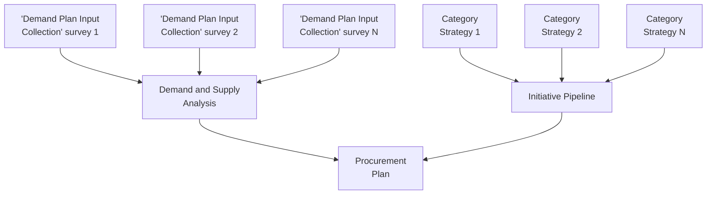

*Figure 2.2.11 Procurement Plan creation*

The "Project Owner" may consider (but not limited to) following points while creating the 'Procurement Plan':

a. Download and collate various "Demand Plan Input Collection Survey" responses to complete the 'Demand and Supply Analysis' tab of the 'Procurement Plan'.

b. Indicate details such as (but not limited to) sufficiency of the existing contract to fulfil the demand, procurement cycle duration, category mapping, and priority of the sourcing initiative in the 'Demand and Supply Analysis' tab of the 'Procurement Plan'.

c. Use the sourcing and procurement initiatives identified in the various 'Category Strategy' documents to complete the 'Initiative Pipeline' tab of the 'Procurement Plan'.

d. The sourcing initiatives identified in the 'Demand and Supply Analysis' and 'Initiative Pipeline' tabs flow through to the 'Procurement Plan' tab, with respective priority.

e. The 'Procurement Plan' tab of the document acts as one of the triggers for the creation of a "Sourcing Request". The information provided in the 'Procurement Plan' is used to complete the "Overview Form" of the "Sourcing Request".

The demand requirements are collated across departments to identify overall demand for an Entity-Specific Category. The demand requirements are collated across Entities to identify overall demand for a Common Category.

The completed 'Procurement Plan' is uploaded in the "Documents" tab of the "Knowledge Project (Procurement Demand Planning)" for reviews and approvals.

38
Procurement Manual (SAP Ariba Aligned)


---


دائرة الإسناد الحكومي
DEPARTMENT OF GOVERNMENT SUPPORT

iii. (S) Roles and Responsibilities

<table>
<thead>
<tr>
<th>Role</th>
<th>Responsibilities</th>
</tr>
</thead>
<tbody>
<tr>
<td>Project Owner</td>
<td>1. Create "Knowledge Project (Procurement Demand Planning)".<br>
2. Assign "Team Members".<br>
3. Prepare and Publish "Demand Plan Input Collection Survey".<br>
4. Collate responses received from "Demand Planning Input Collection Survey".<br>
5. Download, complete and upload 'Procurement Plan'.</td>
</tr>
<tr>
<td>Survey Participants</td>
<td>6. Respond to "Demand Plan Input Collection Survey".</td>
</tr>
</tbody>
</table>

*Table 2.2.8 Roles and Responsibilities - Prepare 'Procurement Plan'*

iv. (B) Process Summary

<table>
<thead>
<tr>
<th>STAKEHOLDERS</th>
<th>DECISIONS INVOLVED</th>
<th>INPUTS</th>
<th>OUTCOMES</th>
<th>FORMS/ DOCUMENTS</th>
</tr>
</thead>
<tbody>
<tr>
<td>• Project Owner<br>• Survey Participants</td>
<td>• If the budget is not sufficient for the collated demand, should budget be increased, or demand be decreased?</td>
<td>• 'Category Strategy' documents</td>
<td>• Completed 'Procurement Plan'</td>
<td>• "Overview Form"<br>• 'Demand Gathering Form'<br>• 'Procurement Plan'</td>
</tr>
</tbody>
</table>

*Figure 2.2.12 Process Summary – Prepare 'Procurement Plan'*

Please refer to <ins>Appendix 3.1 - 2.2.3.(III) Prepare 'Procurement Plan'</ins> for the process map.

## 2.2.3.(IV) Review and Approve 'Procurement Plan'

i. (B) Scope and Purpose

The purpose of this process is to obtain reviews and approvals for the 'Procurement Plan'. The process applies to all prepared 'Procurement Plans'.

39
Procurement Manual (SAP Ariba Aligned)


---


دائرة الإسناد الحكومي
DEPARTMENT OF GOVERNMENT SUPPORT

ii. (B) Process Flow and Key Tasks

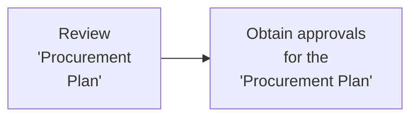

*Figure 2.2.13 Process Flow and Key Tasks - Review and Approve 'Procurement Plan'*

1) Review 'Procurement Plan'

The completed 'Procurement Plan' is reviewed by the "Reviewers" designated *as per the PDoA*. The "Reviewer" clicks on "Complete Review" and, if required, attaches the modified 'Procurement Plan'.

When the "Project Owner" receives the reviewed 'Procurement Plan' from the "Reviewer", the "Project Owner" may "Accept All changes" or initiate another round of review. The latest version of the 'Procurement gets saved in the "Knowledge Project (Procurement Demand Planning)" (automatically) when the "Project Owner" clicks on "Accept All changes".

2) Obtain approvals for the 'Procurement Plan'

The reviewed 'Procurement Plan' is approved by the "Approvers" designated *as per the PDoA*. If "Approvers" recommend modifications to the 'Procurement Plan', the "Project Owner" makes the recommended modifications and uploads the updated version of the 'Procurement Plan' in the "Knowledge Project (Procurement Demand Planning)".

In case the modified 'Procurement Plan' requires review by the "Reviewers", the "Project Owner" may re-trigger the "Review" task. Otherwise, the "Project Owner" can re-trigger the "Approval" task for approval.

The approved 'Procurement Plan' is shared with the relevant *Sourcing Specialists/ Leads*, *Contracting Specialists/Leads*, and *SRM Specialists* outside "SAP Ariba".

iii. (S) Roles and Responsibilities

<table>
<thead>
<tr>
<th>Role</th>
<th>Responsibilities</th>
</tr>
</thead>
<tbody>
<tr>
<td>Project Owner</td>
<td>1. Initiate "Review" task.<br/>
2. Initiate "Approval" task.<br/>
3. "Accept All Changes" recommended by the "Reviewers" or initiate another round of review.<br/>
4. Modify and upload the 'Procurement Plan', if required.<br/>
5. <ins>Communicate the approved 'Procurement Plan' to relevant stakeholders.</ins></td>
</tr>
</tbody>
</table>

40
Procurement Manual (SAP Ariba Aligned)


---


DEPARTMENT OF GOVERNMENT SUPPORT

<table>
<thead>
<tr>
<th>Role</th>
<th>Responsibilities</th>
</tr>
</thead>
<tbody>
<tr>
<td>Reviewers<br>(as per PDoA)</td>
<td>6. Review the 'Procurement Plan'.<br>7. In case the review leads to modifications, provide a modified 'Procurement Plan'.</td>
</tr>
<tr>
<td>Approvers<br>(as per PDoA)</td>
<td>8. Review and approve/deny the 'Procurement Plan'.</td>
</tr>
</tbody>
</table>

*Table 2.2.9 Roles and Responsibilities - Review and Approve 'Procurement Plan'*

iv. **(B) Process Summary**

<table>
<thead>
<tr>
<th>STAKEHOLDERS</th>
<th>DECISIONS INVOLVED</th>
<th>INPUTS</th>
<th>OUTCOMES</th>
<th>FORMS/ DOCUMENTS</th>
</tr>
</thead>
<tbody>
<tr>
<td>• Project Owner<br>• Reviewers (as per PDoA)<br>• Approvers (as per PDoA)</td>
<td>• Does 'Procurement Plan' require modifications?</td>
<td>• Completed 'Procurement Plan'</td>
<td>• Approved 'Procurement Plan'</td>
<td>• 'Procurement Plan'</td>
</tr>
</tbody>
</table>

*Figure 2.2.14 Process Summary – Review and Approve 'Procurement Plan'*

Please refer to *Appendix 3.1 – 2.2.3.(IV) Review and Approve 'Procurement Plan'* Error! Reference source not found. for the process map.

## 2.2.3.(V) Execute and Monitor 'Procurement Plan'

i. **(B) Scope and Purpose**

The purpose of this process is to execute and close the approved 'Procurement Plan'. This process applies to all approved 'Procurement Plans'.

ii. **(B) Process Flow and Key Tasks**

```mermaid
flowchart LR
    A[Monitor progress against 'Procurement Plan'] --> B[Close "Knowledge Project (Procurement Demand Planning)"]
```

*Figure 2.2.15 Process Flow and Key Tasks - Execute and Monitor 'Procurement Plan'*

41
Procurement Manual (SAP Ariba Aligned)


---


دائرة الإسناد الحكومي
DEPARTMENT OF GOVERNMENT SUPPORT

1) Monitor progress against 'Procurement Plan'

   The sourcing initiatives identified in the 'Procurement Plan' are executed through the S2C processes. The "Project Owner" of the "Knowledge Project (Procurement Demand Planning)" conducts periodic reviews of the 'Procurement Plan' execution. This review is managed entirely outside "SAP Ariba".

   With each review, the individuals executing the identified sourcing initiatives provide the updated status along with identified risks. The "Project Owner" collates these inputs in the 'Procurement Plan' document. The "Project Owner" uploads an updated version of the 'Procurement Plan' document in the "Documents" tab of the "Knowledge Project (Procurement Demand Planning)".

   The "Project Owner" can modify the 'Procurement Plan' document during the execution due to any adhoc demands, delays in execution, changes in the 'Category Strategy', or changes in the 'Procurement Strategy'. Any modification made to the 'Procurement Plan' requires reviews and approvals, as explained in section 2.2.3.(IV)

2) Close "Knowledge Project (Procurement Demand Planning)"

   The "Knowledge Project (Procurement Demand Planning)" is considered "Complete" when the sourcing initiatives identified in the 'Procurement Plan' are executed.

   The "Project Owner" uploads an updated version of the 'Procurement Plan' document and closes the "Knowledge Project (Procurement Demand Planning)" project by marking the 'Project State' field as "Completed" in the "Overview" tab.

   The "Project Owner" communicates the closure of the "Knowledge Project (Procurement Demand Planning)" to the respective stakeholders, outside "SAP Ariba".

### iii. (S) Roles and Responsibilities

<table>
<thead>
<tr>
<th>Role</th>
<th>Responsibilities</th>
</tr>
</thead>
<tbody>
<tr>
<td>Project Owner</td>
<td>1. Conduct periodic reviews of the 'Procurement Plan' to monitor progress<br>
2. Modify 'Procurement Plan', if required<br>
3. Close the "Knowledge Project (Procurement Demand Planning)".<br>
4. Communicate the closure of the "Knowledge Project (Procurement Demand Planning)" to the relevant stakeholders.</td>
</tr>
</tbody>
</table>

*Table 2.2.10 Roles and Responsibilities – Execute and Monitor 'Procurement Plan'*

42
Procurement Manual (SAP Ariba Aligned)


---


دائرة الإسناد الحكومي
DEPARTMENT OF GOVERNMENT SUPPORT

iv. (B) Process Summary

<table>
<thead>
<tr>
<th>STAKEHOLDERS</th>
<th>DECISIONS INVOLVED</th>
<th>INPUTS</th>
<th>OUTCOMES</th>
<th>FORMS/ DOCUMENTS</th>
</tr>
</thead>
<tbody>
<tr>
<td>• Project Owner<br>• Individuals implementing the 'Procurement Plan' initiatives</td>
<td>• Does the 'Procurement Plan' require modifications?</td>
<td>• Approved 'Procurement Plan'</td>
<td>• Executed 'Procurement Plan'</td>
<td>• 'Procurement Plan'</td>
</tr>
</tbody>
</table>

**Figure 2.2.16 Process Summary – Execute and Monitor 'Procurement Plan'**

Please refer to *Appendix3.1* - 2.2.3.(V) Execute and Monitor 'Procurement Plan' for the process map.

## 2.2.4 Work Aids – Forms and Documents

<table>
<thead>
<tr>
<th>Procurement Processes</th>
<th>Forms and Documents</th>
</tr>
</thead>
<tbody>
<tr>
<td rowspan="4">2.2.3. (I) Prepare and Approve 'Category Strategy'</td>
<td>Overview Form</td>
</tr>
<tr>
<td>Internal Category Profile</td>
</tr>
<tr>
<td>External Category Analysis</td>
</tr>
<tr>
<td>Category Strategy</td>
</tr>
<tr>
<td rowspan="2">2.2.3. (II) Execute and Monitor 'Category Strategy'</td>
<td>Category Strategy</td>
</tr>
<tr>
<td>Category Strategy Progress Report</td>
</tr>
<tr>
<td rowspan="3">2.2.3. (III) Prepare 'Procurement Plan'</td>
<td>Overview Form</td>
</tr>
<tr>
<td>Demand Gathering Form</td>
</tr>
<tr>
<td>Procurement Plan</td>
</tr>
<tr>
<td>2.2.3. (IV) Review and Approve 'Procurement Plan'</td>
<td>Procurement Plan</td>
</tr>
<tr>
<td>2.2.3. (V) Execute and Monitor 'Procurement Plan'</td>
<td>Procurement Plan</td>
</tr>
</tbody>
</table>

**Table 2.2.11 Work Aids – Forms and Documents - DCM process group**

## 2.2.5 RACI Matrix

Below are the details of the RACI (R – Responsible, A – Accountable, C – Consult, and I – Inform) for the DCM process group:

43
Procurement Manual (SAP Ariba Aligned)


---


دائرة الإسناد الحكومي
DEPARTMENT OF GOVERNMENT SUPPORT

<table>
    <thead>
    <tr>
        <th>L3 Process</th>
        <th></th>
        <th>Sourcing</th>
        <th>Specialist / Lead</th>
        <th></th>
        <th>SurveyParticipants</th>
        <th>ContractAdministrator</th>
        <th>ContractingSpecialist / Lead</th>
        <th>Specialist
SRM</th>
        <th>Reviewers(as per PDoA)</th>
        <th>Approvers(as per PDoA)</th>
        <th>ProcurementScope</th>
    </tr>
    </thead>
    <tr>
        <td>2.2.3. (I) Prepare and Approve 'Category

Strategy'</td>
        <td colspan="4">R, A</td>
        <td></td>
        <td></td>
        <td></td>
        <td></td>
        <td>R</td>
        <td>R</td>
        <td>GPO / Entity</td>
    </tr>
    <tr>
        <td>2.2.3. (II) Execute and Monitor 'Category

Strategy'</td>
        <td colspan="4">R, A</td>
        <td></td>
        <td></td>
        <td></td>
        <td></td>
        <td></td>
        <td></td>
        <td>GPO / Entity</td>
    </tr>
    <tr>
        <td>2.2.3. (III) Prepare 'Procurement Plan'</td>
        <td colspan="4">R, A</td>
        <td>R</td>
        <td>R</td>
        <td></td>
        <td></td>
        <td></td>
        <td></td>
        <td>GPO / Entity</td>
    </tr>
    <tr>
        <td>2.2.3. (IV) Review and Approve

'Procurement Plan'</td>
        <td colspan="4">R, A</td>
        <td></td>
        <td></td>
        <td></td>
        <td></td>
        <td>R</td>
        <td>R</td>
        <td>GPO / Entity</td>
    </tr>
    <tr>
        <td>2.2.3. (V) Execute and Monitor 'Procurement

Plan'</td>
        <td colspan="4">R, A</td>
        <td>I</td>
        <td></td>
        <td>I</td>
        <td>I</td>
        <td></td>
        <td></td>
        <td>GPO / Entity</td>
    </tr></table>

Table 2.2.12 RACI Matrix – DCM process group

## 2.3 Source to Contract (S2C)

### 2.3.1 Overview

The Source to Contract (S2C) process group consists of procedures for conducting sourcing with a focus on maximizing value, minimizing risk, and fulfilling the requirements for goods/services/projects in compliance with Procurement Standards.

This section explains the activities, decisions involved, documents used, outcomes, and the stakeholders involved in the S2C processes. Below is an illustration of the S2C Level 3 processes:

```mermaid
flowchart LR
    A["1. Prepare and<br/>Approve<br/>'Sourcing<br/>Request'"] --> B["2. Create<br/>'Sourcing<br/>Project'"]
    B --> C["3. Develop and<br/>Approve<br/>'Sourcing<br/>Strategy'"]
    C --> D["4. Prepare and Publish<br/>Sourcing Event"]
    D --> E["5. Execute and Monitor<br/>Sourcing Event"]
    E --> F["6. Evaluate<br/>Sourcing<br/>Event"]
    F --> G["7. Conduct<br/>Negotiations"]
    G --> H["8. Create Post<br/>Negotiation<br/>Sourcing Event"]
    H --> I["9. Award<br/>and Event<br/>Close out"]
    
    J["10. Cancel Sourcing<br/>Event/'Sourcing Project'/<br/>'Sourcing Request'"]
    
    style A fill:#000
    style B fill:#000
    style C fill:#000
    style D fill:#666
    style E fill:#666
    style F fill:#fff,stroke:#000
    style G fill:#fff,stroke:#000
    style H fill:#fff,stroke:#000
    style I fill:#000
    style J fill:#000
```

In "SAP Ariba" ⬛ Offline ⬛ In "ORACLE ADERP" ⬜

Figure 2.3.1 S2C procurement processes (Level 3)

44
Procurement Manual (SAP Ariba Aligned)


---


دائرة الإسناد الحكومي
DEPARTMENT OF GOVERNMENT SUPPORT

The S2C process group requires cross-functional collaboration and an appropriate level of governance for decision making and approvals.

Below is an illustration of the guidelines provided in the PDoA to enable decision making for the S2C processes:

<table>
<thead>
<tr>
<th></th>
<th>Sourcing execution by Procurement - Optional</th>
<th>Sourcing executed by Procurement</th>
</tr>
</thead>
<tbody>
<tr>
<td><strong>Buying / Sourcing Channels</strong></td>
<td>
Petty Cash<br>
P - Card<br>
Spot Buy<sup>#</sup>
</td>
<td>
Non-Strategic Sourcing<br>
Strategic Sourcing
</td>
</tr>
<tr>
<td><strong>"Sourcing Project"</strong></td>
<td>
Sourcing Strategy is Optional<br>
("Quick Sourcing Project")
</td>
<td>
Sourcing Strategy Mandatory<br>
("Full Sourcing Project" recommended)
</td>
</tr>
<tr>
<td><strong>Sourcing Methods</strong></td>
<td>
Limited Tender<br>
Single / Sole Source*
</td>
<td>
Public Tender
</td>
</tr>
<tr>
<td><strong>Committees</strong></td>
<td>
Tendering Committee – Optional<br>
(previously known as Tech. Evaluators)
</td>
<td>
Tendering Committee – Mandatory (Sourcing Strategy and Technical Evaluation)<br>
Procurement Committee (previously known as 'TAC')
</td>
</tr>
<tr>
<td><strong>Bonds</strong></td>
<td></td>
<td>
Bid Bond<br>
Performance Bond
</td>
</tr>
<tr>
<td colspan="3" style="text-align: center;">
<strong>Spend Threshold (AED)</strong><br>
5 K      50 K      1M      5 M
</td>
</tr>
</tbody>
</table>

* requires endorsement from the Head of Procurement  
Purchases without sourcing executed by the Procurement; min. 2 quotations required  
# Post factum PR,PO, and GR created for Petty Cash and P-Card purchases

**Figure 2.3.2 PDoA guidelines for decision making – S2C processes**

45
Procurement Manual (SAP Ariba Aligned)


---


دائرة الإسناد الحكومي
DEPARTMENT OF GOVERNMENT SUPPORT

> *Important Note: The guidelines illustrated above are not enforced by "SAP Ariba". The Procurement must comply with these guidelines in adherence with the Procurement Standards and the PDoA.*

> *Important Note: All exceptions to the authorizations mandated in the PDoA are to be supplemented with documentary justifications and require approval from relevant authorities.*

## 2.3.2 "SAP Ariba Module" Overview

All S2C processes are enabled via the "SAP Ariba Sourcing module" as illustrated:

<table>
<thead>
<tr>
<th>Sourcing Module Stages</th>
<th>"Sourcing Request"</th>
<th>"Sourcing Project"</th>
<th>Sourcing Event</th>
</tr>
</thead>
<tbody>
<tr>
<td rowspan="2">Business Processes</td>
<td>1. Prepare and Approve "Sourcing Request"</td>
<td>2. Create "Sourcing Project"<br>3. Develop/Modify 'Sourcing Strategy'</td>
<td>4. Prepare/ Publish Sourcing Event<br>5. Execute/Monitor Sourcing Event<br>6. Evaluate Sourcing Event</td>
</tr>
<tr>
<td></td>
<td>7. Conduct Negotiations<br>8. Create Post Negotiation Sourcing Event<br>9. Award and Project Close out<br>10. Cancel Sourcing Event / Project / Request</td>
<td></td>
</tr>
</tbody>
</table>

*Figure 2.3.3 S2C processes and "SAP Ariba" stages*

A "Sourcing Request" initiates the process to identify the *Supplier* for required goods/services/projects. It may be created against either an approved 'Purchase Requisition (PR)' or a sourcing initiative in the approved 'Procurement Plan'. An approved "Sourcing Request" leads to a "Sourcing Project".

A "Sourcing Project" enables execution of all tendering related tasks including (but not limited to) creation of a 'Sourcing Strategy', creation, execution, and evaluation of the Sourcing Event, and preparation of 'Award Recommendation Report'. A "Sourcing Project" may include one or more Sourcing Events.

The Sourcing Event enables interaction between *Procurement* and *Suppliers* to obtain information or bids. Following are the types of Sourcing Events:

46
Procurement Manual (SAP Ariba Aligned)


---


دائرة الإسناد الحكومي
DEPARTMENT OF GOVERNMENT SUPPORT

1. Request for Information (RFI)
2. Request for Proposal (RFP)
3. Request for Quotation (RFQ)
4. Reverse Auctions (eAuctions)

A *Sourcing Specialist/Lead* is assigned as the "Project Owner" of the "Sourcing Project" in "SAP Ariba". This assigned *Sourcing Specialist/Lead* creates the "Sourcing Request" against which the "Sourcing Project" is created and executed. In case of an Entity Specific Category, the "Project Owner" is from the Entity managing the category while in case of a Common Category, the "Project Owner" is from the GPO.

## 2.3.3 Details of the Level 3 Processes

### 2.3.3.(I) Prepare and Approve "Sourcing Request (SR)"

i. **(B) Scope and Purpose**

Creation and approval of a "Sourcing Request (SR)" is mandatory to conduct sourcing in "SAP Ariba". The purpose of this process is to create and obtain approval for the SR.

ii. **(B) Process Flow and Key Tasks**

<table>
<tr>
<td>Create SR</td>
<td>→</td>
<td>Select the 'Sourcing Method'</td>
<td>→</td>
<td>Add Procurement Manager</td>
<td>→</td>
<td>Add SR Line Items/ additional documents</td>
<td>→</td>
<td>Obtain all approvals for SR</td>
</tr>
</table>

*Figure 2.3.4 Process Flow and Key Tasks - Prepare and Approve "Sourcing Request"*

47
Procurement Manual (SAP Ariba Aligned)


---


DEPARTMENT OF GOVERNMENT SUPPORT

1) **Create SR**
   An SR may be created in following ways:

   a. **Flip an approved PR into an SR (linking "ORACLE ADERP" and "SAP Ariba")**

<table>
<thead>
<tr>
<th>ORACLE</th>
<th colspan="3">Sourcing Module</th>
<th colspan="2">CLM Module</th>
<th>ORACLE</th>
<th>ORACLE</th>
<th>CLM Module</th>
</tr>
</thead>
<tbody>
<tr>
<td>Create and Approve PR</td>
<td>Raise SR</td>
<td>Conduct "Sourcing Project"</td>
<td>Execute Award</td>
<td>Publish Contract</td>
<td>Manage Contract</td>
<td>Create PO & Receive GR</td>
<td>Match Invoice & Pay IR</td>
<td>Close Contract</td>
</tr>
<tr>
<td colspan="6"></td>
<td>ORACLE ADERP</td>
<td colspan="2">SAP Ariba</td>
</tr>
</tbody>
</table>

*Figure 2.3.5 Procurement processes across "ORACLE ADERP" and "SAP Ariba"*

If the goods/services/projects requested in an approved PR require sourcing, PR may be flipped into an SR to identify and finalize the **Supplier**. Since PR is created in "ORACLE ADERP", it must be flipped into an SR manually, as following:

a1. The assigned **Sourcing Specialist/Lead** creates an SR in the "Sourcing Module" against an approved PR.

a2. Details of the approved PRs are downloaded from "ORACLE ADERP" and added in the SR. Additional details may be added as an attachment in the SR for review and approval.

a3. Multiple PRs may be aggregated into a Single SR, or a single PR may be split across multiple SRs, as required.

> *Important Note: Approved PR is verified by the Procurement against existing contracts and inventories to identify if the requirement can be fulfilled without entering into new obligations.*

> *Important Note: The approved procurement requirement is not to be split into multiple SR to bypass approval authorities. Any split must be documented and approved by the Head of Procurement.*

b. **Create SR against sourcing initiatives in the approved 'Procurement Plan'**
   The assigned **Sourcing Specialist/Lead** can create an SR based on a sourcing initiative identified in the 'Procurement Plan' and provide required details.

   The assigned **Sourcing Specialist/Lead** can create an SR by selecting "Sourcing Request" from the "SAP Ariba Dashboard" and completing the "Overview Form".

   The assigned **Sourcing Specialist/Lead** provides UNSPSC Level 2 category in the 'Commodity' field in the "Overview Form".

48
Procurement Manual (SAP Ariba Aligned)


---


دائرة الإسناد الحكومي
DEPARTMENT OF GOVERNMENT SUPPORT

The assigned **Sourcing Specialist/Lead** may link the "Sourcing Request" to a previously executed "Knowledge Project (Procurement Demand Planning)" or "Sourcing Request" by selecting the 'Predecessor Project' in the "Overview Form". This helps in indicating the relationship between projects in "SAP Ariba".

In case, the "Sourcing Request" created is identical (or similar) to a previously executed "Sourcing Request" the assigned **Sourcing Specialist/Lead** may use the 'Copy from Project' field to readily import (but not limited to) "Overview Form" details, and if required, "Project Groups" and documents from the previously executed project into the current project. This imported information is modifiable in the current "Sourcing Request".

The assigned **Sourcing Specialist/Lead** specifies the 'Sourcing Method' in the "Overview Form".

2) Select the 'Sourcing Method'
   The "Project Owner" selects the type of the 'Sourcing Method' to be used for the "Sourcing Project". Following are the types of 'Sourcing Methods' available:

<table>
<thead>
<tr>
<th>Aspects</th>
<th>Public Tender</th>
<th>Limited Tender</th>
<th>Sole/Single Source</th>
</tr>
</thead>
<tbody>
<tr>
<td># of Suppliers</td>
<td>Open to all <em>Suppliers</em> willing to participate</td>
<td>Open to <em>Suppliers</em> which have been screened and shortlisted to submit bids/offers</td>
<td><em>Single Supplier</em> is selected to submit bids/offers</td>
</tr>
<tr>
<td>Tender Visibility</td>
<td>Any <em>Supplier</em></td>
<td>Shortlisted <em>Suppliers</em> from <em>Supplier Master Database</em> maintained by the <em>DGS</em></td>
<td>Selected <em>Supplier</em> from <em>Supplier Master Database</em> maintained by the <em>DGS</em></td>
</tr>
<tr>
<td>Tender Participation</td>
<td><em>Suppliers</em> registered on "SAP Ariba Network"</td>
<td></td>
<td></td>
</tr>
<tr>
<td>Tender Award</td>
<td colspan="3">Winning <em>Supplier</em> – must be "Qualified" in the <em>Supplier Database</em> maintained by the <em>DGS</em><br>(DGS - Department of Government Support)</td>
</tr>
</tbody>
</table>

**Table 2.3.1 Summary of features – Sourcing Methods**

*Important Note: Interested Suppliers, that are not registered in the Supplier Master Database, maintained by the DGS, may participate in Public Tenders. However, they must be registered in the "SAP Ariba Network".*

*Important Note: Sole/Single source should only be selected as the last option, and Procurement must endeavor to suggest suitable alternatives wherever possible.*

In case the assigned **Sourcing Specialist/Lead** selects the Single/Sole source as the 'Sourcing Method' or deviates from the 'Sourcing Method' prescribed in the PDoA, the rationale and business case for the same must be provided for approval. Recommended Sourcing Method, in relation to the tender value, have been specified <ins>in the PDoA</ins>.

49
Procurement Manual (SAP Ariba Aligned)


---


دائرة الإسناد الحكومي
DEPARTMENT OF GOVERNMENT SUPPORT

The SR gets activated once the "Overview Form" is submitted by the assigned *Sourcing Specialist/Lead*. This assigned *Sourcing Specialist/Lead* becomes the "Project Owner" of the SR automatically.

3) Add Procurement Manager
   The "Project Owner" assigns the *Procurement Manager*. The *Procurement Manager* is responsible for providing oversight of the S2C processes and ensure execution is compliant with the Procurement Standards and other relevant regulations.

4) Add SR Line Items/additional documents
   The "Project Owner" edits the SR attributes and provide line-item details. If the SR has been created from an approved PR, this information is imported from the PR. The "Project Owner" may submit additional documents (e.g., SOW) with the SR for review and approval.

5) Obtain all approvals for SR
   The completed SR is reviewed and approved by the "Approvers" designated *as per the PDoA*. "Approval" tasks are initiated automatically in "Sourcing Module" once all predecessor tasks are "Completed".

   If "Approvers" reject the SR, they must provide a valid justification to the "Project Owner". The "Project Owner" makes the recommended modifications and re-submits the SR for approval.

   Once the SR is approved, a "Sourcing Project" template appears in the "Documents" tab of the SR, automatically. This template is then used to execute and manage the "Sourcing Project" associated with the approved SR.

iii. (S) Roles and Responsibilities

<table>
<thead>
<tr>
<th>Role</th>
<th>Responsibilities</th>
</tr>
</thead>
<tbody>
<tr>
<td rowspan="4">Project Owner</td>
<td>1. Create SR.</td>
</tr>
<tr>
<td>2. Provide SR line item details and any additional documents, if required.</td>
</tr>
<tr>
<td>3. Assign Procurement Manager.</td>
</tr>
<tr>
<td>4. Submit SR for approval.</td>
</tr>
<tr>
<td>Approvers<br>(as per PDoA)</td>
<td>5. Review and approve/deny the SR.</td>
</tr>
</tbody>
</table>

*Table 2.3.2 Roles and Responsibilities – Prepare and Approve "Sourcing Request"*

50
Procurement Manual (SAP Ariba Aligned)


---


دائرة الإسناد الحكومي
DEPARTMENT OF GOVERNMENT SUPPORT

iv. **(B) Process Summary**

<table>
<thead>
<tr>
<th>STAKEHOLDERS</th>
<th>DECISIONS INVOLVED</th>
<th>INPUTS</th>
<th>OUTCOMES</th>
<th>FORMS/ DOCUMENTS</th>
</tr>
</thead>
<tbody>
<tr>
<td>• Project Owner<br>• Approvers (as per PDoA)</td>
<td>• Is Sourcing required?<br>• Which 'Sourcing Method' should be used?</td>
<td>• Approved PR<br>• Approved 'Procurement Plan'</td>
<td>• Approved SR<br>• "Sourcing Project" template created</td>
<td>• "Overview Form"</td>
</tr>
</tbody>
</table>

**Figure 2.3.6 Process Summary – Prepare and Approve "Sourcing Request"**

Please refer to *Appendix 3.1 - 2.3.3.(I) Prepare and Approve "Sourcing Request"* for the process map.

## 2.3.3.(II) Create "Sourcing Project"

### i. **(B) Scope and Purpose**

The purpose of this process is to create a suitable "Sourcing Project" for the sourcing initiative.

### ii. **(B) Process Flow and Key Tasks**

<table>
<thead>
<tr>
<th>Create "Sourcing Project"</th>
<th>Select the 'Project Type'</th>
<th>Select the 'Event Type'</th>
<th>Assign "Team Members"</th>
</tr>
</thead>
</table>

**Figure 2.3.7 Process Flow and Key Tasks - Create "Sourcing Project"**

1) **Create "Sourcing Project"**
   As indicated in the previous process, a "Sourcing Project" template appears in the "Documents" tab of the SR, once the SR is approved. The "Project Owner" uses this template and completes the "Overview Form" to create the "Sourcing Project".

   Additional "Sourcing Projects" may be created against an SR by using the "Subproject" functionality available in the "Documents" tab.

   The "Project Owner" provides the UNSPSC Level 2 category in the 'Commodity' field and specifies the 'Project Type' and 'Event type' in the "Overview Form".

51
Procurement Manual (SAP Ariba Aligned)


---


دائرة الإسناد الحكومي
DEPARTMENT OF GOVERNMENT SUPPORT

2) Select the 'Project Type'
   Following are the 'Project Types' available in "SAP Ariba":

   a. **"Full Sourcing Project"** is the preferred choice for a high spend - strategic sourcing initiatives which may require a 'Sourcing Strategy', multiple Sourcing Events, and technical and commercial bid submission in separate "Envelopes".

*Important Note: Public Tenders can only be executed using "Full Sourcing Projects".*

   b. **"Quick Sourcing Project"** is the preferred choice for a low spend - non-strategic sourcing Initiatives which may not require a 'Sourcing Strategy' or multiple Sourcing Events, and where bids may be submitted in a single "Envelope".

Below is an illustration of the differences between a "Full Sourcing Project" and a "Quick Sourcing Project":

<table>
<thead>
<tr>
<th></th>
<th>FULL SOURCING PROJECT</th>
<th>QUICK SOURCING PROJECT</th>
</tr>
</thead>
<tbody>
<tr>
<td><strong>SCOPE AND PURPOSE</strong></td>
<td>
• Preferred for detailed, elaborate sourcing activities which need a 'Sourcing Strategy'.<br>
• For ex: 'Strategic Sourcing' initiatives<br>
• High Spend tender value
</td>
<td>
• Preferred for simpler, quicker sourcing events and does not require a 'Sourcing Strategy'<br>
• For ex: 'Spot buys' and 'Post-negotiations'<br>
• Low spend tender value
</td>
</tr>
<tr>
<td><strong>TYPES & # OF EVENTS ALLOWED</strong></td>
<td>
Multiple events (RFI, RFP, RFQ and Auctions) allowed, followed by detailed evaluation and Negotiation tasks
</td>
<td>
Quick Project only allows one event (RFI, RFQ or Auctions)<br>
<em>(Quick Project is essentially an event)</em>
</td>
</tr>
<tr>
<td><strong>DETAILS</strong></td>
<td>
• Supports two envelopes<br>
• 'Sourcing Strategy' is mandatory<br>
• Sourcing Event evaluation done by "Team Graders" in "SAP Ariba"<br>
• "Contract Workspace" may be within the "Sourcing Project"<br>
• Negotiations tasks enabled in "SAP Ariba"
</td>
<td>
• Supports single envelope<br>
• No 'Sourcing Strategy' required<br>
• Sourcing Event evaluation done outside "SAP Ariba"<br>
• "Contract Workspace" (if required) is created outside the "Sourcing Project"<br>
• No Negotiations tasks enabled in "SAP Ariba"
</td>
</tr>
</tbody>
</table>

Figure 2.3.8 "Sourcing Project" types in "SAP Ariba"

Process flows for a "Full Sourcing Project" (strategic sourcing initiative) and a "Quick Sourcing Project" (non-strategic sourcing initiative) are illustrated below:

52
Procurement Manual (SAP Ariba Aligned)


---


دائرة الإسناد الحكومي
DEPARTMENT OF GOVERNMENT SUPPORT

## Figure 2.3.9 "Full Sourcing Project" process flow

<table>
<tr>
<td>1. Prepare and Approve "Sourcing Request"</td>
<td>→</td>
<td>2. Create "Sourcing Project"</td>
<td>→</td>
<td>3. Develop and Approve 'Sourcing Strategy'</td>
<td>→</td>
<td>4. Prepare and Publish Sourcing Event<br>5. Execute and Monitor Sourcing Event</td>
<td>→</td>
<td>6. Evaluate Sourcing Event</td>
<td>→</td>
<td>7. Conduct Negotiations</td>
<td>→</td>
<td>8. Create Post Negotiation Sourcing Event</td>
<td>→</td>
<td>9. Award and Event Close out</td>
</tr>
<tr>
<td colspan="14" style="text-align: center;">10. Cancel Sourcing Event/"Sourcing Project"/"Sourcing Request"</td>
</tr>
</table>

**Legend:**
- ■ In "SAP Ariba"
- ■ Offline  
- □ In "ORACLE ADERP"

## Figure 2.3.10 "Quick Sourcing Project" process flow

<table>
<tr>
<td>1. Prepare and Approve "Sourcing Request"</td>
<td>→</td>
<td>2. Create "Sourcing Project"</td>
<td>→</td>
<td>4. Prepare and Publish Sourcing Event<br>5. Execute and Monitor Sourcing Event</td>
<td>→</td>
<td>6. Evaluate Sourcing Event</td>
<td>→</td>
<td>9. Award and Event Close out</td>
</tr>
<tr>
<td colspan="9" style="text-align: center;">10. Cancel Sourcing Event/"Sourcing Project"/"Sourcing Request"</td>
</tr>
</table>

**Legend:**
- ■ In "SAP Ariba"
- ■ Offline
- □ In "ORACLE ADERP"

Single or multiple "Sourcing Projects" can be created against an approved SR. The "Project Owner" has an option to select a different 'Sourcing Method' for each "Sourcing Project" within SR.

The Procurement Manual, by default, covers S2C processes from a "Full Sourcing Project" perspective. In case a process is not applicable (or is different) for a "Quick Sourcing Project", it has been highlighted in the respective section.

Recommended 'Project Types', in relation to the tender value, have been illustrated in *Figure 2.3.2*. Any deviation from the recommended 'Project Types' must be accompanied by a valid justification and should be approved by relevant authorities *as per the PDoA*.

53
Procurement Manual (SAP Ariba Aligned)


---


دائرة الإسناد الحكومي
DEPARTMENT OF GOVERNMENT SUPPORT

# 3) Select the 'Event Type'

Following are the 'Event Types' enabled in "SAP Ariba":

## a. Request for Information (RFI)
Used to gather information (market/spend/*Supplier* base) or to shortlist *Suppliers* for RFP/RFQ.

## b. Request for Proposal (RFP)
Used for seeking proposals from *Suppliers*; best suited for services or cases where the *Procurement* relies on the experience and creativity of *Suppliers* to define the best solution. RFP may be followed by RFQ or negotiations.

## c. Request for Quotation (RFQ)
Used for seeking pricing information for a well-defined scope of work or supply of specified goods/services/projects, usually preferred for commoditized goods/services/projects where substitutes/ alternatives are allowed.

## d. Reverse Auction (eAuction)
Used as an alternative to the RFQ for highly commoditized goods/services, or where participating *Suppliers* have fully acknowledged specifications (substitutes/alternatives not allowed); usually multiple *Suppliers* are invited to participate in eAuctions to maximize savings. During eAuctions, the *Suppliers* can see their relative ranking and can adjust their bids in real-time.

*Important Note: The "Project Owner" may select multiple Sourcing Events within a "Full Sourcing Project," depending on the requirement. However, only one Sourcing Event per 'Event Type' can be executed within a "Full Sourcing Project" (e.g., 2 RFPs or 2 RFQs are not allowed).*

*Important Note: The "Project Owner" cannot run parallel Sourcing Events within a "Sourcing Project". There must only be a single "Award Scenario" per "Sourcing Project".*

*Important Note: The "Project Owner" may keep an additional Sourcing Event (RFP/RFQ) in the "Sourcing Project" to obtain and record post-negotiation responses from the Suppliers, if required.*

The "Project Owner" may link the "Sourcing Project" to a previously executed "Sourcing Project" by selecting the 'Predecessor Project' in the "Overview Form". This helps in indicating the relationship between projects in "SAP Ariba".

In case, the "Sourcing Project" created is identical (or similar) to a previously executed "Sourcing Project", the "Project Owner" may use the 'Copy from Project' field to readily import (but not limited to) "Overview Form" details, and if required, "Project Groups" and documents from the previously executed project into the current project. This imported information is modifiable in the current "Sourcing Project".

*Important Note: Only a "Full Sourcing Project" can be copied to another "Full Sourcing Project". The same is the case for a "Quick Sourcing Project".*

54
Procurement Manual (SAP Ariba Aligned)


---


دائرة الإسناد الحكومي
DEPARTMENT OF GOVERNMENT SUPPORT

Once the "Overview Form" is completed and submitted by the "Project Owner", in case of a "Full Sourcing project", the "Sourcing Project" gets activated and in case of a "Quick Sourcing Project", the "Project Owner" is directed to the 'Prepare and Publish Sourcing Event' process directly.

4) Assign "Team Members"
   The "Team Members" are grouped into:

   a. "Project Groups"
      The "Project Groups" enabled within "Sourcing module" are:

      a1. "Project Owner"
          The "Project Owner" is responsible for the execution of "Sourcing Project" tasks.

      a2. "Contract Manager" (not enabled in the "Quick Sourcing Projects")
          The *Contract Specialist/Lead* assigned as the "Contract Manager" is responsible for creating, updating, and maintaining contract templates for goods/services/projects associated with the "Sourcing Project".

      a3. Procurement Manager
          *Procurement Manager* is responsible for providing oversight of the S2C processes and ensures the execution is compliant with the Procurement Standards and other relevant regulations.

      a4. "Project Observers"
          "Project Observers" are responsible for only observing the progress of the "Sourcing Project". Participants of this group are pre-determined. The "Project Owner" can add members to this group but cannot modify the existing members.

      a5. "Team Graders" (not enabled in the "Quick Sourcing Projects")
          "Team Graders" are responsible for performing technical evaluations and commercial evaluations (if required) of the *Supplier* responses to the Sourcing Event. They may participate in negotiations, review the 'Sourcing Strategy', and provide inputs to the 'Negotiations Plan' and 'Award Recommendation Report'.

          In case the *Tendering Committee* is mandated by the PDoA (please refer to *Figure 2.3.2*), members of the *Tendering Committee* are added as "Team Graders". In case the *Tendering Committee* is not mandated, the "Project Owner" may add individuals from other functions and the *Procurement* as "Team Graders".

*Important Note: Members of the Tendering Committee are nominated by the respective department heads and endorsed by the Head of Procurement. This endorsement is managed outside "SAP Ariba".*

55
Procurement Manual (SAP Ariba Aligned)


---


DEPARTMENT OF GOVERNMENT SUPPORT

The "Project Owner" can download the 'Tendering Committee Creation Form' document from the "Documents" tab of the "Sourcing Project" to confirm the *Tendering Committee* members. The "Project Owner" uploads the completed 'Tendering Committee Creation Form' document in the "Documents" tab of the "Sourcing Project".

For Entity-Specific Category, members of "Project Groups" are from the Entity managing the category. In the case of a Common Category, the "Project Owner" is from the GPO, while stakeholders from other Entities may be assigned as "Team Graders" if required.

b. **"System Groups"**
"System Groups" are groups of participants pre-determined for a "Sourcing Project" (e.g., "Approvers" and "Reviewers"). The "Project Owner" can add members to the "System Groups" but cannot modify the existing members.

*Important Note: Assigning "Team Members" is the first task within a "Full Sourcing Project". For a "Quick Sourcing Project", the "Team Members" are assigned within the Sourcing Event.*

iii. (S) Roles and Responsibilities

<table>
<thead>
<tr>
<th>Role</th>
<th>Responsibilities</th>
</tr>
</thead>
<tbody>
<tr>
<td>Project Owner</td>
<td>1. Create "Sourcing Project".<br>2. Assign "Team Members".</td>
</tr>
</tbody>
</table>

Table 2.3.3 Roles and Responsibilities – Create "Sourcing Project"

iv. (B) Process Summary

<table>
<thead>
<tr>
<th>STAKEHOLDERS</th>
<th>DECISIONS INVOLVED</th>
<th>INPUTS</th>
<th>OUTCOMES</th>
<th>FORMS/ DOCUMENTS</th>
</tr>
</thead>
<tbody>
<tr>
<td>• Project Owner</td>
<td>• Which 'Project Type' suits the req.?<br>• Which 'Event Type' are required?</td>
<td>• Approved SR<br>• Details required for completing the "Overview Form"</td>
<td>• "Sourcing Project" created<br>• "Team Members" assigned within the "Sourcing Project"</td>
<td>• "Overview Form"<br>• 'Tendering Committee Creation Form'</td>
</tr>
</tbody>
</table>

Figure 2.3.11 Process Summary – Create "Sourcing Project"

Please refer to Appendix 3.1 - 2.3.3.(II) Create "Sourcing Project" for the process map.

56
Procurement Manual (SAP Ariba Aligned)


---


DEPARTMENT OF GOVERNMENT SUPPORT

## 2.3.3.(III)Develop and Approve 'Sourcing Strategy'

### i. (B) Scope and Purpose

> **Important Note:** This process is only applicable for "Full Sourcing Project". It is not required for a "Quick Sourcing Project".

The purpose of this process is to develop, review, and approve a 'Sourcing Strategy' to finalize the details of the "Full Sourcing Project" being executed.

### ii. (B) Process Flow and Key Tasks

<table>
<tr>
<td>Prepare 'Sourcing Strategy'</td>
<td>→</td>
<td>Review 'Sourcing Strategy' ("Team Graders")</td>
<td>→</td>
<td>Obtain approvals for the 'Sourcing Strategy'</td>
<td>→</td>
<td>Review and agree to Confidentiality Requirements and No Conflict of Interest</td>
</tr>
</table>

**Figure 2.3.12 Process Flow and Key Tasks - Develop and Approve 'Sourcing Strategy'**

1) **Prepare 'Sourcing Strategy'**
   
   The 'Sourcing Strategy' contains necessary information to design and execute a "Full Sourcing Project" in line with the End-User requirements and the Procurement Standards. It includes (but not limited to) objectives, timelines, key milestones, Supplier long list, and RACI matrix for the Sourcing Events planned.
   
   The "Documents" tab of the "Sourcing Project" contains a 'Sourcing Strategy' document which may be downloaded, completed, and uploaded by the "Project Owner". Below is the structure of this document:

<table>
<thead>
<tr>
<th>Tab Name</th>
<th>Description</th>
</tr>
</thead>
<tbody>
<tr>
<td>1. Internal Category Profile</td>
<td rowspan="2">To conduct detailed level assessment of internal trends, market opportunities, risks and supplier base;</td>
</tr>
<tr>
<td>2. External Category Analysis</td>
</tr>
<tr>
<td>3.Sourcing Strategy</td>
<td>To select a Sourcing Method and determine the appropriate solicitation channel based on the objectives of sourcing activity.</td>
</tr>
<tr>
<td>4. Project Plan</td>
<td>To develop a detailed plan for Sourcing Event including milestones, timelines and involved stakeholders</td>
</tr>
<tr>
<td>5. RACI</td>
<td>To describes the level and nature of participation by various stakeholders for completing the activities planned for the Sourcing Event. RACI is an acronym derived from the four key responsibilities most typically used: responsible, accountable, consulted, and informed.</td>
</tr>
</tbody>
</table>

**Table 2.3.4 'Sourcing Strategy' document structure**

57
Procurement Manual (SAP Ariba Aligned)


---


DEPARTMENT OF GOVERNMENT SUPPORT

The "Project Owner" may use the 'Sourcing Strategy' template provided in the "Sourcing Project" or other approved template covering the required elements.

The "Project Owner" considers the following points while creating the 'Sourcing Strategy':

a. Complete all the 'Sourcing Strategy' sections mentioned above, in collaboration with the *End-User*, the *Tendering Committee*, and the Subject Matter Experts (SMEs), as required.

b. In case the 'Internal Category Profile' and 'External Category Analysis' are available in the 'Category Strategy' document, the "Project Owner" is advised to use them to complete respective sections of the 'Sourcing Strategy'.

c. In case the 'Internal Category Profile' and 'External Category Analysis' are not available, create these sections using the methods explained in *section 2.2.3.(I)ii.3)*.

d. In the absence of required information, conduct RFI event and/or market research activities to create the 'Sourcing Strategy'.

e. Indicate the Sourcing Method and Sourcing Event type in the 'Sourcing Strategy' in line with details provided in the "Overview Form" explained in *section 2.3.3.(I)ii.2)* and *section 2.3.3.(II)ii.3)*.

f. The Supplier Long List section of the 'Sourcing Strategy' is only applicable for Limited Tenders. It must only include **Suppliers** from the Supplier Master Database maintained by the DGS.

2) **Review 'Sourcing Strategy'**

The "Project Owner" uploads the completed 'Sourcing Strategy' in the "Documents" tab of the "Sourcing Project" for review by the "Team Graders". "Review" tasks are initiated automatically in "Sourcing Module" once all predecessor tasks are "Completed".

The "Team Graders" may recommend modifications to the 'Sourcing Strategy' or even upload an updated version of the 'Sourcing Strategy', post review.

The "Team Graders" clicks on "Complete Review" and if required, attach the modified 'Sourcing Strategy'. When the "Project Owner" receives the updated 'Sourcing Strategy' from the "Team Graders", the "Project Owner" may "Accept All changes" or initiate another round of review. The latest version of the 'Sourcing Strategy' gets saved in the "Documents" tab of the "Sourcing Project" (automatically) when the "Project Owner" clicks on "Accept All changes".

3) **Obtain approvals for the 'Sourcing Strategy'**

The 'Sourcing Strategy' is approved by the "Approvers" designated *as per the PDoA*. "Approval" tasks are initiated automatically in "Sourcing Module" once all predecessor tasks are "Completed".

If "Approvers" reject the 'Sourcing Strategy', they must provide a valid justification to the "Project Owner". The "Project Owner" makes the recommended modifications and re-submits the 'Sourcing Strategy' for approval.

58
Procurement Manual (SAP Ariba Aligned)


---


دائرة الإسناد الحكومي
DEPARTMENT OF GOVERNMENT SUPPORT

If the "Approvers" approve the 'Sourcing Strategy', the "Project Owner" proceeds to the next task.

The "Project Owner" can modify an approved 'Sourcing Strategy' during the "Sourcing Project" execution, with a valid rationale. Post any modification, the 'Sourcing Strategy' is reviewed and approved, as explained in previous steps.

The "Project Owner" ensures that the "Sourcing Project" is executed in line with the latest approved version of the 'Sourcing Strategy'.

4) Review and agree to Confidentiality Requirements and No Conflict of Interest

Sourcing Events are activated in "Full Sourcing Projects" only after the "Project Owner" reviews and agrees to the Confidentiality Requirements and No Conflict of Interest.

In case the "Project Owner" has a potential/actual conflict of interest, the "Project Owner" records the same in "Comments" section of the task and informs the "Supervisor". The **Head of Procurement** appoints another "Project Owner" in this case.

iii. (S) Roles and Responsibilities

<table>
<thead>
<tr>
<th>Role</th>
<th>Responsibilities</th>
</tr>
</thead>
<tbody>
<tr>
<td rowspan="3">Project Owner</td>
<td>1. Download, complete/modify, and upload 'Sourcing Strategy'.</td>
</tr>
<tr>
<td>2. "Accept All Changes" recommended by the "Reviewers" or initiate another round of review.</td>
</tr>
<tr>
<td>3. Review and agree to Confidentiality Requirements and No Conflict of Interest</td>
</tr>
<tr>
<td rowspan="2">Team Graders</td>
<td>4. Review the 'Sourcing Strategy'.</td>
</tr>
<tr>
<td>5. In case the review leads to modifications, provide modified 'Sourcing Strategy'.</td>
</tr>
<tr>
<td>Approvers<br>(as per PDoA)</td>
<td>6. Review and approve/deny the 'Sourcing Strategy'</td>
</tr>
</tbody>
</table>

Table 2.3.5 Roles and Responsibilities – Develop and Approve 'Sourcing Strategy'

59
Procurement Manual (SAP Ariba Aligned)


---


دائرة الإسناد الحكومي
DEPARTMENT OF GOVERNMENT SUPPORT

iv. (B) Process Summary

<table>
<thead>
<tr>
<th>STAKEHOLDERS</th>
<th>DECISIONS INVOLVED</th>
<th>INPUTS</th>
<th>OUTCOMES</th>
<th>FORMS/ DOCUMENTS</th>
</tr>
</thead>
<tbody>
<tr>
<td>• Project Owner<br>• Team Graders<br>• Approvers (as per PDoA)</td>
<td>• How to select a new "Project Owner"?<br>• How to design the 'Sourcing Strategy'?</td>
<td>• 'Internal Category Profile'<br>• 'External Market Analysis'<br>• 'Category Strategy'<br>• Primary and Secondary sources</td>
<td>• Approved 'Sourcing Strategy'<br>• Agreed No conflict of Interest and Confidentiality Requirements</td>
<td>• 'Sourcing Strategy'</td>
</tr>
</tbody>
</table>

Figure 2.3.13 Process Summary - Develop and Approve 'Sourcing Strategy'

Please refer to <ins>Appendix 3.1 - 2.3.3.(III) Develop and Approve 'Sourcing Strategy'</ins> for the process map.

## 2.3.3.(IV) Prepare and Publish Sourcing Event

i. (B) Scope and Purpose

The purpose of this process is to enable the "Project Owner" to prepare and publish a Sourcing Event.

ii. (B) Process Flow and Key Tasks

Prepare and Publish the Sourcing Event → Create draft "Contract Workspace" ("Contract Manager") → Obtain approvals for the Sourcing Event

Figure 2.3.14 Process Flow and Key Tasks - Prepare and Publish Sourcing Event

1) Prepare and Publish the Sourcing Event
   Please refer to 2.3.3.(II)ii.3) to review the types of Sourcing Events and how to select a Sourcing Event for a "Sourcing Project".

   The "Project Owner" creates the Sourcing Event by completing the following segments:

60
Procurement Manual (SAP Ariba Aligned)


---


دائرة الإسناد الحكومي
DEPARTMENT OF GOVERNMENT SUPPORT

## a. Event Rules

This segment specifies the rules for the execution of the Sourcing Event which may include (but not limited to):

a1. **Timing Rules** – defines time-related parameters of the Sourcing Event (e.g., Planned Start date and time)

a2. **Bidding Rules** – sets rules for bidding for the Sourcing Event (e.g., enable blind grading for the event)

a3. **Currency Rules** – sets rules related to the currency of bidding for Bidder(s) (e.g., should Suppliers be allowed to select bidding currency or should it be fixed to AED).

## b. Assign "Team Members" (Quick Projects)

For "Quick Sourcing Projects", the "Team Members" are assigned within the Sourcing Event. Please refer to section 2.3.3. (II)-(ii)-2.3.3.(II)ii.4) for details of this process.

*Important Note: "Project Owner" and the Procurement Manager are the only "Project Groups" enabled in "Quick Sourcing Projects".*

## c. Select Suppliers

The "Project Owner" considers following points while selecting **Suppliers** for a Sourcing Event:

c1. Screen and shortlist **Suppliers** considering the criteria laid out in the Procurement Standards, which may include (but are not limited to) financial health, commercial standing, legal standing, historical **Supplier** performance, and technical capabilities.

c2. The shortlisting of **Suppliers** can be done via RFI, market research, or industry reports.

c3. In case of "Full Sourcing Project", the "Project Owner" shortlists **Suppliers** from the Supplier Long List provided in the approved 'Sourcing Strategy'.

c4. For all Limited Tenders, **Suppliers** are selected from the Supplier Master Database maintained by the DGS.

c5. Selecting **Suppliers** for the Sourcing Event does not apply to Public Tenders. All Public Tenders are published on "SAP Ariba Discovery" and "Abu Dhabi Procurements Portal". All interested **Suppliers** can view and participate in Public Tenders provided they have an account on "SAP Ariba Network".

*Important Note: "Project Owners" must select the Suppliers "Registered" for the specific category for the Sourcing Event.*

*Important Note: Suppliers with "Disqualified" status in the Supplier Master Database, maintained by the DGS, are not to be invited to participate in a Limited Tender.*

*Important Note: The Suppliers need not be "Registered" in the Supplier Master Database maintained by the DGS to participate in Public Tenders.*

*Important Note: "SAP Ariba Discovery" postings are created for all Public Tenders.*

61
Procurement Manual (SAP Ariba Aligned)


---


دائرة الإسناد الحكومي
DEPARTMENT OF GOVERNMENT SUPPORT

d. **Event Content**
   Includes sections/questions/requirements to which the *Suppliers* must respond to be evaluated and awarded. The Sourcing Event content varies depending on the Sourcing Event type (RFI, RFP, RFQ, eAuctions).

   Sourcing Event content consists of the following sections:

   d1. **Pre-requisites**
       The pre-requisites provide the context of the Sourcing Event to the *Suppliers*. They include the essential terms and conditions which the *Suppliers* must review and agree to before they are allowed to view and respond to the Sourcing Event. The pre-requisites may include (but not limited to):

       d11. Event Overview
       d12. Expression of Interest
       d13. Non-Disclosure Agreement

   d2. **Main Content of the Event**
       The main content of the Sourcing Event consists of sections/questions/requirements to obtain *Suppliers'* responses. Sourcing Event content may include (but not limited to):

       d21. **Event definitions, scope, terms, and conditions** - provide necessary information to participate in the Sourcing Event.

       d22. **Bid Bond** ensures that the awarded *Suppliers* fulfill the commitments of the accepted bid. It is only required for Sourcing Events, which may result in binding commercial proposals. The provisions of the Bid Bond with respect to the tender value is illustrated in *Figure 2.3.2*. Any deviation from the recommended provisions must be accompanied by a valid justification and should be approved by relevant authorities *as per the PDoA*.
            Please refer to *section 1.5* to review the list of *Suppliers* exempted from the Bid Bond submission.

       d23. **Draft Contract** is the agreement proposed to be finalized and signed, post conclusion of the "Sourcing Project" for *Suppliers* to review and provide departures if required.

       d24. **"Technical Envelope"** contains sections/questions/requirements to evaluate the technical capability of the *Supplier* to supply the required goods/services/projects.

       d25. **"Commercial Envelope"** contains sections/questions/requirements for the *Suppliers* to provide commercial bids. In case, the line items have been added

62
Procurement Manual (SAP Ariba Aligned)


---


دائرة الإسناد الحكومي
DEPARTMENT OF GOVERNMENT SUPPORT

during "Sourcing Request", they flow through to the "Commercial Envelope" of the Sourcing Event. "Commercial Envelope" include (but not limited to):

I) **Bid Sheets** - The "Project Owner" can create the commercial bid sheets in "SAP Ariba" in the following ways:
   (i) Create each line item in "SAP Ariba".
   (ii) Upload the line item information using the "SAP Ariba" preferred excel format.

   In this case, the commercial bids are provided, monitored, and evaluated within "SAP Ariba", using the "Bid Console" functionality (e.g., eAuctions).

   The "Project Owner" may provide the commercial bid sheet in an excel format, which the **Suppliers** download, complete, and upload as part of the overall Sourcing Event response.

   The "Project Owner", in collaboration with the **End-User**, may make all line items mandatory for **Suppliers** to respond.

*Important Note: At least one-line item must be added directly in "SAP Ariba" to enable awarding of the event. (e.g., In case the Bid sheet is provided in the form of an excel file, the line item added in "SAP Ariba" can be the 'Total Cost' to which the Suppliers must respond).*

*Important Note: In the case of eAuctions, line items must be created in "SAP Ariba" to enable the "Bid Console" functionality.*

   Post finalizing the content of the Sourcing Event, the "Project Owner" may add scoring criteria (weight/importance/target grade) to enable evaluation of the Sourcing Event within "SAP Ariba". In case the scoring criteria are not set up in "SAP Ariba", the Sourcing Event can only be evaluated offline.

II) **ICV Question** - As part of the "Commercial Envelopes", the "Project Owner" requests the **Suppliers** to provide the In-Country Value (ICV) Certificate in line with the Abu Dhabi Local Content (ADLC) program initiated by the Abu Dhabi Department of Economic Development (AD-DED). Please refer to **Error! Reference source not found.**Section 1.5.1 for the details of the ADLC program.

In case of single-stage evaluations ("Quick Projects"), the "Technical Envelope" and "Commercial Envelope" are merged into a "Technical and Commercial Envelope" with both aspects being recorded and evaluated simultaneously. The "Technical and Commercial Envelope" can be imported from the "Sourcing Library" provided in "SAP Ariba".

*Important Note: Adding the "Technical and Commercial Envelope" is mandatory for RFI and RFQ within a "Quick Sourcing Project".*

63
Procurement Manual (SAP Ariba Aligned)


---


دائرة الإسناد الحكومي
DEPARTMENT OF GOVERNMENT SUPPORT

The "Project Owner" may modify the "Pre-requisites", "Main Content", and "Scoring Methodology" of the Sourcing Event as required. The "Project Owner" may make a section/question within the Sourcing Event content mandatory for the **Suppliers** to respond. These sections/questions appear with a (*) mark in "SAP Ariba".

*Important Note: "SAP Ariba" allows for attachment of files up to 100MB (per file). In case, the "Project Owner" anticipates the Supplier to upload attachments above this limit, the "Project Owner" may split the sections/questions in "Technical Envelope" or "Commercial Envelope" (as required) to enable uploading of multiple smaller attachments.*

2) Create draft "Contract Workspace"
   A "Contract Workspace" may be created from within the "Sourcing Project" to initiate the internal review of the 'Main Contract Document' as explained in the section 2.3.3.(IV)-(ii)-2).

3) Obtain approvals for the Sourcing Event
   The completed Sourcing Event is submitted by the "Project Owner" for approval by "Approvers" designated *as per the PDoA*. "Approval" tasks are initiated automatically in "Sourcing Module" once all predecessor tasks are "Completed".

   If "Approvers" reject the Sourcing Event, they must provide a valid justification to the "Project Owner". The "Project Owner" makes the recommended modifications and re-submits the Sourcing Event for approval.

   If the "Approvers" approve the Sourcing Event, it is published for the **Suppliers** to view and respond.

iii. (S) Roles and Responsibilities

<table>
<thead>
<tr>
<th>Role</th>
<th>Responsibilities</th>
</tr>
</thead>
<tbody>
<tr>
<td rowspan="3">Project Owner</td>
<td>1. Create the Sourcing Event.</td>
</tr>
<tr>
<td>2. Assign weight/importance and target grades for content sections.</td>
</tr>
<tr>
<td>3. Publish the Sourcing Event.</td>
</tr>
<tr>
<td rowspan="2">Contracts Manager</td>
<td>4. Create "Contract Workspace".</td>
</tr>
<tr>
<td>5. Provide 'Draft Contract' for the Sourcing Event content.</td>
</tr>
<tr>
<td>Approvers<br>(as per PDoA)</td>
<td>6. Review and approve/deny the Sourcing Event.</td>
</tr>
</tbody>
</table>

**Table 2.3.6 Roles and Responsibilities – Prepare and Publish Sourcing Event**

64
Procurement Manual (SAP Ariba Aligned)


---


DEPARTMENT OF GOVERNMENT SUPPORT

iv. **(B) Process Summary**

<table>
<thead>
<tr>
<th>STAKEHOLDERS</th>
<th>DECISIONS INVOLVED</th>
<th>INPUTS</th>
<th>OUTCOMES</th>
<th>FORMS/ DOCUMENTS</th>
</tr>
</thead>
<tbody>
<tr>
<td>• Project Owner<br>• Contract Manager<br>• Approvers (as per PDoA)</td>
<td>• How to design a Sourcing Event?<br>• How to shortlist Suppliers for an event?</td>
<td>• 'Sourcing Strategy'<br>• 'Main Contract Document''<br>• PR Line item details</td>
<td>• Approved Sourcing Event<br>• 'Draft contract' for Suppliers</td>
<td>• 'Main Contract Document'<br>• Sourcing Event Content</td>
</tr>
</tbody>
</table>

*Figure 2.3.15 Process Summary – Prepare and Publish Sourcing Event*

Please refer to *Appendix 3.1 - 2.3.3.(IV) Prepare and Publish Sourcing Event* for the process map.

## 2.3.3.(V) Execute and Monitor Sourcing Event

i. **(B) Scope and Purpose**

The approved Sourcing Event is published to the *Suppliers* to provide responses. The purpose of this process is to monitor the Sourcing Event during execution and respond to *Suppliers'* queries.

ii. **(B) Process Flow and Key Tasks**

<table>
<thead>
<tr>
<th>Step 1</th>
<th>Step 2</th>
<th>Step 3</th>
<th>Step 4</th>
</tr>
</thead>
<tbody>
<tr>
<td>Monitor the acceptance of pre-requisites</td>
<td>Respond to Suppliers' queries/ requests</td>
<td>Modify Sourcing Event/ extend Sourcing Event timelines</td>
<td>Monitor the submission of Suppliers' responses</td>
</tr>
</tbody>
</table>

*Figure 2.3.16 Process Flow and Key Tasks - Execute and Monitor Sourcing Event*

1) Monitor the acceptance of pre-requisites
   *Suppliers* must accept the pre-requisites to access and respond to the Sourcing Event content. The "Project Owner" is informed (via email) when a *Suppliers* accepts Sourcing Event pre-requisites. The "Project Owner" may monitor the same within the Sourcing Event.

2) Respond to Suppliers' queries/requests
   While responding to the Sourcing Event, *Suppliers* may seek clarifications or ask for additional information from the "Project Owner". All queries/requests for additional information by

65
Procurement Manual (SAP Ariba Aligned)


---


دائرة الإسناد الحكومي
DEPARTMENT OF GOVERNMENT SUPPORT

**Suppliers** appear in the "Message" tab within the Sourcing Event. The "Message Board" acts as a two-way communication channel between **Suppliers** and "Project Owner" during the execution of the Sourcing Event.

*Important Note: Responses provided by the "Project Owner" are made available to all participating Suppliers to maintain transparency. The "Project Owner" ensures that the identity of the Supplier seeking clarification is kept confidential. It is recommended to keep the "Message Board" open until awarding for the event is complete.*

3) Modify Sourcing Event/ extend Sourcing Event timelines
   If required, the "Project Owner" may modify a Sourcing Event, provided modifications made are compliant with the Procurement Standards. The "Project Owner" **cannot** invite any new **Suppliers** while modifying a published event.

*Important Note: In case a new Supplier is to be added, the published event is cancelled, and another event published with the updated list of Suppliers identified for participation. This is considered a new Sourcing Event.*

The "Project Owner" may extend Sourcing Event timelines under the following scenarios:
a. Modifications/additions have been made to the published Sourcing Event content, due to which **Suppliers** require additional time to respond to the event.
b. **Suppliers** have requested additional time to respond to the published event;

There must be a valid justification for modifying a published Sourcing Event. This rationale is reviewed and approved by "Approvers" *as per the PDoA*. Modifications made to the Sourcing Event must be uniform for all **Suppliers**.

4) Monitor the submission of Suppliers' responses
   The **Suppliers** must respond to the Sourcing Event in line with the terms and conditions of the Sourcing Event. **Suppliers** can revise their submitted responses, as long as the Sourcing Event is active. The "Project Owner" can monitor the submission of Sourcing Event responses by the **Suppliers** within "SAP Ariba".

*Important Note: The responses provided by the Suppliers can be viewed only after opening the respective "Envelopes".*

iii. (S) Roles and Responsibilities

<table>
<thead>
<tr>
<th>Role</th>
<th>Responsibilities</th>
</tr>
</thead>
<tbody>
<tr>
<td>Suppliers</td>
<td>1. Review and accept/deny the Sourcing Event pre-requisites.<br>2. Respond to the Sourcing Event.</td>
</tr>
<tr>
<td>Project Owner</td>
<td>3. Clarify Suppliers' queries.<br>4. Modify Sourcing Event content/timelines, if required.</td>
</tr>
</tbody>
</table>

Table 2.3.7 Roles and Responsibilities – Execute and Monitor Sourcing Event

66
Procurement Manual (SAP Ariba Aligned)


---


دائرة الإسناد الحكومي
DEPARTMENT OF GOVERNMENT SUPPORT

iv. (B) Process Summary

<table>
<thead>
<tr>
<th>STAKEHOLDERS</th>
<th>DECISIONS INVOLVED</th>
<th>INPUTS</th>
<th>OUTCOMES</th>
<th>FORMS/ DOCUMENTS</th>
</tr>
</thead>
<tbody>
<tr>
<td>• Project Owner<br>• Suppliers</td>
<td>• Whether to respond to the event or not?<br>• Should event content/ timelines be modified or not?</td>
<td>• Information/ documents required to respond to the event</td>
<td>• Suppliers responses received<br>• Sourcing Event closed</td>
<td>• Sourcing Event Content</td>
</tr>
</tbody>
</table>

*Figure 2.3.17 Process Summary – Execute and Monitor Sourcing Event*

Please refer to *Appendix 3.1 - 2.3.3.(V) Execute and Monitor Sourcing Event* for the process map.

## 2.3.3.(VI) Evaluate Sourcing Event

i. (B) Scope and Purpose

The technical and commercial evaluations of a Souring Event are conducted in one of the following ways:

1) **Single–Stage Evaluation**
   In a single-stage evaluation, the technical and commercial evaluation is conducted together in a single "Envelope". (e.g., RFQ within a "Quick Sourcing Project"). Single-Stage evaluation may imply that only one of the evaluations is required.

2) **Two-Stage Evaluation**
   In a two-stage evaluation, commercial and technical evaluations are conducted in separate "Envelopes". In such cases, the commercial evaluations are conducted only for *Suppliers* that have qualified the technical evaluations. (e.g., RFP/RFQ within "Full Sourcing Project")

> **Important Note:** In case of eAuctions, the "Bid Console" functionality of "SAP Ariba" can automatically indicate the lowest bid for all line items. Further evaluations for eAuctions, if required, is conducted outside "SAP Ariba".

The purpose of the process is to conduct technical and commercial evaluations of *Suppliers'* responses, as required.

67
Procurement Manual (SAP Ariba Aligned)


---


دائرة الإسناد الحكومي
DEPARTMENT OF GOVERNMENT SUPPORT

ii. **(B) Process Flow and Key Task**

<table>
<tr>
<td>Open<br>"Technical<br>Envelopes"</td>
<td>→</td>
<td>Review pre-requisites<br>for evaluation<br>(Team Graders)</td>
<td>→</td>
<td>Conduct<br>technical<br>evaluations</td>
<td>→</td>
<td>Conduct<br>commercial<br>evaluations</td>
</tr>
</table>

*Figure 2.3.18 Process Flow and Key Tasks - Evaluate Sourcing Event*

1) **Open "Technical Envelopes"**
   For "Full Sourcing Projects", the "Project Owner" opens the "Technical Envelopes" for initiating the technical evaluations. The "Team Graders" receive a system-generated email when the "Technical Envelopes" are opened.

2) **Review pre-requisites for evaluation**
   The "Team Graders" must review and agree to the Confidentiality Requirements and No Conflict of Interest before conducting the technical evaluation. These requirements are provided within the "Review Conflict of Interest and Perform Technical Evaluation" task description.

   In case a "Team Grader" does not agree to the Confidentiality Requirements and No Conflict of Interest, a valid reason for the same is provided to the "Project Owner" via the comments section in the task. The "Team Grader" leaves the task un-attempted in this case.

   In such cases, the "Team Grader" is replaced by the "Project Owner" upon recommendation of the respective function head. Replacement of the "Team Grader" is endorsed by the **Head of Procurement**, outside "SAP Ariba".

   The Confidentiality Requirements and No Conflict of Interest are deemed accepted (automatically) by the "Team Graders" when they complete the "Review Conflict of Interest and Perform Technical Evaluation" task.

3) **Conduct technical evaluations**
   Following methods are provided in "SAP Ariba" to conduct technical evaluations:
   a. **Grade by Content** enables grading of each response, across **Suppliers**, within "SAP Ariba"; this method may be used for comparative grading across **Suppliers** responses.
   b. **Grade by Participants** enables grading of responses, one **Supplier** at a time.
   c. **Grade Offline Using Excel** enables grading in an excel spreadsheet, outside "SAP Ariba"

   The Technical Evaluation within "Sourcing Module" is based on the "Scoring Methodology" defined in the Sourcing Event.

***Important Note:** In case of an RFI event, the Sourcing Event evaluation may result in a list of 'Screened and Shortlisted Suppliers' for subsequent Sourcing Events.*

68
Procurement Manual (SAP Ariba Aligned)


---


دائرة الإسناد الحكومي
DEPARTMENT OF GOVERNMENT SUPPORT

4) Conduct commercial evaluations
   In case of a two-stage evaluation, once the technical evaluation is completed, the "Project Owner" opens the "Commercial Envelopes" for technically qualified *Suppliers*. The commercial evaluation is conducted by the "Project Owner", engaging the *End-user* and the *Finance*, if required.

   The "Project Owner" may engage the "Team Graders" to conduct the commercial evaluation, when recommended by the PDoA.

*Important Note: In case of "Quick Sourcing Project" the Sourcing Event evaluation is managed outside "SAP Ariba".*

Depending upon whether negotiations are required or not, the Evaluate Sourcing Event process may either lead to Conduct Negotiation process or the Award and Event Close Out process.

### (S) Roles and Responsibilities

<table>
<thead>
<tr>
<th>Role</th>
<th>Responsibilities</th>
</tr>
</thead>
<tbody>
<tr>
<td>Team Graders</td>
<td>1. Review and agree to No Conflict of Interest and Confidentiality Requirements.<br>
2. Conduct technical evaluation.<br>
3. Recommend <em>Suppliers</em> for commercial evaluations.<br>
4. Conduct commercial evaluations (if requested by the "Project Owner").</td>
</tr>
<tr>
<td>Project Owner</td>
<td>5. Open "Technical Envelopes".<br>
6. Consolidate technical Evaluation results and open "Commercial Envelopes".<br>
7. Conduct commercial evaluations.</td>
</tr>
</tbody>
</table>

*Table 2.3.8 Roles and Responsibilities – Evaluate Sourcing Event*

### (B) Process Summary

<table>
<thead>
<tr>
<th>STAKEHOLDERS</th>
<th>DECISIONS INVOLVED</th>
<th>INPUTS</th>
<th>OUTCOMES</th>
<th>FORMS/ DOCUMENTS</th>
</tr>
</thead>
<tbody>
<tr>
<td>• Project Owner<br>• Team Graders</td>
<td>• Are <em>Suppliers'</em> responses acceptable?<br>• Which <em>Suppliers</em> are technically qualified?</td>
<td>• Supplier responses<br>• Scoring Methodology</td>
<td>• Completed evaluations<br>• In case of RFI, <em>Suppliers</em> shortlisted for next Sourcing Event</td>
<td>• Technical Evaluation Form<br>• Commercial Evaluation Form</td>
</tr>
</tbody>
</table>

*Figure 2.3.19 Process Summary – Evaluate Sourcing Event*

Please refer to *Appendix 3.1 - 2.3.3.(VI) Evaluate Sourcing Event* for the process map.

69
Procurement Manual (SAP Ariba Aligned)


---


دائرة الإسناد الحكومي
DEPARTMENT OF GOVERNMENT SUPPORT

## 2.3.3.(VII) Conduct Negotiations (optional process)

### i. (B) Scope and Purpose

The "Project Owner" may conduct negotiations to realize additional value for the "Sourcing Project". Negotiations may not be required if the time and effort required to conduct negotiations outweigh the benefits of the same.

The "Conduct Negotiations" task is only enabled in the "Full Sourcing Project". In case negotiations are required for a "Quick Sourcing Project", they are managed outside "SAP Ariba".

Following (but not limited to) aspects of the *Supplier's* response may be negotiated:
1) Departures from the proposed contract
2) Commercial and Technical offer made by the *Supplier*

The purpose of this process is to conduct negotiations if required.

### ii. (B) Process Flow and Key Tasks

<table>
<tr>
<td>Shortlist Suppliers for negotiations</td>
<td>→</td>
<td>Prepare 'Negotiation Plan'</td>
<td>→</td>
<td>Invite Suppliers and conduct negotiations</td>
</tr>
</table>

**Figure 2.3.20 Process Flow and Key Tasks - Conduct Negotiations**

1) **Shortlist Suppliers for negotiations**
   The "Project Owner" shortlists *Suppliers* for negotiations and create a 'Negotiations Bidders List Request' based on the technical and commercial evaluations.

2) **Prepare 'Negotiation Plan'**
   The "Project Owner", in collaboration with the *End-User* or *Tendering Committee*, develops a 'Negotiation Plan' to conduct negotiations. The 'Negotiation Plan' is a document detailing (but not limited to) the purpose, the target, and the proposed methodology of negotiations. The document provides details of the negotiation strategies that may be used.

   The "Documents" tab of the "Sourcing Project" contains a 'Negotiation Plan' document which may be downloaded, completed, and uploaded by the "Project Owner". Below is the structure of this document:

70
Procurement Manual (SAP Ariba Aligned)


---


دائرة الإسناد الحكومي
DEPARTMENT OF GOVERNMENT SUPPORT

<table>
<thead>
<tr>
<th>Section Name</th>
<th>Description</th>
</tr>
</thead>
<tbody>
<tr>
<td>1. Data Collation</td>
<td><em>To create a Bid Summary for all the offers received from the shortlisted Bidders.</em></td>
</tr>
<tr>
<td>2. Defining Needs</td>
<td><em>To provide a summary of the Entity and Bidder needs to be addressed during negotiation.</em></td>
</tr>
<tr>
<td>3. Negotiation Case</td>
<td><em>To document the most beneficial and achievable solution.</em></td>
</tr>
<tr>
<td>4. Estimate proportions</td>
<td><em>To create a list of points of leverage to be used during negotiation.</em></td>
</tr>
<tr>
<td>5. Planning</td>
<td><em>To document the team and schedule of negotiation.</em></td>
</tr>
<tr>
<td>6. Results</td>
<td><em>To summarize the negotiation outcomes.</em></td>
</tr>
</tbody>
</table>

**Table 2.3.9 'Negotiation Plan' document sections**

The "Project Owner" may use the 'Negotiation Plan' template provided in the "Sourcing Project" or other approved template covering the required elements.

The "Project Owner" establishes a team to conduct negotiations. A 'Negotiations Team' may include (but not limited to) Lead Negotiator, Summarizer, Observer, Minutes Taker, Subject Matter Expert, Financial Analyst, and Legal Advisor. The 'Negotiations Team' is encouraged to:

a. Identify the Maximum Supportable Situation (MSS), Least Acceptable Solution (LAS), and Best Alternative to Negotiated Agreement (BATNA).
b. Collect and analyze industry and competitor information.
c. Make a list of the most critical arguments and understand the points of leverage.
d. Plan the details of the negotiations and conduct internal trial runs, if required.

> **Important Note:** *An individual can perform multiple roles within the 'Negotiations Team' (if required). The 'Negotiations Team' must consist of a minimum of two members.*

3) **Invite Suppliers and conduct negotiations**

The "Project Owner" invites identified *Suppliers* for negotiations via the "Message Board" functionality. Post-negotiations, if an agreement is reached between the *Supplier* and the *Procurement*, the "Project Owner" publishes the post negotiation Sourcing Event to record updated *Supplier* responses.

In cases an agreement cannot be reached post-negotiations, the "Project Owner" may take one of the following approaches:

a. If the original bids are acceptable, the "Project Owner" proceeds to the "Approve Recommendation of Award" task considering the original bids.
b. If the original bids are unacceptable, the "Project Owner" cancels the Sourcing Event. The "Project Owner" may modify the 'Sourcing Strategy' or just conduct another Sourcing Event, to obtain the desired results.

71
Procurement Manual (SAP Ariba Aligned)


---


DEPARTMENT OF GOVERNMENT SUPPORT

### iii. (S) Roles and Responsibilities

<table>
<thead>
<tr>
<th>Role</th>
<th>Responsibilities</th>
</tr>
</thead>
<tbody>
<tr>
<td rowspan="5">Project Owner</td>
<td>1. Shortlist Suppliers for negotiations.</td>
</tr>
<tr>
<td>2. Create a 'Negotiation Team'.</td>
</tr>
<tr>
<td>3. Create a 'Negotiation Suppliers List Request' and 'Negotiation Plan'.</td>
</tr>
<tr>
<td>4. Invite Suppliers for negotiations.</td>
</tr>
<tr>
<td>5. Ensure that the 'Negotiations Team' conducts negotiations.</td>
</tr>
<tr>
<td>Negotiations Team</td>
<td>6. Provide input to the 'Negotiation Plan' and conduct negotiations.</td>
</tr>
</tbody>
</table>

*Table 2.3.10 Roles and Responsibilities – Conduct Negotiations*

### iv. (B) Process Summary

<table>
<thead>
<tr>
<th>STAKEHOLDERS</th>
<th>DECISIONS INVOLVED</th>
<th>INPUTS</th>
<th>OUTCOMES</th>
<th>FORMS/ DOCUMENTS</th>
</tr>
</thead>
<tbody>
<tr>
<td>• Project Owner<br>• Negotiation Team</td>
<td>• Should Negotiations be conducted?<br>• Who to negotiate with?<br>• What should be the Negotiation Strategy?<br>• Next action if negotiations fail?</td>
<td>• Information required to create the 'Negotiation Plan'</td>
<td>• Negotiations Successful/ Unsuccessful</td>
<td>• 'Negotiations Bidders List Request'<br>• 'Negotiation Plan'</td>
</tr>
</tbody>
</table>

*Figure 2.3.21 Process Summary – Conduct Negotiations*

Please refer to *Appendix 3.1 - 2.3.3.(VII) Conduct Negotiations* for the process map.

## 2.3.3.(VIII) Create and Execute Post-Negotiations Sourcing Event

### i. (B) Scope and Purpose

To register post-negotiations Suppliers' responses in "SAP Ariba", the "Project Owner" creates and executes a post negotiation Sourcing Event (linked to the original SR).

The purpose of this process is to create a Sourcing Event (linked to the SR) to record post negotiations responses in "SAP Ariba".

72
Procurement Manual (SAP Ariba Aligned)


---


دائرة الإسناد الحكومي
DEPARTMENT OF GOVERNMENT SUPPORT

ii. **(B) Process Flow and Key Tasks**

<table>
<tr>
<td>Create post negotiation Sourcing Event</td>
<td>→</td>
<td>Prepare, publish and execute the Sourcing Event</td>
<td>→</td>
<td>Verify Suppliers' responses</td>
</tr>
</table>

*Figure 2.3.22 Process Flow and Key Tasks – Create and Execute Post-Negotiations Sourcing Event*

1) **Create post negotiation Sourcing Event**
   The "Project Owner" can create a post-negotiations Sourcing Event in following ways:
   
   a. **Using additional Sourcing Event in the original "Sourcing Project"**
      As recommended in Reverse Auction (eAuction), the "Project Owner" may use the additional Sourcing Event within the "Full Sourcing Project" to obtain negotiated bids from the *Suppliers*.
   
   b. **Post-negotiations Quick Project**
      The "Project Owner" may create an additional "Quick Sourcing Project" (linked to the original SR) for *Suppliers* to provide negotiated bids. This is done by creating another "Subproject" from the "Documents" tab of the associated "Sourcing Request".

> *Important Note: If another "Quick Sourcing Project" is used to obtain negotiated bids, the original "Sourcing Project" must be closed by changing the 'Project State' to "Completed" in the "Overview" tab.*

2) **Prepare, publish and execute the Sourcing Event**
   In case, an additional Sourcing Event within the original "Full Sourcing Project" is used for recording negotiated bids in "SAP Ariba", the "Project Owner" completes all activities specified in Prepare and Publish Sourcing Event for a "Full Sourcing Project".
   
   In case an additional "Quick Sourcing Project" is created to record post-negotiations bids in "SAP Ariba", the "Project Owner" completes all activities specified for "Quick Sourcing Projects" in Create "Sourcing Project" and Prepare and Publish Sourcing Event.
   
   In either case, the "Project Owner" may download the content of the original Sourcing Event and upload it in the new Sourcing Event. The Sourcing Event content can be modified in the new Sourcing Event, as required.

> *Important Note: The "Project Owner" must invite all Suppliers that participated in the negotiations to provide negotiated responses in the post-negotiations Sourcing Event.*

73
Procurement Manual (SAP Ariba Aligned)


---


دائرة الإسناد الحكومي
DEPARTMENT OF GOVERNMENT SUPPORT

3) Verify Suppliers' responses
   Detailed evaluations are not required for post-negotiations Sourcing Event. The "Project Owner" reviews the updated bids to ensure that they are in line with negotiations conducted.

iii. (S) Roles and Responsibilities

<table>
<thead>
<tr>
<th>Role</th>
<th>Responsibilities</th>
</tr>
</thead>
<tbody>
<tr>
<td>Project Owner</td>
<td>1. Create the post-negotiations Sourcing Event.<br>2. Prepare and publish the Sourcing Event.<br>3. Review and verify the <em>Suppliers'</em> responses.</td>
</tr>
<tr>
<td>Approvers<br>(as per PDoA)</td>
<td>4. <em>Review and approve/deny the Sourcing Event before it is published.</em></td>
</tr>
<tr>
<td>Suppliers</td>
<td>5. <em>Update and submit the Sourcing Event response.</em></td>
</tr>
</tbody>
</table>

*Table 2.3.11 Roles and Responsibilities – Create and Execute Post-Negotiation Sourcing Event*

iv. (B) Process Summary

<table>
<thead>
<tr>
<th>STAKEHOLDERS</th>
<th>DECISIONS INVOLVED</th>
<th>INPUTS</th>
<th>OUTCOMES</th>
<th>FORMS/ DOCUMENTS</th>
</tr>
</thead>
<tbody>
<tr>
<td>• Project Owner<br>• Suppliers<br>• Approvers (as per PDoA)</td>
<td>• <em>Which Suppliers should be invited to submit final responses?</em></td>
<td>• <em>Original Sourcing Event Content and Supplier responses</em></td>
<td>• <em>Negotiated responses recorded in "SAP Ariba"</em></td>
<td>• <em>'Main Contract Document'<br>• Sourcing Event Content</em></td>
</tr>
</tbody>
</table>

*Figure 2.3.23 Process Summary – Create and Execute Post-Negotiations Sourcing Event*

Please refer to *Appendix 3.1 - 2.3.3.(VIII) Create and Execute Post-Negotiations Sourcing Event* for the process map.

## 2.3.3.(IX) Award and Event Closeout

i. (B) Scope and Purpose

The purpose of this process is to prepare and approve 'Award Recommendation Report' and "Award Scenarios" for a "Sourcing Project".

74
Procurement Manual (SAP Ariba Aligned)


---


DEPARTMENT OF GOVERNMENT SUPPORT

ii. **(B) Process Flow and Key Tasks**

<table>
<tr>
<td>Ensure all winning Suppliers are "Qualified"</td>
<td>→</td>
<td>Prepare the 'Award Recommendation Report' and "Awards Scenarios"</td>
<td>→</td>
<td>Obtain approvals for "Award Scenario" and 'Award Recommendation Report'</td>
<td>→</td>
<td>Communicate award to winning Suppliers</td>
<td>→</td>
<td>Accept/reject the award (Suppliers)</td>
</tr>
</table>

*Figure 2.3.24 Process Flow and Key Tasks - Award and Event Close Out*

1) **Ensure all winning Suppliers are "Qualified"**
   The "Project Owner" ensures that *Suppliers* considered for an award are "Qualified" in the Supplier Master Database maintained by the DGS. The process to "Qualify" a *Supplier* in the Supplier Master Database is explained in the *section 2.8.3.(IV)*.

*Important Note: Disqualified Suppliers should not be considered for awards.*

2) **Prepare the 'Award Recommendation Report' and "Award Scenarios"**
   The "Project Owner" creates the following:

   a. **'Award Recommendation Report'**
      The 'Award Recommendation Report' summarizes the execution of "Souring Project" and provides details of award.

      In case that the negotiations were not conducted, the "Project Owner" creates the 'Award Recommendation Report' after the Sourcing Event evaluation and attach it along with the "Award Scenarios" for approval by the "Approvers" designated *as per the PDoA*.

      In case negotiations were conducted, the "Project Owner" creates the 'Award Recommendation Report' post-negotiations and attaches it along with the "Award Scenarios" for approval by the "Approvers" designated *as per the PDoA*.

      The "Documents" tab of the "Sourcing Project" contains an 'Award Recommendation Report' document, which may be downloaded, completed, and uploaded by the "Project Owner". Below is the structure of this document:

75
Procurement Manual (SAP Ariba Aligned)


---


دائرة الإسناد الحكومي
DEPARTMENT OF GOVERNMENT SUPPORT

<table>
<thead>
<tr>
<th>Section Name</th>
<th>Description</th>
</tr>
</thead>
<tbody>
<tr>
<td>1. Executive Summary</td>
<td>To provide an executive summary of the 'Award Recommendation Report' document.</td>
</tr>
<tr>
<td>2. Recommendation Summary</td>
<td>To document details of bidder(s) recommended for award.</td>
</tr>
<tr>
<td>3. Savings Summary</td>
<td>To document the projected savings.</td>
</tr>
<tr>
<td>4. Sourcing Event Chronology</td>
<td>To document the chronology for the "Sourcing Project".</td>
</tr>
<tr>
<td>5. Evaluation Criteria</td>
<td>To summarize the technical and commercial evaluation criteria.</td>
</tr>
<tr>
<td>6. Technical Evaluation Summary</td>
<td>To compare and summarize the technical qualifications for shortlisted bidders.</td>
</tr>
<tr>
<td>7. Commercial Evaluation</td>
<td>To summarize the overall cost comparison for shortlisted bidders.</td>
</tr>
<tr>
<td>8. Negotiation</td>
<td>To summarize the negotiation outcomes.</td>
</tr>
<tr>
<td>9. Contract Details</td>
<td>To summarize the contract details including final delivery schedule & timetable.</td>
</tr>
</tbody>
</table>

**Table 2.3.12 'Award Recommendation Report' in "SAP Ariba"**

The "Project Owner" may use the 'Award Recommendation Report' template provided in the "Sourcing Project" or other approved template covering the required elements.

> **Important Note: In case of "Quick Sourcing Project", the 'Award Recommendation Report' is provided in the "Sourcing Library" from where it can be downloaded, completed, and attached with the "Award Scenarios".**

b. **"Award Scenarios"**

Creating "Award Scenarios" is the process to allocate the line items to winning **Suppliers** in "SAP Ariba". This allocation follows through to "Contract Workspace" and to "Procure to Order (P2O) module" (once enabled).

In case the "Bid Console" functionality is used, the "Project Owner" can define a criterion in "Bid Console" to automatically allocate line items to the successful **Suppliers**. Alternatively, the "Project Owner" may allocate line items manually. A line item may be split among winning **Suppliers** if required. Please refer to **section 10.22** of the Procurement Standards to understand how to resolve a tie among **Suppliers**.

> **Important Note: Approval of "Awards Scenarios" is mandatory for "Sourcing Project" completion in "SAP Ariba".**

3) **Obtain approvals for "Award Scenario" and 'Award Recommendation Report'**

The completed "Awards Scenario" and the 'Award Recommendation Report' are approved by the "Approvers" designated **as per the PDoA**. "Approval" tasks are initiated in "Sourcing Module" once all predecessor tasks are "Completed".

If "Approvers" reject the "Awards Scenario" and the 'Award Recommendation Report', they must provide a valid justification to the "Project Owner". The "Project Owner" makes the

76
Procurement Manual (SAP Ariba Aligned)


---


دائرة الإسناد الحكومي
DEPARTMENT OF GOVERNMENT SUPPORT

recommended modifications and re-submits the "Awards Scenario" and the 'Award Recommendation Report' for approval.

As soon as the "Approvers" approve the "Awards Scenario" and the 'Award Recommendation Report', the "Sourcing Project" automatically closes for any further modifications.

4) Communicate award to winning Suppliers.
   Once the "Award Scenarios" are "Approved", "SAP Ariba" can automatically send a system-generated email to the winning *Suppliers*, providing them with the details of the line items awarded to them. The "Project Owner" needs to enable this automated email when creating the "Award Scenarios".

5) Accept/reject the award
   The "Project Owner" tracks the acceptance/rejection of the award by winning *Suppliers*. In case the winning *Suppliers* reject the award, the "Project Owner" may take one of the following steps:

   a. **Consider the next eligible Supplier for award**

      The "Project Owner" can create another "Quick Sourcing Project" (linked to the same SR) where the next eligible *Supplier* is invited to provide final bids. Please refer to *section 2.3.3. (VIII)-(2.3.3.(VII)ii)* for the details of the process.

   b. **Modify 'Sourcing Strategy'**
      The "Project Owner" cancels this Sourcing Event and modifies the 'Sourcing Strategy'. The Sourcing Events are created and executed following the newly approved 'Sourcing Strategy' to fulfil the requirements.

      The selected way forward is endorsed by the *Head of Procurement*.

*Important Note: If a 'Bid Bond Certificate' has been provisioned in the Sourcing Event, the "Project Owner" must inform the Finance to appropriate the Bid Bond for winning Suppliers who have rejected the award. The "Project Owner" may recommend adding such Suppliers to the list of blacklisted Suppliers in the Supplier Master Database maintained by the DGS.*

*Important Note: The "Sourcing Project" must be closed by changing the 'Project State' to "Completed" in the "Overview" tab, even if it is not awarded.*

iii. (S) Roles and Responsibilities

<table>
<thead>
<tr>
<th>Role</th>
<th>Responsibilities</th>
</tr>
</thead>
<tbody>
<tr>
<td>Project Owner</td>
<td>1. Create/update and submit 'Award Recommendation Report' and "Award Scenario".<br>
2. Communicate award to winning <em>Suppliers</em> and confirm acceptance/rejection.<br>
3. If winning <em>Suppliers</em> reject the award, decide on the next course of action and coordinate with the <em>Finance</em> to appropriate the Bid Bond amount (if applicable).<br>
4. If winning <em>Suppliers</em> reject the award, prepare and publish additional "Quick Sourcing Project" within the same SR to obtain final bids from next eligible <em>Suppliers</em>.</td>
</tr>
</tbody>
</table>

77
Procurement Manual (SAP Ariba Aligned)


---


دائرة الإسناد الحكومي
DEPARTMENT OF GOVERNMENT SUPPORT

<table>
<thead>
<tr>
<th>Role</th>
<th>Responsibilities</th>
</tr>
</thead>
<tbody>
<tr>
<td>Approvers<br>(as per PDoA)</td>
<td>5. Review and approve/deny the 'Award Recommendation Report' and "Award Scenario".</td>
</tr>
<tr>
<td>Suppliers</td>
<td>6. Review and approve/deny the award.</td>
</tr>
</tbody>
</table>

*Table 2.3.13 Roles and Responsibilities – Award and Event Closeout*

iv. **(B) Process Summary**

<table>
<thead>
<tr>
<th>STAKEHOLDERS</th>
<th>DECISIONS INVOLVED</th>
<th>INPUTS</th>
<th>OUTCOMES</th>
<th>FORMS/ DOCUMENTS</th>
</tr>
</thead>
<tbody>
<tr>
<td>• Project Owner<br>• Suppliers<br>• Approvers (as per PDoA)</td>
<td>• If winning Suppliers reject the award, what should be next step?</td>
<td>• Final Suppliers' responses</td>
<td>• Approved 'Award Recommendation Report' and "Award Scenario"</td>
<td>• 'Award Recommendation Report'</td>
</tr>
</tbody>
</table>

*Figure 2.3.25 Process Summary – Award and Event Closeout*

Please refer to **Appendix 3.1 - 2.3.3.(IX) Award and Event Close Out** for the process map.

## 2.3.3.(X) Cancel Sourcing Event/"Sourcing Project"/"Sourcing Request"

i. **(B) Scope and Purpose**

Cancellation of a Sourcing Event/"Sourcing Project"/"Sourcing Request" implies lost time and resources and should only be done as a last resort.

However, in certain circumstances, it might be necessary to cancel a Sourcing Event/"Sourcing Project"/"Sourcing Request". Such scenarios may include (but not limited to):

1) "Sourcing Request" is no longer valid (requested goods/services/projects are not required anymore).
2) *Suppliers* shortlisted for the Sourcing Event did not respond to the event.
3) *Suppliers* responses to a Sourcing Event are invalid and cannot be evaluated.
4) No agreement reached post-negotiations, and original bids are not acceptable.

The purpose of this process is to cancel the Sourcing Event/"Sourcing Project"/"Sourcing Request" in "SAP Ariba", as required and inform the participating *Suppliers*.

78
Procurement Manual (SAP Ariba Aligned)


---


دائرة الإسناد الحكومي
DEPARTMENT OF GOVERNMENT SUPPORT

ii. **(B) Process Flow and Key Tasks**

<table>
<tr>
<td>Add "Cancel Sourcing Event" task</td>
<td>→</td>
<td>Create and obtain approvals for 'Event Cancellation Request'</td>
<td>→</td>
<td>Cancel the Sourcing Event</td>
<td>→</td>
<td>Send 'Event Cancellation Notice' to Suppliers</td>
<td>→</td>
<td>Cancel "Sourcing Project"/ "Sourcing Request"</td>
</tr>
</table>

**Figure 2.3.26 Process Flow and Key Tasks - Cancel Sourcing Event/"Sourcing Project"/"Sourcing Request"**

1) Add "Cancel Sourcing Event" task
   The "Cancel Sourcing Event" is not a default task within the "Sourcing Project". In case the Sourcing Event needs to be cancelled, the "Project Owner" adds the "Cancel Sourcing Event" task via the "Overview" tab.

2) Create and obtain approvals for 'Event Cancellation Request'
   The "Project Owner" creates an 'Event Cancellation Request' and submit it for approval by the "Approvers" designated <ins>as per the PDoA</ins>.

   The "Documents" tab of the "Sourcing Project" contains an 'Event Cancellation Request' document, which may be downloaded, completed, and uploaded by the "Project Owner". The "Project Owner" may use the 'Event Cancellation Request' template provided in the "Sourcing Project" or other approved template covering the required elements.

3) Cancel the Sourcing Event
   In case the 'Event Cancellation Request' is approved, the "Project Owner" cancels the respective Sourcing Event in "SAP Ariba". The "Project Owner" can cancel the event by updating the event details and marking the event "Cancelled".

*Important Note: In the case of "Quick Sourcing Project", the "Project Owner" executes the above process steps outside "SAP Ariba". The "Approvers" for 'Event Cancellation Request' are same as the "Approvers" for Prepare and Publish Sourcing Event process.*

4) Send 'Event Cancellation Notice' to Suppliers
   'Event Cancellation Notice' is the automated email sent to all participating **Suppliers** when the Sourcing Event gets cancelled.

5) Cancel "Sourcing Project"/"Sourcing Request"
   A "Sourcing Project" should only be cancelled if all events within the "Sourcing Project" are cancelled. Similarly, a "Sourcing Request" should be cancelled only if all "Sourcing Projects" associated with the "Sourcing Request" are cancelled.

79
Procurement Manual (SAP Ariba Aligned)


---


DEPARTMENT OF GOVERNMENT SUPPORT

"Sourcing Project"/"Sourcing Request" can be cancelled by changing the respective status in the "Overview" tab. The "Project Owner" must obtain relevant approvals *as per the PDoA* before cancelling a "Sourcing Project"/"Sourcing Request". These approvals are managed outside "SAP Ariba".

## iii. (S) Roles and Responsibilities

<table>
<thead>
<tr>
<th>Role</th>
<th>Responsibilities</th>
</tr>
</thead>
<tbody>
<tr>
<td rowspan="4">Project Owner</td>
<td>1. Add "Cancel Sourcing Event" task in the "Sourcing Project".</td>
</tr>
<tr>
<td>2. Prepare and submit the 'Event Cancellation Request'.</td>
</tr>
<tr>
<td>3. Cancel the Sourcing Event and notify Suppliers via 'Event Cancellation Notice'.</td>
</tr>
<tr>
<td>4. Cancel "Sourcing Project"/"Sourcing Request", if required.</td>
</tr>
<tr>
<td rowspan="2">Approvers</td>
<td>5. Review and approve/deny the 'Sourcing Event Cancellation Request'.</td>
</tr>
<tr>
<td>6. Review and approve/deny the "Sourcing Project"/"Sourcing Request" cancellation.</td>
</tr>
</tbody>
</table>

**Table 2.3.14 Roles and Responsibilities – Cancel Sourcing Event/"Sourcing Project"/"Sourcing Request"**

## iv. (B) Process Summary

<table>
<thead>
<tr>
<th>STAKEHOLDERS</th>
<th>DECISIONS INVOLVED</th>
<th>INPUTS</th>
<th>OUTCOMES</th>
<th>FORMS/ DOCUMENTS</th>
</tr>
</thead>
<tbody>
<tr>
<td>• Project Owner<br>• Approvers (as per PDoA)</td>
<td>• Should the Sourcing Event/ "Sourcing Project"/ "Sourcing Request" be cancelled or not?</td>
<td>• Sourcing Event/ "Sourcing Project"/"Sourcing Request" cancellation rationale (valid)</td>
<td>• Updated PR<br>• Creation of new 'Sourcing Strategy'/ Sourcing Event</td>
<td>• 'Event Cancellation Request'<br>• 'Event Cancellation Notice'</td>
</tr>
</tbody>
</table>

**Figure 2.3.27 Process Summary – Cancel Sourcing Event/"Sourcing Project"/"Sourcing Request"**

Please refer to *Appendix 3.1 - 2.3.3.(X) Cancel Sourcing Event* for the process map.

## 2.3.4 Work Aids - Forms and Documents

<table>
<thead>
<tr>
<th>2.3.3. (I)</th>
<th>Prepare and Approve "Sourcing Request"</th>
<th>Overview Form</th>
</tr>
</thead>
<tbody>
<tr>
<td>2.3.3. (II)</td>
<td>Create "Sourcing Project"</td>
<td>Overview Form<br>Tendering Committee Creation Form</td>
</tr>
<tr>
<td>2.3.3. (III)</td>
<td>Develop and Approve 'Sourcing Strategy'</td>
<td>Sourcing Strategy</td>
</tr>
<tr>
<td>2.3.3. (IV)</td>
<td>Prepare and Publish Sourcing Event</td>
<td>Sourcing Event Content</td>
</tr>
</tbody>
</table>

80
Procurement Manual (SAP Ariba Aligned)


---


دائرة الإسناد الحكومي
DEPARTMENT OF GOVERNMENT SUPPORT

<table>
<tr>
<td>2.3.3. (V)</td>
<td><em>Execute and Monitor Sourcing Event</em></td>
<td>Draft 'Main Contract Document'<br>Sourcing Event Content</td>
</tr>
<tr>
<td>2.3.3. (VI)</td>
<td><em>Evaluate Sourcing Event</em></td>
<td>Draft 'Main Contract Document'<br>Technical Evaluation Form<br>Commercial Evaluation Form</td>
</tr>
<tr>
<td>2.3.3. (VII)</td>
<td><em>Conduct Negotiations</em></td>
<td>Negotiations Plan<br>Negotiations Bidders List Request</td>
</tr>
<tr>
<td>2.3.3.(VIII)</td>
<td><em>Conduct Post Negotiations Sourcing Event</em></td>
<td>Sourcing Event Content</td>
</tr>
<tr>
<td>2.3.3. (IX)</td>
<td><em>Award & Event Closeout</em></td>
<td>Award Recommendation Report</td>
</tr>
<tr>
<td>2.3.3. (X)</td>
<td><em>Cancel Sourcing Event</em></td>
<td>Event Cancellation Request / Event Modification Request<br>Event Cancellation Notice</td>
</tr>
</table>

*Table 2.3.15 Work Aids – Forms and Documents – S2C process group*

## 2.3.5 RACI Matrix

Below are the details of the RACI (R – Responsible, A – Accountable, C – Consult, and I – Inform) for the S2C process group:

<table>
<thead>
<tr>
<th>L3 Process</th>
<th>Requestor (End User Dept.)</th>
<th>Sourcing Specialist/ Lead</th>
<th>Supplier</th>
<th>Approvers (as per PDoA)</th>
<th>Tendering Committee</th>
<th>Contract Manager</th>
<th>Procurement Scope</th>
</tr>
</thead>
<tbody>
<tr>
<td>2.3.3. (I) Prepare & Approve Sourcing Request (SR)</td>
<td>I</td>
<td>R, A</td>
<td></td>
<td>R</td>
<td></td>
<td></td>
<td>GPO / Entity</td>
</tr>
<tr>
<td>2.3.3. (II) Create Sourcing Project</td>
<td>C</td>
<td>R, A</td>
<td></td>
<td></td>
<td></td>
<td></td>
<td>GPO / Entity</td>
</tr>
<tr>
<td>2.3.3. (III) Develop & Approve Sourcing Strategy</td>
<td>I</td>
<td>R, A</td>
<td></td>
<td>R</td>
<td>R</td>
<td></td>
<td>GPO / Entity</td>
</tr>
<tr>
<td>2.3.3. (IV) Prepare & Publish Sourcing Event</td>
<td>I</td>
<td>R, A</td>
<td>I</td>
<td>R</td>
<td></td>
<td>R</td>
<td>GPO / Entity</td>
</tr>
<tr>
<td>2.3.3. (V) Execute & Monitor Sourcing Event</td>
<td>C</td>
<td>R, A</td>
<td>R</td>
<td></td>
<td></td>
<td></td>
<td>GPO / Entity</td>
</tr>
<tr>
<td>2.3.3. (VI) Evaluate Sourcing Event</td>
<td></td>
<td>R, A</td>
<td></td>
<td></td>
<td>R</td>
<td></td>
<td>GPO / Entity</td>
</tr>
<tr>
<td>2.3.3. (VII) Conduct Negotiations</td>
<td>C</td>
<td>R, A</td>
<td>R</td>
<td></td>
<td>C</td>
<td></td>
<td>GPO / Entity</td>
</tr>
<tr>
<td>2.3.3. (VIII) Create & Execute Post Negotiations Quick Project</td>
<td>C</td>
<td>R, A</td>
<td>R</td>
<td></td>
<td></td>
<td></td>
<td>GPO / Entity</td>
</tr>
</tbody>
</table>

81
Procurement Manual (SAP Ariba Aligned)


---


دائرة الإسناد الحكومي
DEPARTMENT OF GOVERNMENT SUPPORT

<table>
<thead>
<tr>
<th>L3 Process</th>
<th>Requestor (End-User Dept.)</th>
<th>Sourcing Specialist/ Lead</th>
<th>Supplier</th>
<th>Approvers (as per PDoA)</th>
<th>Tendering Committee</th>
<th>Contract Manager</th>
<th>Procurement Scope</th>
</tr>
</thead>
<tbody>
<tr>
<td>2.3.3. (IX) Award & Event Close Out</td>
<td>I</td>
<td>R, A</td>
<td>I</td>
<td>R</td>
<td></td>
<td></td>
<td>GPO / Entity</td>
</tr>
<tr>
<td>2.3.3.(X) Cancel Sourcing Event / Project / Request</td>
<td>C</td>
<td>R, A</td>
<td>I</td>
<td>R</td>
<td>C</td>
<td></td>
<td>GPO / Entity</td>
</tr>
</tbody>
</table>

*Table 2.3.16 RACI Matrix – S2C process group*

## 2.4 Contract Lifecycle Management (CLM)

### 2.4.1 Overview

The Contract Lifecycle Management (CLM) process group consists of procedures associated with creation, management, and closure of contracts.

This section explains the activities, decisions involved, documents and templates used, the outcomes, and the stakeholders involved in the CLM processes.

82
Procurement Manual (SAP Ariba Aligned)


---


دائرة الإسناد الحكومي
DEPARTMENT OF GOVERNMENT SUPPORT

Below is an illustration of the CLM level 3 processes:

<table>
<tr>
<td rowspan="8">OTHER PROCESS GROUPS</td>
<td>Supplier Performance and Relationship Management</td>
<td>+</td>
<td>Requisition to pay (ORACLE ADERP)</td>
</tr>
<tr>
<td colspan="3"></td>
</tr>
<tr>
<td rowspan="6">CLM PROCESS GROUP</td>
<td>Amendment Required?</td>
<td>3. Initiate Contract Amendment</td>
<td>4. Review and Finalize Amendment</td>
</tr>
<tr>
<td>1. Initiate & Review Contract</td>
<td>2. Approve & Publish Contract</td>
<td></td>
<td>8. Close Contract</td>
</tr>
<tr>
<td></td>
<td>Claim/ Penalty/ Dispute Raised?</td>
<td>5. Initiate Contract Claim/ Penalty/ Dispute</td>
<td>7. Settle Contract Claim/ Penalty/ Dispute</td>
</tr>
<tr>
<td></td>
<td></td>
<td>6. Review Contract Claim/ Penalty/ Dispute</td>
<td></td>
</tr>
<tr>
<td colspan="4"></td>
</tr>
<tr>
<td colspan="4">⬛ In "SAP Ariba" ⬜ Offline ⬜ In "ORACLE ADEERP"</td>
</tr>
</table>

Figure 2.4.1 CLM Procurement Processes (Level 3)

The CLM process group interacts with the Supplier Performance and Relationship Management (SPRM) process group (to evaluate supplier performance against the contract) and the Requisition to Pay (R2P) process group (to manage associated downstream activities). Details of these processes are provided in 2.5 and 2.6, respectively.

83
Procurement Manual (SAP Ariba Aligned)


---


دائرة الإسناد الحكومي
DEPARTMENT OF GOVERNMENT SUPPORT

Currently, Requisition to Pay (R2P) process group is managed in "ORACLE ADERP". Consequently, the procurement practitioners must switch between "ORACLE ADERP" and "SAP Ariba", as illustrated below:

<table>
<tr>
<td style="background-color: black; color: white; text-align: center;">ORACLE</td>
<td colspan="3" style="text-align: center;">Sourcing Module</td>
<td style="text-align: center;">CLM Module</td>
<td style="background-color: black; color: white; text-align: center;">ORACLE</td>
<td style="background-color: black; color: white; text-align: center;">ORACLE</td>
<td style="text-align: center;">CLM Module</td>
</tr>
<tr>
<td style="text-align: center;">Create and<br>Approve PR</td>
<td style="text-align: center;">Raise<br>Sourcing<br>Request</td>
<td style="text-align: center;">Conduct<br>Sourcing</td>
<td style="text-align: center;">Execute<br>Award</td>
<td style="text-align: center;">Publish<br>Contract</td>
<td style="text-align: center;">Manage<br>Contract</td>
<td style="text-align: center;">Create PO &<br>Receive GR</td>
<td style="text-align: center;">Match Invoice<br>& Pay IR</td>
<td style="text-align: center;">Close<br>Contract</td>
</tr>
<tr>
<td colspan="6"></td>
<td style="background-color: black; color: white; text-align: center;">ORACLE ADERP</td>
<td style="background-color: lightgray; text-align: center;">SAP Ariba</td>
<td></td>
</tr>
</table>

*Figure 2.4.2 Procurement processes across "ORACLE" and "SAP Ariba."*

Below is an illustration of the process once the Requisition to Pay (R2P) process group is enabled through "SAP Ariba":

<table>
<tr>
<td style="text-align: center;">R2P Module</td>
<td colspan="3" style="text-align: center;">Sourcing Module</td>
<td style="text-align: center;">CLM Module</td>
<td style="text-align: center;">R2P Module</td>
<td style="background-color: black; color: white; text-align: center;">ORACLE</td>
<td style="text-align: center;">CLM Module</td>
</tr>
<tr>
<td style="text-align: center;">Create and<br>Approve PR</td>
<td style="text-align: center;">Raise<br>Sourcing<br>Request</td>
<td style="text-align: center;">Conduct<br>Sourcing</td>
<td style="text-align: center;">Execute<br>Award</td>
<td style="text-align: center;">Publish<br>Contract</td>
<td style="text-align: center;">Manage<br>Contract</td>
<td style="text-align: center;">Create PO<br>& Receive<br>GR</td>
<td style="text-align: center;">Match<br>Invoice &<br>Pay IR</td>
<td style="text-align: center;">Close<br>Contract</td>
</tr>
<tr>
<td colspan="5"></td>
<td style="background-color: black; color: white; text-align: center;">ORACLE</td>
<td style="background-color: lightgray; text-align: center;">SAP Ariba</td>
<td></td>
<td></td>
</tr>
</table>

*Figure 2.4.3 Procurement Processes - "SAP Ariba"*

## 2.4.2 "SAP Ariba Module" Overview

The CLM process group is enabled through the "SAP Ariba Contract Lifecycle Management (CLM) module". Each contract associates to a "Contract Workspace" (in the "CLM module") which has pre-defined "Tasks", "Team Members", "Documents", and approval chains configured to enable efficient creation and management of any contract.

The CLM processes are executed in the "Contract Workspace," as illustrated below:

84
Procurement Manual (SAP Ariba Aligned)


---


دائرة الإسناد الحكومي
DEPARTMENT OF GOVERNMENT SUPPORT

<table>
<thead>
<tr>
<th>CONTRACT WORKSPACE STAGES</th>
<th>Publish Contract</th>
<th>Manage Contract</th>
<th>Close Contract</th>
</tr>
</thead>
<tbody>
<tr>
<td rowspan="2">BUSINESS PROCESSES</td>
<td>1. Initiate and Review Contract<br>2. Approve and Publish Contract</td>
<td>3. Initiate Contract Amendment<br>4. Review and Finalize Contract Amendment<br>5. Initiate Contract Claim/Penalty/Dispute<br>6. Review Contract Claim/Penalty/Dispute<br>7. Settle Contract Claim/Penalty/Dispute</td>
<td>8. Close Contract</td>
</tr>
</tbody>
</table>

*Figure 2.4.4 CLM processes and "SAP Ariba" stages*

The **Publish Contract** enables the creation, review, approval, and publishing of the contract in the "Contract Workspace". The **Manage Contract** enables the management of contract amendments, claims, penalties, and disputes that may arise during the lifecycle of the contract. The **Close Contract** enables the closure/termination of the "Contract Workspace" and completion of associated tasks.

A *Contracting Specialist/Lead* is assigned as the "Project Owner" of the "Contract Workspace". For a "Contract Workspace" created against an Entity-Specific Category, the "Project Owner" is from the Entity managing the category. For a "Contract Workspace" created against a Common Category, the "Project Owner" is from the GPO. The "Contract Workspace" for call-off contract (executed pursuant to the Common Category) is created and managed by the Entity executing the same.

## 2.4.3 Details of the Level 3 Processes

### 2.4.3.(I) Initiate and Review Contract

i. **(B) Scope and Purpose**

The purpose of this process is to create a "Contract Workspace" and add the 'Main Contract Document' and "CLID" to it for review, approval, and publishing.

85
Procurement Manual (SAP Ariba Aligned)


---


دائرة الإسناد الحكومي
DEPARTMENT OF GOVERNMENT SUPPORT

ii. **(B) Process Flow and Key Tasks**

Create "Contract Workspace" → Select the 'Contract Domain' → Select the 'Hierarchical Type' → Select the 'Term Type' → Assign "Team Members" → Add/update "Contract Folder" documents → Review "Contract Folder" documents

*Figure 2.4.5 Process Flow and Key Tasks - Initiate and Review Contract*

1) **Create "Contract Workspace"**
   A "Contract Workspace" can be created in following ways:

   a. **From "Sourcing Project" (Post "Awards Scenario" approval)**
      This is the preferred method for creating a "Contract Workspace" that is linked to a "Sourcing Project". Once the "Awards Scenario" is approved, the "Project Owner" of the "Sourcing Project" creates a "Contract Workspace", completes the "Overview Form" to create the "Contract Workspace". In this case, the "Project Owner" of the "Sourcing Project" marks the assigned **Contracting Specialist/Lead** as the "Project Owner" of the "Contract Workspace".

      Depending upon the number of winning **Suppliers**, multiple "Contract Workspaces" may be created against a "Sourcing Project". In this case, each "Contract Workspace" has the 'Main Contract Document' and "Contract Line Item Details (CLID)" specific to the **Supplier**.
      Below is an illustration of the same:

**SOURCING PROJECT**
*(Project Owner - Sourcing Specialist/Lead)*

Approved "Awards Scenario"

<table>
<thead>
<tr>
<th>Line Item#</th>
<th>Description</th>
<th>Winning Supplier</th>
<th>Price</th>
<th>Qty</th>
</tr>
</thead>
<tbody>
<tr>
<td>1</td>
<td>Item Description 1</td>
<td>Supplier A</td>
<td>XX</td>
<td>YY</td>
</tr>
<tr>
<td>2</td>
<td>Item Description 2</td>
<td>Supplier B</td>
<td>XX</td>
<td>YY</td>
</tr>
<tr>
<td>3</td>
<td>Item Description 3</td>
<td>Supplier B</td>
<td>XX</td>
<td>YY</td>
</tr>
<tr>
<td>4</td>
<td>Item Description 4</td>
<td>Supplier A</td>
<td>XX</td>
<td>YY</td>
</tr>
<tr>
<td>5</td>
<td>Item Description 5</td>
<td>Supplier A</td>
<td>XX</td>
<td>YY</td>
</tr>
<tr>
<td>6</td>
<td>Item Description 6</td>
<td>Supplier B</td>
<td>XX</td>
<td>YY</td>
</tr>
</tbody>
</table>

**CONTRACT WORKSPACE**
*(Project Owner - Contract Specialist/Lead)*

**CW 1**

**CONTRACT FOLDER**
Main Agreement
Contract Line Items

**CW 2**

**CONTRACT FOLDER**
Main Agreement
Contract Line Items

*Figure 2.4.6: Link between "Sourcing Module" and "CLM module."*

86
Procurement Manual (SAP Ariba Aligned)


---


دائرة الإسناد الحكومي
DEPARTMENT OF GOVERNMENT SUPPORT

b. **From "Sourcing Project" (during the creation of the Sourcing Event itself)**
   This method of creating a "Contract Workspace" is preferred when the "Project Owner" (or associated "Contract Manager") of the "Sourcing Project" believes that the review of the 'Main Contract Document' requires significant time and can be done alongside the "Sourcing Project" execution. Please refer to section 2.3.3.(IV)ii.2) for details.

c. **From the "SAP Ariba Dashboard"**
   The assigned **Contracting Specialist/Lead** creates a "Contract Workspace" from "SAP Ariba Dashboard" by selecting "Contract Workspace (Procurement)" from "SAP Ariba Dashboard" and completing the "Overview Form".

   The assigned **Contracting Specialist/Lead** provides UNSPSC Level 2 category is provided in the 'Commodity' field in the "Overview Form".

   The assigned **Contracting Specialist/Lead** may link the "Contract Workspace" to a previously executed "Contract Workspace" or "Sourcing Project" by selecting the 'Predecessor Project' field in the "Overview Form". This helps in indicating the relationship between projects in "SAP Ariba".

   In case, the "Contract Workspace" created is identical (or similar) to a previously executed "Contract Workspace", the assigned **Contracting Specialist/Lead** may use the 'Copy from Project' field to readily import (but not limited to) "Overview Form" details, and if required, "Project Groups" and documents from the previously executed project into the current project. This imported information is modifiable in the current "Contract Workspace".

   The assigned **Contracting Specialist/Lead** selects the 'Contract Domain', 'Hierarchical Type', and 'Term Type' while completing the "Overview Form" as explained below.

*Important Note: "Contract Workspace" cannot be created against Suppliers with "Disqualified" status in the Supplier Master Database, maintained by the DGS.*

2) Select the 'Contract Domain'
   The contract can be a Goods contract, Services contract, or a Capital Projects contract.

3) Select the 'Hierarchical Type'
   Contract hierarchies are used to organize and view related contracts, to combine pricing terms across selected contracts, and to roll up accumulated spend amounts throughout the hierarchy.

   The "CLM module" enables the "Project Owner" to organize contracts into hierarchies where a master agreement (also known as framework agreement) is the parent to one or more sub-agreements (also known as call-off contract). The stand-alone agreement is a contract that is not part a contract hierarchy and is executed by the Entity for its own requirements. Below is an illustrative example of contract hierarchy:

87
Procurement Manual (SAP Ariba Aligned)


---


دائرة الإسناد الحكومي
DEPARTMENT OF GOVERNMENT SUPPORT

## Framework Agreement - Contract Management Plan

<table>
<tr>
<td rowspan="2">FRAMEWORK AGREEMENT - CONTRACT MANAGEMENT PLAN</td>
<td>Master Agreement</td>
<td>Contains elements common to multiple Entities e.g., pricing (3AED per apple), guarantees, overall terms and conditions</td>
</tr>
<tr>
<td>Sub Agreement 1, Sub Agreement 2, Sub Agreement 3</td>
<td>Contains elements specific to each Entity e.g., delivery locations (Corniche 1), authorized requesters, SLAs</td>
</tr>
<tr>
<td>CONTRACT EXECUTION</td>
<td>Order Order Order Order Order<br>Order Order Order Order Order</td>
<td>Contains delivery request(s) issues by each Entity defining date(s), quantity etc. in line with the provisions on FA and call off contract.<br>e.g., PO for entity 1 for 3 apples at 3AED each to be delivered at Corniche</td>
</tr>
</table>

**Figure 2.4.7: Master Agreement – Sub-agreement Hierarchy type**

As illustrated above, multiple sub agreements may roll up to a master agreement. The Entity/department executing the sub-agreement raises the Purchase Orders (PO) against the same.

*Important Note: The Entity/department executing the sub-agreement owns the management of the sub-agreement. The Entity/department can make necessary amendments or manage any Claim/Penalty/Dispute for the sub-agreement.*

Depending upon the type of agreement, suitable 'Hierarchical Type' is selected in the "Overview Form". If the sub-agreement is selected as the 'Hierarchical Type', the "Project Owner" must provide a master agreement reference in the "Overview Form".

*Important Note: Master agreement and sub-agreements are managed via different "Contract Workspaces" in "SAP Ariba".*

4) Select the 'Term Type'
   The following are 'Term Type' available in a "Contract Workspace":

   a. **Fixed** - A fixed-term contract is a contractual relationship between a **Supplier** and an Entity/GPO that lasts for a specified period.

   b. **Auto-Renew** – Auto-Renew contracts may automatically extend past the expiration date. When using Auto-Renew, the "Project Owner" specifies renewal interval and the maximum number of renewals.

88
Procurement Manual (SAP Ariba Aligned)


---


دائرة الإسناد الحكومي
DEPARTMENT OF GOVERNMENT SUPPORT

The "Contract Workspace" gets activated when the "Overview form" is completed and submitted by the assigned *Contracting Specialist/Lead*. This *Contracting Specialist/Lead* becomes the "Project Owner" of the project.

5) Assign "Team Members"
   The "Team Members" are grouped into:

   a. **"Project Groups"**
      The "Project Groups" enabled within the "CLM module" are:

      a1. **Project Owner**
          The "Project Owner" is responsible for execution of "Contract Workspace" tasks.

      a2. **Procurement Manager**
          *Procurement Manager* is responsible for providing oversight of the CLM processes and ensuring execution is compliant with the Procurement Standards and other relevant regulations.

      a3. **Contract Administrator**
          *The Contract Administrator* is responsible for the execution of the contract. The *Contract Administrator* reviews the "Contract Folder", contract claim/penalty/dispute, and initiates contract amendments.

      a4. **Supplier**
          A *Supplier* is an individual or an organization that provides required goods/services/projects. In the "Contract Workspace", the *Supplier* is responsible for reviewing the "Contract Folder", executing the contract, and acknowledging termination notice and claim/penalty/dispute.

      a5. **Budget Owner**
          The *Budget Owner* is accountable for spending decisions of the section/department managing the contract. In the "Contract Workspace", the *Budget Owner* is one of the approvers for the documents provided in the "Contract Folder" before their execution.

      a6. **Legal**
          The assigned member from the *Legal* is added to the "Contract Workspace" to review the contract, contract amendments, and contract claim/penalty/dispute.

      a7. **Finance**
          The assigned member from the *Finance* is added to the "Contract Workspace" to review the contract, contract amendments, and contract claim/penalty/dispute.

      a8. **Master Data Management**

89
Procurement Manual (SAP Ariba Aligned)


---


دائرة الإسناد الحكومي
DEPARTMENT OF GOVERNMENT SUPPORT

The assigned member from the *Master Data Management* is added to the "Contract Workspace" to review the contract, contract amendments, and contract claim/penalty/dispute.

a9. **"Project Observers"**
"Project Observers" are responsible for only observing the progress of the "Sourcing Project". Participants of this group are pre-determined. The "Project Owner" can add members to this group but cannot modify the existing members.

b. **"System Groups"**
"System Groups" are groups of participants pre-determined for a "Contract Workspace" (e.g., "Approvers" and "Reviewers"). The "Project Owner" can add members to the "System Groups" but cannot modify the existing members.

## 6) Add/update "Contract Folder" documents

The "Documents" tab of the "Contract Workspace" contains a "Contract Folder". The "Contract Folder" is the key document folder that is shared with the "Reviewers" and "Approvers" at every stage. It may contain the following documents, depending upon the nature of the contract:

a. **'Main Contract Document'**
The 'Main Contract Document' is the legal document that defines the basis of the contract, including both parties' roles, responsibilities, and a detailed description of the work. The 'Main Contract Document' could be the master agreement, sub-agreement or stand-alone agreement. The "Project Owner" may use the 'Main Contract Document' templates provided in "SAP Ariba Contracting Library" or other approved template covering the required elements.

*Important Note: The 'Main Contract Document' may include the provision for a Performance Bond for the Supplier. Please refer to section 1.5 to review the exceptions to the Performance Bond.*

b. **"Contract Line Item Details (CLID)"**
The line items associated with the contract are created and managed in the "Contract Workspace" as "Contract Line Item Details (CLID)". These may include information regarding (but not limited to) specifications, unit of measure (UOM) and prices.

In case the "Contract Workspace" is linked to a "Sourcing Project", the "Project Owner" imports the "CLID" from the "Sourcing Project" directly. In case the "Contract Workspace" is not linked to a "Sourcing Project", the "Project Owner" creates "CLID" within the "Contract Workspace" in the following ways:

b1. Create "CLID" directly in "SAP Ariba".
b2. Download, complete, and upload the "CLID" excel template.

90
Procurement Manual (SAP Ariba Aligned)


---


دائرة الإسناد الحكومي
DEPARTMENT OF GOVERNMENT SUPPORT

c. 'Termination Notice'
   The 'Termination Notice' is a legal notice to the Supplier confirming the termination of a contract. The 'Termination Notice' should always be prepared in collaboration with the Legal. This document is available in "Contract Folder" tab once the 'Termination' amendment is triggered.

d. 'Contract Claim/Penalty/Dispute Logging Form'
   The 'Contract Claim/Penalty/Dispute Logging Form' provides details of the raised claim/penalty/dispute. This document is available in "Contract Folder" tab once the contract claim/penalty/dispute tasks are triggered.

*Important Note: To publish a contract in the "Contract Workspace", the "Project Owner" must upload the 'Main Contract Document' and "CLID", for review and approval. The "Project Owner" may upload additional reference documents in the "Contract Folder", if required.*

7) Review "Contract Folder" documents
   All "Review" tasks are performed uniformly across the "Contract Workspace". Below are the key activities for any "Review" task:
   a. Step 1 - The "Project Owner" initiates a "Review" task by providing a 'Due Date' to the "Reviewer".
   b. Step 2 - The "Reviewer" opens the "Contract Folder", and downloads and reviews all required documents.
   c. Step 3 – The "Reviewer" uploads the modified "Contract Folder" documents (only in case of modifications) and clicks on "Complete Review" with additional comments/attachments if required.
   d. Step 4 - The "Project Owner" reviews the updated documents in the "Contract Folder". In case of modifications, the "Project Owner" may "Accept All changes" or initiate another round of review. The latest version of the documents gets saved in the "Contract Folder" (automatically) when the "Project Owner" clicks on "Accept All changes".
   e. Step 5 - The "Project Owner" marks the specific "Review" task "Complete" and initiates the next task.

In the "CLM module", review by the Contract Administrator, the "Supervisor" (Contracting Lead or Procurement Manager), and the Supplier are mandatory. The review with the Supplier is managed through a "Negotiation" task, where the Supplier can either "Accept Proposal" or "Propose Counter Proposal" and attach modified documents.

91
Procurement Manual (SAP Ariba Aligned)


---


DEPARTMENT OF GOVERNMENT SUPPORT

### iii. (S) Roles and Responsibilities

<table>
<thead>
<tr>
<th>Role</th>
<th>Responsibilities</th>
</tr>
</thead>
<tbody>
<tr>
<td>Project Owner<br>(Sourcing Project)</td>
<td>1. Create "Contract Workspace".<br>2. Set the assigned Contracting Specialist/Lead as "Project Owner".</td>
</tr>
<tr>
<td>Project Owner<br>(Contract<br>Workspace)</td>
<td>3. Create "Contract Workspace".<br>4. Assign "Team Members".<br>5. Prepare/update the 'Main Contract Document' and "CLID" in the "Contract Folder".<br>6. Initiate "Review" task(s).<br>7. "Accept All Changes" recommended by the "Reviewers" or initiate another round of review.</td>
</tr>
<tr>
<td>Reviewers<br>(as per PDoA)</td>
<td>8. Review documents in the "Contract Folder".<br>9. In case of modifications, provide modified documents.</td>
</tr>
</tbody>
</table>

*Table 2.4.1 Roles and Responsibilities – Initiate and Review Contract*

### iv. (B) Process Summary

<table>
<thead>
<tr>
<th>STAKEHOLDERS</th>
<th>DECISIONS INVOLVED</th>
<th>INPUTS</th>
<th>OUTCOMES</th>
<th>FORMS/ DOCUMENTS</th>
</tr>
</thead>
<tbody>
<tr>
<td>• Project Owner ("Sourcing Project")<br>• Project Owner ("Contract Workspace")<br>• Reviewers (as per PDoA)</td>
<td>• What will be the Contract Type?<br>• What will be the Contract Hierarchical Type?<br>• What will be the Contract Term Type?</td>
<td>• "Awards Scenario"<br>• "CLID" details<br>• 'Main Contract Document'</td>
<td>• Reviewed Contract documents</td>
<td>• 'Main Contract Document'</td>
</tr>
</tbody>
</table>

*Figure 2.4.8 Process Summary – Initiate and Review Contract*

Please refer to <ins>Appendix 3.1 - 2.4.3.(I) Initiate and Review Contract</ins> for the process map.

## 2.4.3.(II) Approve and Publish Contract

### i. (B) Scope and Purpose

The purpose of this process is to approve, sign, and publish (in "SAP Ariba") the contract.

92
Procurement Manual (SAP Ariba Aligned)


---


DEPARTMENT OF GOVERNMENT SUPPORT

ii. **(B) Process Flow and Key Tasks**

<table>
<tr>
<td>Obtain approvals for "Contract Folder" documents</td>
<td>Obtain contract signatures</td>
<td>Create "Supplier Performance Management (SPM) Project"</td>
<td>Publish Contract</td>
</tr>
</table>

*Figure 2.4.9 Process Flow and Key Tasks - Approve and Publish Contract*

1) **Obtain approvals for "Contract Folder" documents**

All "Approval" tasks are performed uniformly across the "Contract Workspace". Below are the key activities for any "Approval" task:

a. **Step 1** - The "Project Owner" initiates an approval by providing a 'Due Date'.

b. **Step 2** - The "Approver" opens the "Contract Folder", and downloads and reviews all required documents.

c. **Step 3** - The "Approver" approves/denies the documents and provides comments/ attaches modified documents within the "Approval" task.

d. **Step 4** – In case the "Approver" has denied the documents (with recommended changes/justification), the "Project Owner" makes necessary changes and saves an updated version of documents in the "Contract Folder".

e. **Step 5** – If the "Project Owner" believes that the modified documents require review by "Reviewers", the "Project Owner" re-triggers specific "Review" tasks.

f. **Step 6** – In case the review by the "Reviewers" is not required, the "Project Owner" re-triggers the "Approval" task.

g. **Step 7** - If the "Approver" approves the documents, the "Contract Folder" moves to the next "Approver" in the chain automatically, and Step 2 – Step 6 are repeated.

h. **Step 8** – Once all approvals are completed, the status of the "Approval" task changes to "Completed", automatically.

*Important Note: Each "Review" tasks is specific to a "Reviewer", whereas an "Approval" task is a single task with a chain of "Approver"' designated as per the PDoA.*

2) **Obtain contract signatures**

The "Project Owner" obtains signatures on two hard copies of the 'Main Contract Document' from authorized signatories, starting with the **Supplier**. Obtaining signatures is an offline process. The "Project Owner" uploads a scanned copy of the signed 'Main Contract Document' in the "Contract Folder" and marks the task "Complete".

One hard copy is shared with the **Supplier** while the other hard copy is retained by the **Procurement** after the contract is "Published" in "SAP Ariba".

93
Procurement Manual (SAP Ariba Aligned)


---


DEPARTMENT OF GOVERNMENT SUPPORT

3) Create "Supplier Performance Management (SPM) Project" (optional task)
   As illustrated in *Figure 2.4.1*, the "CLM module" interacts with the "Supplier Performance Management module" to monitor supplier performance against the respective contract. The "Project Owner" creates a "Supplier Performance Management (SPM) Project" against the "Contract Workspace," as explained in *section 2.5.3.(III)ii.1)*.

4) Publish contract
   The "Project Owner" can publish a contract through the "Overview" tab of the "Contract Workspace". Upon completing this activity, the "Project Owner" confirms that the status of the contract is "Published". Only a "Published" contract can be used for the Requisition to Pay (R2P) processes.

## (S) Roles and Responsibilities

<table>
<thead>
<tr>
<th>Role</th>
<th>Responsibilities</th>
</tr>
</thead>
<tbody>
<tr>
<td>Project Owner</td>
<td>1. Initiate "Approval" task.<br>
2. Modify the documents in the "Contract Folder" as per "Approvers" recommendations.<br>
3. Obtain contract signatures on the 'Main Contract Document' from the respective stakeholders.<br>
4. Create "Supplier Performance Management (SPM) Project".<br>
5. Publish the contract through the "Overview" tab.<br>
6. Share a signed copy of the 'Main Contract Document' with the <ins>Supplier</ins>.</td>
</tr>
<tr>
<td>Approvers<br>(as per PDoA)</td>
<td>7. Review and approve/deny the documents in the "Contract Folder".</td>
</tr>
</tbody>
</table>

*Table 2.4.2 Roles and Responsibilities – Approve and Publish Contract*

## (B) Process Summary

<table>
<thead>
<tr>
<th>STAKEHOLDERS</th>
<th>DECISIONS INVOLVED</th>
<th>INPUTS</th>
<th>OUTCOMES</th>
<th>FORMS/ DOCUMENTS</th>
</tr>
</thead>
<tbody>
<tr>
<td>• Project Owner<br>• Approvers (as per PDoA)</td>
<td>• Whether to approve/deny "Contract Folder" documents?</td>
<td>• Reviewed "Contract Folder" documents</td>
<td>• Approved "Contract Folder" documents<br>• Published contract</td>
<td>• 'Main Contract Document'</td>
</tr>
</tbody>
</table>

*Figure 2.4.10 Process Summary – Approve and Publish Contract*

Please refer to *Appendix 3.1 - 2.4.3.(II) Approve and Publish Contract* for the process map.

94
Procurement Manual (SAP Ariba Aligned)


---


دائرة الإسناد الحكومي
DEPARTMENT OF GOVERNMENT SUPPORT

## 2.4.3.(III)Initiate Contract Amendment

i. **(B) Scope and Purpose**

The contract amendment allows to make modifications to the existing contract, which have been approved and agreed with the *Supplier*. An amendment may be an addition, deletion, or modification to the existing contract. The original contract remains in place, along with changes made via the amendment.

In the "Contract Workspace", the following types of contract amendments are feasible:

<table>
<thead>
<tr>
<th>'Administrative'</th>
<th>'Amendment'</th>
<th>'Renewal / Extension'</th>
<th>'Termination'</th>
</tr>
</thead>
<tbody>
<tr>
<td>
• Changes that do not affect or alter the rights of the Entity / <em>Supplier</em><br>
• No financial / material impact<br>
• Include (not limited to):<br>
  ✓ Change in "Team Members"<br>
  ✓ Changes in billing instruction or address<br>
  ✓ Correction of typographical errors<br>
  ✓ Other changes permitted by the contract clause
</td>
<td>
• Changes into the contract by adding, removing, or changing the obligations or benefits<br>
• May include Change Orders, Change Requests, scope modification etc.<br>
• Claims / Penalties / Disputes are considered as a type of an 'Amendment' in "SAP Ariba"<br>
• Price update is also done through 'Amendment'
</td>
<td>
• Requested by End-Users or initiated by the <em>Procurement</em> on behalf of the <em>End-User</em><br>
• Renewals permitted only if relevant provision allowing for renewal exists in the contract<br>
• <em>Procurement</em> to verify that sufficient approved budget is available for 'Renewal/ Extension'
</td>
<td>
<strong>For convenience</strong><br>
• To protect the Entity's interest<br>
• Notify <em>Supplier</em> of extent, reason, effective date<br>
<strong>For default</strong><br>
• Continuous unsatisfactory performance; failure of <em>Suppliers</em> to mobilize within timeframe; breach of the provisions of the contract<br>
• Give <em>Supplier</em> a grace period to rectify performance
</td>
</tr>
<tr>
<td>No amendment tasks</td>
<td colspan="3">Respective amendment tasks in SAP Ariba</td>
</tr>
</tbody>
</table>

*Figure 2.4.11 Contract amendments in "Contract Workspace."*

The 'Administrative' amendments do not have associated "Review" and "Approval" tasks. The "Project Owner" can directly make 'Administrative' amendments and publish without any review or approvals. On the other hand, selecting 'Amendment', 'Renewal/Extension', or 'Termination' type of amendments creates pre-defined "To Do", "Review", and "Approval" tasks in the "Contract Workspace", which are referred to as amendment tasks.

*Important Note: The "Project Owner" executes modification to the unit price, UOM, or the quantity of the "CLID" through 'Amendment' type of amendment in "SAP Ariba".*

The purpose of this process is to initiate various types of amendment to the contract, as required.

95
Procurement Manual (SAP Ariba Aligned)


---


دائرة الإسناد الحكومي
DEPARTMENT OF GOVERNMENT SUPPORT

ii. **(B) Process Flow and Key Tasks**

<table>
<tr>
<td>Receive and validate amendment<br>(Contract Administrator)</td>
<td>→</td>
<td>Initiate contract amendment</td>
<td>→</td>
<td>Edit information and complete amendment</td>
<td>→</td>
<td>Review 'Termination Checklist'</td>
<td>→</td>
<td>Add/update documents in the "Contract Folder"</td>
</tr>
</table>

*Figure 2.4.12 Process Flow and Key Tasks - Initiate Contract Amendment*

1) **Receive and validate amendment (offline process)**
   An amendment request is raised either by the **Supplier** or the **Contract Administrator**. In either case, the **Contract Administrator** confirms the validity of the amendment before the "Project Owner" initiates respective tasks in "Contract Workspace". The **Contract Administrator** reviews the amendment with the **Budget Owner** to ensure the necessary budget is available for the proposed amendment. This validation of the amendment is managed outside "SAP Ariba".

   If the amendment is invalid, it is communicated to respective stakeholders, and any relevant query is resolved. In case the amendment is valid, and the budget availability is confirmed, the **Contract Administrator** communicates the details of the amendment and asks the "Project Owner" to initiate the amendment tasks.

2) **Initiate contract amendment**
   The "Project Owner" initiates an amendment through the "Overview" tab and selects the suitable amendment type. Following are the types of the contract amendments enabled in "SAP Ariba":
   a. 'Administrative' amendment
   b. 'Amendment' amendment
   c. 'Renewal/Extension' amendment
   d. 'Termination' amendment

3) **Edit information and complete amendment**
   In case of 'Administrative' amendment, the "Project Owner" can modify the "Overview" information and the "Team Member" and publish the contract directly through the "Overview" tab, without any reviews or approvals.

4) **Review 'Termination Checklist'**
   In case of 'Termination' amendment, the "Project Owner" reviews and completes the "Termination Checklist" first. The "Project Owner" may use the checklist provided in "Contract Workspace" or other approved template covering the required elements.

96
Procurement Manual (SAP Ariba Aligned)


---


دائرة الإسناد الحكومي
DEPARTMENT OF GOVERNMENT SUPPORT

> **Important Note:** The "Termination Checklist" ensures that the termination is justified. It does not address relevant activities to be completed to close contract. These activities are provided in the 'Contract Closure Checklist' and are explained in **section 2.4.3.(VIII)ii.2)**

5) Add/update documents in the "Contract Folder"
   
   a. **In case of 'Amendment' or 'Renewal/Extension'**
      
      a1. The "**Project Owner**", in consultation with the **Contract Administrator**, may either create an additional amendment document or modify original contract documents, and upload them in the "Contract Folder".
      
      a2. The "**Project Owner**" may upload supporting document(s) in the "Contract Folder", if required.
   
   b. **In case of 'Termination'**
      
      Upon review and completion of the "Termination Checklist", the "**Project Owner**" must upload the 'Termination Notice' document in the "Contract Folder", along with any supporting documents.

iii. **(S) Roles and Responsibilities**

<table>
<thead>
<tr>
<th>Role</th>
<th>Responsibilities</th>
</tr>
</thead>
<tbody>
<tr>
<td rowspan="4">Contract Administrator</td>
<td>1. Raise/ receive an amendment from the <strong>Supplier</strong>.</td>
</tr>
<tr>
<td>2. Review the amendment along with the <strong>Budget Owner</strong>.</td>
</tr>
<tr>
<td>3. If amendment is valid, communicate details to the "<strong>Project Owner</strong>".</td>
</tr>
<tr>
<td>4. If amendment is invalid, inform the stakeholder and resolve any query.</td>
</tr>
<tr>
<td rowspan="6">Project Owner</td>
<td>5. Receive details of amendment from the <strong>Contract Administrator</strong>.</td>
</tr>
<tr>
<td>6. Select the amendment type and Initiate amendment tasks in the "<strong>Contract Workspace</strong>."</td>
</tr>
<tr>
<td>7. In case of '<strong>Administrative</strong>' amendment - modify "<strong>Overview</strong>" details and/or the "<strong>Team Members</strong>" and publish.</td>
</tr>
<tr>
<td>8. In case of '<strong>Amendment</strong>','<strong>Extension / Renewal</strong>' - amend the required documents in the "<strong>Contract Folder</strong>".</td>
</tr>
<tr>
<td>9. In case of '<strong>Termination</strong>', review the "<strong>Termination Checklist</strong>" and add '<strong>Termination Notice</strong>' in the "<strong>Contract Folder</strong>".</td>
</tr>
<tr>
<td>10. Add any additional documents in the "<strong>Contract Folder</strong>", if required.</td>
</tr>
</tbody>
</table>

**Table 2.4.3 Roles and Responsibilities – Initiate Contract Amendment**

97
Procurement Manual (SAP Ariba Aligned)


---


دائرة الإسناد الحكومي
DEPARTMENT OF GOVERNMENT SUPPORT

iv. (B) Process Summary

<table>
<thead>
<tr>
<th>STAKEHOLDERS</th>
<th>DECISIONS INVOLVED</th>
<th>INPUTS</th>
<th>OUTCOMES</th>
<th>FORMS/ DOCUMENTS</th>
</tr>
</thead>
<tbody>
<tr>
<td>• Project Owner<br>• Contract Administrator<br>• Budget Owner</td>
<td>• Is the amendment valid?<br>• What amendment type should be used?</td>
<td>• Details of the amendment</td>
<td>• 'Administrative' amendment completed<br>• 'Termination Notice' / "Contract Folder" documents updated</td>
<td>• 'Main Contract Document'<br>• Contract Amendment Order<br>• "Termination Checklist"<br>• 'Termination Notice'</td>
</tr>
</tbody>
</table>

Figure 2.4.13 Process Summary – Initiate Contract Amendment

Please refer to <ins>Appendix 3.1- 2.4.3.(III) Initiate Contract Amendment</ins> for the process map.

## 2.4.3.(IV) Review and Finalize Contract Amendment

i. (B) Scope and Purpose

This process is applicable only for 'Amendment', 'Renewal/Extension', and 'Termination' amendments. The review and approval process for these amendments are same as that for the original contract explained in section 2.4.3.(I)ii.7) and section 2.4.3.(II).

*Important Note: Only one set of tasks is available for 'Amendment', 'Renewal/Extension', and 'Termination' amendments. In the future, if an amendment is required again, then the completed tasks need to be re-initiated.*

The purpose of this process is to review, approve, sign, and publish (in "SAP Ariba") the amended contract documents.

98
Procurement Manual (SAP Ariba Aligned)


---


دائرة الإسناد الحكومي
DEPARTMENT OF GOVERNMENT SUPPORT

ii. **(B) Process Flow and Key Tasks**

<table>
<tr>
<td>⚙️<br>Review contract<br>amendment<br>(Reviewers)</td>
<td>➡️</td>
<td>✓<br>Approve contract<br>amendment<br>(Approvers)</td>
<td>➡️</td>
<td>🔍<br>Obtain<br>contract<br>signatures</td>
<td>➡️</td>
<td>📄<br>Publish<br>contract</td>
</tr>
</table>

*Figure 2.4.14 Process Flow and Key Tasks - Review and Finalize Contract Amendment*

1) Review Contract amendment
   Please refer to *section 2.4.3.(I)-(ii)-2.4.3.(I)ii.7)* to for details.

2) Approve Contract amendment
   Please refer to *section2.4.3.(II)-(ii)-2.4.3.(II)ii.1)* for details.

   In case of 'Renewal/Extension' and 'Termination' amendment, the "Project Owner" modifies the 'Expiration Date' field in the "Overview" tab in line with the approved amendment.

3) Obtain contract signatures
   Please refer to *section 2.4.3. (II)-(ii)-2.4.3.(II)ii.2)* for details.

4) Publish contract
   Please refer to *section 2.4.3. (II)-(ii)-2.4.3.(II)ii.4)* for details.

   Once "Published", the amended contract is in effect, and all stakeholders must refer to the amended contract for all associated R2P and SPM processes.

Obtaining signatures and publishing contract is not applicable to the 'Termination' amendment. After the approval of the contract amendment, the 'Termination Notice' is sent to the **Supplier** and 'Expiration Date' of "Contract Workspace" is modified.

99
Procurement Manual (SAP Ariba Aligned)


---


دائرة الإسناد الحكومي
DEPARTMENT OF GOVERNMENT SUPPORT

## iii. (S) Roles and Responsibilities

<table>
<thead>
<tr>
<th>Role</th>
<th>Responsibilities</th>
</tr>
</thead>
<tbody>
<tr>
<td rowspan="7">Project Owner</td>
<td>1. Initiate "Review" task(s).</td>
</tr>
<tr>
<td>2. Initiate "Approval" task.</td>
</tr>
<tr>
<td>3. Modify documents in the "Contract Folder" as per "Approvers" recommendations.</td>
</tr>
<tr>
<td>4. Obtain contract signatures from relevant stakeholders.</td>
</tr>
<tr>
<td>5. Publish amended contract through the "Overview" tab.</td>
</tr>
<tr>
<td>6. Share a signed copy of the amended contract with the Supplier.</td>
</tr>
<tr>
<td>7. "Accept All Changes" recommended by the "Reviewers" or initiate another round of review.</td>
</tr>
<tr>
<td rowspan="2">Reviewers<br>(as per PDoA)</td>
<td>8. Review the documents in the "Contract Folder".</td>
</tr>
<tr>
<td>9. In case the review leads to modifications, provide the modified documents.</td>
</tr>
<tr>
<td>Approvers<br>(as per PDoA)</td>
<td>10. Review and approve/deny the documents in the "Contract Folder".</td>
</tr>
</tbody>
</table>

Table 2.4.4 Roles and Responsibilities – Review and Finalize Contract Amendment

## iv. (B) Process Summary

<table>
<thead>
<tr>
<th>STAKEHOLDERS</th>
<th>DECISIONS INVOLVED</th>
<th>INPUTS</th>
<th>OUTCOMES</th>
<th>FORMS/ DOCUMENTS</th>
</tr>
</thead>
<tbody>
<tr>
<td>• Project Owner<br>• Reviewers (as per PDoA)<br>• Approvers (as per PDoA)</td>
<td>• Should amendment be approved/ denied?</td>
<td>• Updated "Contract Folder" documents in line with the amendment</td>
<td>• Amendment denied<br>• Amended contract published</td>
<td>• 'Main Contract Document'<br>• Contract Amendment Order<br>• "Termination Checklist"<br>• 'Termination Notice'</td>
</tr>
</tbody>
</table>

Figure 2.4.15 Process Summary – Review and Finalize Contract Amendment

Please refer to <ins>Appendix 3.1 - 2.4.3.(IV) Review and Finalize Contract Amendment</ins> for the process map.

100
Procurement Manual (SAP Ariba Aligned)


---


دائرة الإسناد الحكومي
DEPARTMENT OF GOVERNMENT SUPPORT

## 2.4.3.(V) Initiate Contract Claim/Penalty/Dispute

### i. (B) Scope and Purpose

In the "Contract Workspace", contract claim/penalty/dispute is initiated through 'Amendment' type of amendment and managed through pre-defined claim/penalty/dispute tasks.

*Important Note: Only one set of claim/penalty/dispute tasks is available for claim/penalty/dispute in a "Contract Workspace". In case multiple claims/penalties/disputes arise during the contract lifecycle, they are managed by re-initiating the already completed "Claim/Penalty/Dispute tasks".*

The purpose of this process is to initiate a claim/penalty/dispute against the contract.

### ii. (B) Process Flow and Key Tasks

<table>
<tr>
<td>Raise/validate contract claim/penalty/dispute<br>(Contract Administrator)</td>
<td>→</td>
<td>Initiate contract claim/penalty/dispute tasks</td>
<td>→</td>
<td>Fill and submit 'Claim/Penalty/Dispute Logging Form'</td>
</tr>
</table>

**Figure 2.4.16 Process Flow and Key Tasks - Initiate Contract Claim/Penalty/Dispute**

1) **Raise/validate contract claim/penalty/dispute**
   A contract claim/penalty/dispute is raised by either the **Supplier** or the **Contract Administrator**. In either case, the **Contract Administrator** confirms the validity of the claim/penalty/dispute. The **Contract Administrator** reviews the claim/penalty/dispute along with the **Budget Owner** of the contract to ensure necessary budget availability (in case the claim/penalty/dispute is proposed by the **Supplier**).

   If the claim/penalty/dispute is invalid, it is communicated to the respective stakeholders, and any relevant query is resolved. In case the claim/penalty/dispute is valid, the **Contract Administrator** communicates the details of the claim/penalty/dispute and asks the "Project Owner" to initiate the claim/penalty/dispute tasks. This validation of the claim/penalty/dispute is managed outside "SAP Ariba".

2) **Initiate contract claim/penalty/dispute tasks**
   To initiate the claim/penalty/dispute tasks, the "Project Owner" selects the 'Amendment' type of amendment, responds "Yes" to the claim/penalty/dispute template question.

3) **Fill and submit 'Claim/Penalty/Dispute Logging Form'**
   The "Project Owner" downloads the 'Contract Claim/Penalty/Dispute Logging Form' document from the "Documents" tab of the "Contract Workspace" and sends it to the **Contract Administrator**.

101
Procurement Manual (SAP Ariba Aligned)


---


دائرة الإسناد الحكومي
DEPARTMENT OF GOVERNMENT SUPPORT

The **Contract Administrator** completes the 'Contract Claim/Penalty/Dispute Logging Form' document with relevant details and sends it back to the "Project Owner" to be uploaded in the "Contract Folder". The "Project Owner' may upload additional documents in the "Contract Folder" in support of the claim/penalty/dispute, if required.

### iii. (S) Roles and Responsibilities

<table>
<thead>
<tr>
<th>Role</th>
<th>Responsibilities</th>
</tr>
</thead>
<tbody>
<tr>
<td rowspan="5">Contract Administrator</td>
<td>1. Raise claim/penalty/dispute or receive claim/penalty/dispute from the <strong>Supplier</strong>.</td>
</tr>
<tr>
<td>2. Review the claim/penalty/dispute along with the <strong>Budget Owner</strong>.</td>
</tr>
<tr>
<td>3. If valid, communicate the details of the claim/penalty/dispute to the "Project Owner".</td>
</tr>
<tr>
<td>4. If invalid, communicate to the relevant stakeholder and resolve any query.</td>
</tr>
<tr>
<td>5. Receive, complete, and submit the 'Claim/Penalty/Dispute Logging Form'.</td>
</tr>
<tr>
<td rowspan="5">Project Owner</td>
<td>6. Initiate the claim/penalty/dispute tasks.</td>
</tr>
<tr>
<td>7. Download the 'Claim/Penalty/Dispute Logging Form'.</td>
</tr>
<tr>
<td>8. Send the 'Claim/Penalty/Dispute Logging Form' to the <strong>Contract Administrator</strong>.</td>
</tr>
<tr>
<td>9. Upload the completed 'Claim/Penalty/Dispute Logging Form' received from the <strong>Contract Administrator</strong>.</td>
</tr>
<tr>
<td>10. Upload additional documents in the "Contract Folder", if required.</td>
</tr>
</tbody>
</table>

**Table 2.4.5 Roles and Responsibilities – Initiate Contract Claim/Penalty/Dispute**

### iv. (B) Process Summary

<table>
<thead>
<tr>
<th>STAKEHOLDERS</th>
<th>DECISIONS INVOLVED</th>
<th>INPUTS</th>
<th>OUTCOMES</th>
<th>FORMS/ DOCUMENTS</th>
</tr>
</thead>
<tbody>
<tr>
<td>• Project Owner<br>• Contract Administrator<br>• Budget Owner</td>
<td>• Is 'Claim/Penalty/ Dispute' valid w.r.t the contract?</td>
<td>• Details of the 'Claim/ Penalty/ Dispute</td>
<td>• Claim/Penalty/ Dispute – Rejected<br>• Claim/Penalty/ Dispute tasks created</td>
<td>• 'Claims/Disputes/ Penalties Logging Form'</td>
</tr>
</tbody>
</table>

**Figure 2.4.17 Process Summary – Initiate Contract Claim/Penalty/Dispute**

Please refer to *Appendix 3.1 - 2.4.3.(V) Initiate Contract Claim/Penalty/Dispute* for the process map.

102
Procurement Manual (SAP Ariba Aligned)


---


دائرة الإسناد الحكومي
DEPARTMENT OF GOVERNMENT SUPPORT

## 2.4.3.(VI) Review Contract Claim/Penalty/Dispute

i. **(B) Scope and Purpose**

The purpose of this process is to review and modify (if required) the claim/penalty/dispute.

ii. **(B) Process Flow and Key Tasks**

Review the contract claim/penalty/dispute

*Figure 2.4.18 Process Flow and Key Tasks - Review Contract Claim/Penalty/Dispute*

1) **Review the contract claim/penalty/dispute**
   The review process for the contract claim/penalty/dispute is same as the review process for the original contract explained in **section 2.4.3.(I)ii.7)** for the details of the review process within a "Contract Workspace".

   Though the "Reviewers" can access the "Contract Folder", the key document to be reviewed is the 'Contract Claim/Penalty/Dispute Logging Form'. The "Reviewers" must review any additional documents provided in support of the claim/penalty/dispute.

iii. **(S) Roles and Responsibilities**

<table>
<thead>
<tr>
<th>Role</th>
<th>Responsibilities</th>
</tr>
</thead>
<tbody>
<tr>
<td rowspan="2">Project Owner</td>
<td>1. Initiate "Review" task(s).</td>
</tr>
<tr>
<td>2. "Accept All Changes" recommended by the "Reviewers" or initiate another round of review.</td>
</tr>
<tr>
<td rowspan="3">Reviewers<br>(as per PDoA)</td>
<td>3. Review documents in the "Contracts Folder," including the 'Claim/Penalty/Dispute Logging Form'.</td>
</tr>
<tr>
<td>4. Provide a modified 'Claim/Penalty/Dispute Logging Form' if required.</td>
</tr>
<tr>
<td>5. Deny the claim/penalty/dispute, if deemed invalid from **Finance** or **Legal**.</td>
</tr>
</tbody>
</table>

*Table 2.4.6 Roles and Responsibilities – Review Contract Claim/Penalty/Dispute*

103
Procurement Manual (SAP Ariba Aligned)


---


DEPARTMENT OF GOVERNMENT SUPPORT

iv. **(B) Process Summary**

<table>
<thead>
<tr>
<th>STAKEHOLDERS</th>
<th>DECISIONS INVOLVED</th>
<th>INPUTS</th>
<th>OUTCOMES</th>
<th>FORMS/ DOCUMENTS</th>
</tr>
</thead>
<tbody>
<tr>
<td>• Project Owner<br>• Reviewers (As per PDoA)</td>
<td>• Any modification to the claim/Penalty/ dispute?<br>• Is the claim/ penalty/dispute Valid w.r.t the Legal/Finance?</td>
<td>• 'Claim/ Penalty/ Dispute Logging Form'<br>• Any supporting documents, if provided</td>
<td>• claim/penalty/ dispute – Rejected<br>• claim/penalty/ dispute – reviewed</td>
<td>• 'Claim/Penalty/ Dispute Logging Form'<br>• 'Main Contract Document'</td>
</tr>
</tbody>
</table>

**Figure 2.4.19 Process Summary – Review Contract Claim/Penalty/Dispute**

Please refer to <ins>Appendix 3.1 - 2.4.3.(VI) Review Contract Claim/Penalty/Dispute</ins> for the process map.

## 2.4.3.(VII) Settle Contract Claim/Penalty/Dispute

i. **(B) Scope and Purpose**

The purpose of this process is to resolve or settle the approved claim/penalty/dispute.

ii. **(B) Process Flow and Key Tasks**

Finalize the contract claim/penalty/ dispute with Supplier → Obtain approval of the contract claim/ penalty/dispute → Settle Contract claim/penalty/ dispute

**Figure 2.4.20 Process Flow and Key Tasks - Settle Contract Claim/Penalty/Dispute**

1) **Finalize the contract claim/penalty/dispute with the Supplier**
   Review with the **Supplier** is managed in the "Contracts Workspace" through a "Negotiation" task, where the **Supplier** can either "Accept proposal" or "Propose Counter Proposal" and attach modified documents.

   If required, the "Project Owner" may arrange a meeting with the **Supplier** to discuss and resolve the claim/penalty/dispute, in collaboration with the **Contract Administrator**, the **Legal** and the **Finance**.

104
Procurement Manual (SAP Ariba Aligned)


---


DEPARTMENT OF GOVERNMENT SUPPORT

The process to review with the *Supplier* is uniform across "Contract Workspace" explained in *section 2.4.3.(I)ii.7)*.

2) Obtain approval of the contract claim/penalty/dispute
   The process of approval of contract claim/penalty/dispute is same as the process for approval of the original contract explained in *section 2.4.3.(II)ii.1)*.

   Even though the "Approvers" can access the entire "Contract Folder", the key document to be reviewed and approved is the 'Contract Claim/Penalty/Dispute Logging Form'. The "Approvers" also review any additional documents provided in support of the claim/penalty/dispute.

3) Settle contract claim/penalty/dispute
   The settlement of any claim/penalty/dispute is done outside "SAP Ariba".

iii. (S) Roles and Responsibilities

<table>
<thead>
<tr>
<th>Role</th>
<th>Responsibilities</th>
</tr>
</thead>
<tbody>
<tr>
<td>Project Owner</td>
<td>1. Initiate the "Approval" task.<br>
2. Discuss the claim/penalty/dispute with the <em>Supplier</em> in collaboration with the <em>Contract Administrator</em>, the <em>Legal</em> and the <em>Finance</em>, as required.<br>
3. Modify the "Contract Folder" documents as recommended by the "Approvers".</td>
</tr>
<tr>
<td>Supplier</td>
<td>4. Review documents in the "Contract Folder" including the 'Claim/Penalty/Dispute Logging Form'.<br>
5. In case the review leads to modifications, provide modified documents.</td>
</tr>
<tr>
<td>Approvers<br>(as per PDoA)</td>
<td>6. Review and approve/deny the 'Claim/Penalty/Dispute Logging Form' along with any other supporting documents.</td>
</tr>
</tbody>
</table>

*Table 2.4.7 Roles and Responsibilities – Settle Contract Claim/Penalty/Dispute*

105
Procurement Manual (SAP Ariba Aligned)


---


DEPARTMENT OF GOVERNMENT SUPPORT

iv. **(B) Process Summary**

<table>
<thead>
<tr>
<th>STAKEHOLDERS</th>
<th>DECISIONS INVOLVED</th>
<th>INPUTS</th>
<th>OUTCOMES</th>
<th>FORMS/ DOCUMENTS</th>
</tr>
</thead>
<tbody>
<tr>
<td>• Project Owner<br>• Supplier<br>• Approvers (as per PDoA)</td>
<td>• Any modification to the claim/penalty/ dispute?<br>• Should the claim/ penalty/ dispute be approved?</td>
<td>• Reviewed 'Claim/ Penalty/ Dispute Logging Form'<br>• Reviewed other supporting documents, if provided</td>
<td>• claim/penalty/ dispute – Rejected<br>• claim/penalty/ dispute – Approved and settled</td>
<td>• 'Claims/Disputes/ Penalties Logging Form'<br>• 'Main Contract Document'<br>• Support document</td>
</tr>
</tbody>
</table>

**Figure 2.4.21 Process Summary – Settle Contract Claim/Penalty/Dispute**

Please refer to *Appendix 3.1 - 2.4.3.(VII) Settle Contract Claim/Penalty/Dispute* for the process map.

## 2.4.3.(VIII) Close Contract

### i. **(B) Scope and Purpose**

The purpose of this process is to close or terminate the contract, as required. A "Contract Workspace" may be closed in the following scenarios:
1) All contractual obligations are met.
2) The 'Expiration Date' has passed, and the contract is "Expired".
3) The contract is being 'Terminated' (either for convenience or for default).

This process covers all three scenarios and associated activities.

### ii. **(B) Process Flow and Key Tasks**

<table>
<thead>
<tr>
<th>Step 1</th>
<th>Step 2</th>
<th>Step 3</th>
<th>Step 4</th>
</tr>
</thead>
<tbody>
<tr>
<td>Monitor "Contract Workspace" for closure/expiry</td>
<td>Complete 'Contract Closure Checklist'</td>
<td>Edit 'Expiration Date', if required</td>
<td>Communicate contract closure to stakeholders</td>
</tr>
</tbody>
</table>

**Figure 2.4.22 Process Flow and Key Tasks - Close Contract**

106
Procurement Manual (SAP Ariba Aligned)


---


DEPARTMENT OF GOVERNMENT SUPPORT

1) Monitor "Contract Workspace" for closure/expiry
   The "Project Owner" in collaboration with **Contract Administrator** monitors the following for an open contract:
   a. **Supplier** performance against the contract through "SPM Project"
   b. Status of contractual obligations to estimate the contract closure
   c. Upcoming contract expiry

   In case the 'Expiration Date' of the contract approaches (before all contractual obligations are met), the "Project Owner" may extend the 'Expiration Date' to allow the **Supplier** to meet all contractual obligations, provided such an extension is requested by **Contract Administrator** and has been duly approved. If relevant provisions exist in the contract, the "Project Owner" may renew the contract after obtaining required approvals.

   The process for 'Extension/Renewal' amendment is explained in *section 2.4.3.(IV)*.

   In case the contract is not to be renewed or extended, either the "Project Owner" closes the "Contract Workspace", or the "Contract Workspace" automatically expires as per the initially set 'Expiration Date' (irrespective of the incomplete contractual obligations).

2) Complete 'Contract Closure Checklist'
   The 'Contract Closure Checklist' contains a comprehensive list of activities to be completed before the contract is expired or closed. The "Project Owner" can download the 'Contract Closure Checklist' document from the "Documents" tab of the "Contract Workspace". The "Project Owner" completes and uploads the 'Contract Closure Checklist' in the "Contract Folder" along with any relevant documents.

3) Edit 'Expiration Date', if required
   In case of 'Termination' amendment or contract early closure, the "Project Owner" proceeds to modify the contract 'Expiration Date' and close the "Contract Workspace" as required.

> *Important Note: There are no "Reviews" and "Approval" tasks for contract closure and expiry. The "Reviews" and "Approval" tasks for 'Termination' amendment are already covered in **Section 2.4.3.(IV)**.*

4) Communicate contract closure to stakeholders (offline process)
   The "Project Owner" completes the following activities post-closure or 'Termination' of the "Contract Workspace", outside "SAP Ariba":
   a. Coordinate with the **Finance** for release of the Performance Bond or retentions (as applicable).
   b. Communicate the contract closure to all relevant stakeholders.

107
Procurement Manual (SAP Ariba Aligned)


---


دائرة الإسناد الحكومي
DEPARTMENT OF GOVERNMENT SUPPORT

iii. (S) Roles and Responsibilities

<table>
<thead>
<tr>
<th>Role</th>
<th>Responsibilities</th>
</tr>
</thead>
<tbody>
<tr>
<td>Project Owner</td>
<td>1. Monitor the "Contract Workspace" for upcoming contract expiry/closure.<br>
2. Initiate the 'Renewal/Extension' amendment, if requested by Contract Administrator.<br>
3. If the contract expiry/closure is approaching, review and complete activities in the 'Contract Closure Checklist'.<br>
4. Upload the completed 'Contract Closure Checklist' and supporting documents in the "Contract Folder".<br>
5. In case of early contract closure, update the 'Expiration Date' in the "Overview" tab.<br>
6. Communicate contract expiry/closure to the relevant stakeholders.<br>
7. Coordinate with the Finance for release of the Performance Bond or retentions, as applicable.</td>
</tr>
</tbody>
</table>

Table 2.4.8 Roles and Responsibilities – Close Contract

iv. (B) Process Summary

<table>
<thead>
<tr>
<th>STAKEHOLDERS</th>
<th>DECISIONS INVOLVED</th>
<th>INPUTS</th>
<th>OUTCOMES</th>
<th>FORMS/ DOCUMENTS</th>
</tr>
</thead>
<tbody>
<tr>
<td>• Project Owner<br>• Contract Administrator<br>• Finance</td>
<td>• Which activities in the 'Contract Closure Checklist' to be completed?<br>• Should the Contract be extended/ renewed?</td>
<td>• Information required to complete 'Contract Closure Checklist' activities</td>
<td>• Renewed/extended Contract<br>• Closed/expired "Contract Workspace"</td>
<td>• 'Contract Closure Checklist'<br>• 'Termination Notice'<br>• 'Main Contract Document'</td>
</tr>
</tbody>
</table>

Figure 2.4.23 Process Summary – Close Contract

Please refer to Appendix 3.1 - 2.4.3.(VIII) Close Contract for the process map.

108
Procurement Manual (SAP Ariba Aligned)


---


دائرة الإسناد الحكومي
DEPARTMENT OF GOVERNMENT SUPPORT

## 2.4.4 Work Aids – Forms and Documents

<table>
<thead>
<tr>
<th>Procurement Processes</th>
<th>Forms and Documents</th>
</tr>
</thead>
<tbody>
<tr>
<td>2.4.3. (I)</td>
<td>Initiate and Review Contract</td>
<td>Overview Form<br>Main Contract Document</td>
</tr>
<tr>
<td>2.4.3. (II)</td>
<td>Approve and Publish Contract</td>
<td>Signed Contract Document<br>Main Contract Document</td>
</tr>
<tr>
<td rowspan="4">2.4.3. (III)</td>
<td rowspan="4">Initiate Contract Amendment</td>
<td>Contract Amendment Order</td>
</tr>
<tr>
<td>Contract Termination Checklist</td>
</tr>
<tr>
<td>Termination Notice</td>
</tr>
<tr>
<td>Main Contract Document</td>
</tr>
<tr>
<td rowspan="3">2.4.3. (IV)</td>
<td rowspan="3">Review and Finalize Contract Amendment</td>
<td>Contract Amendment Order</td>
</tr>
<tr>
<td>Contract Termination Checklist</td>
</tr>
<tr>
<td>Termination Notice</td>
</tr>
<tr>
<td>2.4.3. (V)</td>
<td>Initiate Contract Claim/Penalty/Dispute</td>
<td>Claim/Penalty/Dispute Logging Form</td>
</tr>
<tr>
<td>2.4.3. (VI)</td>
<td>Review Contract Claim/Penalty/Dispute</td>
<td>Claim/Penalty/Dispute Logging Form</td>
</tr>
<tr>
<td>2.4.3. (VII)</td>
<td>Settle Contract Claim/Penalty/Dispute</td>
<td>Claim/Penalty/Dispute Logging Form</td>
</tr>
<tr>
<td>2.4.3. (VIII)</td>
<td>Close Contract</td>
<td>Contract Closure Checklist</td>
</tr>
</tbody>
</table>

*Table 2.4.9 Work Aids – Forms and Documents - CLM process group*

## 2.4.5 RACI Matrix

Below are the details of the RACI (R – Responsible, A – Accountable, C – Consult, and I – Inform) for the CLM process group:

<table>
    <thead>
    <tr>
        <th colspan="2">L3 Process</th>
        <th>Sourcing</th>
        <th>Specialist / Lead</th>
        <th colspan="10">ContractingSpecialist/ LeadContractAdministratorProcurementManagerSupplierFinanceLegalSRM SpecialistApprovers(as per PDoA)ProcurementScope</th>
    </tr>
    <tr>
        <th>2.4.3. (I) Initiate and Review

Contract</th>
        <th colspan="4">R</th>
        <th>R, A</th>
        <th>R</th>
        <th>R</th>
        <th>R</th>
        <th>R</th>
        <th>R</th>
        <th></th>
        <th></th>
        <th>GPO / Entity</th>
    </tr>
    <tr>
        <th>2.4.3. (II) Approve and Publish

Contract</th>
        <th colspan="4"></th>
        <th>R, A</th>
        <th></th>
        <th></th>
        <th>I</th>
        <th></th>
        <th></th>
        <th>I</th>
        <th>R</th>
        <th>GPO / Entity</th>
    </tr>
    <tr>
        <th>2.4.3. (III) Initiate Contract

Amendment</th>
        <th colspan="4"></th>
        <th>R</th>
        <th>R, A</th>
        <th></th>
        <th></th>
        <th></th>
        <th></th>
        <th></th>
        <th>R</th>
        <th>GPO / Entity</th>
    </tr>
    <tr>
        <th>2.4.3. (IV) Review and Finalize

Contract Amendment</th>
        <th colspan="4"></th>
        <th>R, A</th>
        <th>R</th>
        <th></th>
        <th>R</th>
        <th>R</th>
        <th>R</th>
        <th>I</th>
        <th>R</th>
        <th>GPO / Entity</th>
    </tr>
    <tr>
        <th>2.4.3. (V) Initiate Contract

Claim/Penalty/Dispute</th>
        <th colspan="4"></th>
        <th>R</th>
        <th>R, A</th>
        <th></th>
        <th>R</th>
        <th></th>
        <th></th>
        <th></th>
        <th></th>
        <th>GPO / Entity</th>
    </tr></table>

109
Procurement Manual (SAP Ariba Aligned)


---


دائرة الإسناد الحكومي
DEPARTMENT OF GOVERNMENT SUPPORT

<table>
<thead>
<tr>
<th>L3 Process</th>
<th>Sourcing Specialist / Lead</th>
<th>Contracting Specialist/ Lead</th>
<th>Contract Administrator</th>
<th>Procurement Manager</th>
<th>Supplier</th>
<th>Finance</th>
<th>Legal</th>
<th>SRM Specialist</th>
<th>Approvers (as per PDoA)</th>
<th>Procurement Scope</th>
</tr>
</thead>
<tbody>
<tr>
<td>2.4.3. (VI) Review Contract Claim/Penalty/Dispute</td>
<td>R, A</td>
<td></td>
<td></td>
<td>I</td>
<td>R</td>
<td>R</td>
<td></td>
<td></td>
<td></td>
<td>GPO / Entity</td>
</tr>
<tr>
<td>2.4.3. (VII) Settle Contract Claim/Penalty/Dispute</td>
<td>R, A</td>
<td></td>
<td></td>
<td>R</td>
<td>C</td>
<td>C</td>
<td></td>
<td>R</td>
<td></td>
<td>GPO / Entity</td>
</tr>
<tr>
<td>2.4.3. (VIII) Close Contract</td>
<td>I</td>
<td>R, A</td>
<td>I</td>
<td></td>
<td>I</td>
<td>I</td>
<td></td>
<td></td>
<td></td>
<td>GPO / Entity</td>
</tr>
</tbody>
</table>

Table 2.4.10 RACI Matrix – CLM process group

## 2.5 Supplier Performance and Relationship Management (SPRM)

### 2.5.1 Overview

Supplier Performance and Relationship Management (SPRM) process group consists of procedures to segment, manage relationships and performance of **Suppliers**.

This section explains the activities, decisions involved, documents and templates used, the outcomes, and the stakeholders involved in the SPRM processes.

Below is an illustration of SPRM Level 3 processes:

<table>
<thead>
<tr>
<th>Process Step</th>
<th>Description</th>
</tr>
</thead>
<tbody>
<tr>
<td>1. Segment Supplier</td>
<td>Annual Supplier Segmentation</td>
</tr>
<tr>
<td>2. Set Relationship with selected Suppliers</td>
<td>Annual Supplier Development & Collaboration Plan</td>
</tr>
<tr>
<td>3. Evaluate Supplier Performance</td>
<td>'Supplier Performance Management' Project (against open 'contract)</td>
</tr>
<tr>
<td>4. Monitor Supplier Performance</td>
<td></td>
</tr>
</tbody>
</table>

**System Classifications:**
- In "SAP Ariba"
- Offline
- In "ORACLEADEERP"

Figure 2.5.1 SPRM Procurement Processes (Level 3)

110
Procurement Manual (SAP Ariba Aligned)


---


دائرة الإسناد الحكومي
DEPARTMENT OF GOVERNMENT SUPPORT

## 2.5.2 "SAP Ariba Modules" Overview

The SPRM processes are grouped into three distinct stages, enabled either through an "SAP Ariba module" or managed offline. Below is an illustration of these stages and respective "SAP Ariba modules" enabling them:

<table>
<thead>
<tr>
<th>SPRM Stages</th>
<th>Segment Suppliers</th>
<th>Manage Supplier Relationship</th>
<th>Manage Supplier Performance</th>
</tr>
</thead>
<tbody>
<tr>
<td>Enabled by</td>
<td>"SAP Ariba Knowledge Project (Supplier Segmentation)"</td>
<td>(Offline Process)</td>
<td>"SAP Ariba Supplier Performance Mgmt. (SPM) Module"</td>
</tr>
<tr>
<td>Business Processes</td>
<td>1. Segment Suppliers</td>
<td>2. Set Relationships with Selected Suppliers</td>
<td>3. Evaluate Supplier Performance<br>4. Monitor Supplier Performance</td>
</tr>
</tbody>
</table>

*Figure 2.5.2 SPRM processes and "SAP Ariba" stages*

**Segment Suppliers** is enabled through "SAP Ariba Knowledge Projects (Supplier Segmentation)". A "Knowledge Projects (Supplier Segmentation)" is created at the GPO level to categorize all *Suppliers* catering to Common Categories and at each Entity level to categorize all *Suppliers* catering to Entity-Specific Categories. An *SRM Specialist* is assigned as the "Project Owner" for "Knowledge Projects (Supplier Segmentation)".

**Manage Supplier Relationships** enables development of collaborative relationships with selected *Suppliers*. It is executed at the GPO level for *Suppliers* catering to Common Categories and at each Entity level for *Suppliers* catering to Entity-Specific Categories. This stage is executed entirely outside "SAP Ariba". An *SRM Specialist* may be assigned as the single point of contact (SPOC) to execute and manage process for shortlisted *Suppliers*.

The **Manage Supplier Performance** enables evaluation, monitoring, and management of the *Supplier* performance against open contracts. It is enabled through the "SAP Ariba Supplier Performance Management (SPM) Module". For a Common Category contract, the "SPM project" is created and managed by the GPO, and for an Entity-Specific Category contract, the "SPM project" is created and managed by the respective Entity. The *Contracting Specialist/Lead* assigned as the "Project Owner" of the original "Contract Workspace" should be assigned the "Project Owner" of the associated "SPM project".

111
Procurement Manual (SAP Ariba Aligned)


---


DEPARTMENT OF GOVERNMENT SUPPORT

## 2.5.3 Details of the Level 3 Processes

### 2.5.3.(I) Segment Suppliers

i. **(B) Scope and Purpose**

Segment **Suppliers** process is executed periodically, preferably once a year. The process of segmenting **Suppliers** into pre-defined groups (Strategic, Critical, Transactional, and Operational) enables the procurement to optimize and prioritize its efforts and focus on developing long-term relationships with the right **Suppliers**.

> *Important Note: While segmenting **Suppliers**, it is crucial to consider the contracted spend with each **Supplier** for the same period to maintain a fair comparison. **Suppliers** that do not have contracted spend for the period of review may not be considered for Segment **Suppliers** process.*

The purpose of this process is to conduct the "Supplier Segmentation Input Collection Survey" and prepare the 'Supplier Segmentation Report' in the "Knowledge Projects (Supplier Segmentation)".

ii. **(B) Process Flow and Key Tasks**

<table>
<tr>
<td>Create the "Knowledge Project (Supplier Segmentation)"</td>
<td>Assign Procurement Manager</td>
<td>Prepare and publish "Supplier Segmentation Input Collection Survey"</td>
<td>Respond to the "Supplier Segmentation Input Collection Survey" (Survey Participants)</td>
<td>Prepare 'Supplier Segmentation Report'</td>
<td>Obtain approvals of the 'Supplier Segmentation Report'</td>
<td>Implement the Supplier Segment Strategy</td>
</tr>
</table>

**Figure 2.5.3 Process Flow and Key Tasks - Segment Suppliers**

1) **Create the "Knowledge Project (Supplier Segmentation)"**
   
   The assigned **SRM Specialist** creates the "Knowledge Project (Supplier Segmentation)" by selecting the "Knowledge Projects" from "SAP Ariba Dashboard", completing the "Overview Form", and selecting the "Supplier Segmentation Template".
   
   The assigned **SRM Specialist** may link the "Knowledge Project (Supplier Segmentation)" to a previously executed "Knowledge Project (Supplier Segmentation)" by selecting the 'Predecessor Project' field in the "Overview Form". This helps in indicating the relationship between projects in "SAP Ariba".
   
   In case, the "Knowledge Project (Supplier Segmentation)" created is identical (or similar) to a previously executed "Knowledge Project (Supplier Segmentation)", the assigned **SRM Specialist** may use the 'Copy from Project' field to readily import (but not limited to) "Overview Form" details, and if required, "Project Groups" and documents from the previously executed project

112
Procurement Manual (SAP Ariba Aligned)


---


DEPARTMENT OF GOVERNMENT SUPPORT

into the current project. This imported information is modifiable in the current "Contract Workspace"

The "Knowledge Project (Supplier Segmentation)" gets activated when the "Overview Form" is completed and submitted by the assigned *SRM Specialist*. This *SRM Specialist* becomes the "Project Owner" of the project.

2) Assign Procurement Manager
   The "Project Owner" assigns the *Procurement Manager* in the "Teams" tab. The *Procurement Manager* is responsible for providing oversight of the Supplier Segmentation process and ensuring execution is compliant with the Procurement Standards and other relevant regulations.

3) Prepare and publish "Supplier Segmentation Input Collection Survey"
   The "Project Owner" creates the "Supplier Segmentation Input Collection Survey" by completing the following components:
   
   a. **Survey Rules**
      These rules define execution of the survey, such as:
      a1. **Timing Rules** – define time-related parameters of the survey (e.g., Planned Start date and duration).

   b. **Survey Participants**
      Category Managers of the Entity-Specific Categories or Common Categories participate in the respective "Supplier Segmentation Input Collection Survey".
      
      For the categories, where the Category Managers are not assigned, *Contract Administrators* or *End-Users* involved in the category procurement participate in the survey.

   c. **Survey Content**
      The "Supplier Segmentation Input Collection Survey" content includes a 'Supplier Segmentation - Category Specific' document, which needs to be filled by survey participants. Following is the structure of the document:

<table>
<thead>
<tr>
<th>Tab Name</th>
<th>Description</th>
</tr>
</thead>
<tbody>
<tr>
<td>1. Data Inputs</td>
<td>To provide scores for 'Business Impact and 'Supplier Risk/Complexity'</td>
</tr>
<tr>
<td>2. Supplier Segmentation Output</td>
<td>To segment the 'Category - Supplier' combination; (automated tab)</td>
</tr>
<tr>
<td>3. Final Supplier Segment</td>
<td>To provide overall segmentation of the Supplier.</td>
</tr>
<tr>
<td>4. Scoring Guidelines</td>
<td>Reference tab; to provide 'Business Impact and 'Supplier Risk/Complexity' scores in the 'Data Inputs' tab</td>
</tr>
<tr>
<td>5. Category Taxonomy</td>
<td>Reference tab; to fill level 2 category in the 'Data Inputs' tab</td>
</tr>
</tbody>
</table>

*Table 2.5.1 'Supplier Segmentation – Category Specific' document structure*

4) Respond to the "Supplier Segmentation Input Collection Survey"
   The Supplier Segmentation depends on two parameters:

113
Procurement Manual (SAP Ariba Aligned)


---


دائرة الإسناد الحكومي
DEPARTMENT OF GOVERNMENT SUPPORT
[Government logo/emblem]

a. **Business Impact of the Supplier** implies how vital the *Supplier* is to business operations and future initiatives.

b. **Supplier Risk /Complexity** implies the dependence on the *Supplier* and ease of switching the *Supplier*, if required.

The detailed criteria to score a *Supplier* on these parameters are provided in the 'Scoring Guidelines' tab of the 'Supplier Segmentation - Category Specific' document. A higher score implies higher business impact/complexity of the *Supplier* being evaluated. Scores on these two parameters serve as the criteria for segmenting the *Supplier* into one of the following segments:

**b1. Strategic Supplier** - Strategic Suppliers are the *Suppliers* that show potential of innovation and collaboration. These *Suppliers* usually have a proven track record and are some of the highest spend *Suppliers*. An *SRM Specialist* is assigned to each Strategic Supplier to monitor and ensure execution of the Supplier Segment Strategy elements specified in

**b2.**

**b3.** Figure 2.5.5.

*Important Note: The Suppliers of Common Categories are considered as Strategic Suppliers by default, and GPO ensures execution of the Supplier Segment Strategy elements for these Suppliers.*

**b4. Critical Supplier** – Critical Suppliers are critical to everyday operations, and any failure by such a *Supplier* usually has a significant impact. An *SRM Specialist* is assigned to each Critical Supplier to monitor and ensure execution of the Supplier Segment Strategy elements specified in

**b5.**

**b6.** Figure 2.5.5.

**b7. Operational Supplier** – Operational Suppliers have contracted commitments that require operational tracking and delivery monitoring. Usually, such *Suppliers* are not considered for development and collaboration initiatives or Supplier Risk Profiling process.

In case an Operational Supplier is in top 80% of the Entity spend, an *SRM Specialist* is assigned to such a *Supplier* to monitor and ensure execution of the Supplier Segment Strategy elements specified in

Figure 2.5.5.

114
Procurement Manual (SAP Ariba Aligned)


---


DEPARTMENT OF GOVERNMENT SUPPORT

Only in such a case, the Operational Supplier may be considered for development and collaboration initiatives or Supplier Risk Profiling process.

**b8. Transactional Supplier** – Transactional Suppliers are the *Suppliers* with minimal contracted spend and least impact.

In case a Transactional Supplier is in top 80% of the Entity spend, an *SRM Specialist* is assigned to such a *Supplier* to monitor and ensure execution of the Supplier Segment Strategy elements specified in

Figure 2.5.5. Only in such a case, the Transactional Supplier may be considered for development and collaboration initiatives.

*Suppliers* are segmented at the category level as well as overall Entity/GPO level. The following is a Supplier Segmentation Matrix:

<table>
<thead>
<tr>
<th>Supplier Risk / Complexity</th>
<th colspan="4">Business Impact</th>
</tr>
<tr>
<th></th>
<th>1</th>
<th>2</th>
<th>3</th>
<th>4</th>
</tr>
</thead>
<tbody>
<tr>
<td>4</td>
<td>CRITICAL</td>
<td>Supplier J</td>
<td colspan="2">STRATEGIC</td>
</tr>
<tr>
<td>3</td>
<td>OPERATIONAL</td>
<td>Supplier I<br>Supplier H</td>
<td>Supplier K</td>
<td>Supplier L</td>
</tr>
<tr>
<td>2</td>
<td></td>
<td></td>
<td>Supplier G</td>
<td></td>
</tr>
<tr>
<td>1</td>
<td>TRANSACTIONAL<br>Supplier A<br>Supplier B<br>Supplier C</td>
<td>Supplier F<br>Supplier E</td>
<td>Supplier D</td>
<td></td>
</tr>
<tr>
<td>0</td>
<td></td>
<td></td>
<td></td>
<td></td>
</tr>
</tbody>
</table>

*Figure 2.5.4 Supplier Segmentation Matrix*

The "Supplier Segmentation Input Collection Survey" is completed as follows:

a. **For categories with Category Managers**
   The 'Supplier Segmentation – Category Specific' document is filled for each category by the respective Category Manager. The Category Manager identifies and scores each *Supplier*, on the above-explained parameters, within the category in the 'Data Input' tab of the document.

   The Category Manager may share this document with the relevant *Contract Administrators/End-Users* to collate required inputs. The collation of these inputs is

115
Procurement Manual (SAP Ariba Aligned)


---


دائرة الإسناد الحكومي
DEPARTMENT OF GOVERNMENT SUPPORT

managed entirely outside "SAP Ariba". The Category Manager collates the inputs into one 'Supplier Segmentation – Category Specific' document, with information on all **Suppliers** for the respective category.

b. **For categories without Category Managers**
   The 'Supplier Segmentation – Category Specific' document is filled by the relevant **Contract Administrators/End-Users**.

The survey participants upload the completed 'Supplier Segmentation – Category Specific' document in the "SPM Project" as the survey response.

*Important Note: While collating data for their category, the Category Manager / Contract Administrator / End-User are advised to ensure that the entire contracted spend is accounted for in the 'Data Inputs' tab.*

5) **Prepare 'Supplier Segmentation Report'**
   The "Project Owner" downloads and collates the received survey responses in the 'Supplier Segmentation – Consolidated' document and modifies the 'Final Supplier Segment' tab. The "Project Owner" can download the 'Supplier Segmentation Consolidated' document from "Documents" tab.

*Important Note: The "Project Owner" is encouraged to validate the spend figures of the Suppliers during collation of survey responses and adjust them if required.*

This 'Supplier Segmentation – Consolidated' document when completed forms the 'Supplier Segmentation Report'. Only one 'Supplier Segmentation Report' and should include all **Suppliers**.

The key outcome of the 'Supplier Segmentation Report' is the Supplier Segmentation Matrix (illustrated in Figure 2.5.4) which provides a relative position of a **Supplier**.

*Important Note: All Common Category Suppliers are considered as Strategic Suppliers.*

6) **Obtain approval of the 'Supplier Segmentation Report'**
   "Project Owner" uploads the completed 'Supplier Segmentation Report' in "Documents" tab for approval by the "Approvers" designated as per the PDoA.

If "Approvers" reject the 'Supplier Segmentation Report', they must provide a valid justification to the "Project Owner". If "Approvers" recommend changes to the 'Supplier Segmentation Report', the "Project Owner" makes the recommended modifications and uploads the updated version of the 'Supplier Segmentation Report' in the "Knowledge Project (Supplier Segmentation)" for approval.

If the "Approvers" approve the 'Supplier Segmentation Report', the respective segment strategies are executed across **Suppliers**.

116
Procurement Manual (SAP Ariba Aligned)


---


DEPARTMENT OF GOVERNMENT SUPPORT

The approved 'Supplier Segmentation Report' is made available to the *Sourcing Specialists/Leads, Contracting Specialists/Leads*, and *SRM Specialists* outside "SAP Ariba".

7) Implement the Supplier Segment Strategy
   Following is a summary of the key aspects of the Supplier Segment Strategy for various *Supplier* segments:

<table>
<thead>
<tr>
<th>Actions</th>
<th>Transactional</th>
<th>Operational</th>
<th>Critical</th>
<th>Strategic</th>
</tr>
</thead>
<tbody>
<tr>
<td>Contract Compliance</td>
<td>✓</td>
<td>✓</td>
<td>✓</td>
<td>✓</td>
</tr>
<tr>
<td>Performance Evaluation</td>
<td>✓</td>
<td>✓</td>
<td>✓</td>
<td>✓</td>
</tr>
<tr>
<td>Supplier Risk Profiling</td>
<td>✗</td>
<td>?</td>
<td>✓</td>
<td>✓</td>
</tr>
<tr>
<td>Supplier Development</td>
<td>?</td>
<td>?</td>
<td>✓</td>
<td>✓</td>
</tr>
<tr>
<td>Supplier Collaboration</td>
<td>✗</td>
<td>✗</td>
<td>✓</td>
<td>✓</td>
</tr>
</tbody>
</table>

✓ Required    ✗ Not required    ? May be required

*Figure 2.5.5 Supplier Segment Strategy*

The Supplier Segment Strategy is executed across procurement processes and respective "SAP Ariba module" as following:

a. Contract Compliance– Contract compliance is monitored and managed through supervision of contract claim/penalty/dispute explained in <ins>section 2.4.3.(V)</ins>.

b. Supplier Performance Evaluation – Please refer to <ins>section 2.5.3.(III)</ins> for the details of the Supplier Performance Management processes.

c. Supplier Risk Profiling – Please refer to <ins>section 2.7.3.(I)</ins> for the details of the Supplier Risk Profiling processes.

d. Supplier Development – Please refer to <ins>section 2.5.3.(II)</ins> for the details of the Supplier Development and Collaboration processes.

e. Supplier Collaboration – Please refer to <ins>section 2.5.3.(II)</ins> for the details of the Supplier Development and Collaboration processes

117
Procurement Manual (SAP Ariba Aligned)


---


DEPARTMENT OF GOVERNMENT SUPPORT

### iii. (S) Roles and Responsibilities

<table>
<thead>
<tr>
<th>Role</th>
<th>Responsibilities</th>
</tr>
</thead>
<tbody>
<tr>
<td>Project Owner</td>
<td>1. Create a "Knowledge Project (Supplier Segmentation)".<br>
2. Assign <em>Procurement Manager</em>.<br>
3. Prepare and publish "Supplier Segmentation Input Collection Survey".<br>
4. Prepare 'Supplier Segmentation Report'.<br>
5. Initiate "Approval" task.<br>
6. Communicate 'Supplier Segmentation Report' to relevant stakeholders.</td>
</tr>
<tr>
<td>Survey Participants</td>
<td>7. Download, complete, and upload "Supplier Segmentation Input Collection Survey".</td>
</tr>
<tr>
<td>Approvers<br>(as per PDoA)</td>
<td>8. Review and approve/deny the 'Supplier Segmentation Report'.</td>
</tr>
</tbody>
</table>

*Table 2.5.2 Roles and Responsibilities – Segment Suppliers*

### iv. (B) Process Summary

<table>
<thead>
<tr>
<th>STAKEHOLDERS</th>
<th>DECISIONS INVOLVED</th>
<th>INPUTS</th>
<th>OUTCOMES</th>
<th>FORMS/ DOCUMENTS</th>
</tr>
</thead>
<tbody>
<tr>
<td>• Project Owner<br>• Survey Participants<br>• Approvers (as per PDoA)</td>
<td>• Which segment does the Supplier belong to?<br>• Which elements of the Supplier Segment Strategy be executed for the Supplier?</td>
<td>• Inputs required to score the Supplier on business impact and complexity parameters</td>
<td>• Suppliers categorized into segments</td>
<td>• "Overview Form"<br>• 'Supplier Segmentation – Category Specific'<br>• 'Supplier Segmentation – Consolidated'</td>
</tr>
</tbody>
</table>

*Figure 2.5.6 Process Summary – Segment Suppliers*

Please refer to *Appendix 3.1 - 2.5.3.(I) Segment Supplier* for the process map.

## 2.5.3.(II) Set Relationship with Selected Suppliers

### i. (B) Scope and Purpose

The purpose of this process is to prepare, publish, monitor, and close the 'Supplier Development and Collaboration Plan' for shortlisted *Suppliers*.

118
Procurement Manual (SAP Ariba Aligned)


---


دائرة الإسناد الحكومي
DEPARTMENT OF GOVERNMENT SUPPORT

ii. **(B) Process Flow and Key Tasks**

<table>
<tr>
<td>Shortlist Suppliers and assign SRM Specialist</td>
<td>Set up the 'Supplier Development and Collaboration Team'</td>
<td>Prepare and publish the 'Supplier Development and Collaboration Plan'</td>
<td>Monitor and close 'Supplier Development and Collaboration' Plan'</td>
</tr>
</table>

*Figure 2.5.7 Process Flow and Key Tasks - Set Relationship with Selected Supplier*

1) **Shortlist Suppliers and assign SRM Specialist**
   In line with the Supplier Segment Strategy, an *SRM Specialist* is assigned to following *Suppliers* to manage development and collaboration initiatives:
   a. All Strategic and Critical *Suppliers*
   b. Operational and Transactional *Suppliers* in top 80% of the spend of the Entity.

2) **Set up the 'Supplier Development and Collaboration Team'**
   The assigned *SRM Specialist* engages with the *Supplier* to discuss the development and collaboration initiatives and the way forward. The assigned *SRM Specialist* sets up a team to develop, execute, monitor, and close these initiatives. This team is called 'Supplier Development and Collaboration Team' and may include the following roles:

<table>
<thead>
<tr>
<th>Roles</th>
<th>Responsibility</th>
</tr>
</thead>
<tbody>
<tr>
<td>1. Contract Lead</td>
<td>Ensures that <em>Supplier</em> collaboration process incorporates key aspects of the contractual relationship between the Entity and <em>Supplier</em>.</td>
</tr>
<tr>
<td>2. Business Lead</td>
<td>Provides business/functional inputs in development of <em>Supplier</em> collaboration strategies, processes, and actions.</td>
</tr>
<tr>
<td>3. Technical Lead</td>
<td>Provides technical inputs in development of <em>Supplier</em> collaboration strategies, processes, and actions</td>
</tr>
<tr>
<td>4. Executive Sponsor</td>
<td>Executive level member responsible for success of the initiative; has authority to make decisions</td>
</tr>
<tr>
<td>5. Supplier Representative</td>
<td>SPOC from <em>Supplier</em> organization with respect to development/ collaboration activities</td>
</tr>
</tbody>
</table>

*Table 2.5.3 'Supplier Development and Collaboration Team' roles*

3) **Prepare and publish the 'Supplier Development and Collaboration Plan'**
   The assigned *SRM Specialist* can request the "Project Owner" of the "Knowledge Project (Supplier Segmentation)" to share the 'Supplier Development and Collaboration Plan' document.

119
Procurement Manual (SAP Ariba Aligned)


---


DEPARTMENT OF GOVERNMENT SUPPORT

The assigned *SRM Specialist*, in consultation with the 'Supplier Development and Collaboration Team', identifies the relevant opportunities and completes the 'Supplier Development and Collaboration Plan' document for the *Supplier*. Below is the structure of the document:

<table>
<thead>
<tr>
<th>Tab Name</th>
<th>Description</th>
</tr>
</thead>
<tbody>
<tr>
<td>1. Development and Collaboration Team</td>
<td>List of team members responsible for managing and executing development and collaboration initiatives</td>
</tr>
<tr>
<td>2. Development and Collaboration Plan</td>
<td>Lists the identified development and collaboration opportunities for the <em>Supplier</em>.</td>
</tr>
<tr>
<td>3. Progress Tracker</td>
<td>Track the progress made on development and collaboration opportunities identified as high priority in the plan and close all relevant actions.</td>
</tr>
<tr>
<td>4. Enablers</td>
<td>Reference tab; Lists potential enablers for <em>Supplier</em> development and collaboration.</td>
</tr>
<tr>
<td>5. Category Taxonomy</td>
<td>Reference tab; to fill level 2 category details in the 'Development and Collaboration Plan' tab.</td>
</tr>
</tbody>
</table>

Table 2.5.4 'Supplier Development and Collaboration Plan' document structure

The assigned *SRM Specialist* may consider the following points while completing the 'Supplier Development and Collaboration Plan' document:

a. The development and collaboration opportunities are derived from the 'Procurement Strategy' and/or the 'Category Strategy' documents.

b. *Supplier* development and collaboration enablers (provided in the 'Supplier Development and Collaboration Plan' document) can be utilized to specify existing opportunities and identify additional opportunities.

c. An engagement session can be arranged with the *Supplier* to identify additional opportunities as well as finalize and prioritize the identified opportunities.

d. Based on the discussion, the assigned *SRM Specialist* completes the 'Progress Tracker' tab in the 'Supplier Development and Collaboration Plan' document and shares it with respective stakeholders (including the *Supplier*) for execution.

## 4) Monitor and close 'Supplier Development and Collaboration Plan'

The high priority opportunities in the 'Supplier Development and Collaboration Plan' are monitored closely by the assigned *SRM Specialist*. The assigned *SRM Specialist* periodically collates inputs from the stakeholders executing the plan, to monitor and ensure closure of opportunities.

120
Procurement Manual (SAP Ariba Aligned)


---


DEPARTMENT OF GOVERNMENT SUPPORT

### iii. (S) Roles and Responsibilities

<table>
<thead>
<tr>
<th>Role</th>
<th>Responsibilities</th>
</tr>
</thead>
<tbody>
<tr>
<td>SRM Specialist</td>
<td>1. *Shortlist* **Suppliers** *for development and collaboration initiatives.*<br>
2. *Obtain the* 'Supplier Development and Collaboration Plan'.<br>
3. *Conduct engagement sessions with the* **Supplier** *to introduce the initiative.*<br>
4. *Assign members to the* 'Supplier Development and Collaboration Team'.<br>
5. *Prepare and publish the* 'Supplier Development and Collaboration Plan'.<br>
6. *Conduct engagement sessions with the* **Supplier** *to finalize the* 'Supplier Development and Collaboration Plan' *and prioritize opportunities.*<br>
7. *Monitor and Close the* 'Supplier Development and Collaboration Plan'.</td>
</tr>
<tr>
<td>Supplier</td>
<td>8. *Nominate a representative as SPOC for the development and collaboration initiatives.*<br>
9. *Participate in engagement initiatives and finalize the* 'Supplier Development and Collaboration Plan'.<br>
10. *Execute the* 'Supplier Development and Collaboration Plan', *as required.*</td>
</tr>
<tr>
<td>Supplier Development and Collaboration Team</td>
<td>11. *Execute, monitor, and close the* 'Supplier Development and Collaboration Plan'</td>
</tr>
</tbody>
</table>

*Table 2.5.5 Roles and Responsibilities – Set Relationships with Selected Suppliers*

### iv. (B) Process Summary

<table>
<thead>
<tr>
<th>STAKEHOLDERS</th>
<th>DECISIONS INVOLVED</th>
<th>INPUTS</th>
<th>OUTCOMES</th>
<th>FORMS/ DOCUMENTS</th>
</tr>
</thead>
<tbody>
<tr>
<td>• SRM Specialist<br>
• Supplier<br>
• Supplier Development and Collaboration Team</td>
<td>• How to identify development / collaboration initiatives for Suppliers?<br>
• Which development / collaboration opportunities should be high priority?</td>
<td>• 'Supplier Segmentation Report'<br>
• 'Category Strategy' documents<br>
• 'Procurement Strategy'</td>
<td>• Executed development and collaboration initiatives</td>
<td>• 'Supplier Development and Collaboration Plan'</td>
</tr>
</tbody>
</table>

*Figure 2.5.8 Process Summary – Set Relationship with Selected Suppliers*

Please refer to *Appendix 3.1 - 2.5.3.(II) Set Relationship with Selected Suppliers* for the process map.

121
Procurement Manual (SAP Ariba Aligned)


---


دائرة الإسناد الحكومي
DEPARTMENT OF GOVERNMENT SUPPORT

## 2.5.3.(III) Evaluate Supplier Performance

### i. (B) Scope and Purpose

Supplier performance is evaluated and monitored regularly against all open contracts. Below is how the "SPM Project" is linked to the "Contract Workspace" and how a 'Supplier Performance Scorecard' can be created in the "SPM module"

<table>
<tr>
<td>
<strong>SOURCING MODULE</strong><br><br>

<table>
<thead>
<tr><th colspan="4">Project 1</th></tr>
<tr><th>#</th><th>Desc</th><th>Supp</th><th>AED</th></tr>
</thead>
<tbody>
<tr><td>1</td><td>Item Desc1</td><td>A</td><td>XX</td></tr>
<tr><td>2</td><td>Item Desc 2</td><td>B</td><td>XX</td></tr>
<tr><td>3</td><td>Item Desc 4</td><td>A</td><td>XX</td></tr>
<tr><td>4</td><td>Item Desc 5</td><td>A</td><td>XX</td></tr>
</tbody>
</table>

<br>

<table>
<thead>
<tr><th colspan="4">Project 2</th></tr>
<tr><th>#</th><th>Desc</th><th>Supp</th><th>AED</th></tr>
</thead>
<tbody>
<tr><td>1</td><td>Item Desc 1</td><td>A</td><td>XX</td></tr>
<tr><td>2</td><td>Item Desc 2</td><td>C</td><td>XX</td></tr>
<tr><td>3</td><td>Item Desc 3</td><td>C</td><td>XX</td></tr>
<tr><td>4</td><td>Item Desc 4</td><td>A</td><td>XX</td></tr>
</tbody>
</table>

</td>
<td>→</td>
<td>
<strong>CLM MODULE</strong><br><br>
<strong>CONTRACT WORKSPACE 1</strong><br>
for Supplier A<br><br>
<strong>CONTRACT FOLDER</strong><br>
• Main Agreement<br>
• Contract Line Items<br><br><br>
<strong>CONTRACT WORKSPACE 2</strong><br>
for Supplier A<br><br>
<strong>CONTRACT FOLDER</strong><br>
• Main Agreement<br>
• Contract Line Items
</td>
<td>→</td>
<td>
<strong>SUPPLIER PERF. MGMT. MODULE</strong><br><br>
<strong>SUPPLIER PERFORMANCE MGMT. PROJECT 1</strong> for Supplier A<br>
• Performance Goals/KPIs<br>
• Performance Surveys<br>
• Supplier Performance Management Plan<br><br>
<strong>SUPPLIER PERFORMANCE MGMT. PROJECT 2</strong> for Supplier A<br>
• Performance Goals/KPIs<br>
• Performance Surveys<br>
• Supplier Performance Management Plan
</td>
<td>→</td>
<td>
<strong>SCORE CARD 1</strong><br><br><br><br><br>
<strong>SCORE CARD 2</strong>
</td>
<td>→</td>
<td>
<strong>OVERALL SUPPLIER PERFORMANCE SCORECARDS</strong>
</td>
</tr>
</table>

**Figure 2.5.9 Example – Supplier Performance Creation**

As illustrated above, in the "SAP Ariba Sourcing module", two "Sourcing Projects" are executed where Supplier A wins selected line items. In the "SAP Ariba CLM module", a "Contract Workspace" is created against each "Sourcing Project" with the 'Main Contract Document' and "CLID" specific to Supplier A.

An "SPM Project" is created against a "Contract Workspace", enabling the evaluation and management of Supplier performance against the associated contract. (e.g., in above illustration an "SPM Project" is created against each "Contract Workspaces").

A key outcome of the "SPM Project" is a 'Supplier Performance Scorecard', which summarizes how the Supplier is performing against the KPIs and goals established in the contract. (e.g., in above illustration, a 'Supplier Performance Scorecard' is created against each "SPM Project")

'Supplier Performance Scorecards' from all associated "SPM Projects" for the Supplier are consolidated, by "SAP Ariba", to provide an overall 'Supplier Performance Scorecard'. (e.g., in above illustration, 'Supplier Performance Scorecards' against the two "SPM Projects" merge into an overall 'Supplier Performance Scorecard' for Supplier A)

122
Procurement Manual (SAP Ariba Aligned)


---


دائرة الإسناد الحكومي
DEPARTMENT OF GOVERNMENT SUPPORT

The *Contracting Specialist/Lead* assigned as the "Project Owner" of the "Contract Workspace" should be assigned the "Project Owner" of the associated "SPM Project".

The purpose of this process is to conduct "Supplier Performance Survey" and create the 'Supplier Performance Management Plan', if required, in the "SPM Project".

ii. (B) Process Flow and Key Tasks

<table>
<tr>
<td>Create "SPM Project"</td>
<td>Assign "Team Members"</td>
<td>Set up "Supplier Performance Input Collection Survey" and 'Supplier Performance Scorecard'</td>
<td>Communicate performance goals to the Supplier</td>
<td>Execute "Supplier Performance Input Collection Survey"</td>
<td>Review and publish 'Supplier Performance Scorecard'</td>
<td>Develop 'Supplier Performance Management (SPM) Plan'</td>
<td>Obtain approvals for the 'SPM Plan'</td>
</tr>
</table>

**Figure 2.5.10 Process Flow and Key Tasks - Evaluate Supplier Performance**

1) Create "SPM Project"
   The assigned *Contracting Specialist/Lead* creates an "SPM Project" either from within a "Contract Workspace" or by selecting the "Supplier Performance Management Project" from "SAP Ariba Dashboard" and completing the "Overview Form".

   The assigned *Contracting Specialist/Lead* may link the "SPM Project" to a previously executed "SPM Project" or "Contract Workspace" by selecting the 'Predecessor Project' field in the "Overview Form". This helps in indicating the relationship between projects in "SAP Ariba".

   In case, the "SPM Project" created is identical (or similar) to a previously executed "Contract Workspace", the assigned *Contracting Specialist/Lead* may use the 'Copy from Project' field to readily import (but not limited to) "Overview Form" details, and if required, "Project Groups" and documents from the previously executed project into the current project. This imported information is modifiable in the current "SPM Project".

   The "SPM Project" gets activated when the "Overview Form" is completed and submitted by the assigned *Contracting Specialist/Lead*. This *Contracting Specialist/Lead* becomes the "Project Owner" of the project.

2) Assign "Team Members"
   The "Team Members" are grouped into:

   a. "Project Groups"
      The "Project Groups" enabled within "SPM Project" are:

123
Procurement Manual (SAP Ariba Aligned)


---


DEPARTMENT OF GOVERNMENT SUPPORT

a1. **Project Owner**
    The "Project Owner" is responsible for execution of "SPM Project" tasks.

a2. **SRM Specialist**
    *SRM Specialist* is responsible for reviewing and approving/denying the 'Supplier Performance Management Plan'.

a3. ***Contract Administrator***
    The assigned *Contract Administrator* in the original "Contract Workspace" should be assigned as the *Contract Administrator* for the associated "SPM Project". The *Contract Administrator* is one of the "Supplier Performance Survey" participants and an "Approver" of the 'Supplier Performance Management Plan'.

b. **"System Groups"**
   "System Groups" are groups of participants pre-determined for an "SPM Project" (e.g., "Approvers" and "Reviewers"). The "Project Owner" can add members to the "System Groups" but cannot modify the existing members.

3) **Set up "Supplier Performance Input Collection Survey" and 'Supplier Performance Scorecard'**
   The "Project Owner" sets up the 'Supplier Performance Scorecard' by assigning weightage/target grade to each KPI.

   The "Project Owner" sets up the "Supplier Performance Input Collection Survey" by completing the following segments:

   a. **Survey Rules**
      This segment specifies the rules for the execution of the survey, such as:
      a1. **Timing Rules** – defines time-related parameters of the survey (e.g., Planned Start date and duration).

   b. **Survey Participants**
      *Contract Administrator* for the original "Contract Workspace" and other identified *End-Users* participate in the survey.

   c. **Survey Content**
      The "Supplier Performance Survey" focusses on assessing the *Supplier* performance against standard KPIs set up in an "SPM Project". These KPIs are:

124
Procurement Manual (SAP Ariba Aligned)


---


دائرة الإسناد الحكومي
DEPARTMENT OF GOVERNMENT SUPPORT

<table>
<tr>
<td>
<strong>ACCOUNT MANAGEMENT</strong><br><br>
• Does the Supplier act as a Strategic Partner?<br>
• Does the Supplier show accountability?<br>
• Does the Supplier proactively communicate deviations / challenges?<br>
• Does the Supplier participate in new Business Opportunities?<br>
• How fast does the Supplier respond to escalations?
</td>
<td>
<strong>COST</strong><br><br>
• How competitive is the Supplier Pricing?<br>
• Does the Supplier suggest cost saving initiatives?<br>
• How transparent is the Supplier in terms of cost?<br>
• Does the Supplier adhere to agreed rates for the term of the contract?
</td>
<td>
<strong>QUALITY</strong><br><br>
• Has the supplier met SLAs of the contract?<br>
• Complaints recorder in past quarter for the Supplier ?<br>
• # of audit non-conformances in past quarter?<br>
• Has the supplier closed all corrective points?<br>
• Has the supplier maintained the quality certifications ?
</td>
</tr>
<tr>
<td>
<strong>DELIVERY</strong><br><br>
• Does the supplier deliver as per agreed schedule and quantities?<br>
• Was there a 'Out of Stock' situation due to the Supplier?<br>
• Does the Supplier offer flexibility in supply for any change in the demand?<br>
• Does the Supplier provide all delivery reports?
</td>
<td>
<strong>INNOVATION</strong><br><br>
• Does the Supplier provide continuous improvement and innovation ideas?<br>
• Does the Supplier implement leading practices in their operations?
</td>
<td>
<strong>RISK AND COMPLIANCE</strong><br><br>
• Does the Supplier comply with laws and regulatory requirements, manuals, company policies and procedures?<br>
• Are the Supplier's risk mitigation activities satisfactory?<br>
• Does the Supplier comply with health, safety, and environment guidelines?
</td>
</tr>
</table>

**Figure 2.5.11 Supplier Performance KPIs and default survey questions**

These six KPIs are fixed for all "SPM Projects" and should not be deleted from any survey. The "Project Owner" may change the weightage of any KPI to '0' if the KPI is not applicable, but the KPI should not be removed from the survey and the scorecard. Similarly, no new KPI should be added to the survey and scorecard.

Based on the contract, against which the **Supplier** performance is being assessed, the "Project Owner" may change:
a. Weightage/target grade of KPIs
b. Questions within each KPI

4) Communicate performance goals to the Supplier
   The KPIs, criteria within each KPI, and frequency of performance evaluations are communicated to the **Supplier** outside "SAP Ariba". The "Project Owner" marks the task "Completed" after communicating with the **Supplier**.

5) Execute "Supplier Performance Input Collection Survey"
   The "Supplier Performance Input Collection Survey" gets automatically published as per the recurrence set by the "Project Owner" while completing the "Overview Form". The "Project Owner" is intimated about the upcoming survey to make any required changes to the survey rules, content, and participants, for the upcoming evaluation cycle.

125
Procurement Manual (SAP Ariba Aligned)


---


دائرة الإسناد الحكومي
DEPARTMENT OF GOVERNMENT SUPPORT

The survey participants must provide their responses against each question provided in the survey within "SAP Ariba".

## 6) Review and publish 'Supplier Performance Scorecard'

"SAP Ariba" generates the 'Supplier Performance Scorecard' based on the survey responses received, automatically. The 'Supplier Performance Scorecard' provides *Supplier* scores against each KPI and indicates the areas of improvement (KPIs where target grade is not met).

The "Project Owner" reviews and publishes the 'Supplier Performance Scorecard' for the other "Project Groups" members to view in "SAP Ariba" and shares it with the *Supplier* outside "SAP Ariba".

## 7) Develop 'Supplier Performance Management (SPM) Plan'

If the *Supplier* performs satisfactorily on all KPIs (met the target grade), the evaluation cycle may be considered closed, and the "Project Owner" repeats the entire process for the next evaluation cycle.

If the *Supplier* fails to perform satisfactorily against any of the KPIs, the "Project Owner" completes the 'Supplier Performance Management Plan' document to rectify the performance Below is the structure of the 'Supplier Performance Management Plan' document:

<table>
<thead>
<tr>
<th>Tab Name</th>
<th>Description</th>
</tr>
</thead>
<tbody>
<tr>
<td>1. Supplier Performance Management Plan</td>
<td>To identify root cause for low <em>Supplier</em> scores and develop a mitigation plan for the same.</td>
</tr>
<tr>
<td>2. Progress report</td>
<td>To track progress made on the high priority actions identified in the 'SPM Plan'.</td>
</tr>
</tbody>
</table>

*Table 2.5.6 'Supplier Performance Management Plan' document structure*

The "Project Owner" downloads the 'SPM Plan' document from the "Documents" tab of the "SPM Project" and completes the 'Supplier Performance Management Plan' tab. The "Project Owner" may consider the following points while completing the 'SPM Plan' tab:

a. For each KPI (where *Supplier* performance is lacking), identify the root cause, potential impact, corrective actions, owner of the corrective action, completion date and ease of implementation.

b. Each row should refer to a unique 'Corrective action.'

The "Project Owner" reviews the completed 'SPM Plan', with the *Supplier*, to finalize and prioritize the corrective actions to be executed. Based on this review, the corrective actions may be modified, or additional actions may be identified. Relevant changes must be made to the 'Supplier Performance Management Plan' tab before uploading it in the "SPM Project" for review and approval.

126
Procurement Manual (SAP Ariba Aligned)


---


دائرة الإسناد الحكومي
DEPARTMENT OF GOVERNMENT SUPPORT

Only the 'SPM Plan' tab of the document is uploaded for review and approval. The 'Progress Report' tab is not uploaded at this point.

8) Obtain approvals for the 'SPM Plan'

The 'SPM Plan' is reviewed and approved by the "Approvers" designated *as per the PDoA*. "Approvers" may consider following points while reviewing the 'Supplier Performance Management Plan':

a. Each row of the 'SPM Plan' tab should refer to a unique corrective action.
b. The root cause analysis and identified impacts should be accurate and based on logical, objective criteria.
c. The corrective actions must address the root cause and mitigate the impact.
d. The target date for the corrective actions must be realistic.
e. The corrective actions must be aligned to the overall 'Category Strategy', 'Procurement Strategy', and the Supplier Segment Strategy.

The "Approvers" may suggest modifications to the plan, which the "Project Owner" makes and re-submits the plan for approval.

The "Project Owner" shares the approved 'SPM Plan' with relevant stakeholders for execution and monitoring outside "SAP Ariba".

iii. (S) Roles and Responsibilities

<table>
<thead>
<tr>
<th>Role</th>
<th>Responsibilities</th>
</tr>
</thead>
<tbody>
<tr>
<td rowspan="8">Project Owner</td>
<td>1. Create "SPM Project".</td>
</tr>
<tr>
<td>2. Assign "Team Members".</td>
</tr>
<tr>
<td>3. Prepare and publish the 'Supplier Performance Management Survey'.</td>
</tr>
<tr>
<td>4. Communicate performance goals to the *Supplier*.</td>
</tr>
<tr>
<td>5. Collate survey responses and publish 'Supplier Performance Scorecard'.</td>
</tr>
<tr>
<td>6. Develop 'Supplier Performance Management Plan', if required.</td>
</tr>
<tr>
<td>7. Initiate "Approval" task.</td>
</tr>
<tr>
<td>8. Share the 'Supplier Performance Scorecard' and 'SPM Plan' with relevant stakeholders.</td>
</tr>
<tr>
<td>Survey Participants</td>
<td>9. Complete and submit the "Supplier Performance Survey".</td>
</tr>
<tr>
<td>Approvers<br>(as per PDoA)</td>
<td>10. Review and approve/deny 'SPM Plan'.</td>
</tr>
</tbody>
</table>

*Table 2.5.7 Roles and Responsibilities – Evaluate Supplier Performance*

127
Procurement Manual (SAP Ariba Aligned)


---


دائرة الإسناد الحكومي
DEPARTMENT OF GOVERNMENT SUPPORT

iv. (B) Process Summary

<table>
<thead>
<tr>
<th>STAKEHOLDERS</th>
<th>DECISIONS INVOLVED</th>
<th>INPUTS</th>
<th>OUTCOMES</th>
<th>FORMS/ DOCUMENTS</th>
</tr>
</thead>
<tbody>
<tr>
<td>• Project Owner<br>• Survey Participants<br>• Supplier<br>• Approvers (as per PDoA)</td>
<td>• How to set up KPIs and relevant questions in the 'Supplier Performance Survey'?</td>
<td>• Contract KPIs (associated contract)</td>
<td>• "Supplier Performance Scorecard"<br>• Approved 'Supplier Performance Management Plan'</td>
<td>• "Overview Form"<br>• 'Supplier Performance Management Plan'</td>
</tr>
</tbody>
</table>

Figure 2.5.12 Process Summary – Evaluate Supplier Performance

Please refer to Appendix 3.1 - 2.5.3.(III) Evaluate Supplier Performance for the process map.

## 2.5.3.(IV) Manage Supplier Performance

### i. (B) Scope and Purpose

The Manage Supplier Performance process includes execution and closure of the approved 'SPM Plan'. The "Project Owner" is advised to complete all identified corrective actions within the performance cycle. In case a corrective action could not be completed within the performance cycle, it may be added to the 'SPM Plan' document of the next performance cycle if required.

The purpose of this process is to execute and close the 'SPM Plan'.

### ii. (B) Process Flow and Key Tasks

Monitor progress against the 'SPM Plan' → Close the 'SPM Plan' → Close the "SPM Project"

Figure 2.5.13 Process Flow and Key Tasks - Manage Supplier Performance

1) Monitor progress against the 'SPM Plan.'
   The progress against the approved 'SPM Plan' is monitored regularly to ensure better Supplier performance in the next evaluation cycle. This monitoring is managed entirely outside "SAP Ariba" and follows the below steps:

128
Procurement Manual (SAP Ariba Aligned)


---


دائرة الإسناد الحكومي
DEPARTMENT OF GOVERNMENT SUPPORT

a. **Step 1** - The "Project Owner" fills in the 'Progress Report' tab of the 'SPM Plan' (downloaded in the previous process) with approved high priority corrective actions.

b. **Step 2** - The "Project Owner" sends this 'Progress Report' tab to individuals executing the 'SPM Plan' to track the progress made against each corrective action.

c. **Step 3** - The "Project Owner" monitors the progress made against each corrective action through multiple rounds of inputs, if required.

2) Close the 'SPM Plan'
   The "Project Owner" may close the 'SPM Plan' by uploading the updated 'Progress Report' tab in the "Documents" tab and marking the "Monitor and Close Plan" task "Complete".

3) Close the "SPM Project"
   The "Project Owner" marks the "SPM Project" "Completed", through the "Overview" tab, after the associated "Contract Workspace" is "Closed" or "Expired".

iii. <ins>(S) Roles and Responsibilities</ins>

<table>
<thead>
<tr>
<th>Role</th>
<th>Responsibilities</th>
</tr>
</thead>
<tbody>
<tr>
<td>Project Owner</td>
<td>1. Periodically monitor the progress made against the 'SPM Plan'.<br>2. Close the 'SPM Plan'.<br>3. Mark the "SPM Project" – "Complete".</td>
</tr>
<tr>
<td>Individual executing the 'SPM Plan'</td>
<td>4. Execute the 'SPM Plan'.</td>
</tr>
</tbody>
</table>

*Table 2.5.8 Roles and Responsibilities – Manage Supplier Performance*

iv. <ins>(B) Process Summary</ins>

<table>
<thead>
<tr>
<th>STAKEHOLDERS</th>
<th>DECISIONS INVOLVED</th>
<th>INPUTS</th>
<th>OUTCOMES</th>
<th>FORMS/ DOCUMENTS</th>
</tr>
</thead>
<tbody>
<tr>
<td>• Project Owner<br>• Individuals executing the 'SPM Plan'</td>
<td>• How frequently to review the SPM Plan execution?</td>
<td>• Approve 'SPM Plan'</td>
<td>• Executed and closed 'SPM Plan'<br>• Closed "SPM Project"</td>
<td>• 'SPM Plan'</td>
</tr>
</tbody>
</table>

*Figure 2.5.14 Process Summary – Manage Supplier Performance*

Please refer to *Appendix 3.1 - 2.5.3.(IV) Manage Supplier Performance* for the process map.

129
Procurement Manual (SAP Ariba Aligned)


---


دائرة الإسناد الحكومي
DEPARTMENT OF GOVERNMENT SUPPORT

## 2.5.4 Work Aids – Forms and Documents

<table>
<thead>
<tr>
<th>Procurement Processes</th>
<th>Forms and Documents</th>
</tr>
</thead>
<tbody>
<tr>
<td><strong>2.5.3. (I)</strong> Segment Suppliers</td>
<td>Overview Form<br>Supplier Segmentation – Category Specific<br>Supplier Segmentation – Consolidated</td>
</tr>
<tr>
<td><strong>2.5.3. (II)</strong> Set Relationship with Selected Suppliers</td>
<td>Supplier Development and Collaboration Plan</td>
</tr>
<tr>
<td><strong>2.5.3. (III)</strong> Evaluate Supplier Performance</td>
<td>Overview Form<br>Supplier Performance Management Plan</td>
</tr>
<tr>
<td><strong>2.5.3. (IV)</strong> Manage Supplier Performance</td>
<td>Supplier Performance Management Plan</td>
</tr>
</tbody>
</table>

*Table 2.5.9 Work Aids – Forms and Documents – SPRM process group*

## 2.5.5 RACI Matrix

Below are the details of the RACI (R – Responsible, A – Accountable, C – Consult, and I – Inform) for the SPRM process group:

<table>
    <thead>
    <tr>
        <th colspan="3">L3 Processes SRM Specialist</th>
        <th>Contracting</th>
        <th>Specialist/ Lead</th>
        <th colspan="8">ProcurementManagerSurveyParticipantsSupplierDevelopmentCollaborationSupplier ApproversContractAdministratorProcurementScope
and Team</th>
    </tr>
    <tr>
        <th>2.5.3. (I) Segment Supplier</th>
        <th>R, A</th>
        <th colspan="4"></th>
        <th>I</th>
        <th>R</th>
        <th></th>
        <th></th>
        <th>R</th>
        <th>R</th>
        <th>GPO /
Entity</th>
    </tr>
    <tr>
        <th>2.5.3. (II) Set Relationship

with Selected Supplier</th>
        <th>R, A</th>
        <th colspan="4"></th>
        <th>I</th>
        <th></th>
        <th>R, A</th>
        <th>C</th>
        <th></th>
        <th></th>
        <th>GPO /
Entity</th>
    </tr>
    <tr>
        <th>2.5.3. (III) Evaluate Supplier

Performance</th>
        <th></th>
        <th colspan="4">R, A</th>
        <th>I</th>
        <th></th>
        <th></th>
        <th>I</th>
        <th>R</th>
        <th>R</th>
        <th>GPO /
Entity</th>
    </tr>
    <tr>
        <th>2.4.3. (IV) Manage Supplier

Performance</th>
        <th></th>
        <th colspan="4">R, A</th>
        <th>I</th>
        <th></th>
        <th></th>
        <th>R</th>
        <th></th>
        <th></th>
        <th>GPO /
Entity</th>
    </tr></table>

*Table 2.5.10 RACI Matrix – SPRM process group*

## 2.6 Requisition to Pay (R2P)

### 2.6.1 Overview

The Requisition to Pay (R2P) process group consists of procedures for creation and approval of Purchase Requisitions (PR), Purchase Orders (PO) and Goods/Services/Projects Receipts. It details the procedures for conducting Emergency, Petty Cash, and P-Card purchases and receiving goods/services/projects.

130
Procurement Manual (SAP Ariba Aligned)


---


DEPARTMENT OF GOVERNMENT SUPPORT

This section explains the activities, decisions involved, documents and templates used, the outcomes, and the stakeholders involved in the R2P processes.

Below is an illustration of the R2P Level 3 processes:

<table>
<tr>
<td>1. Create and Approve PR</td>
<td>→</td>
<td>2. Create and Approve PO</td>
<td>→</td>
<td>3. Receive Goods and Confirm Services</td>
<td>→</td>
<td>7. Create and Reconcile Invoice</td>
</tr>
<tr>
<td colspan="7"></td>
</tr>
<tr>
<td colspan="2"></td>
<td>4. Conduct Emergency Purchases</td>
<td colspan="2"></td>
<td>6. Create and Approve post factum PR-PO-Goods/Services/Projects Receipt</td>
<td>↑</td>
</tr>
<tr>
<td colspan="2"></td>
<td>5. Conduct Petty Cash/P-Card Purchases</td>
<td colspan="4">→</td>
</tr>
</table>

Figure 2.6.1 Requisition to Pay (R2P) – Procurement Processes

## 2.6.2 Details of Level 3 Processes

### 2.6.2.(I) Create and Approve PR

i. **(B) Scope and Purpose**

The purpose of this process is to create and obtain approvals for the Purchase Requisition (PR). The **End User** creates the PR to request goods/services/projects and obtain necessary approvals for the purchase.

131
Procurement Manual (SAP Ariba Aligned)


---


دائرة الإسناد الحكومي
DEPARTMENT OF GOVERNMENT SUPPORT

ii. **(B) Process Flow and Key Tasks**

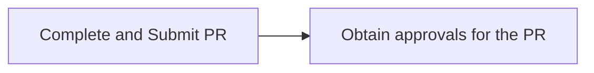

*Figure 2.6.2 Process Flow and Key Tasks - Create and Approve PR*

1) **Complete and Submit PR**
   The *End-User* creates a PR to request goods/services/projects considering (but not limited to):

   a. Existing inventory & requirement forecast.
   b. Suitable category and sub-category.
   c. Technical specifications, scope, and time plan which may be required in the PR.
   d. Budget estimated and reserved for the PR
   e. In case the requirements in the PR exceed the allocated budget, the *End-User* either arranges for additional budget, in consultation with the *Budget Owner*, or modifies the requirements in the PR to fit the allocated budget.

*Important Note: A procurement requirement is not to be split into multiple PRs to bypass approval authorities.*

2) **Obtain approvals for the PR**
   PR is reviewed and approved by approvers designated *as per the PDoA*. These approvers are from the *Business*, the *Finance*, and the *Procurement*.

   The *Procurement* verifies, if the PR requirements can be met by existing stock/inventory. If available, the requested goods are issued from the stock/inventory and the PR is cancelled by the *End-User*. If not available, the PR is reviewed for other details.

   If the approvers suggest modifications to the PR, the *End-User* makes the recommended changes and re-submits the updated PR for approval.

   An approved PR leads directly to PO unless the source of supply or conditions of the purchase must first be determined, in which case the "Sourcing Request" is created by the *Procurement* for execution of Sourcing.

132
Procurement Manual (SAP Ariba Aligned)


---


DEPARTMENT OF GOVERNMENT SUPPORT

iii. (B) Roles and Responsibilities

<table>
<thead>
<tr>
<th>Role</th>
<th>Responsibilities</th>
</tr>
</thead>
<tbody>
<tr>
<td>End-User</td>
<td>1. Complete/Update and submit PR for review and approval.<br>2. Cancel the PR if requirement can be fulfilled by the existing stock/inventory.</td>
</tr>
<tr>
<td>Approvers<br>(as per PDoA)</td>
<td>3. Review details and approve/deny PR.<br>4. Verify if the requirement can be fulfilled by the existing stock/inventory.</td>
</tr>
</tbody>
</table>

Table 2.6.1 Roles and Responsibilities – Create and Approve PR

iv. (B) Process Summary

<table>
<thead>
<tr>
<th>STAKEHOLDERS</th>
<th>DECISIONS INVOLVED</th>
<th>INPUTS</th>
<th>OUTCOMES</th>
<th>FORMS/ DOCUMENTS</th>
</tr>
</thead>
<tbody>
<tr>
<td>• End-User<br>• Approvers (as per PDoA)<br>• Store/Warehouse</td>
<td>• Is a PR required?<br>• Whether to approve/deny the PR?</td>
<td>• Details of the goods/services/ project required</td>
<td>• Approved PR<br>• Goods procured from store/ warehouse</td>
<td>• 'Purchase Requisition (PR) Form'</td>
</tr>
</tbody>
</table>

Figure 2.6.3 Process Summary – Create and Approve PR

Please refer 2.6.2.(I) 2.6.2.(I) Create and Approve PR for the process map.

## 2.6.2.(II) Create and Approve PO

i. (B) Scope and Purpose

The purpose of this process is to create and issue PO to the **Supplier** which details the terms and conditions of purchase after required approvals. The **Supplier** also confirms the receipt of the PO as a part of this process.

133
Procurement Manual (SAP Ariba Aligned)


---


دائرة الإسناد الحكومي
DEPARTMENT OF GOVERNMENT SUPPORT

ii. **(B) Process Flow and Key Tasks**

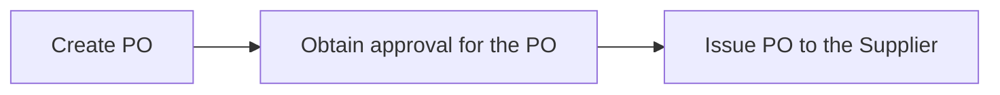

*Figure 2.6.4 Process Flow and Key Tasks - Create and Approve PO*

1) **Create PO**
   Multiple Purchase Requisitions (PR) may either be consolidated into aggregate PO or single PR may require multiple POs for the following reasons:
   a. **Same/Different Suppliers** – Goods/services/projects requested in the PR are procured through one or multiple **Suppliers**.
   b. **Same/Different Ship to Address** – Goods/services/projects requested in the PR are to be delivered across one or more locations.
   c. **Catalogue vs. Non-Catalogue** - Goods/services/projects requested in the PR may be partially fulfilled through an existing contract.

> *Important Note: An approved PR is not to be split into multiple POs to bypass approval authorities.*

A PR may be converted into a PO directly, through an existing contract, or through sourcing and contracting processes. PO is created by the **Procurement**.

> *Important Note: Approved PR is verified by the Procurement against existing contracts to identify if the requirement can be fulfilled without entering into new obligations.*

A Purchase Order (PO) includes details defining what the **Supplier** needs to fulfil the order. The PO serves as an electronic trace defining the purchase. The details relevant for the PO include (but not limited to):

a. Supplier details
b. Descriptions, quantities, prices, and discounts on goods/services/projects in the order
c. Payment terms along with shipment/delivery dates

2) **Obtain approval for the PO**
   PO is reviewed and approved by approvers designated **as per the PDoA**. If the approvers suggest modifications to the PO, the **Procurement** makes the recommended changes and re-submits the updated PO for approval. Approved PO is sent to the **Supplier** for delivery of goods/services/projects.

134
Procurement Manual (SAP Ariba Aligned)


---


دائرة الإسناد الحكومي
DEPARTMENT OF GOVERNMENT SUPPORT

3) Issue PO to the Supplier

The *Supplier* confirms the receipt of the PO and specifies whether it can provide the entire quantities specified in the PO or not, as a part of this process.

In cases where a *Supplier* can only provide partial quantities, the *Procurement* can edit the PO for the quantities confirmed by the *Supplier*. The modified PO needs to go through the approval process explained above.

iii. (B) Roles and Responsibilities

<table>
<thead>
<tr>
<th>Role</th>
<th>Responsibilities</th>
</tr>
</thead>
<tbody>
<tr>
<td>End-User</td>
<td>1. Modify PR, if required.</td>
</tr>
<tr>
<td>Approvers<br>(as per PDoA)</td>
<td>2. Review details and approve/deny PO.</td>
</tr>
<tr>
<td rowspan="4">Procurement</td>
<td>3. Create/update and submit PO for review and approval.</td>
</tr>
<tr>
<td>4. Send PO to the *Supplier*.</td>
</tr>
<tr>
<td>5. Modify PO, if partial quantities can be provided by the *Supplier*.</td>
</tr>
<tr>
<td>6. Issue PO to the *Supplier*</td>
</tr>
<tr>
<td>Supplier</td>
<td>7. Confirm receipt of the PO and specify if full/partial PO quantities can be met.</td>
</tr>
</tbody>
</table>

*Table 2.6.2 Roles and Responsibilities – Create and Approve PO*

iv. (B) Process Summary

<table>
<thead>
<tr>
<th>STAKEHOLDERS</th>
<th>DECISIONS INVOLVED</th>
<th>INPUTS</th>
<th>OUTCOMES</th>
<th>FORMS/ DOCUMENTS</th>
</tr>
</thead>
<tbody>
<tr>
<td>• Procurement<br>• End-User<br>• Approvers (as per PDoA)<br>• Supplier</td>
<td>• Should Single/ multiple POs be created against the PR?</td>
<td>• Approved PR<br>• Approved Contract<br>• Approved " Awards Scenario"</td>
<td>• Approved PO<br>• Modified PR</td>
<td>• Purchase Order (PO) form</td>
</tr>
</tbody>
</table>

*Figure 2.6.5 Process Summary – Create and Approve PO*

Please refer to *Appendix 3.1 – 2.6.2.(II) Create and Approve PO* for the process map.

135
Procurement Manual (SAP Ariba Aligned)


---


دائرة الإسناد الحكومي
DEPARTMENT OF GOVERNMENT SUPPORT

## 2.6.2.(III) Receive Goods/Services/Projects and Confirm

### i. (B) Scope and Purpose

The purpose of the receiving process is to accept the goods/services/projects, generate a receipt for the accepted delivery. The process includes quality inspection and management of return of goods to the *Suppliers*.

### ii. (B) Process Flow and Key Tasks

<table>
<tr>
<td>Receive goods/services/projects and match against PO</td>
<td>→</td>
<td>Create and approve Goods/Services/Projects Receipt</td>
</tr>
</table>

*Figure 2.6.6 Process Flow and Key Tasks - Receive Goods/Services/Projects and Confirm*

1) Receive goods/services/projects and match against PO
   The goods received by the *End-User* or the store/warehouse are reviewed to ensure that the quantity delivered and specifications match with the PO and the delivery documents.

   Based on the review, one of the following approaches may be taken:

   a. **Delivery Rejection**
      Delivery of goods may be rejected if the quantity or the specifications do not match with that provided in the PO. In such cases, the discrepancy is communicated to the *Procurement* and the *Supplier*. Depending on the reason for rejection, the *Supplier* either replaces the defective/damaged goods or delivers the missing goods.

      In case of services/projects, the *Supplier* is communicated of the deficiency of service against the PO (mapped against milestones, variance from the KPI's/SLA, timelines etc.).

      Delivery of goods/services/projects can be rejected completely or partially (e.g., % of goods delivered are not as per the specification in the PO). In case of partial rejection, partial Goods/Services/Projects Receipt is created against the PO.

      If required, the *Procurement* may also fulfil the pending requirement through an alternate *Supplier*.

136
Procurement Manual (SAP Ariba Aligned)


---


دائرة الإسناد الحكومي
DEPARTMENT OF GOVERNMENT SUPPORT

b. **Delivery Acceptance**
   Delivery of goods is accepted if the quantity and specifications of goods received match with that provided in the PO. In case of services/projects, the *End-User* provide inputs on service/projects delivery with milestones, KPI's/SLA, timelines etc. which is used to provide delivery acceptance.

2) **Create and approve Goods/Service/Projects Receipt**
   *End-User* creates Goods/Service/Projects Receipt reflecting the goods/services/projects accepted upon delivery or post inspection. In case of goods/services/projects with high value, Entity may choose to form a committee to conduct the inspection.

   The Goods/Service/Projects Receipt is reviewed by the approvers designated *as per the PDoA*. In case the approvers suggest modifications to the Goods/Service/Projects Receipt, the *End-User* makes necessary modifications and re-submits it for approval.

   The Goods/Service/Projects Receipt and PO are used as reference documents for invoice reconciliation process and authorizing payment to the *Supplier*.

iii. **(B) Roles and Responsibilities**

<table>
<thead>
<tr>
<th>Role</th>
<th>Responsibilities</th>
</tr>
</thead>
<tbody>
<tr>
<td>Store/<br>Warehouse<br>(if applicable)</td>
<td>1. Receive goods and match order against the PO.<br>2. Accept/reject delivery.<br>3. Communicate delivery rejection to <em>Procurement</em> and <em>Supplier</em>.<br>4. Create Goods/Service/Projects Receipt.</td>
</tr>
<tr>
<td>End-User</td>
<td>5. Receive goods/services/projects and match order against the PO.<br>6. Accept/reject delivery.<br>7. Communicate delivery rejection to <em>Procurement</em> and <em>Supplier</em>.<br>8. Create Goods/Service/Projects Receipt</td>
</tr>
<tr>
<td>Approvers</td>
<td>9. Review and approve/deny the Goods/Service/Projects Receipt</td>
</tr>
<tr>
<td>Supplier</td>
<td>10. Repair/replace defective goods, rectify services, or deliver missing goods/services/projects.</td>
</tr>
</tbody>
</table>

**Table 2.6.3 Roles and Responsibilities – Receive Goods/Services/Projects and Confirm**

137
Procurement Manual (SAP Ariba Aligned)


---


دائرة الإسناد الحكومي
DEPARTMENT OF GOVERNMENT SUPPORT

#### iv. (B) Process Summary

<table>
<thead>
<tr>
<th>STAKEHOLDERS</th>
<th>DECISIONS INVOLVED</th>
<th>INPUTS</th>
<th>OUTCOMES</th>
<th>FORMS/ DOCUMENTS</th>
</tr>
</thead>
<tbody>
<tr>
<td>• End-User<br>• Store/Warehouse (if applicable)<br>• Approvers (as per PDoA)<br>• Supplier</td>
<td>• Whether to accept/reject the delivery?<br>• In case of delivery rejection, how to fulfill the demand?</td>
<td>• Goods/services /projects delivered<br>• Purchase Order (PO) details</td>
<td>• Accepted/rejected delivery<br>• Approved Goods/ Service /Projects Receipt</td>
<td>• Goods/Service/ Projects Receipt</td>
</tr>
</tbody>
</table>

*Figure 2.6.7 Process Summary – Receive Goods/Services/Projects and Confirm*

Please refer to *Appendix 3.1 - 2.6.2.(III) Receive Goods/Services/Projects and Confirm* for the process map.

### 2.6.2.(IV) Conduct Emergency Purchase

#### i. (B) Scope and Purpose

The purpose of this process is to enable expedited purchases in case of operational or personal emergencies as defined *in the Procurement Standards*. The *Procurement* must ensure that emergency purchase is not used as an excuse for failing to plan.

*Important Note: This process is applicable to emergency purchase above the spend threshold specified for P-Card or Petty Cash purchases in the PDoA. Emergency purchases below this spend threshold can be managed through P-Card or Petty Cash, as applicable.*

#### ii. (B) Process Flow and Key Tasks

<table>
<thead>
<tr>
<th>Step 1</th>
<th>Step 2</th>
<th>Step 3</th>
</tr>
</thead>
<tbody>
<tr>
<td>Create, submit and approve PR</td>
<td>Create, submit and approve PO</td>
<td>Receive goods/ services</td>
</tr>
</tbody>
</table>

*Figure 2.6.8 Process Flow and Key Tasks - Conduct Emergency Purchase*

138
Procurement Manual (SAP Ariba Aligned)


---


دائرة الإسناد الحكومي
DEPARTMENT OF GOVERNMENT SUPPORT

1) Create, submit and approve PR
   The *End-User* creates and submits the PR and justification for Emergency purchase for approvals by approvers designated *as per the PDoA*.

   If approvers reject the justification for the emergency purchase, the requested goods/services/projects must be procured through regular channels. If approvers recommend modifications to the justification, the *End-User* makes the recommended modifications and re-submits PR and justification for the emergency purchase for approval.

2) Create, submit and approve PO
   Approved PR is used by the *Procurement* to verify if the requirements can be met by existing stock/inventory. If available, the requested goods are issued from the stock/inventory. If required goods are not available, the *Procurement* creates the PO and submits it for approvals by approvers designated *as per the PDoA*.

   If approvers recommend modifications to the PO, the *Procurement* makes the recommended modifications and re-submits it for approval.

3) Receive goods/services/projects
   *Procurement* engages with the *Supplier* and procures the required goods/services/projects. *Supplier* provides an invoice of the purchase to the *End-User*.

### (B) Roles and Responsibilities

<table>
<thead>
<tr>
<th>Role</th>
<th>Responsibilities</th>
</tr>
</thead>
<tbody>
<tr>
<td>End-User</td>
<td>1. Complete/update and submit PR and justification for the emergency purchase.</td>
</tr>
<tr>
<td rowspan="5">Procurement</td>
<td>2. Coordinate with End-User and store/warehouse to fulfill requirement, if possible.</td>
</tr>
<tr>
<td>3. Complete/update and submit PO</td>
</tr>
<tr>
<td>4. Identify and Engage Supplier.</td>
</tr>
<tr>
<td>5. Obtain requested goods/services/projects and invoice.</td>
</tr>
<tr>
<td rowspan="2">Approvers<br>(as per PDoA)</td>
<td>6. Review and approve/deny PR and justification for Emergency purchase</td>
</tr>
<tr>
<td>7. Review and approve/deny PO</td>
</tr>
</tbody>
</table>

*Table 2.6.4 Roles and Responsibilities - Conduct Emergency Purchase*

139
Procurement Manual (SAP Ariba Aligned)


---


DEPARTMENT OF GOVERNMENT SUPPORT

#### (B) Process Summary

<table>
<thead>
<tr>
<th>STAKEHOLDERS</th>
<th>DECISIONS INVOLVED</th>
<th>INPUTS</th>
<th>OUTCOMES</th>
<th>FORMS/ DOCUMENTS</th>
</tr>
</thead>
<tbody>
<tr>
<td>• End-User<br>• Procurement<br>• Approvers</td>
<td>• Is the requirement actually an emergency req.?<br>• Can the requirement be fulfilled by existing inventory?</td>
<td>• Goods/service /projects requirements<br>• Inventory details</td>
<td>• Goods/services /projects procured through emergency channel</td>
<td>• PR form<br>• PO form<br>• Justification for Emergency purchase</td>
</tr>
</tbody>
</table>

*Figure 2.6.9 Process Summary – Conduct Emergency Purchase*

Please refer to *Appendix 3.1 - 2.6.2.(IV) Conduct Emergency Purchase* for the process map.

### 2.6.2.(V) Conduct Petty Cash/P-Card Purchase

#### (B) Scope and Purpose

The purpose of this process is to enable Petty Cash/P-Card purchases as per the spend thresholds specified in the PDoA. Such requirements can be fulfilled without the involvement of the *Procurement*.

#### (B) Process Flow and Key Tasks

Receive goods/ services and invoice

*Figure 2.6.10 Process Flow and Key Tasks - Conduct Petty Cash/P-Card Purchase*

1) Receive goods/services/projects and invoice
   The *End-User* verifies if the requirement can be fulfilled by existing stock/inventory. If available, the requested goods are issued from the stock/inventory. Otherwise, the *End-user* may directly engage with the *Supplier* and procure required goods/services/projects, without an approved PR or PO. The *Supplier* provides an invoice of the purchase to the *End-User*.

   In case of Petty Cash/P-Card purchases, PR and PO are created and approved post-factum.

140
Procurement Manual (SAP Ariba Aligned)


---


دائرة الإسناد الحكومي
DEPARTMENT OF GOVERNMENT SUPPORT

iii. (B) Roles and Responsibilities

<table>
<thead>
<tr>
<th>Role</th>
<th>Responsibilities</th>
</tr>
</thead>
<tbody>
<tr>
<td>End-User</td>
<td>1. Check with the store/inventory for availability of required goods.<br>
2. If available, obtain required goods from Store/ Inventory.<br>
3. If unavailable, obtain goods/ services by identifying and engaging Supplier.<br>
4. Receive invoice for goods/ services.</td>
</tr>
</tbody>
</table>

Table 2.6.5 Roles and Responsibilities – Conduct Petty Cash/ P-Card Procurement

iv. (B) Process Summary

<table>
<thead>
<tr>
<th>STAKEHOLDERS</th>
<th>DECISIONS INVOLVED</th>
<th>INPUTS</th>
<th>OUTCOMES</th>
<th>FORMS/ DOCUMENTS</th>
</tr>
</thead>
<tbody>
<tr>
<td>• End-User</td>
<td>• Whether to conduct Petty Cash / P-Card procurement?</td>
<td>• Goods/service/ projects requirement</td>
<td>• Required goods/services/ projects procured</td>
<td>• Not applicable</td>
</tr>
</tbody>
</table>

Figure 2.6.11 Process Summary – Conduct Petty Cash/P-Card Purchase

Please refer to *Appendix 3.1- 2.6.2.(V) Conduct Petty Cash/P-Card Purchase* for the process map.

## 2.6.2.(VI) Create and Approve post factum PR-PO-Goods/Services/Projects Receipt

i. (B) Scope and Purpose

A post factum PR, PO, and Goods/Services/Projects Receipt is created in case of Emergency, Petty Cash, and P-Card purchases to record the purchase and spend reconciliation.

ii. (B) Process Flow and Key Tasks

<table>
<thead>
<tr>
<th>Step 1</th>
<th></th>
<th>Step 2</th>
<th></th>
<th>Step 3</th>
</tr>
</thead>
<tbody>
<tr>
<td>Create and Approve post factum PR</td>
<td>→</td>
<td>Create and Approve post factum PO</td>
<td>→</td>
<td>Create and Approve post factum Goods/Services/ Projects Receipt</td>
</tr>
</tbody>
</table>

Figure 2.6.12 Process Flow and Key Tasks - Create and Approve post factum PR - PO – Goods/Services/Projects Receipt

141
Procurement Manual (SAP Ariba Aligned)


---


دائرة الإسناد الحكومي
DEPARTMENT OF GOVERNMENT SUPPORT

1) Create and Approve post factum PR
   *End-User* completes and submits the post factum PR for review and approval by the approvers designated *as per the PDoA*. If modifications are recommended by the approvers, the *End-User* makes the recommended modifications and re-submits the post factum PR for approval.

2) Create and Approve post factum PO
   *Procurement* creates and submits the post factum PO for review and approval by the approvers designated *as per the PDoA*. If modifications are recommended by the approvers, the *Procurement* makes the recommended modifications and re-submits the post factum PO for approval.

3) Create and Approve post factum Goods/Services/Projects Receipt
   *End-User* creates and submits the post factum Goods/Services/Projects Receipt for review and approval by the approvers designated *as per the PDoA*. If modifications are recommended by the approvers, the *End-User* makes the recommended modifications and re-submits the post factum Goods/Services/Projects Receipt for approval.

   Approved post factum PR, PO, and Goods/Services/Projects Receipt are used as reference documents for invoice reconciliation process and authorizing payment to the *Supplier*.

iii. ### (B) Roles and Responsibilities

<table>
<thead>
<tr>
<th>Role</th>
<th>Responsibilities</th>
</tr>
</thead>
<tbody>
<tr>
<td rowspan="3">End-User</td>
<td>1. Complete/update and submit post factum PR for review and approval.</td>
</tr>
<tr>
<td>2. Create/update post factum Goods/Services/Projects Receipt.</td>
</tr>
<tr>
<td>3. Modify PR and Goods/Services/Projects Receipt as recommended by the approvers.</td>
</tr>
<tr>
<td>Approvers</td>
<td>4. Review details and approve/deny post factum PR, PO, and Goods/Services/Projects Receipt.</td>
</tr>
<tr>
<td rowspan="2">Procurement</td>
<td>5. Create/Update and submit post factum PO for review and approval.</td>
</tr>
<tr>
<td>6. Modify PO as recommended by the approvers.</td>
</tr>
</tbody>
</table>

*Table 2.6.6 Roles and Responsibilities – Create and Approve post factum PR-PO- Goods/Services/Projects Receipt*

142
Procurement Manual (SAP Ariba Aligned)


---


دائرة الإسناد الحكومي
DEPARTMENT OF GOVERNMENT SUPPORT

iv. (B) Process Summary

<table>
<thead>
<tr>
<th>STAKEHOLDERS</th>
<th>DECISIONS INVOLVED</th>
<th>INPUTS</th>
<th>OUTCOMES</th>
<th>FORMS/ DOCUMENTS</th>
</tr>
</thead>
<tbody>
<tr>
<td>• End-User<br>• Procurement<br>• Approvers</td>
<td>• Whether to Approve/ Deny the PR-PO- Goods /Services/Projects Receipt?</td>
<td>• Details of the goods/ services procured through Petty Cash/ P-Card/ Emergency channels</td>
<td>• Approved post factum PR-PO- Goods /Services/Projects Receipt</td>
<td>• PR form<br>• PO form<br>• Goods /Services/ Projects Receipt</td>
</tr>
</tbody>
</table>

Figure 2.6.13 Process Summary – Create and Approve post factum PR-PO-Goods/Services/Projects Receipt

Please refer to Appendix 3.1- 2.6.2.(VI) Create and Approve post factum PR-PO-Goods/Services/Projects Receipt for the process map.

## 2.6.2.(VII) Recieve and Reconcile Invoice

### i. (B) Scope and Purpose

The objective of this process is to receive invoices from the **Supplier**, reconcile it against the PO and the Goods/Services/Projects Receipt, and trigger payment to the **Supplier**.

### ii. (B) Process Flow and Key Tasks

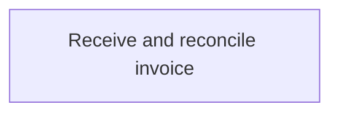

Figure 2.6.14 Process Flow and Key Tasks - Receive and Reconcile Invoice

1) Receive and reconcile invoice
   The **Finance** reconciles the invoices with the PO, Goods/Services/Projects Receipt, and contract, and triggers the payment to the **Supplier**.

### iii. (B) Roles and Responsibilities

<table>
<thead>
<tr>
<th>Role</th>
<th>Responsibilities</th>
</tr>
</thead>
<tbody>
<tr>
<td>End-User</td>
<td>1. Submit Invoice to <strong>Finance</strong>, in case of Petty Cash and P-Card purchases.<br>2. Submit PR / Post factum PR to <strong>Finance</strong>.</td>
</tr>
</tbody>
</table>

143
Procurement Manual (SAP Ariba Aligned)


---


دائرة الإسناد الحكومي
DEPARTMENT OF GOVERNMENT SUPPORT

<table>
<thead>
<tr>
<th>Role</th>
<th>Responsibilities</th>
</tr>
</thead>
<tbody>
<tr>
<td rowspan="2">Supplier</td>
<td>3. Submit Goods/Services/Projects Receipt to Finance, in case of regular and Emergency purchase.</td>
</tr>
<tr>
<td>4. Submit Invoice (along with the details of the PO), in case of regular and Emergency purchase.</td>
</tr>
<tr>
<td rowspan="2">Finance</td>
<td>5. Review and verify invoice completeness and reconciliation.</td>
</tr>
<tr>
<td>6. Approve/deny invoice and trigger payment to the Supplier.</td>
</tr>
</tbody>
</table>

**Table 2.6.7 Roles and Responsibilities – Receive and Reconcile Invoice**

iv. **(B) Process Summary**

<table>
<thead>
<tr>
<th>STAKEHOLDERS</th>
<th>DECISIONS INVOLVED</th>
<th>INPUTS</th>
<th>OUTCOMES</th>
<th>FORMS/ DOCUMENTS</th>
</tr>
</thead>
<tbody>
<tr>
<td>• Supplier<br>• Finance<br>• End-User</td>
<td>• How to proceed if invoice does not reconcile?</td>
<td>• Invoice<br>• Details of the PO<br>• Contract<br>• Goods/Services/ Projects Receipt</td>
<td>• Reconciled invoice sent for processing</td>
<td>• Invoice Receipt<br>• PR, PO, Goods/Services/ Projects Receipt<br>• Contract</td>
</tr>
</tbody>
</table>

**Figure 2.6.15 Process Summary – Receive and Reconcile Invoice**

Please refer *Appendix 3.1- 2.6.2.(VII) Receive and Reconcile Invoice* for the process map.

## 2.6.3 Work aids – Forms and Documents

<table>
<thead>
<tr>
<th>Procurement Processes</th>
<th>Work aids used</th>
</tr>
</thead>
<tbody>
<tr>
<td>2.6.2. (I)</td>
<td>Create and Approve PR</td>
<td>Purchase Requisition (PR)</td>
</tr>
<tr>
<td>2.6.2. (II)</td>
<td>Create and Approve PO</td>
<td>Purchase Order (PO)</td>
</tr>
<tr>
<td>2.6.2. (III)</td>
<td>Receive goods and confirm services</td>
<td>Goods/Services/Projects Receipt</td>
</tr>
<tr>
<td>2.6.2. (IV)</td>
<td>Conduct Emergency Procurement</td>
<td>Not applicable</td>
</tr>
<tr>
<td>2.6.2. (V)</td>
<td>Conduct Petty Cash/P-Card Procurement</td>
<td>Not applicable</td>
</tr>
<tr>
<td>2.6.2. (VI)</td>
<td>Create and Approve post factum PR, PO, and Goods/Services/Projects Receipt</td>
<td>Purchase Requisition (PR), Purchase Order (PO), and Goods/Services/Projects Receipt</td>
</tr>
<tr>
<td>2.6.2. (VII)</td>
<td>Receive and Reconcile Invoice</td>
<td>Invoice Receipt</td>
</tr>
</tbody>
</table>

**Table 2.6.8 Work Aids – Forms and Documents - R2P process group**

144
Procurement Manual (SAP Ariba Aligned)


---


دائرة الإسناد الحكومي
DEPARTMENT OF GOVERNMENT SUPPORT

## 2.6.4 RACI Matrix

Below are the details of the RACI (R – Responsible, A – Accountable, C – Consult, and I – Inform) for the R2P process group:

<table>
    <thead>
    <tr>
        <th colspan="2">L3 Process</th>
        <th>User
-
End</th>
        <th>Department</th>
        <th colspan="7">SupplierProcurementApprovers(as per PDoA)FinanceStore/WarehouseProcurementScope</th>
    </tr>
    <tr>
        <th>2.6.2.(I) Create and Approve PR</th>
        <th colspan="4">R, A</th>
        <th></th>
        <th></th>
        <th>R</th>
        <th>R</th>
        <th>C</th>
        <th>Entity</th>
    </tr>
    <tr>
        <th>2.6.2.(II) Create and Approve PO</th>
        <th colspan="4">I</th>
        <th></th>
        <th>R, A</th>
        <th>R</th>
        <th></th>
        <th></th>
        <th>Entity</th>
    </tr>
    <tr>
        <th>2.6.2.(III) Receive Goods/Services/Projects

and Confirm</th>
        <th colspan="4">R, A</th>
        <th>R</th>
        <th>I</th>
        <th></th>
        <th></th>
        <th>R</th>
        <th>Entity</th>
    </tr>
    <tr>
        <th>2.6.2.(IV) Conduct Emergency Purchase</th>
        <th colspan="4">R, A</th>
        <th></th>
        <th>R</th>
        <th>R</th>
        <th></th>
        <th>C</th>
        <th>Entity</th>
    </tr>
    <tr>
        <th>2.6.2.(V) Conduct Petty Cash/P-Card Purchase</th>
        <th colspan="4">R, A</th>
        <th></th>
        <th></th>
        <th></th>
        <th></th>
        <th>C</th>
        <th>Entity</th>
    </tr>
    <tr>
        <th>2.6.2.(VI) Create and Approve post factum PR

and Goods/Services/Projects Receipt</th>
        <th colspan="4">R,A</th>
        <th></th>
        <th></th>
        <th>R</th>
        <th></th>
        <th></th>
        <th>Entity</th>
    </tr>
    </thead>
    <tr>
        <td>2.6.2.(VI) Create and Approve post factum PO</td>
        <td colspan="4">I</td>
        <td></td>
        <td>R, A</td>
        <td>R</td>
        <td></td>
        <td></td>
        <td>Entity</td>
    </tr>
    <tr>
        <td>2.6.2.(VII) Receive and Reconcile Invoice</td>
        <td colspan="4">R</td>
        <td>R</td>
        <td>I</td>
        <td></td>
        <td>R, A</td>
        <td>C</td>
        <td>Entity</td>
    </tr></table>

*Table 2.6.9 RACI Matrix – R2P process group*

## 2.7 Risk and Regulation (R&R)

### 2.7.1 Overview

The Risk and Regulation (R&R) process group consists of procedures for the management of procurement risks and regulatory changes.

This section explains the activities, decisions involved, documents and templates used, the outcomes, and the stakeholders involved in the R&R processes.

*Procurement* risk is defined as a potential for failure of any of the procurement processes. Procurement risks may be associated with *Supplier*, supply chain, and procurement organization as illustrated below:

145
Procurement Manual (SAP Ariba Aligned)


---


دائرة الإسناد الحكومي
DEPARTMENT OF GOVERNMENT SUPPORT

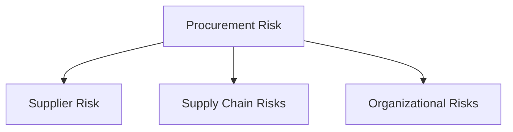

**Supplier Risk**: Risks emerging from *Suppliers'* end and are specific to *Supplier* (e.g., bankruptcies, location change, price increase, quality/delivery failure, mergers and acquisitions etc.)

**Supply Chain Risks**: Risks emerging from unexpected external market events (e.g., environmental disasters causing supply chain disruption, price and supply volatility, supply shock, etc.)

**Organizational Risks**: Risks emerging from internal processes/organization (e.g., incorrect approach to market, insufficient procurement resources, absence of category expertise, etc.)

*Figure 2.7.1 Sources of procurement risks*

Below is an illustration of the R&R Level 3 processes:

```mermaid
flowchart LR
    A[1. Profile Supplier Risk] --> B[2. Identify and Assess Risk]
    B --> C[3. Mitigate and Close Risk]
    C --> D[4. Manage 'Regulations Change']
    
    E[Periodic Supplier Risk Profiling] -.-> A
    F[ENTITY / GPO - Risk Register] -.-> B
    F -.-> C
    G[GPO to manage] -.-> D
    
    H[In "SAP Ariba"] -.-> E
    I[Offline] -.-> F
    J[In "ORACLE ADEERP"] -.-> G
```

*Figure 2.7.2 Risk and Regulations – Procurement Processes (Level 3)*

146
Procurement Manual (SAP Ariba Aligned)


---


دائرة الإسناد الحكومي
DEPARTMENT OF GOVERNMENT SUPPORT

## 2.7.2 "SAP Ariba module" Overview

All R&R procurement processes are enabled through the "SAP Ariba Knowledge Project (Supply Risk)". The R&R processes are clubbed into three distinct stages, each of which is enabled through a different risk profiling type (sub-template) within the "Knowledge Project (Supply Risk)" as illustrated below.

<table>
<thead>
<tr>
<th>Risk and Regulations Stages</th>
<th>Profile Supplier Risk</th>
<th>Manage Procurement Risks</th>
<th>Manage Regulation Change</th>
</tr>
</thead>
<tbody>
<tr>
<td>Risk Profiling type</td>
<td><em>"Supplier Risk Profiling"</em></td>
<td><em>"Mitigate Risk"</em></td>
<td><em>"Regulation Change"</em></td>
</tr>
<tr>
<td>Business Processes</td>
<td>1. Profile Supplier Risk</td>
<td>2. Identify and Assess Risk<br>3. Mitigate and Close Risk</td>
<td>4. Implement Regulation Change</td>
</tr>
</tbody>
</table>

*Figure 2.7.3 R&R processes and "SAP Ariba" stages*

The **Profile Supplier Risk** is enabled through the "Supplier Risk Profiling" sub-template within the "Knowledge Project (Supply Risk)". A "Knowledge Project (Supply Risk) - Supplier Risk Profiling" is created at GPO level to profile **Suppliers** catering to Common Categories, and at each Entity level to profile **Suppliers** catering to Entity-Specific Categories. If a **Supplier** caters to Entity-Specific Categories and Common Categories, then the **Supplier** is profiled both at GPO and Entity level. An **SRM Specialist** is assigned as the "Project Owner" for the "Knowledge Project (Supply Risk) - Supplier Risk Profiling".

The **Manage Procurement Risk** is enabled through the "Mitigate Risk" sub-template within the "Knowledge Project (Supply Risk)". A "Knowledge Project (Supply Risk) - Mitigate Risk" is created at Entity/GPO level to manage respective procurement risks. An **SRM Specialist** is assigned as the "Project Owner" for the "Knowledge Project (Supply Risk) - Mitigate Risk".

The **Manage Regulation Change** is enabled via the "Regulation Change" sub-template within the "Knowledge Project (Supply Risk)". A "Knowledge Project (Supply Risk) – Regulation Change" is only created at the GPO level. A **Risk and Regulations Lead** from the GPO is assigned as the "Project Owner" for the "Knowledge Project (Supply Risk) - Regulation Change".

147
Procurement Manual (SAP Ariba Aligned)


---


DEPARTMENT OF GOVERNMENT SUPPORT

### 2.7.3 Details of the Level 3 Processes

#### 2.7.3.(I) Profile Supplier Risk

i. **(B) Scope and Purpose**

The Profile Supplier Risk process is conducted periodically, preferably once a year, to identify high-risk *Suppliers* and optimize the risk mitigation efforts. As per the Supplier Segment Strategy, the risk profiling is conducted for following *Suppliers*:

1) All Strategic and Critical *Suppliers*.
2) Operational *Suppliers* with spend in the top 80% of the Entity spend.

The purpose of this process is to conduct "Supplier Risk Profile Input Collection Survey" and develop risk profile for *Suppliers* in "Knowledge Project (Supply Risk) – Supplier Risk Profiling".

ii. **(B) Process Flow and Key Tasks**

<table>
<thead>
<tr>
<th>Step 1</th>
<th>Step 2</th>
<th>Step 3</th>
<th>Step 4</th>
<th>Step 5</th>
</tr>
</thead>
<tbody>
<tr>
<td>Create "Knowledge Project (Supply Risk) – Supplier Risk Profiling"</td>
<td>Prepare and publish "Supplier Risk Profile Input Collection Survey"</td>
<td>Respond to "Supplier Risk Profile Input Collection Survey" (Survey Participants)</td>
<td>Complete 'Supplier Risk Profiling - Consolidated'</td>
<td>Close "Knowledge Project (Supply Risk) –Supplier Risk Profiling"</td>
</tr>
</tbody>
</table>

**Figure 2.7.4 Process Flow and Key Tasks - Profile Supplier Risk**

1) Create "Knowledge Project (Supply Risk) – Supplier Risk Profiling"
   
   The assigned *SRM Specialist* creates a "Knowledge Project (Supply Risk) – Supplier Risk Profiling" by selecting "Knowledge Project" from the "SAP Ariba Dashboard", completing the "Overview Form", selecting the "Supply Risk Management" template, and selecting "Supplier Risk Profiling" as the risk profiling type.
   
   The assigned *SRM Specialist* may link the "Knowledge Project (Supply Risk) – Supplier Risk Profiling" to a previously executed "Knowledge Project (Supply Risk) – Supplier Risk Profiling" by selecting the 'Predecessor Project' field in the "Overview Form". This helps in indicating the relationship between projects in "SAP Ariba".
   
   In case, the "Knowledge Project (Supply Risk) – Supplier Risk Profiling" created is identical (or similar) to a previously executed "Knowledge Project (Supply Risk) – Supplier Risk Profiling", the assigned *SRM Specialist* may use the 'Copy from Project' field to readily import (but not limited to) "Overview Form" details, and if required, "Project Groups" and documents from the

148
Procurement Manual (SAP Ariba Aligned)


---


دائرة الإسناد الحكومي
DEPARTMENT OF GOVERNMENT SUPPORT

previously executed project into the current project. This imported information is modifiable in the current "Knowledge Project (Supply Risk) – Supplier Risk Profiling".

The "Knowledge Project (Supply Risk) – Supplier Risk Profiling" gets activated upon completion and submission of the "Overview Form" by the assigned *SRM Specialist*. This *SRM Specialist* becomes the "Project Owner" of the project.

2) Prepare and publish "Supplier Risk Profile Input Collection Survey"
   The "Project Owner" sets up the "Supplier Risk Profile Input Collection Survey" by completing following segments:

   a. **Survey Rules**
      These rules define execution of the survey, such as:
      a1. **Timing Rules** – define time-related parameters of the survey (e.g., Planned Start date and duration).

   b. **Survey Participants**
      The Category Managers participate in the 'Supplier Risk Input Collection Survey'. For the categories, where the Category Managers are not assigned, the *Contract Administrators* and *End-Users* participate in the survey.

   c. **Survey Content**
      The content of the survey includes a 'Supplier Risk Profiling' document, which is filled by all survey participants. Following is the structure of the document:

<table>
<thead>
<tr>
<th>Tab Name</th>
<th>Description</th>
</tr>
</thead>
<tbody>
<tr>
<td>Supplier Risk Profile</td>
<td>To obtain details regarding <em>Supplier</em> risk profiles from survey participants and identify high-risk <em>Suppliers</em>.</td>
</tr>
<tr>
<td>Risk Profiling Criteria</td>
<td>Reference tab; provides detailed criteria to score the <em>Supplier</em> on Financial, Operational, Environmental, and Legislative Impacts in 'Supplier Risk Profiles' tab.</td>
</tr>
<tr>
<td>Category Taxonomy</td>
<td>Reference tab; to add level 2 category details in 'Supplier Risk Profiles' tab.</td>
</tr>
</tbody>
</table>

**Table 2.7.1** 'Supplier Risk Profiling' document structure

3) Respond to "Supplier Risk Profile Input Collection Survey"
   The *Supplier* risk profile is determined by assessing following types of *Supplier* risks:

   a. **Financial Risk**
   b. **Operational Risk**
   c. **Environmental Risk**
   d. **Legislative Risk**

   The detailed evaluation criteria for these risks is provided in the 'Risk Profiling Criteria' tab of the 'Supplier Risk Profiling' document. A higher score implies higher associated risk.

149
Procurement Manual (SAP Ariba Aligned)


---


دائرة الإسناد الحكومي
DEPARTMENT OF GOVERNMENT SUPPORT

*Suppliers* are evaluated on above mentioned risk types on a five-point scale (0 – No risk, 1 – Low Risk, 2- Medium risk, 3 – High risk, and 4 – Significant risk). *Suppliers* with a score of 3 (or above) on any of the risk types are considered as high-risk *Suppliers*.

The "Supplier Risk Profile Input Collection Survey" is completed as follows:

a. **For categories managed by Category Managers**
   The 'Supplier Risk Profiling' document is filled for each category by the respective Category Manager. The Category Manager identifies and assesses the *Supplier* risk in the 'Supplier Risk Profiles' tab of the document.

   The Category Managers may share this document with the relevant *Contract Administrators* and *End-Users* to collate required inputs. The collation of these inputs is managed outside "SAP Ariba". In such cases, the Category Manager collates these inputs into one 'Supplier Risk Profiling' document.

b. **For Categories without Category Managers**
   The 'Supplier Risk Profiling' document is filled by the relevant *Contract Administrators* and *End-Users*.

The survey participants upload the completed 'Supplier Risk Profiling' document in the "Knowledge Project (Supply Risk) – Supplier Risk Profiling" as the survey response.

*Important Note: While collating data for their category, the Category Manager / Contract Administrator / End-User are advised to ensure that the entire contracted spend is accounted for in the 'Supplier Risk Profiles' tab.*

4) **Complete 'Supplier Risk Profiling – Consolidated'**
   The "Project Owner" collates received survey responses in the 'Supplier Risk Profiles' tab of the 'Supplier Risk Profiling – Consolidated' document and completes the 'High-Risk Suppliers' tab of the document. The "Project Owner" can download the 'Supplier Risk Profiling – Consolidated' document from the "Documents" tab.

5) **Close "Knowledge Project (Supply Risk) – Supplier Risk Profiling"**
   The "Project Owner" may close the "Knowledge Project (Supply Risk) – Supplier Risk Profiling" from the "Overview" tab once the 'Supplier Risk Profiling – Consolidated' document has been uploaded in the "SAP Ariba" and shared with relevant stakeholders.

150
Procurement Manual (SAP Ariba Aligned)


---


دائرة الإسناد الحكومي
DEPARTMENT OF GOVERNMENT SUPPORT

### iii. (S) Roles and Responsibility

<table>
<thead>
<tr>
<th>Role</th>
<th>Responsibilities</th>
</tr>
</thead>
<tbody>
<tr>
<td rowspan="4">Project Owner</td>
<td>1. Create "Knowledge Project (Supply Risk) – Supplier Risk Profiling".</td>
</tr>
<tr>
<td>2. Prepare and publish the "Supplier Risk Profile Input Collection Survey".</td>
</tr>
<tr>
<td>3. Consolidate survey responses in the 'Supplier Risk Profiling - Consolidated' document and identify high-risk <strong>Suppliers</strong>.</td>
</tr>
<tr>
<td>4. Upload completed 'Supplier Risk Profiling - Consolidated' in "Knowledge Project (Supply Risk) – Profile Supplier Risk".</td>
</tr>
<tr>
<td>Survey Participants</td>
<td>5. Download, complete and upload 'Supplier Risk Profiling' document</td>
</tr>
</tbody>
</table>

**Table 2.7.2 Roles and Responsibilities – Profile Supplier Risk**

### iv. (B) Process Summary

<table>
<thead>
<tr>
<th>STAKEHOLDERS</th>
<th>DECISIONS INVOLVED</th>
<th>INPUTS</th>
<th>OUTCOMES</th>
<th>FORMS/ DOCUMENTS</th>
</tr>
</thead>
<tbody>
<tr>
<td>• Project Owner<br>• Survey Participants</td>
<td>• For which Suppliers should the risk profiling be done?</td>
<td>• Supplier's performance against risk profiling parameters</td>
<td>• High-Risk Suppliers identified for Entities/GPO</td>
<td>• "Overview Form"<br>• 'Supplier Risk Profiling'<br>• 'Supplier Risk Profiling – Consolidated'</td>
</tr>
</tbody>
</table>

**Figure 2.7.5 Process Summary – Profile Supplier Risk**

Please refer to *Appendix 3.1 - 2.7.3.(I) Profile Supplier Risk* for the process map.

## 2.7.3.(II) Identify and Assess Risk

### i. (B) Scope and Purpose

The purpose of this process is to conduct "Risk Register Input Collection Survey" and complete 'Risk Register and Mitigation Tracker' document in "Knowledge Project (Supply Risk) – Mitigate Risk".

151
Procurement Manual (SAP Ariba Aligned)


---


دائرة الإسناد الحكومي
DEPARTMENT OF GOVERNMENT SUPPORT

ii. **(B) Process Flow and Key Tasks**

<table>
<tr>
<td>Create "Knowledge Project (Supply Risk) – Mitigate Risk"</td>
<td>→</td>
<td>Assign Procurement Manager</td>
<td>→</td>
<td>Prepare and publish "Risk Register Input Collection Survey"</td>
<td>→</td>
<td>Respond to "Risk Register Input Collection Survey" (Survey Participants)</td>
<td>→</td>
<td>Update 'Risk Register and Mitigation Tracker' document</td>
</tr>
</table>

**Figure 2.7.6 Process Flow and Key Tasks - Identify and Assess Risk**

1) **Create "Knowledge Project (Supply Risk) – Mitigate Risk"**
   The assigned **SRM Specialist** creates a "Knowledge Project (Supply Risk) – Mitigate Risk" by selecting "Knowledge Project" from the "SAP Ariba Dashboard", completing the "Overview Form", selecting the "Supply Risk Management" template, and selecting the "Risk Mitigation" as the risk profiling type.

   The assigned **SRM Specialist** may link the "Knowledge Project (Supply Risk) – Mitigate Risk" to a previously executed "Knowledge Project (Supply Risk) – Mitigate Risk" or "Knowledge Project (Supply Risk) – Supplier Risk Profiling" by selecting the 'Predecessor Project' field in the "Overview Form". This helps in indicating the relationship between projects in "SAP Ariba".

   In case, the "Knowledge Project (Supply Risk) – Mitigate Risk" created is identical (or similar) to a previously executed "Knowledge Project (Supply Risk) – Mitigate Risk", the assigned **SRM Specialist** may use the 'Copy from Project' field to readily import (but not limited to) "Overview Form" details, and if required, "Project Groups" and documents from the previously executed project into the current project. This imported information is modifiable in the current "Knowledge Project (Supply Risk) – Mitigate Risk".

   The "Knowledge Project (Supply Risk) – Mitigate Risk" gets activated upon completion and submission of the "Overview Form" by the assigned **SRM Specialist**. This **SRM Specialist** becomes the "Project Owner" of the project.

2) **Assign Procurement Manager**
   The "Project Owner" assigns the **Procurement Manager** in the "Teams" tab. The **Procurement Manager** is responsible for providing oversight of the 'Identify and Assess Risk' processes and ensuring execution is compliant with the Procurement Standards and other relevant regulations.

3) **Prepare and publish "Risk Register Input Collection Survey"**
   The "Project Owner" sets up the "Risk Register Input Collection Survey" by completing the following components:
   
   a. **Survey Rules**
      These rules define execution of the survey, such as:

152
Procurement Manual (SAP Ariba Aligned)


---


دائرة الإسناد الحكومي
DEPARTMENT OF GOVERNMENT SUPPORT

a1. **Timing Rules** – define time-related parameters of the survey (e.g., Planned Start date and duration).

b. **Survey Participants**
   Relevant Category Managers, *Sourcing Leads* and *Contracting Administrators* participate in the "Risk Register Input Collection Survey".

c. **Survey content**
   The survey content includes the 'Risk Identification, Assessment, and Mitigation' document, which is filled by all survey participants. Below is the structure of the document:

<table>
<thead>
<tr>
<th>Tab Name</th>
<th>Description</th>
</tr>
</thead>
<tbody>
<tr>
<td>1. Risk Identification</td>
<td><em>To capture the details regarding the risks - products & services impacted, type of risk, etc.</em></td>
</tr>
<tr>
<td>2. Risk Assessment</td>
<td><em>To identify and evaluate the impact of the risk (in terms of likelihood and severity)</em></td>
</tr>
<tr>
<td>3. Risk Mitigation</td>
<td><em>To identify potential mitigation approaches and details for identified risks</em></td>
</tr>
<tr>
<td>4. Risk Assessment Criteria</td>
<td><em>Reference tab: To provide the criteria for quantifying the likelihood and severity of different types of risks</em></td>
</tr>
<tr>
<td>5. Risk Mitigation Approaches</td>
<td><em>Reference Tab: To provide different types of approaches which can be adopted to mitigate identified risks</em></td>
</tr>
</tbody>
</table>

**Table 2.7.3** 'Risk Register and Mitigation Tracker' document structure

4) **Respond to "Risk Register Input Collection Survey"**
   All survey participants complete the following tabs of the 'Risk Identification, Assessment and Mitigation' document:

   a. **Risk Identification tab**
      The survey participants fill this tab with details such as risk title, description, and root cause for all existing/potential procurement risks.

   b. **Risk Assessment**
      Details from the 'Risk Identification' tab are auto imported into the 'Risk Assessment' tab. The survey participants assess the severity and likelihood of each risk in this tab. Detailed criteria for these parameters are provided in the 'Risk Assessment Criteria' tab of the document. A higher score implies higher severity and likelihood of the risk.

   c. **Risk Mitigation**
      Details from the 'Risk Assessment' tabs are auto imported into the 'Risk Mitigation' tab. The survey participants identify an appropriate mitigation approach for each risk in this tab. The types of mitigation approaches are detailed in the 'Risk Mitigation Approaches' tab of the document.

   If required, the survey participants may share the 'Risk Identification, Assessment, and Mitigation' document with the *End-Users* and *Sourcing Specialists*, for additional inputs. This

153
Procurement Manual (SAP Ariba Aligned)


---


DEPARTMENT OF GOVERNMENT SUPPORT

collation of inputs is managed outside "SAP Ariba". In this case, the survey participant collates these inputs into one 'Risk Identification, Assessment, and Mitigation' document and upload it as the survey response.

The survey participants remove duplicate risks and sanitize the information in the 'Risk Identification, Assessment and Mitigation' document before submitting it as survey response.

*Important Note: Survey participants should ensure that all potential risks for the high-risk Suppliers (identified in section 2.7.3.(I) are added to the 'Risk Identification, Assessment and Mitigation' document.*

5) Update 'Risk Register and Mitigation Tracker' document
   The "Project Owner" collates the received survey response into the 'Risk Register and Mitigation Tracker' document. Below is the structure of the document:

<table>
<thead>
<tr>
<th>Tab Name</th>
<th>Description</th>
</tr>
</thead>
<tbody>
<tr>
<td>1. Risk Register</td>
<td>To maintain a live record of all procurement-related risks identified by various stakeholders. Risks identified as high-priority risks in this tab are reviewed and approved by the "Approvers" before executing the respective 'Mitigation Plan.'</td>
</tr>
</tbody>
</table>

Table 2.7.4 'Risk Mitigation Progress Report' document structure

The "Project Owner" can download the 'Risk Register and Mitigation Tracker' document from the "Documents" tab. The "Project Owner" removes any duplicate risk and rationalizes the Supplier names in the document. The "Project Owner" uploads the completed document in "Knowledge Project (Supply Risk) – Mitigate Risk" for review and approval.

*Important Note: The "Project Owner" ensures that all potential risks for the high-risk Suppliers (identified in section 2.7.3.(I) are added to the 'Risk Register and Mitigation Tracker' document.*

iii. (S) Roles and Responsibility

<table>
<thead>
<tr>
<th>Role</th>
<th>Responsibilities</th>
</tr>
</thead>
<tbody>
<tr>
<td>Project Owner</td>
<td>1. Create "Knowledge Project (Supply Risk) – Mitigate Risk".<br>
2. Assign Procurement Manager.<br>
3. Prepare and publish "Risk Register Input Collection Survey"<br>
4. Consolidate survey responses and complete 'Risk Register and Mitigation Tracker' document.</td>
</tr>
<tr>
<td>Survey Participants</td>
<td>5. Download, complete and upload the filled 'Risk Identification, Assessment, and Mitigation' document.</td>
</tr>
</tbody>
</table>

Table 2.7.5 Roles and Responsibilities – Identify and Assess Risks

154
Procurement Manual (SAP Ariba Aligned)


---


دائرة الإسناد الحكومي
DEPARTMENT OF GOVERNMENT SUPPORT

iv. (B) Process Summary

<table>
<thead>
<tr>
<th>STAKEHOLDERS</th>
<th>DECISIONS INVOLVED</th>
<th>INPUTS</th>
<th>OUTCOMES</th>
<th>FORMS/ DOCUMENTS</th>
</tr>
</thead>
<tbody>
<tr>
<td>• Project Owner<br>• Survey Participants</td>
<td>• How to identify procurement risks?<br>• How to identify appropriate mitigation approach for the risks?</td>
<td>• Existing issues and potential procurement risks</td>
<td>• Completed 'Risk Register and Mitigation Tracker' document</td>
<td>• "Overview Form"<br>• 'Risk Register and Mitigation Tracker' document</td>
</tr>
</tbody>
</table>

**Figure 2.7.7 Process Summary – Identify and Assess Risk**

Please refer to <ins>Appendix 3.1 - 2.7.3.(II) Identify and Assess Risk</ins> for the process map.

### 2.7.3.(III)Mitigate and Close Risk

i. (B) Scope and Purpose

The purpose of this process is to approve the 'Risk Register and Mitigation Tracker' document and close the identified high priority risks.

ii. (B) Process Flow and Key Tasks

<table>
<thead>
<tr>
<th>Step 1</th>
<th>Step 2</th>
<th>Step 3</th>
<th>Step 4</th>
<th>Step 5</th>
</tr>
</thead>
<tbody>
<tr>
<td>Obtain all approvals for the 'Risk Register and Mitigation Tracker' document</td>
<td>Complete 'Risk Mitigation Progress Report' and communicate high-priority risks</td>
<td>Monitor mitigation of high-priority risks</td>
<td>Close risks in 'Risk Register and Mitigation tracker' document</td>
<td>Close "Knowledge Project (Supply Risk) – Mitigate Risk"</td>
</tr>
</tbody>
</table>

**Figure 2.7.8 Process Flow and Key Tasks - Mitigate and Close Risk**

1) Obtain all approvals for the 'Risk Register and Mitigation Tracker' document
   The 'Risk Register and Mitigation Tracker' document is reviewed and approved by "Approvers" designated <ins>as per the PDoA</ins>. The "Approvers" may consider (but not limited to) the following points while reviewing the document:
   a. Check that the details provided for each risk are correct.
   b. Suggest modifications to any risk provided in the document, if required.

155
Procurement Manual (SAP Ariba Aligned)


---


DEPARTMENT OF GOVERNMENT SUPPORT

c. Recommend marking additional risks as high priority risks or to remove risks from the list of identified high-priority risks, if required.
d. Recommend assigning a high priority risk to another individual, if required.
e. Recommend adding risks to the 'Risk Register and Mitigation Tracker' document, if required.

If "Approvers" recommend changes to the 'Risk Register and Mitigation Tracker' document, the "Project Owner" makes the recommended modifications and re-submit it for approval.

The approved 'Risk Register and Mitigation Tracker' document is used to create the 'Risk Mitigation Progress Report' document and communicate high priority risks.

2) Complete 'Risk Mitigation Progress Report' and communicate high priority risks
   The "Project Owner" provides the details of the approved high priority risks in the 'Risk Mitigation Progress Report' document. Below is the structure of the document:

<table>
<thead>
<tr>
<th>Tab Name</th>
<th>Description</th>
</tr>
</thead>
<tbody>
<tr>
<td>Risk Mitigation Progress Tracker</td>
<td>To monitor the progress made toward closure of the identified high-priority risks.</td>
</tr>
</tbody>
</table>

Table 2.7.6 'Risk Mitigation Progress Report' document structure

The 'Risk Mitigation Progress Report' document is shared with the individuals responsible (identified in the approved 'Risk Register and Mitigation Tracker' document) for mitigating the high priority risks outside "SAP Ariba".

3) Monitor mitigation of high-priority risks
   The "Project Owner" initiates periodic reviews for the 'Risk Mitigation Progress Report' document. The individuals responsible for mitigating high-priority risks update the document with progress details and upload the same in the "Knowledge Project (Supply Risk) – Mitigate Risk". This monitoring of 'Risk Mitigation Progress Report' document is managed outside "SAP Ariba".

4) Close risks in 'Risk Register and Mitigation Tracker' document
   With every review of the 'Risk Mitigation Progress Report' document, the "Project Owner" updates the risk status and uploads the updated version of the 'Risk Register and Mitigation Tracker' document in the "Document" tab.

5) Close "Knowledge Project (Supply Risk) – Mitigate Risk"
   The "Project Owner" uploads the updated 'Risk Register and Mitigation Tracker' document in the "Documents" tab and close the "Knowledge Project (Supply Risk) – Mitigate Risk" from the "Overview" tab, once all identified high priority risks are "Closed".

156
Procurement Manual (SAP Ariba Aligned)


---


دائرة الإسناد الحكومي
DEPARTMENT OF GOVERNMENT SUPPORT

### iii. (S) Roles and Responsibility

<table>
<thead>
<tr>
<th>Role</th>
<th>Responsibilities</th>
</tr>
</thead>
<tbody>
<tr>
<td rowspan="5">Project Owner</td>
<td>1. Initiate "Approval" task.</td>
</tr>
<tr>
<td>2. Complete the 'Risk Mitigation Progress Report' document with details of the approved high priority risks.</td>
</tr>
<tr>
<td>3. Initiate periodic reviews of the 'Risk Mitigation Progress Report' document to monitor the progress made towards closure of identified high-priority risks.</td>
</tr>
<tr>
<td>4. Update the status of risk in the 'Risk Register and Mitigation Tracker' document with each review and upload the document.</td>
</tr>
<tr>
<td>5. Close the "Knowledge Project (Supply Risk) – Mitigate Risk"</td>
</tr>
<tr>
<td>Relevant Stakeholders</td>
<td>6. Update and submit the 'Risk Mitigation Progress report' document, as required.</td>
</tr>
<tr>
<td>Approvers (as per PDoA)</td>
<td>7. Review and approve/deny the 'Risk Register and Mitigation Tracker' document.</td>
</tr>
</tbody>
</table>

*Table 2.7.7 Roles and Responsibilities – Mitigate and Close Risks*

### iv. (B) Process Summary

<table>
<thead>
<tr>
<th>STAKEHOLDERS</th>
<th>DECISIONS INVOLVED</th>
<th>INPUTS</th>
<th>OUTCOMES</th>
<th>FORMS/ DOCUMENTS</th>
</tr>
</thead>
<tbody>
<tr>
<td>• Project Owner<br>• Relevant Stakeholders<br>• Approvers (as per PDoA)</td>
<td>• Which procurement risks should be high priority risks?<br>• Whether the proposed mitigation approach correct or not?</td>
<td>• Completed 'Risk Register and Mitigation Tracker' document</td>
<td>• Mitigated and closed procurement risks</td>
<td>• 'Risk Register and Mitigation Tracker'<br>• 'Risk Mitigation Progress report'</td>
</tr>
</tbody>
</table>

*Figure 2.7.9 Process Summary – Mitigate and Close Risks*

Please refer to *Appendix 3.1 - 2.7.3.(III) Mitigate and Close Risk* for the process map.

## 2.7.3.(IV) Implement Regulation Change

### i. (B) Scope and Purpose

The Manage Regulation Change process is conducted as and when a regulation change, effecting the *Procurement*, is introduced. The process includes development, approval, and implementation of a

157
Procurement Manual (SAP Ariba Aligned)


---


دائرة الإسناد الحكومي
DEPARTMENT OF GOVERNMENT SUPPORT

'Regulation Change' plan and is managed entirely by the GPO. Activities may be assigned to stakeholders from affected Entities, as per the 'Regulation Change' plan.

The purpose of this process is to prepare, approve, execute, and close the 'Regulation Change' document.

ii. **(B) Process Flow and Key Tasks**

<table>
<tr>
<td>Assess regulation change for impact on Procurement</td>
<td>Create "Knowledge Project (Supply Risk) – Regulation Change"</td>
<td>Complete the 'Regulation Change' document</td>
<td>Obtain approvals for the 'Regulation Change' document</td>
<td>Monitor 'Regulation Change' implementation</td>
<td>Close "Knowledge Project (Supply Risk) – Regulation Change"</td>
</tr>
</table>

**Figure 2.7.10 Process Flow and Key Tasks - Implement Regulation Change**

1) **Assess regulation change for impact on Procurement**
   The **Risk and Regulation Lead** reviews and assess potential impacts of the upcoming regulation changes on **Procurement**. In case of potential impacts, the **Risk and regulation Lead** creates, manages, executes and closes the "Knowledge Project (Supply Risk) – Regulation Change".

2) **Create "Knowledge Project (Supply Risk) – Regulation Change"**
   Assigned **Risk and Regulation Lead** creates a "Knowledge Project (Supply Risk) – Regulation Change" by selecting "Knowledge Project" from the "SAP Ariba Dashboard", completing the "Overview Form", selecting the "Supply Risk Management" template, and selecting the "Regulation Change" as the risk profiling type.

   Assigned **Risk and Regulation Lead** from GPO may link the "Knowledge Project (Supply Risk) – Regulation Change" to a previously executed "Knowledge Project (Supply Risk) – Regulation Change" by selecting the 'Predecessor Project' field in the "Overview Form". This helps in indicating the relationship between projects in "SAP Ariba".

   In case, the "Knowledge Project (Supply Risk) – Regulation Change" created is identical (or similar) to a previously executed "Knowledge Project (Supply Risk) – Regulation Change", the assigned Contracting Specialist/Lead may use the 'Copy from Project' field to readily import (but not limited to) "Overview Form" details, and if required, "Project Groups" and documents from the previously executed project into the current project. This imported information is modifiable in the current "Knowledge Project (Supply Risk) – Regulation Change".

   The "Knowledge Project (Supply Risk) – Regulation Change" gets activated upon completion and submission of the "Overview Form" by the assigned **Risk and Regulation Lead**. This **Risk and Regulation Lead** becomes the "Project Owner" of the project.

158
Procurement Manual (SAP Ariba Aligned)


---


دائرة الإسناد الحكومي
DEPARTMENT OF GOVERNMENT SUPPORT

3) Complete the 'Regulation Change' document
   The "Project Owner" downloads, completes, and uploads the 'Regulation Change' document provided in the "Documents" tab. Any inputs required to complete the document are collated offline. Below is the structure of the 'Regulation Change' document:

<table>
<thead>
<tr>
<th>Section Name</th>
<th>Description</th>
</tr>
</thead>
<tbody>
<tr>
<td>1. Regulation Overview</td>
<td><em>Provides overview details of the regulation change (such as regulation no., description, categories impacted, products impacted, etc.)</em></td>
</tr>
<tr>
<td>2. Impact on Procurement</td>
<td><em>Details actions to be taken for compliance with associated timelines, dependencies, entities affected, and budget requirement</em></td>
</tr>
<tr>
<td>3. Implementation Activities</td>
<td><em>Detailed activities to be conducted along with RACI Matrix</em></td>
</tr>
<tr>
<td>4. Communication Plan</td>
<td><em>Details of all communications required to monitor and execute the regulation change, including persons targeted, dates and key messages to be communicated</em></td>
</tr>
<tr>
<td>5. Potential Risks and Issues</td>
<td><em>Details all potential risks in the implementation of the regulation change</em></td>
</tr>
<tr>
<td>6. Implementation Plan - timelines</td>
<td><em>Details timelines for all activities listed in the 'Implementation Activities'</em></td>
</tr>
<tr>
<td>7. Regulation Change Tracking</td>
<td><em>Monitors progress made by each affected entity and progress made against each 'Implementation Activity.'</em></td>
</tr>
</tbody>
</table>

Table 2.7.8 'Regulation Change' document structure

The "Project Owner" may use the 'Regulation Change' template provided in the "Knowledge Project (Supply Risk) – Regulation Change" or other approved template covering the required elements.

4) Obtain approvals for the 'Regulation Change' document
   The completed 'Regulation Change' document is uploaded in the "Documents" tab for approval by "Approvers" designated <em>by the PDoA</em>.

   If "Approvers" recommend changes to the 'Regulation Change' document, the "Project Owner" makes the recommended modifications and re-submits it for approval.

   The approved 'Regulation Change' document is shared with the relevant stakeholders to execute the identified activities.

5) Monitor 'Regulation Change' implementation
   The "Project Owner" initiates periodic reviews of the 'Regulation Change' document to monitor the progress. Relevant stakeholders provide a progress report and highlight any issues/ deviations in the 'Regulation Change Tracking' section of the 'Regulation Change' document.

   With each review, the "Project Owner" uploads an updated version of the 'Regulation Change' document in the "Knowledge Project (Supply Risk) – Regulation Change".

159
Procurement Manual (SAP Ariba Aligned)


---


دائرة الإسناد الحكومي
DEPARTMENT OF GOVERNMENT SUPPORT

6) Close "Knowledge Project (Supply Risk) – Regulation Change"
   The "Project Owner" closes the "Knowledge Project (Supply Risk) – Regulation Change" from the "Overview" tab once all the tasks in the 'Regulation Change' document are completed, and the regulation change has been implemented.

iii. (S) Roles and Responsibility

<table>
<thead>
<tr>
<th>Role</th>
<th>Responsibilities</th>
</tr>
</thead>
<tbody>
<tr>
<td rowspan="8">Project Owner</td>
<td>1. Assess upcoming regulation change to identify impacts on the Procurement.</td>
</tr>
<tr>
<td>2. Create the "Knowledge Project (Supply Risk) – Regulation Change".</td>
</tr>
<tr>
<td>3. Download, complete, and upload the 'Regulation Change' document.</td>
</tr>
<tr>
<td>4. Initiate "Approval" task.</td>
</tr>
<tr>
<td>5. Share the approved 'Regulation Change' document with relevant stakeholders.</td>
</tr>
<tr>
<td>6. Conduct periodic reviews to monitor the progress made against the activities detailed in the 'Regulation Change' document.</td>
</tr>
<tr>
<td>7. Update and upload the 'Regulation Change' document with each review.</td>
</tr>
<tr>
<td>8. Close the "Knowledge Project (Supply Risk) – Regulation Change"</td>
</tr>
<tr>
<td>Relevant Stakeholders</td>
<td>9. Update the 'Regulation Change Tracking' section of the 'Regulation Change' document with updated status of actions and upload the document</td>
</tr>
<tr>
<td>Approvers (as per PDoA)</td>
<td>10. Review and approve/deny the 'Regulation Change' document.</td>
</tr>
</tbody>
</table>

Table 2.7.9 Roles and Responsibilities – Implement Regulation Change

iv. (B) Process Summary

<table>
<thead>
<tr>
<th>STAKEHOLDERS</th>
<th>DECISIONS INVOLVED</th>
<th>INPUTS</th>
<th>OUTCOMES</th>
<th>FORMS/ DOCUMENTS</th>
</tr>
</thead>
<tbody>
<tr>
<td>• Project Owner<br>• Relevant stakeholders<br>• Approvers (as per PDoA)</td>
<td>• Which stakeholders from the affected Entities be involved in the 'Regulation Change' implementation?</td>
<td>• Details of the 'Regulation Change'<br>• Provided timelines for implementation (if provided)</td>
<td>• Implemented 'Regulation Change'</td>
<td>• "Overview Form"<br>• 'Regulation Change'</td>
</tr>
</tbody>
</table>

Figure 2.7.11 Process Summary – Manage Regulation Change

Please refer to Appendix 3.1 - 2.7.3.(IV) Implement Regulation Change for the process map.

160
Procurement Manual (SAP Ariba Aligned)


---


دائرة الإسناد الحكومي
DEPARTMENT OF GOVERNMENT SUPPORT

## 2.7.4 Work Aids – Forms and Documents

<table>
<thead>
<tr>
<th>Procurement Processes</th>
<th>Forms and Documents</th>
</tr>
</thead>
<tbody>
<tr>
<td rowspan="3"><strong>2.7.3. (I)</strong></td>
<td rowspan="3"><em>Profile Supplier Risk</em></td>
<td>Overview Form</td>
</tr>
<tr>
<td>Supplier Risk Profiling</td>
</tr>
<tr>
<td>Supplier Risk Profiling – Consolidated</td>
</tr>
<tr>
<td rowspan="3"><strong>2.7.3. (II)</strong></td>
<td rowspan="3"><em>Identify and Assess Risk</em></td>
<td>Overview Form</td>
</tr>
<tr>
<td>Risk Identification, Assessment, and Mitigation</td>
</tr>
<tr>
<td>Risk Register and Mitigation Tracker</td>
</tr>
<tr>
<td rowspan="3"><strong>2.7.3. (III)</strong></td>
<td rowspan="3"><em>Mitigate and Close Risk</em></td>
<td>Risk Register and Mitigation Tracker</td>
</tr>
<tr>
<td>Risk Mitigation Progress Report</td>
</tr>
<tr>
<td rowspan="3"><strong>2.7.3. (IV)</strong></td>
<td rowspan="3"><em>Implement Regulation Change</em></td>
<td>Overview Form</td>
</tr>
<tr>
<td>Regulation Change</td>
</tr>
</tbody>
</table>

*Table 2.7.10 Work Aids – Forms and Documents – R&R process group*

## 2.7.5 RACI Matrix

Below are the details of the RACI (R – Responsible, A – Accountable, C – Consult, and I – Inform) for the R&R process group:

<table>
    <thead>
    <tr>
        <th colspan="3">L3 Process SRM Specialist</th>
        <th>Regulation and</th>
        <th>GPO
-
Risk Lead</th>
        <th colspan="8">ContractAdministratorser Dept.)SurveyParticipantsSupplierFinanceLegal Approvers(as per PDoA)ProcurementScope
U
-
(End</th>
    </tr>
    <tr>
        <th>2.7.3. (I) Profile Supplier Risk</th>
        <th>R, A</th>
        <th colspan="4"></th>
        <th>R</th>
        <th>R</th>
        <th>I</th>
        <th></th>
        <th></th>
        <th></th>
        <th>GPO / Entity</th>
    </tr>
    <tr>
        <th>2.7.3. (II) Identify and Assess Risk</th>
        <th>R, A</th>
        <th colspan="4"></th>
        <th>R</th>
        <th>R</th>
        <th></th>
        <th></th>
        <th></th>
        <th></th>
        <th>GPO / Entity</th>
    </tr>
    <tr>
        <th>2.7.3. (III) Mitigate and Close

Risks</th>
        <th>R, A</th>
        <th colspan="4"></th>
        <th></th>
        <th></th>
        <th>R</th>
        <th></th>
        <th></th>
        <th>R</th>
        <th>GPO / Entity</th>
    </tr>
    <tr>
        <th>2.4.3. (IV) Implement Regulation

Change</th>
        <th></th>
        <th colspan="4">R, A</th>
        <th></th>
        <th></th>
        <th></th>
        <th>C</th>
        <th>C</th>
        <th>R</th>
        <th>GPO</th>
    </tr></table>

*Table 2.7.11 RACI Matrix – R&R process group*

## 2.8 Supplier Master Data Management

### 2.8.1 Overview

The Supplier Master Data Management (Supplier MDM) process group consists of procedures associated with the creation and maintenance of the Supplier Master Database. It includes procedures for *Supplier* registration, qualification, disqualification, deactivation, and reactivation. The Supplier Master Database contains unique record of each *Supplier*.

161
Procurement Manual (SAP Ariba Aligned)


---


دائرة الإسناد الحكومي
DEPARTMENT OF GOVERNMENT SUPPORT

This section explains the activities, decisions involved, documents and templates used, the outcomes, and the stakeholders involved in the Supplier MDM processes.

*Important Note: This process is only applicable to procurement Suppliers.*

Below is an illustration of the Supplier MDM processes:

<table>
<tr>
<td>1. Initiate Supplier Registration Request</td>
<td>2. Register Supplier<br>3. Update Supplier Registration</td>
<td>4. Qualify/Disqualify Supplier<br>5. Identify Preferred Supplier</td>
<td>6. Deactivate Supplier<br>7. Reactivate Supplier</td>
</tr>
</table>

*Figure 2.8.1 Supplier MDM – Procurement Processes (Level 3)*

## 2.8.1.(I) Supplier Classification

The onboarding process of a Supplier varies with the type of Supplier. Suppliers can be broadly classified into the following two categories:

i. Abu Dhabi Suppliers (AD-DED)

This category includes Suppliers that operate in the Abu Dhabi & have a valid Abu Dhabi DED license.

ii. Non-Abu Dhabi Suppliers (Non-AD-DED)

This category includes Suppliers that do not have a valid Abu Dhabi DED license. Such Suppliers may further be classified into:

1) Local Suppliers (UAE Mainland and Freezone)
2) Foreign Suppliers

The Supplier Registration Team, at the Department of Government Support (DGS), is responsible for onboarding Suppliers and maintaining the Supplier Master Database.

162
Procurement Manual (SAP Ariba Aligned)


---


دائرة الإسناد الحكومي
DEPARTMENT OF GOVERNMENT SUPPORT

## 2.8.2 "SAP Ariba Module" Overview

The Supplier MDM process group is enabled through the "SAP Ariba Supplier Lifecycle and Performance (SLP) module". The module covers the following stages:

<table>
<thead>
<tr>
<th rowspan="2">SLP Stages</th>
<th>Registration<br>Request</th>
<th>Supplier<br>Registration</th>
<th>Supplier<br>Qualification</th>
<th>Supplier<br>Deactivation/<br>Reactivation</th>
</tr>
</thead>
<tbody>
<tr>
<td rowspan="2">Business<br>Processes</td>
<td>1. Initiate Supplier<br>Registration<br>Request</td>
<td>2. Register Supplier<br>3. Update Supplier<br>Registration</td>
<td>4. Qualify/Disqualify<br>Supplier<br>5. Identify Preferred<br>Suppliers</td>
<td>6. Deactivate<br>Suppliers<br>7. Reactivate<br>Suppliers</td>
</tr>
</tbody>
</table>

*Figure 2.8.2 Supplier MDM processes and "SAP Ariba" stages*

The **Registration Request** enables *Suppliers* or Entities to raise the "Registration Request". It enables identification of duplicate requests.

The **Supplier Registration** enables *Suppliers* to complete and submit the "Registration Questionnaires" to be reviewed by the *Supplier Registration Team*. Registration of a *Supplier* in the Supplier Master Database is necessary for the *Supplier* to participate in Limited Tenders.

The **Supplier Qualification** enables *Suppliers* to complete and submit the "Qualification Questionnaire" to be reviewed by the *Supplier Registration Team*. Qualification of a *Supplier* in the Supplier Master Database is necessary for the *Supplier* to conduct business activities, including (but not limited to) receiving award, PO and submitting invoices.

The **Supplier Qualification** also includes process to disqualify a *Supplier*, if required. Suppliers can be blacklisted through the disqualification process.

The **Supplier Deactivation/Reactivation** enables the *Supplier Registration Team* to deactivate/reactivate the *Suppliers*, as required. A "Deactivated" *Supplier* is not eligible to conduct any business activity or participate in any Limited Tender.

163
Procurement Manual (SAP Ariba Aligned)


---


DEPARTMENT OF GOVERNMENT SUPPORT

## 2.8.3 Details of the Level 3 Processes

### 2.8.3.(I) Initiate Supplier Request

#### i. (B) Scope and Purpose

The *Supplier* onboarding process starts with a valid "Registration Request". The purpose of this process is to create, review, and approve the "Registration Request" and ensure that *Supplier* records are not duplicated in the Supplier Master Database.

#### ii. (B) Process Flow and Key Tasks

```mermaid
flowchart LR
    A[Raise "Registration Request"<br/>(Supplier/Entity User)] --> B[Receive and assign<br/>"Registration Request"]
    B --> C[Review and approve/<br/>deny "Registration Request"]
```

*Figure 2.8.3 Process Flow & Key Tasks - Initiate Supplier Request*

1) Raise "Registration Request"
   Below is how the "Registration Request" and registration requirements change based on the *Supplier* classification:

```mermaid
flowchart TD
    A[Self - Request] --> B[Supplier Classification]
    C[Entity Raised Request] --> B
    B --> D[Abu Dhabi Suppliers<br/>(AD - DED)]
    B --> E[Non-Abu Dhabi Suppliers<br/>(Non- AD - DED)]
    D --> F[Local Suppliers<br/>(UAE Mainland + Free zone)]
    E --> F
    E --> G[Foreign Suppliers]
    F --> H[Suppliers that operate inside<br/>UAE;<br/>No Attestation required]
    G --> I[Suppliers that only operate<br/>outside UAE;<br/>Attestation required]
```

*Figure 2.8.4 Supplier Classification*

164
Procurement Manual (SAP Ariba Aligned)


---


DEPARTMENT OF GOVERNMENT SUPPORT

a. *AD-DED Suppliers* raise a "Supplier Self-Registration Request" by opening the "SAP Ariba Supplier Self-Registration Request link" and completing and submitting the "Self-Registration Request form".

b. *Non- AD-DED Suppliers* request an Entity to raise an "Entity Raised Supplier Request", on their behalf. In such cases, the Entity user logs into "SAP Ariba Supplier Entity-Request Page", completes and submits the "Entity Raised Request Form", and uploads the required documents.

   The Entity user should validate the information provided by the *Supplier* before submitting the request and confirm that the business requirements which are met by the *Non - AD-DED Supplier* cannot be met by a *Supplier* that holds an Abu Dhabi DED license.

   The Entity user, while completing the "Entity-Raised Request Form" must confirm the expected spend with the *Supplier*. In case of *Foreign Suppliers*, this expected spend decides the attestation requirements.

2) Receive and assign "Registration Request"
   The *Supplier Registration Team Lead*, upon receiving on the "Registration Request", assigns the request to a *Supplier Data Management Specialist* for review and approval.

3) Review and approve/deny "Registration Request"
   The *Supplier Data Management Specialist* reviews the "Registration Request" for the following:

   a. Duplicate "Registration Request" - "SAP Ariba" automatically highlights if the received "Registration Request" is a duplicate and highlights potential matches using the following fields:
      a1. 'Company Name'
      a2. 'Commercial/Industrial License Number'
      a3. 'Tax Registration Number'

      In case "SAP Ariba" highlights potential matches for a "Registration Request", the *Supplier Data Management Specialist* checks for the following points, across potential duplicates:

   b. *Suppliers* with the same 'Company Name' appear as potential matches in "SAP Ariba". In this case, the *Supplier Data Management Specialist* should compare the 'Commercial/Industrial License Number' and 'Tax Registration Number' with that of the potential matches to determine if the "Registration Request" is a duplicate.

   c. *Suppliers* related to each other (e.g., parent and child companies) may have the same 'Tax Registration Number'. Such *Suppliers* appear as potential matches in "SAP Ariba". In such cases, the *Supplier Data Management Specialist* should compare the 'Commercial/Industrial License Number' with that of the potential matches to determine if the "Registration Request" is a duplicate.

165
Procurement Manual (SAP Ariba Aligned)


---


دائرة الإسناد الحكومي
DEPARTMENT OF GOVERNMENT SUPPORT

*Important Note: Different 'Commercial/Industrial License Number' implies a different Supplier. A Supplier with multiple commercial/industrial licenses raises a separate "Registration Request" for each of the commercial/industrial license.*

Based on the above activities, the **Supplier Data Management Specialist** determines if the "Registration Request" is a duplicate and reject the same in such cases. In case "SAP Ariba" does not highlight a duplicate for a "Registration Request", the **Supplier Data Management Specialist** proceeds to further evaluation of the "Registration Request".

d. **Valid "Registration Request"** – In case the "Registration Request" is not a duplicate, the **Supplier Data Management Specialist** validates if the information provided in the "Registration Request" is accurate and matches the information in the documents provided.

In case the "Registration Request" is denied, the **Supplier Data Management Specialist** provides a valid rationale, and the **Supplier** or Entity may re-start the process.

If the details provided in the "Registration Request" are found accurate, the **Supplier Data Management Specialist** approves the request and assigns himself/herself as the "Supplier Manager" for the **Supplier**. The "Supplier Manager" acts as the single point of contact for the **Supplier** during the registration and qualification processes.

As soon as the "Registration Request" is "Approved", the **Supplier** receives an invitation to register with "SAP Ariba Network". This email includes the "SAP Ariba Registration Link".

*Important Note: In case the "Registration Request" is raised by the Entity, the Entity users is notified about the request status (approval/denied).*

Suitable communication channels are established to support **Suppliers** during the registration process. The **Supplier Registration Team** must only use these channels to communicate with the **Suppliers**. The channels set up are:

<table>
<tr>
<td>
<strong>SAP ARIBA<br>"Request Additional Info"<br>functionality</strong><br><br>
<em>Supplier Registration Team can communicate with the Supplier via "Request Additional info" functionality provided in "SAP Ariba" after Supplier has submitted the registration questionnaire</em>
</td>
<td>
<strong>Helpdesk<br>Email</strong><br><br>
<em>Supplier Registration team may also communicate with the Supplier using the helpdesk email:<br>srs@dgs.gov.ae</em>
</td>
</tr>
</table>

*Figure 2.8.5 "SAP ARIBA - Communication Channels"*

166
Procurement Manual (SAP Ariba Aligned)


---


DEPARTMENT OF GOVERNMENT SUPPORT

The "Request Additional Info" functionality is only active once the **Supplier** has created an "SAP Ariba Network Account". Hence it is not available during the Initiate Supplier Request process.

## iii. (S) Roles and Responsibilities

<table>
<thead>
<tr>
<th>Role</th>
<th>Responsibilities</th>
</tr>
</thead>
<tbody>
<tr>
<td rowspan="4">Supplier</td>
<td>1. Raise "Self Registration Request", in case of <strong>AD-DED Suppliers</strong>.</td>
</tr>
<tr>
<td>2. Request an Entity to raise "Entity Raised Supplier Request", in case of <strong>Non - AD-DED Suppliers</strong>.</td>
</tr>
<tr>
<td>3. Provide all information and documentation requested by the Entity to raise the "Entity Raised Supplier Request".</td>
</tr>
<tr>
<td>4. Raise queries, if any.</td>
</tr>
<tr>
<td>Entity user</td>
<td>5. Complete and submit the "Entity-Raised Supplier Request" for <strong>Non - AD-DED Suppliers</strong>.</td>
</tr>
<tr>
<td>Supplier Data Management Lead</td>
<td>6. Assign "Registration Request" to one of the <strong>Supplier Data Management Specialists</strong>.</td>
</tr>
<tr>
<td rowspan="2">Supplier Data Management Specialist</td>
<td>7. Review the "Registration Request" for accuracy and duplication.</td>
</tr>
<tr>
<td>8. Assign "Supplier Manager".</td>
</tr>
</tbody>
</table>

*Table 2.8.1 Roles and Responsibilities – Initiate Supplier Registration*

## iv. (B) Process Summary

<table>
<thead>
<tr>
<th>STAKEHOLDERS</th>
<th>DECISIONS INVOLVED</th>
<th>INPUTS</th>
<th>OUTCOMES</th>
<th>FORMS/ DOCUMENTS</th>
</tr>
</thead>
<tbody>
<tr>
<td>
• Supplier<br>
• Entity user<br>
• Supplier Data Management Lead/ Specialist
</td>
<td>
• Whether to raise Self-Request or Entity-Request?<br>
• Whether to approve/deny the "Registration Request"?
</td>
<td>
• Information and documents required to complete "Registration Request"
</td>
<td>
• Approved/ Denied "Registration Request"<br>
• Supplier receiving "SAP Ariba Registration Link"
</td>
<td>
• "Self-Registration Request Form"<br>
• "Entity Raised Request Form"
</td>
</tr>
</tbody>
</table>

*Figure 2.8.6 Process Summary - Initiate Supplier Registration*

Please refer to **Appendix 3.1 - 2.8.3.(I) Initiate Supplier Request** for the process map.

167
Procurement Manual (SAP Ariba Aligned)


---


دائرة الإسناد الحكومي
DEPARTMENT OF GOVERNMENT SUPPORT

## 2.8.3.(II) Register Supplier

### i. (B) Scope and Purpose

The purpose of this process is to register a *Supplier* in the Supplier Master Database, maintained by the DGS. The *Supplier* is required to register with the "SAP Ariba Network", and then complete and submit the "Registration Questionnaires" to register in the Supplier Master Database, maintained by the DGS.

"Registration Questionnaires" are divided into:

1) "General Registration Questionnaire", and
2) "Payment and Bank Questionnaire"

### ii. (B) Process Flow and Key Tasks

<table>
<tr>
<td>Create "SAP Ariba Network Standard Account" (Supplier)</td>
<td>→</td>
<td>Complete and submit the "Registration Questionnaires" (Supplier)</td>
<td>→</td>
<td>Review and approve "General Registration Questionnaire"</td>
<td>→</td>
<td>Review and approve "Payment and Bank Questionnaire" (Bank Information Specialist)</td>
<td>→</td>
<td>Complete "Internal Questionnaire"</td>
</tr>
</table>

**Figure 2.8.7 Process Flow & Key Tasks - Register Supplier**

1) Create "SAP Ariba Network Standard Account"
   Using the "Registration Link" from "SAP Ariba", *Suppliers* create an "SAP Ariba Network Standard Account". *Suppliers* don't have to pay any fees to maintain this account. Once the account is created, *Suppliers* have an email ID and password to access the account.

   *Suppliers* may use their existing "SAP Ariba Network Account".

   *Suppliers* already registered in "ORACLE ADERP" need to re-register in the Supplier Master Database, maintained by the DGS in "SAP Ariba.

2) Complete and submit the "Registration Questionnaires"
   The *Supplier* logs into the "SAP Ariba Network Standard account" and views the following "Registration Questionnaires" to be filled and submitted:

   a. "General Registration Questionnaire"
      The "General Registration Questionnaire" is used to obtain information such as (but not limited to) 'License and tax information', 'Contact details', 'Goods & Services', 'Authorized Representatives', and 'Ownership Details'.

168
Procurement Manual (SAP Ariba Aligned)


---


دائرة الإسناد الحكومي
DEPARTMENT OF GOVERNMENT SUPPORT

While filling the "General Registration Questionnaire", *Foreign Suppliers* must download, review, and agree to the 'Attestation Requirements' elaborated in <ins>point (c)</ins> below.

b. **"Payment and Bank Questionnaire"**
   The *Supplier* fills the "Payment and Bank Questionnaire" upon completion and submission of the "General Registration Questionnaire". The "Payment and Bank Questionnaire" is used to obtain essential financial information such as (but not limited to) 'Payment Information' and 'Primary / Secondary Bank Details'.

c. **Attestation requirements**
   A summary of the attestation requirements is illustrated below:

<table>
<tr>
<th>Supplier Classification</th>
<th>Spend Threshold</th>
<th>Attestation Requirement</th>
</tr>
<tr>
<td rowspan="2">Foreign Suppliers</td>
<td>>500K AED/ Yr.</td>
<td><strong>Attestation Not Required:</strong><br>
• Hotels<br>
• Other Travel modes (such as Road/Rail Transportation)<br>
• Training fees for Universities and training programs<br>
• Telecommunication Services<br>
• Goods and Services to Presidential Flights<br><br>
<strong>Attestation Required</strong></td>
</tr>
<tr>
<td><500K AED/ Yr.</td>
<td><strong>No Attestation Required</strong></td>
</tr>
</table>

*Figure 2.8.8 Supplier Registration - Attestation requirements*

To be registered as a *Supplier* in the Supplier Master Database, all *Foreign Suppliers* must get certain documents attested by the UAE embassy in the country of their establishment.

c1. **Documents to be attested:**
    c11. Commercial/Industrial License or Valid Justification on Company letterhead
    c12. Tax Registration Number Certificate or Valid Justification on Company letterhead
    c13. Articles of Association / Partnership Agreement
    c14. Bank Account Confirmation letter

c2. **Exceptions to the attestation requirements:**
    c21. *Exception 1: Foreign Suppliers* with current/expected spend of less than 500,000 AED/year with all Entities combined.
    c22. *Exception 2: Foreign Suppliers* providing goods/services related to the following categories:

169
Procurement Manual (SAP Ariba Aligned)


---


دائرة الإسناد الحكومي
DEPARTMENT OF GOVERNMENT SUPPORT

I) Hotels
II) Other travel modes (such as Road/Rail transportation)
III) Training Fees for universities and training programs
IV) Telecommunication services
V) Goods/services on Presidential Flights

All *Foreign Suppliers* must download, review and agree to the 'Attestation Requirements' document, as applicable.

3) Review and approve "General Registration Questionnaire"
   The "Supplier Manager" reviews the "General Registration Questionnaire" to validate the information provided, check if attestation requirements are met (if applicable), and categories requested are valid. Once validated, the "Supplier Manager" approves the "General Registration Questionnaire" for the *Supplier*.

*Important Note: UNSPSC Level 2 Categories mentioned in the "General Registration Questionnaire" must be covered by the commercial/industrial license of the Supplier and must be aligned with the goods/services the Supplier intends to supply.*

If required, the "Supplier Manager" may request the *Supplier* to modify information provided in the "General Registration Questionnaire" through the "Request Additional Info" functionality in "SAP Ariba".

Once the "General Registration Questionnaire" is approved, the review of the "Payment and Bank Questionnaire" and completion of the "Internal Questionnaire" are initiated in parallel.

4) Review and approve "Payment and Bank Questionnaire"
   The "Bank Information Specialist" (within the *Supplier Registration Team*) ensures that the information provided in the "Payment and Bank Questionnaire" is accurate, and the attestation requirements are met (if applicable).

   If required, the "Bank Information Specialist" may request the *Supplier* to modify information provided in the "Payment and Bank Questionnaire" through the "Request Additional Info" functionality in "SAP Ariba".

5) Complete "Internal Questionnaire"
   The "Internal Questionnaire" is an "SAP Ariba" template that decides the *Supplier* enablement and restrictions.

   Based on the approved "Registration Questionnaires", the "Supplier Manager" adds information about the *Supplier* such as goods/services categories, Entities, ADERP Number (if applicable), and Related Supplier ID (if applicable) in the "Internal Questionnaire".

170
Procurement Manual (SAP Ariba Aligned)


---


دائرة الإسناد الحكومي
DEPARTMENT OF GOVERNMENT SUPPORT

*AD-DED Suppliers* are "Registered" for all Entities. While *Non – AD-DED Suppliers* are "Registered" for the Entity raising the "Entity Raised Request" for the *Supplier*. "Registered" *Suppliers* can participate in tenders across Entities and categories.

Entities specified in the "Internal Questionnaire" can conduct business (i.e., raise PO) with the *Supplier* after it is "Qualified".

## iii. (S) Roles and Responsibilities

<table>
<thead>
<tr>
<th>Role</th>
<th>Responsibilities</th>
</tr>
</thead>
<tbody>
<tr>
<td rowspan="4">Supplier</td>
<td>1. Create the "SAP Ariba Network Light Account".</td>
</tr>
<tr>
<td>2. Complete and submit the "General Registration Questionnaire" and the "Payment and Bank Questionnaire".</td>
</tr>
<tr>
<td>3. Download and review the 'Attestation Requirements' (only applicable for <em>Foreign Suppliers</em>).</td>
</tr>
<tr>
<td>4. Provide requested documents along with necessary attestations (only applicable for <em>Foreign Suppliers</em>).</td>
</tr>
<tr>
<td rowspan="3">Supplier Manager</td>
<td>5. Review and approve the "General Registration Questionnaire".</td>
</tr>
<tr>
<td>6. Seek clarifications from the <em>Supplier</em> (if any)</td>
</tr>
<tr>
<td>7. Complete the "Internal Questionnaire"</td>
</tr>
<tr>
<td rowspan="2">Bank Information Specialist</td>
<td>8. Review and approve the "Payment and Bank Questionnaire".</td>
</tr>
<tr>
<td>9. Seek clarifications from the <em>Supplier</em> (if any)</td>
</tr>
</tbody>
</table>

*Table 2.8.2 Roles and Responsibilities - Register Supplier*

## iv. (B) Process Summary

<table>
<thead>
<tr>
<th>STAKEHOLDERS</th>
<th>DECISIONS INVOLVED</th>
<th>INPUTS</th>
<th>OUTCOMES</th>
<th>FORMS/ DOCUMENTS</th>
</tr>
</thead>
<tbody>
<tr>
<td>• Supplier<br>• Supplier Manager<br>• Bank Information Specialist</td>
<td>• Is the attestation required?<br>• Whether to approve/deny the "Registration Questionnaires"?</td>
<td>• Details and documents required to complete "Registration Questionnaires"</td>
<td>• Supplier "Registered" in Supplier Master Database</td>
<td>• "General Registration Questionnaire"<br>• 'Attestation Requirements'<br>• "Payment and Bank Questionnaire"<br>• "Internal Questionnaire"</td>
</tr>
</tbody>
</table>

*Figure 2.8.9 Process Summary – Register Supplier*

Please refer to *Appendix 3.1 - 2.8.3.(II) Register Supplier* for the process map.

171
Procurement Manual (SAP Ariba Aligned)


---


DEPARTMENT OF GOVERNMENT SUPPORT

## 2.8.3.(III)Update Supplier Registration

### i. (B) Scope and Purpose

The *Supplier* can update the information provided in either of the "Registration Questionnaires", as required, at any point in time. Any such update is reviewed by the "Supplier Manager" or the "Bank Information Specialist" (as applicable) and, if validated, reflected in the *Supplier* profile.

The purpose of this process is to update the information provided by the *Supplier* in "Registration Questionnaires", as required and enable a 'Registered" *Non – AD-DED Supplier* for additional Entities.

### ii. (B) Process Flow and Key tasks

<table>
<tr>
<td>Open the "Registration Questionnaire" (*Supplier*)</td>
<td>Update the required information (*Supplier*)</td>
<td>Review and validate updated information</td>
<td>Trigger the *Supplier* "Qualification"</td>
<td>Add Entity to "Registered" *Non – AD-DED Supplier*</td>
</tr>
</table>

*Figure 2.8.10 Process Flow & Key Tasks - Update Supplier Registration*

1) Open the "Registration Questionnaire"
   The *Supplier* may need to update the information provided in the "Registration Questionnaires" due to multiple reasons including (but not limited to):

   a. Add/modify a category in the "Registration Questionnaire"
   b. Modify information due to an update at the *Supplier* end
   c. Modification in the "Registration Questionnaire" template due to a Regulation Change.

   The *Supplier* logs into the "SAP Ariba Network Standard Account" and updates the relevant information in the "General Registration Questionnaire" and "Payment and Bank Questionnaire", as required.

   The "Registration Questionnaires" close for further modifications after 365 days of no activity. In this case, the *Supplier* sends a request to the *Supplier Registration Team* (via GPO Helpdesk) to re-open the "Registration Questionnaires".

2) Update the required information
   The *Supplier* modifies/updates the information provided (including updated documents, if required) and submits the relevant "Registration Questionnaire(s)" for review and approval.

172
Procurement Manual (SAP Ariba Aligned)


---


DEPARTMENT OF GOVERNMENT SUPPORT

*Important Note: Changes in the 'Company name' or 'Commercial/Industrial License Number' of the Supplier are not allowed. The Supplier should raise a new "Registration Request" if modifications in these fields are required.*

3) Review and validate the updated information
   Once submitted, the modified "Registration Questionnaires" are reviewed and approved, as explained in section 2.8.3.(II)ii.3) and section 2.8.3.(II)ii.4). If required, "Internal Questionnaire" is updated as explained in section 2.8.3.(II)ii.5).

4) Trigger the Supplier "Qualification"
   If the Supplier has added another category of goods/services while updating information in the "Registration Questionnaires", the "Supplier Manager" qualifies the Supplier for the added category. The criteria and process for qualifying a Supplier are explained in section 2.8.3.(IV).

5) Add Entities to "Registered" Non – AD-DED Supplier
   An Entity can create a quick survey from the "SAP Ariba dashboard" to activate an already "Registered" Non - Abu Dhabi DED Supplier for itself. In such cases, the "Supplier Manager" asks the Supplier to update the "General Registration Questionnaire" to include the Entity.

   The Entity user provides the details of the Non-AD-DED Supplier to be activated, adds the "Supplier Manager" as the survey participant, and submits the survey. Upon receiving the survey, the "Supplier Manager" asks the Supplier to update the "General Registration Questionnaire" and adds this Entity to the "Internal Questionnaire" of the Non-AD-DED Supplier.

iii. (S) Roles and Responsibilities

<table>
<thead>
<tr>
<th>Role</th>
<th>Responsibilities</th>
</tr>
</thead>
<tbody>
<tr>
<td rowspan="2">Supplier</td>
<td>1. Raise request to open the "Registration Questionnaires"</td>
</tr>
<tr>
<td>2. Update information in the "General Registration Questionnaire" and "Payment and Bank Questionnaire"</td>
</tr>
<tr>
<td>Entity User</td>
<td>3. Request "Supplier Manager" to add a Non - AD-DED Supplier to the Entity's scope.</td>
</tr>
<tr>
<td rowspan="3">Supplier Manager</td>
<td>4. Open the "Registration Questionnaires"</td>
</tr>
<tr>
<td>5. Review and approve the "General Registration Questionnaire", (if updated)</td>
</tr>
<tr>
<td>6. Update the "Internal Questionnaire" (if reqd.)</td>
</tr>
<tr>
<td>Bank Information Specialist</td>
<td>7. Review and approve the "Payment and Bank Questionnaire" (if updated)</td>
</tr>
</tbody>
</table>

Table 2.8.3 Roles and Responsibilities - Update Supplier Registration

173
Procurement Manual (SAP Ariba Aligned)


---


دائرة الإسناد الحكومي
DEPARTMENT OF GOVERNMENT SUPPORT

iv. (B) Process Summary

<table>
<thead>
<tr>
<th>STAKEHOLDERS</th>
<th>DECISIONS INVOLVED</th>
<th>INPUTS</th>
<th>OUTCOMES</th>
<th>FORMS/ DOCUMENTS</th>
</tr>
</thead>
<tbody>
<tr>
<td>• Supplier<br>• Supplier Manager<br>• Entity User<br>• Bank Information Specialist</td>
<td>• Whether to approve/deny updated info.?<br>• Is the "Qualification" to be triggered for the Supplier?</td>
<td>• Updated Supplier information</td>
<td>• Updated Supplier profile<br>• "Qualification "triggered</td>
<td>• "General Registration Questionnaire"<br>• "Attestation Requirements"<br>• "Payment and Bank Questionnaire"<br>• "Internal Questionnaire"</td>
</tr>
</tbody>
</table>

*Figure 2.8.11 Process Summary – Update Supplier Registration*

Please refer to *Appendix 3.1 – 2.8.3.(III) Update Supplier Registration* for the process map.

## 2.8.3.(IV) Qualify/Disqualify Suppliers

### i. (B) Scope and Purpose

*Supplier* must be "Qualified" to be awarded or for issuance of PO. The purpose of this process is to qualify/disqualify a *Supplier*, as required.

### ii. (B) Process Flow and Key Tasks

<table>
<thead>
<tr>
<th>Step 1</th>
<th>Step 2</th>
<th>Step 3</th>
<th>Step 4</th>
</tr>
</thead>
<tbody>
<tr>
<td>Send "Qualification Questionnaire"</td>
<td>Complete & submit "Qualification Questionnaire" (Supplier)</td>
<td>Review responses & mark Supplier "Qualified"</td>
<td>Disqualify Supplier</td>
</tr>
</tbody>
</table>

*Figure 2.8.12 Process Flow & Key Tasks – Qualify/Disqualify Suppliers*

1) Send "Qualification Questionnaire"
   The "Supplier Manager" completes the "Pre-Qualification Questionnaire" and specifies the 'Category', 'Region' and 'Entity' for which the *Supplier* is to be "Qualified".

174
Procurement Manual (SAP Ariba Aligned)


---


دائرة الإسناد الحكومي
DEPARTMENT OF GOVERNMENT SUPPORT

The "Supplier Manager" sends the "Qualification Questionnaire" to the **Supplier**. The "Qualification Questionnaire" contains sections for the **Supplier** to provide declarations with respect to 'Business Standing', 'Financial Standing', and 'Previous Experience'.

**Suppliers** can be "Qualified" for multiple categories using a single "Qualification Questionnaire". In the "Pre -Qualification Questionnaire", the "Supplier Manager" has an option to add multiple categories in the 'Category' field.

2) Complete & submit "Qualification Questionnaire"
   The **Supplier** receives and responds to all sections in the "Qualification Questionnaire".

3) Review responses & mark Supplier "Qualified"
   The responses to "Qualification Questionnaire" are reviewed by the "Supplier Manager" and, subsequently, the **Supplier Data Management Lead**. The Supplier status changes to "Qualified" (automatically) once the "Qualification Questionnaire" is "Approved" by the **Supplier Data Management Lead**.

   The "Supplier Manager" (or **Supplier Data Management Lead**) may ask the **Supplier** for more information while reviewing the "Qualification Questionnaire" through the "Request Additional Info" functionality in "SAP Ariba".

   The "Supplier Manager" may provide an 'Expiry Date' for the "Qualified" status of the **Supplier**, in line with the commercial/industrial license expiration date. In such a case, once the 'Expiry Date' has passed, the **Supplier** status changes to "Qualification Expired".

4) Disqualify Supplier
   **Suppliers** can be blacklisted using disqualification functionality.

   The Entity user can create the "Supplier Disqualification Survey" from the "SAP Ariba dashboard" to request blacklisting of a **Supplier**.

   The "Supplier Manager" can disqualify a **Supplier** through the "Supplier profile" page provided in "SAP Ariba". The "Supplier Manager" provides a 'Disqualification Start Date' and a 'Disqualification End Date' while disqualifying a **Supplier**. When the 'Disqualification Expiry Date' has passed, the "Supplier Manager" may re-initiate the qualification process for the **Supplier**, as explained above.

   The guidelines for **Supplier** blacklisting are provided in **section 12** of the Procurement Standards.

### (S) Roles and Responsibilities

<table>
<thead>
<tr>
<th>Role</th>
<th>Responsibilities</th>
</tr>
</thead>
<tbody>
<tr>
<td>Supplier</td>
<td>1. Receive the "Qualification Questionnaire".<br>
2. Complete and submit "Qualification Questionnaire".<br>
3. Re-qualify Supplier, as required.</td>
</tr>
</tbody>
</table>

175
Procurement Manual (SAP Ariba Aligned)


---


DEPARTMENT OF GOVERNMENT SUPPORT

<table>
<thead>
<tr>
<th>Role</th>
<th>Responsibilities</th>
</tr>
</thead>
<tbody>
<tr>
<td>Entity User</td>
<td>4. Request "Supplier Manager" to disqualify a **Supplier**.<br>
5. Send "Qualification Questionnaire" to the **Supplier**.</td>
</tr>
<tr>
<td>Supplier Manager</td>
<td>6. Review and approve the "Qualification Questionnaire".<br>
7. Qualify **Non – AD-DED Supplier** for the requesting Entity.</td>
</tr>
<tr>
<td>Supplier Data Management Lead</td>
<td>8. Review and approve the "Qualification Questionnaire".</td>
</tr>
</tbody>
</table>

*Table 2.8.4 Roles and Responsibilities – Qualify/Disqualify Supplier*

iv. **(B) Process Summary**

<table>
<thead>
<tr>
<th>STAKEHOLDERS</th>
<th>DECISIONS INVOLVED</th>
<th>INPUTS</th>
<th>OUTCOMES</th>
<th>FORMS/ DOCUMENTS</th>
</tr>
</thead>
<tbody>
<tr>
<td>• Supplier<br>
• Supplier Manager<br>
• Supplier Data Management Lead<br>
• Entity User</td>
<td>• Whether to Qualify the Supplier or not?</td>
<td>• Details required to complete the "Qualification Questionnaire"</td>
<td>• "Qualified" Supplier<br>
• "Disqualified" Supplier</td>
<td>• "Qualification Questionnaire"<br>
• "Supplier Disqualification Survey"</td>
</tr>
</tbody>
</table>

*Figure 2.8.13 Process Summary – Qualify/Disqualify Supplier*

Please refer to *Appendix 3.1 - 2.8.3.(IV) Qualify/Disqualify Supplier* for the process map.

**2.8.3.(V) Identify "Preferred" Supplier**

i. **(B) Scope and Purpose**

A **Supplier** can be considered as a "Preferred" **Supplier** only after, at least, one year of continual business. During this year, the **Supplier** performance is monitored to decide if the **Supplier** should be considered as a "Preferred" **Supplier** for the category.

The purpose of this process is to identify and mark "Preferred" **Suppliers** for a goods/service category.

176
Procurement Manual (SAP Ariba Aligned)


---


دائرة الإسناد الحكومي
DEPARTMENT OF GOVERNMENT SUPPORT

## (B) Process Flow and Key Tasks

*Identify and mark "Preferred" Supplier(s)*

*Figure 2.8.14 Process Flow & Key Tasks – Identify "Preferred" Supplier*

1) Identify and mark "Preferred" Supplier(s)
   The "Preferred" status of the **Supplier** depends on meeting the following criteria:

   a. The **Supplier's** 'Performance Score' must be > 85% and;
   b. The **Supplier** should either be a Common Category **Supplier** or in the top 80% spend of an Entity-Specific Category spend

*Important Note: Suppliers categorized as MSME, Start-up, Emirati Entrepreneur, or Freelancers (please refer to section 1.5) are marked "Preferred" for the respective categories.*

A "Preferred" **Supplier** appears on top of the search list for the respective category, when creating a Sourcing Event.

*'Important Note': There may be more than one "Preferred" Suppliers for a Category.*

A **Supplier** can be marked "Preferred" for a category by using the "Preferred Status Form" available in the "Supplier Profile" in "SAP Ariba".

## (S) Roles and Responsibilities

<table>
<thead>
<tr>
<th>Role</th>
<th>Responsibilities</th>
</tr>
</thead>
<tbody>
<tr>
<td>Supplier Manager</td>
<td>1. Decide if the <strong>Supplier</strong> should be marked as "Preferred" for a category or not.<br>2. Mark the <strong>Supplier</strong> "Preferred", if required.</td>
</tr>
</tbody>
</table>

*Table 2.8.5 Roles and Responsibilities – Identify Preferred Supplier*

177
Procurement Manual (SAP Ariba Aligned)


---


DEPARTMENT OF GOVERNMENT SUPPORT

iv. (B) Process Summary

<table>
<thead>
<tr>
<th>STAKEHOLDERS</th>
<th>DECISIONS INVOLVED</th>
<th>INPUTS</th>
<th>OUTCOMES</th>
<th>FORMS/ DOCUMENTS</th>
</tr>
</thead>
<tbody>
<tr>
<td>• Supplier Manager</td>
<td>• Whether to mark a Supplier "Preferred"?</td>
<td>• 'Supplier Performance Scorecard'<br>• Supplier Spend details</td>
<td>• "Preferred" Supplier</td>
<td>• Not applicable</td>
</tr>
</tbody>
</table>

Figure 2.8.15 Process Summary –Identify "Preferred" Supplier

Please refer to Appendix 3.1 - 2.8.3.(V) Identify "Preferred" Supplier for the process map.

## 2.8.3.(VI) Deactivate Supplier

### i. (B) Scope and Purpose

The purpose of this process is to enable the assigned **Supplier Data Management Specialist** to deactivate **Suppliers** with an expired commercial/industrial License.

### ii. (B) Process Flow and Key Tasks

<table>
<thead>
<tr>
<th>Step 1</th>
<th>Step 2</th>
<th>Step 3</th>
</tr>
</thead>
<tbody>
<tr>
<td>Identify Suppliers with expired commercial/ industrial license</td>
<td>Email Supplier to renew commercial/ industrial license</td>
<td>Mark Supplier Deactivated</td>
</tr>
</tbody>
</table>

Figure 2.8.16 Process Flow and Key Tasks - Deactivate Supplier

1) Identify Suppliers with expired commercial/industrial license
   The assigned **Supplier Data Management Specialist** conducts quarterly reviews of the Supplier Master Database and identify **Suppliers** with expired commercial/industrial license.

2) Email Suppliers to renew commercial/industrial license
   The **Suppliers** with expired commercial/industrial license receive an email requesting to renew the license. The email mentions that if the renewed license is not reflected in "SAP Ariba" before the next quarterly review, the **Supplier** may be "Deactivated".

178
Procurement Manual (SAP Ariba Aligned)


---


دائرة الإسناد الحكومي
DEPARTMENT OF GOVERNMENT SUPPORT

3) Mark Supplier Deactivated

In case the assigned *Supplier Data Management Specialist* identifies a *Supplier* with an expired commercial/industrial license in the next quarterly review as well (even after reminder), the "Supplier Manager" may "Deactivate" the *Supplier* and provide a valid justification for the same.

"Deactivated" status implies that the "SAP Ariba" profile of the *Supplier* is no longer active. Suppliers in "Deactivated" status are not visible in any search list, cannot participate in tenders, and cannot be awarded.

All existing contracts with the *Supplier* must be terminated before deactivating a *Supplier*.

The *Supplier* must update the "Registration Questionnaire" with the renewed Commercial/ industrial license information to continue business. This is done through the Update Supplier Registration process explained in *section 2.8.3.(III)*.

### iii. (S) Roles and Responsibilities

<table>
<thead>
<tr>
<th>Role</th>
<th>Responsibilities</th>
</tr>
</thead>
<tbody>
<tr>
<td>Supplier Registration Team</td>
<td>1. Inform the <em>Supplier</em> of the expired commercial/industrial license.</td>
</tr>
<tr>
<td>Supplier Data Management Specialist</td>
<td>2. Mark the supplier "Deactivated" and provide justification.</td>
</tr>
<tr>
<td>Supplier</td>
<td>3. Update the commercial/industrial License in "General Registration Questionnaire".</td>
</tr>
</tbody>
</table>

*Table 2.8.6 Roles and Responsibilities – Deactivate Supplier*

### iv. (B) Process Summary

<table>
<thead>
<tr>
<th>STAKEHOLDERS</th>
<th>DECISIONS INVOLVED</th>
<th>INPUTS</th>
<th>OUTCOMES</th>
<th>FORMS/ DOCUMENTS</th>
</tr>
</thead>
<tbody>
<tr>
<td>• Supplier<br>• Supplier Data Quality Specialist</td>
<td>• Whether to "Deactivate" the supplier or not?</td>
<td>• Supplier commercial/ industrial License copy</td>
<td>• "Deactivated" Supplier</td>
<td>• Not applicable</td>
</tr>
</tbody>
</table>

*Figure 2.8.17 Process Summary – Deactivate Supplier*

Please refer to *Appendix 3.1 - 2.8.3.(VI) Deactivate Supplier* for the process map.

179
Procurement Manual (SAP Ariba Aligned)


---


دائرة الإسناد الحكومي
DEPARTMENT OF GOVERNMENT SUPPORT

## 2.8.3.(VII) Reactivate Supplier

### i. (B) Scope and Purpose

Activities covered under the scope of this process enable the "Supplier Manager" to reactivate a "Deactivated" *Supplier*.

### ii. (B) Process Flow and Key Tasks

<table>
<tr>
<td>Provide updated commercial/ industrial license (Supplier)</td>
<td>→</td>
<td>"Reactivate" the Supplier</td>
</tr>
</table>

*Figure 2.8.18 Process Flow and Key Tasks - Reactivate Supplier*

1) **Provide updated commercial/industrial license**
   Once the *Supplier* has updated the "General Registration Questionnaire" with the renewed Commercial/industrial License details, the same is reviewed and approved by the "Supplier Manager".

   The "General Registration Questionnaire" close for further modifications after 365 days of no activity. In this case, the *Supplier* sends a request to the *Supplier Registration Team* (via GPO Helpdesk) to re-open the "General Registration Questionnaire".

   The process to provide renewed license details in the "General Registration Questionnaire" is part of the Update Supplier Registration process explained in <ins>section 2.8.3.(III)</ins>.

2) **"Reactivate" the Supplier**
   Upon review of the renewed commercial/industrial license, the "Supplier Manager" may "Reactivate" the *Supplier*. A reactivated *Supplier* resumes the same status as it had before deactivation.

### iii. (S) Roles and Responsibilities

<table>
<thead>
<tr>
<th>Role</th>
<th>Responsibilities</th>
</tr>
</thead>
<tbody>
<tr>
<td rowspan="2">Supplier</td>
<td>1. <em>Raise Request to open the "General Registration Questionnaire" if required.</em></td>
</tr>
<tr>
<td>2. <em>Submit renewed commercial/industrial license.</em></td>
</tr>
<tr>
<td rowspan="3">Supplier Manager</td>
<td>3. <em>Review and approve request to open the "General Registration Questionnaire".</em></td>
</tr>
<tr>
<td>4. <em>Review the renewed commercial/industrial license.</em></td>
</tr>
<tr>
<td>5. <em>Mark the supplier "Reactivated" and provide justification.</em></td>
</tr>
</tbody>
</table>

*Table 2.8.7 Roles and Responsibilities –Reactivate Supplier*

180
Procurement Manual (SAP Ariba Aligned)


---


دائرة الإسناد الحكومي
DEPARTMENT OF GOVERNMENT SUPPORT

#### iv. (B) Process Summary

<table>
<thead>
<tr>
<th>STAKEHOLDERS</th>
<th>DECISIONS INVOLVED</th>
<th>INPUTS</th>
<th>OUTCOMES</th>
<th>FORMS/ DOCUMENTS</th>
</tr>
</thead>
<tbody>
<tr>
<td>• Supplier<br>• "Supplier Manager"<br>• Supplier Data Quality Specialist</td>
<td>• Whether to "Reactivate" the supplier or not?</td>
<td>• Renewed commercial/ industrial license</td>
<td>• "Reactivated" Supplier</td>
<td>• Not applicable</td>
</tr>
</tbody>
</table>

*Figure 2.8.19 Process Summary – Reactivate Supplier*

Please refer to *Appendix 3.1 - 2.8.3.(VII) Reactivate Supplier* for the process map.

### 2.8.4 Work Aids – Forms and Documents

<table>
<thead>
<tr>
<th>Procurement Processes</th>
<th>Forms and Documents</th>
</tr>
</thead>
<tbody>
<tr>
<td><strong>2.8.3. (I)</strong></td>
<td><strong>Initiate Supplier Registration</strong></td>
</tr>
<tr>
<td></td>
<td>Self-Registration Request Form</td>
</tr>
<tr>
<td></td>
<td>Entity Raised Request Form</td>
</tr>
<tr>
<td></td>
<td>General Registration Questionnaire</td>
</tr>
<tr>
<td><strong>2.8.3. (II)</strong></td>
<td><strong>Register Supplier</strong></td>
</tr>
<tr>
<td></td>
<td>Internal Questionnaire</td>
</tr>
<tr>
<td></td>
<td>Payment and Bank Questionnaire</td>
</tr>
<tr>
<td></td>
<td>General Registration Questionnaire</td>
</tr>
<tr>
<td><strong>2.8.3. (III)</strong></td>
<td><strong>Update Supplier Registration</strong></td>
</tr>
<tr>
<td></td>
<td>Internal Questionnaire</td>
</tr>
<tr>
<td></td>
<td>Payment and Bank Questionnaire</td>
</tr>
<tr>
<td><strong>2.8.3. (IV)</strong></td>
<td><strong>Qualify/Disqualify Supplier</strong></td>
</tr>
<tr>
<td></td>
<td>Qualification Questionnaire</td>
</tr>
</tbody>
</table>

*Table 2.8.8 Work Aids – Forms and Documents – Supplier MDM process group*

181
Procurement Manual (SAP Ariba Aligned)


---


دائرة الإسناد الحكومي
DEPARTMENT OF GOVERNMENT SUPPORT

## 2.8.5 RACI Matrix

Below are the details of the RACI (R – Responsible, A – Accountable, C – Consult, and I – Inform) for the Supplier MDM process group:

<table>
    <thead>
    <tr>
        <th colspan="2">L3 Process</th>
        <th>Supplier</th>
        <th>Management</th>
        <th>Data Lead</th>
        <th colspan="7">SupplierManagementData SpecialistEntity UserSupplierSupplier ManagerBank InformationSpecialistProcurementScope</th>
    </tr>
    <tr>
        <th>2.8.3.(I) Initiate and approve Supplier Request</th>
        <th colspan="5">R</th>
        <th>R, A</th>
        <th>R</th>
        <th>R</th>
        <th></th>
        <th></th>
        <th>GPO / Entity</th>
    </tr>
    <tr>
        <th>2.8.3.(II) Register Supplier</th>
        <th colspan="5"></th>
        <th></th>
        <th></th>
        <th>R</th>
        <th>R, A</th>
        <th>R</th>
        <th>GPO / Entity</th>
    </tr>
    <tr>
        <th>2.8.3.(III) Update Supplier Registration</th>
        <th colspan="5"></th>
        <th></th>
        <th></th>
        <th>R</th>
        <th>R, A</th>
        <th>R</th>
        <th>GPO / Entity</th>
    </tr>
    <tr>
        <th>2.8.3.(IV) Qualify/ Disqualify Supplier</th>
        <th colspan="5">R</th>
        <th></th>
        <th>R</th>
        <th>R</th>
        <th>R, A</th>
        <th></th>
        <th>GPO / Entity</th>
    </tr>
    <tr>
        <th>2.8.3.(V) Identify Preferred Suppliers</th>
        <th colspan="5"></th>
        <th></th>
        <th>I</th>
        <th>I</th>
        <th>R, A</th>
        <th></th>
        <th>GPO / Entity</th>
    </tr>
    <tr>
        <th>2.8.3.(VI) Deactivate Supplier</th>
        <th colspan="5">I</th>
        <th></th>
        <th>I</th>
        <th>R</th>
        <th>R, A</th>
        <th></th>
        <th>GPO / Entity</th>
    </tr>
    </thead>
    <tr>
        <td>2.8.3.(VII) Reactivate Supplier</td>
        <td colspan="5">I</td>
        <td></td>
        <td>I</td>
        <td>R</td>
        <td>R, A</td>
        <td></td>
        <td>GPO / Entity</td>
    </tr></table>

*Table 2.8.9 RACI Matrix – Supplier MDM process group*

## 2.9 Item Master Data Management

### 2.9.1 Overview

Item Master Data Management (Item MDM) process group consists of procedures associated with the creation and maintenance of records of items representing unique goods/services. The Item Master Data provides accurate, consistent and complete record of goods/services procured across Entities. The responsibility for maintaining Item Master Data is centralized with changes to the records initiated by the Entities.

Following guidelines must be adhered to during creation and maintenance of the Item Master Database:

1) Records of Item Master Data are created for frequently purchased goods/services.
2) Each item is identified by a unique code in the Item Master Data.
3) The record of each item contains (but not limited to):
   a. Item Code
   b. Description
   c. Item type
   d. Item group
   e. Unit of Measurement
   f. Unit price.

182
Procurement Manual (SAP Ariba Aligned)


---


DEPARTMENT OF GOVERNMENT SUPPORT

4) Each item belongs to one of the UNSPSC Level 3 'Classes'. UNSPSC classification is explained in section 1.2.2.

5) Item Master Database is regularly cleansed to identify and remove duplicate records and rectify incomplete and inconsistent records, to ensure data integrity.

## 2.9.2 Details of the level 3 Processes

### 2.9.2.(I) Add/modify/Delete Item record

Entity requestor can raise a request to add/modify an item record in the Item Master Data though GPO Helpdesk. The raised request must be approved by the supervisor of the requestor. The Helpdesk forwards the request to the Item Master Data team.

The Item Master Data team reviews the raised request for completeness, accuracy, and duplication.

In case the request is duplicate, the Item Master Data team rejects the request and communicate the same to the GPO helpdesk. The GPO helpdesk communicates the same to the Entity requestor.

In case the request if inaccurate or incomplete, the Item Master Data team seeks additional information from the Entity requestor (through Helpdesk).

If case the request is accurate, complete, and valid, the Item Master Data team obtains required approvals as per the PDoA to create/modify/delete the record, depending upon the request. Once approved, the Item Master Data completes executes the request in the Item master Data and communicates the same to the GPO Helpdesk. The GPO Helpdesk communicates the completion of request to the Entity requestor.

## 2.9.3 RACI Matrix

Below are the details of the RACI (R – Responsible, A – Accountable, C – Consult, and I – Inform) for the Item MDM process group:

<table>
<thead>
<tr>
<th>L3 Process</th>
<th>Entity Requestor</th>
<th>Item Master Data Team</th>
<th>Approvers (as per PDoA)</th>
<th>Procurement Scope</th>
</tr>
</thead>
<tbody>
<tr>
<td>2.9.2.(I) Add/modify/delete Item record</td>
<td>R</td>
<td>R, A</td>
<td>R</td>
<td>GPO / Entity</td>
</tr>
</tbody>
</table>

Table 2.9.1 RACI Matrix – Item MDM process group

183
Procurement Manual (SAP Ariba Aligned)


---


دائرة الإسناد الحكومي
DEPARTMENT OF GOVERNMENT SUPPORT

## 2.10 User Master Data Management

### 2.10.1 Overview
User Master Data Management (User MDM) process group consists of procedures associated with the enablement, modification and deactivation of users in "SAP Ariba". It also describes the procedure for resetting the "SAP Ariba" account password and user delegation.

This section explains the activities, decisions involved, documents and templates used, the outcomes, and the stakeholders involved in the User MDM processes.

Below is an illustration of the User MDM Level 3 processes:

<table>
<tr>
<td>1. Enable/<br>Modify/<br>Deactivate User</td>
<td>2. Delegate User /<br>Reset "SAP<br>Ariba"<br>Password</td>
</tr>
<tr>
<td>In "SAP Ariba"</td>
<td>Offline</td>
<td>In "ORACLE ADEERP"</td>
</tr>
</table>

*Figure 2.10.1 User MDM Procurement Processes (Level 3)*

### 2.10.2 "SAP Ariba – Core Administration" Overview
The User MDM process group is enabled through the "SAP Ariba – Core Administration" functionality. A "User Enablement Team" (part of the GPO) executes User MDM processes in "SAP Ariba", for all Entities.

### 2.10.3 Details of the Level 3 Processes

#### 2.10.3.(I)Enable/Modify/Deactivate User

i. <ins>Scope and Purpose</ins>

The purpose of this process is to enable/modify/deactivate users in "SAP Ariba".

184
Procurement Manual (SAP Ariba Aligned)


---


دائرة الإسناد الحكومي
DEPARTMENT OF GOVERNMENT SUPPORT

ii. **Process Flow and Key Tasks**

<table>
<tr>
<td>Raise request to enable/modify/deactivate user</td>
<td>→</td>
<td>Obtain approvals for the raised request</td>
<td>→</td>
<td>Complete the request in "SAP Ariba" (User Enablement Team)</td>
<td>→</td>
<td>Set password for enabled user</td>
</tr>
</table>

*Figure 2.10.2 Process Flow and Key Tasks – Enable/Modify/Deactivate User*

1) **Raise request to enable/modify/deactivate user**
   Entity requestor raises the request to enable/modify/deactivate user by completing the 'SAP Ariba Enablement Form'. The 'SAP Ariba Enablement Form' can be downloaded from "Abu Dhabi Procurements Portal".

2) **Obtain approvals for the raised request**
   Entity requestor sends the completed 'SAP Ariba Enablement Form' to the **Head of Procurement** for review and approval.

   If the **Head of Procurement** rejects the 'SAP Ariba Enablement Form', a valid justification must be provided to the "Requestor". The "Requestor" makes the recommended modifications and re-submits the 'SAP Ariba Enablement Form' for approval.

   Entity requestor submits the approved 'SAP Ariba Enablement Form' in "Abu Dhabi Procurements Portal" for review and approval by the "GPO Approver". If the "GPO Approver" rejects the 'SAP Ariba Enablement Form', a valid justification must be provided to the "Requestor". The "Requestor" makes the recommended modifications and re-submits the 'SAP Ariba Enablement Form' for approval.

3) **Complete the request in "SAP Ariba"**
   After the "GPO Approver" approves the 'SAP Ariba Enablement Form', the "User Enablement Team" is notified through a system-generated email.

   The assigned team member from the "User Enablement Team" takes the required actions in "SAP Ariba" and closes the request in "Abu Dhabi Procurements Portal" which triggers a notification email for the "Requestor" informing completion of the raised request.

4) **Set password for enabled user**
   In case of new user enablement, an auto-generated email is received by the Entity requestor with the instructions to set the password after the user is created in "SAP Ariba".

185
Procurement Manual (SAP Ariba Aligned)


---


DEPARTMENT OF GOVERNMENT SUPPORT

### iii. Roles and Responsibilities

<table>
<thead>
<tr>
<th>Role</th>
<th>Responsibilities</th>
</tr>
</thead>
<tbody>
<tr>
<td rowspan="6">Entity Requestor</td>
<td>1. Download 'SAP Ariba Enablement Form' from "Abu Dhabi Procurements Portal"</td>
</tr>
<tr>
<td>2. Complete, sign and submit 'SAP Ariba Enablement Form' to Head of Procurement.</td>
</tr>
<tr>
<td>3. Submit approved 'SAP Ariba Enablement Form' in "Abu Dhabi Procurements Portal ".</td>
</tr>
<tr>
<td>4. Select "GPO Approver".</td>
</tr>
<tr>
<td>5. Modify 'SAP Ariba Responsibility Form' as per the recommendation of Head of Procurement/ "GPO Approver"</td>
</tr>
<tr>
<td>6. Follow email instructions and set password (in case of new user)</td>
</tr>
<tr>
<td>Head of the Procurement</td>
<td>7. Review and approve/deny the 'SAP Ariba Enablement Form'.</td>
</tr>
<tr>
<td rowspan="2">User Enablement Team</td>
<td>8. Complete required actions in "SAP Ariba" to complete the request.</td>
</tr>
<tr>
<td>9. Close request in "Abu Dhabi Procurements Portal".</td>
</tr>
<tr>
<td>GPO Approver</td>
<td>10. Review and approve/deny the 'SAP Ariba Enablement Form'.</td>
</tr>
<tr>
<td>New User</td>
<td>11. Follow email instructions and set password.</td>
</tr>
</tbody>
</table>

**Table 2.10.1 Roles and Responsibilities – Enable/Modify/Deactivate User**

### iv. Process Summary

<table>
<thead>
<tr>
<th>STAKEHOLDERS</th>
<th>DECISIONS INVOLVED</th>
<th>INPUTS</th>
<th>OUTCOMES</th>
<th>FORMS/ DOCUMENTS</th>
</tr>
</thead>
<tbody>
<tr>
<td>• Requestor<br>• Head of the Procurement<br>• User Enablement Team<br>• GPO Approver<br>• New User</td>
<td>• Is the request valid?</td>
<td>• Details required for completing "SAP Ariba Enablement Form'</td>
<td>• User enabled/ modified/ deactivated in "SAP Ariba"</td>
<td>• 'SAP Ariba Enablement Form'</td>
</tr>
</tbody>
</table>

**Figure 2.10.3 Process Summary - Enable/Modify/Deactivate User**

Please refer to *Appendix 3.1 - 2.10.3.(I) Enable/Modify/Deactivate User* for the process map.

## 2.10.3.(II) Delegate User/Reset "SAP Ariba" Password

### i. (B) Scope and Purpose

The purpose of this process is to enable the Entity requestor to delegate "SAP Ariba" responsibilities to another user and reset "SAP Ariba" password.

186
Procurement Manual (SAP Ariba Aligned)


---


دائرة الإسناد الحكومي
DEPARTMENT OF GOVERNMENT SUPPORT

*Important Note: Please note that a User can self-reset the password directly from the website. This process is only to be followed in case the self-reset does not work.*

ii. (B) Process Flow and Key Tasks

<table>
<tr>
<td>Raise<br>Request</td>
<td>→</td>
<td>Implement request<br>in "SAP Ariba"<br>(User Enablement Team)</td>
<td>→</td>
<td>Reset<br>Password</td>
</tr>
</table>

*Figure 2.10.4 Process Flow and Key Tasks – Delegate User / Reset "SAP Ariba" Password*

1) Raise Request
   The Entity requestor sends an email to the GPO Helpdesk requesting delegation of "SAP Ariba" access to another user or a password reset.

2) Implement request in "SAP Ariba"
   The GPO Helpdesk forwards the request to the "User Enablement Team" via email. The "User Enablement Team" takes the required action in "SAP Ariba" and confirms the closure of the request to GPO Helpdesk. The GPO Helpdesk confirms the same to the Entity requestor.

   In case of a delegation request, the "User Enablement Team" sends an email to the delegatee (person to whom responsibilities have been delegated to) with details of the delegation.

3) Reset Password
   In case of the password reset request, the Entity requestor receives an auto-generated email containing instructions to set a new password, once the "User Enablement Team" has reset the password in "SAP Ariba".

iii. (S) Roles and Responsibilities

<table>
<thead>
<tr>
<th>Role</th>
<th>Responsibilities</th>
</tr>
</thead>
<tbody>
<tr>
<td rowspan="3">Requestor</td>
<td>1. Submit password reset request to GPO Helpdesk via email.</td>
</tr>
<tr>
<td>2. Submit "SAP Ariba" access delegation request to GPO Helpdesk, via email.</td>
</tr>
<tr>
<td>3. Reset "SAP Ariba" password as per the instructions received in the email.</td>
</tr>
<tr>
<td rowspan="2">GPO<br>Helpdesk</td>
<td>4. Receive requests from "Requestor" and communicate to "User Enablement Team".</td>
</tr>
<tr>
<td>5. Receive confirmation from "User Enablement Team" and communicate to "Requestor".</td>
</tr>
<tr>
<td rowspan="3">User<br>Enablement<br>Team</td>
<td>6. Complete request in "SAP Ariba".</td>
</tr>
<tr>
<td>7. Communicate request completion to GPO Helpdesk.</td>
</tr>
<tr>
<td>8. Inform delegatee of the delegation done (in case of delegation request).</td>
</tr>
</tbody>
</table>

*Table 2.10.2 Roles and Responsibilities – Delegate User/Reset "SAP Ariba" Password*

187
Procurement Manual (SAP Ariba Aligned)


---


دائرة الإسناد الحكومي
DEPARTMENT OF GOVERNMENT SUPPORT

iv. (B) Process Summary

<table>
<thead>
<tr>
<th>STAKEHOLDERS</th>
<th>DECISIONS INVOLVED</th>
<th>INPUTS</th>
<th>OUTCOMES</th>
<th>FORMS/ DOCUMENTS</th>
</tr>
</thead>
<tbody>
<tr>
<td>• <em>Requestor</em><br>• <em>GPO Helpdesk</em><br>• <em>User Enablement Team</em></td>
<td>• <em>Not applicable</em></td>
<td>• <em>Request email for password reset</em></td>
<td>• <em>Password reset for the "Requestor"</em></td>
<td>• <em>Not applicable</em></td>
</tr>
</tbody>
</table>

*Figure 2.10.5 Process Summary – Delegate User/Reset "SAP Ariba" Password*

Please refer to <ins>Appendix 3.1 - 2.10.3.(II) Delegate User/Reset "SAP Ariba" Password</ins> for the process map.

### 2.10.4 Work Aids – Documents and "SAP Ariba" templates

<table>
<thead>
<tr>
<th>Procurement Processes</th>
<th>Forms and Documents</th>
</tr>
</thead>
<tbody>
<tr>
<td><strong>2.10.3.(I)</strong></td>
<td><em>Enable/Modify/Deactivate User</em></td>
<td>SAP Ariba Enablement Form</td>
</tr>
<tr>
<td><strong>2.10.3.(II)</strong></td>
<td><em>Delegate User / Reset "SAP Ariba" Password</em></td>
<td>Not Applicable</td>
</tr>
</tbody>
</table>

*Table 2.10.3 Work Aids – Forms and Documents - User MDM process group*

### 2.10.5 RACI Matrix

Below are the details of the RACI (R – Responsible, A – Accountable, C – Consult, and I – Inform) for the User MDM process group:

<table>
<thead>
<tr>
<th>L3 Process</th>
<th>Requestor</th>
<th>GPO Helpdesk</th>
<th>User Enablement Team</th>
<th>Head of Procurement</th>
<th>GPO Approver</th>
<th>Procurement Scope</th>
</tr>
</thead>
<tbody>
<tr>
<td><strong>2.10.3.(I)</strong> Enable/Modify/ Deactivate User</td>
<td>R, A</td>
<td></td>
<td>R</td>
<td>R</td>
<td>R</td>
<td>GPO / Entity</td>
</tr>
<tr>
<td><strong>2.7.3.(II)</strong> Delegate User / reset "SAP Ariba" password</td>
<td>R, A</td>
<td>I</td>
<td>R</td>
<td></td>
<td></td>
<td>GPO / Entity</td>
</tr>
</tbody>
</table>

*Table 2.10.4 RACI Matrix – User MDM process group*

188
Procurement Manual (SAP Ariba Aligned)


---


دائرة الاسناد الحكومي
DEPARTMENT OF GOVERNMENT SUPPORT

# 3. Appendix

## 3.1 Process Maps

### 2.2.3.(I) Prepare and Approve 'Category Strategy'

```mermaid
flowchart TD
    Start([Annual 'Category Strategy' creation]) --> A1[2.2.3.I_1<br/>Complete 'Overview'<br/>details and select<br/>'Category<br/>Management'<br/>template]
    
    A1 --> A2[2.2.3.I_2<br/>Assign Procurement<br/>Manager and mark task<br/>'Complete']
    
    A2 --> A3[2.2.3.I_3<br/>Download, complete/<br/>modify and upload<br/>'Internal Category<br/>Profile'. Mark task<br/>'Complete']
    
    A2 --> A4[2.2.3.I_4<br/>Download, complete/<br/>modify and upload<br/>'External Category<br/>Analysis'. Mark task<br/>'Complete']
    
    A3 --> A5[2.2.3.I_5<br/>Download, complete/<br/>modify and upload<br/>'Category Strategy'.<br/>Mark task 'Complete']
    
    A4 --> A5
    
    A5 --> A6[2.2.3.I_6<br/>Initiate/re-initiate<br/>'Review' task for<br/>Category Strategy]
    
    A6 --> A7[2.2.3.I_7<br/>Review the 'Category<br/>Strategy']
    
    A7 --> D1{Modifications<br/>Suggested?}
    
    D1 -->|Y| A8[2.2.3.I_8<br/>'Complete Review']
    D1 -->|N| A9[2.2.3.I_9<br/>'Complete Review'<br/>and upload modified<br/>'Category Strategy']
    
    A8 --> A9
    
    A9 --> A12[2.2.3.I_12<br/>Approve/deny the<br/>Category Strategy]
    
    A12 --> D2{Approved?}
    
    D2 -->|N| D3{Review<br/>Required?}
    D3 -->|Y| A10[2.2.3.I_10<br/>'Accept all Changes'<br/>and save as new<br/>version]
    D3 -->|N| A11[2.2.3.I_11<br/>Mark 'Review Category<br/>Strategy' task<br/>'Complete']
    
    A10 --> A11
    
    D2 -->|Y| D4{Review<br/>Required?}
    D4 -->|N| A13[2.2.3.I_13<br/>Make necessary<br/>modifications and save<br/>as new version]
    
    A11 --> A13
    A13 --> End[2.2.3.II Execute<br/>and Monitor<br/>'Category<br/>Strategy']
    
    D4 -->|Y| A6
```

189
Procurement Manual (SAP Ariba Aligned)


---


دائرة الاسناد الحكومي
DEPARTMENT OF GOVERNMENT SUPPORT

# 2.2.3.(II) Execute and Monitor 'Category Strategy'

```mermaid
flowchart TD
    Start([2.2.3.%28II%29_Execute and Monitor 'Category Strategy']) --> A[2.2.3.%28II%29_1<br/>Download approved<br/>'Category Strategy']
    
    A --> B[2.2.3.%28II%29_2<br/>Conduct periodic<br/>review to monitor<br/>'Category Strategy'<br/>execution]
    
    B --> C{Risks<br/>identified?}
    
    C -->|Y| D[2.7.3.%28III%29 Identify<br/>and Mitigate Risk]
    C -->|N| E{Changes<br/>reqd. in 'Category<br/>Strategy'?}
    
    D --> F[2.2.3%281%29 Prepare<br/>And Approve 'Category<br/>Strategy']
    F --> E
    
    E -->|Y| F
    E -->|N| G{Execution Plan<br/>completed?}
    
    G -->|N| B
    G -->|Y| H[2.2.3.%28II%29_3<br/>Communicate<br/>completion of<br/>'Category Strategy' to<br/>relevant stakeholders]
    
    H --> I[2.2.3.%28II%29_4<br/>Mark project<br/>"Complete" through<br/>"Overview" tab]
    
    I --> End([End])
    
    subgraph "Sourcing Specialist Lead"
        J[2.2.3%281%29 Prepare<br/>and Approve<br/>'Category<br/>Strategy']
        K[2.3 Source to<br/>Contract]
        L[2.4 Contract<br/>Lifecycle<br/>Management]
        M[2.5.2 Set<br/>relationship with<br/>selected<br/>Suppliers]
    end
    
    A -.-> N[Category<br/>Strategy]
```

190
Procurement Manual (SAP Ariba Aligned)


---


دائرة الاسناد الحكومي
DEPARTMENT OF GOVERNMENT SUPPORT

## 2.2.3.(III) Prepare 'Procurement Plan'

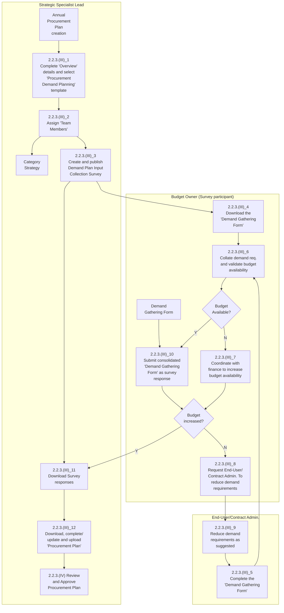

191
Procurement Manual (SAP Ariba Aligned)


---


دائرة الاسناد الحكومي
DEPARTMENT OF GOVERNMENT SUPPORT

## 2.2.3.(IV) Review and Approve 'Procurement Plan'

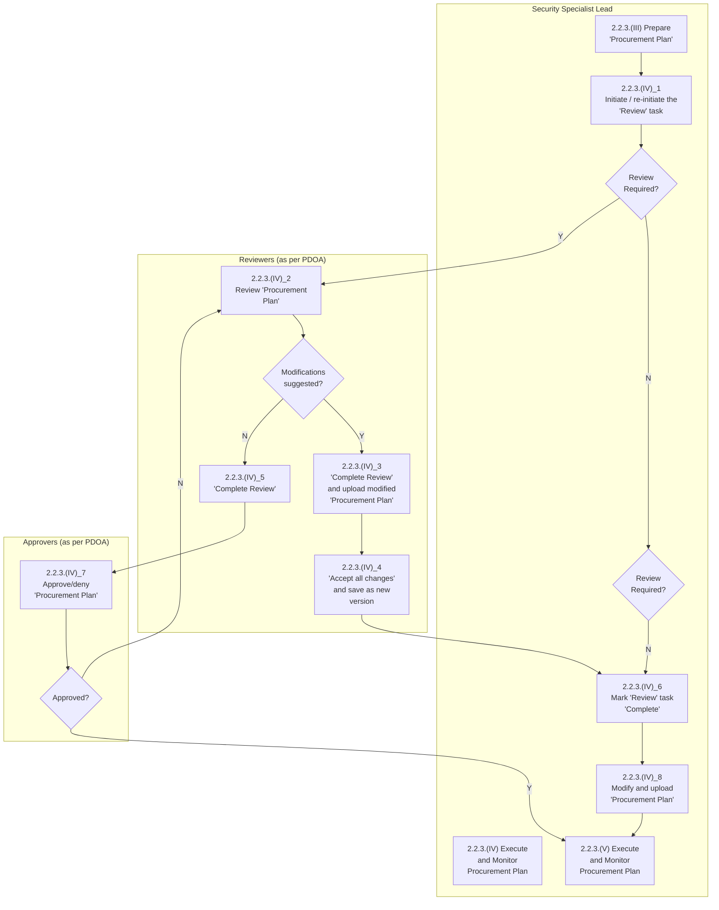

192
Procurement Manual (SAP Ariba Aligned)


---


دائرة الاسناد الحكومي
DEPARTMENT OF GOVERNMENT SUPPORT

## 2.2.3.(V) Execute and Monitor 'Procurement Plan'

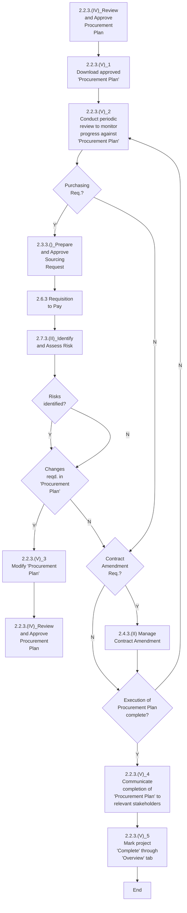

**Sourcing Specialist Lead**

193
Procurement Manual (SAP Ariba Aligned)


---


دائرة الاسناد الحكومي
DEPARTMENT OF GOVERNMENT SUPPORT

## 2.3.3.(I) Prepare and Approve "Sourcing Request"

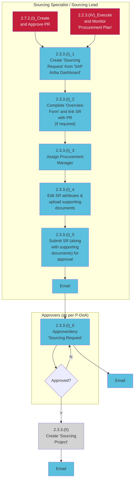

*Note: 'Sourcing Project' object appears in 'Document' tab*

194
Procurement Manual (SAP Ariba Aligned)


---


دائرة الاسناد الحكومي
DEPARTMENT OF GOVERNMENT SUPPORT

## 2.3.3.(II) Create "Sourcing Project"

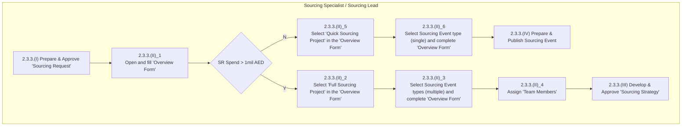

195
Procurement Manual (SAP Ariba Aligned)


---


DEPARTMENT OF GOVERNMENT SUPPORT

## 2.3.3.(III) Develop and Approve 'Sourcing Strategy'

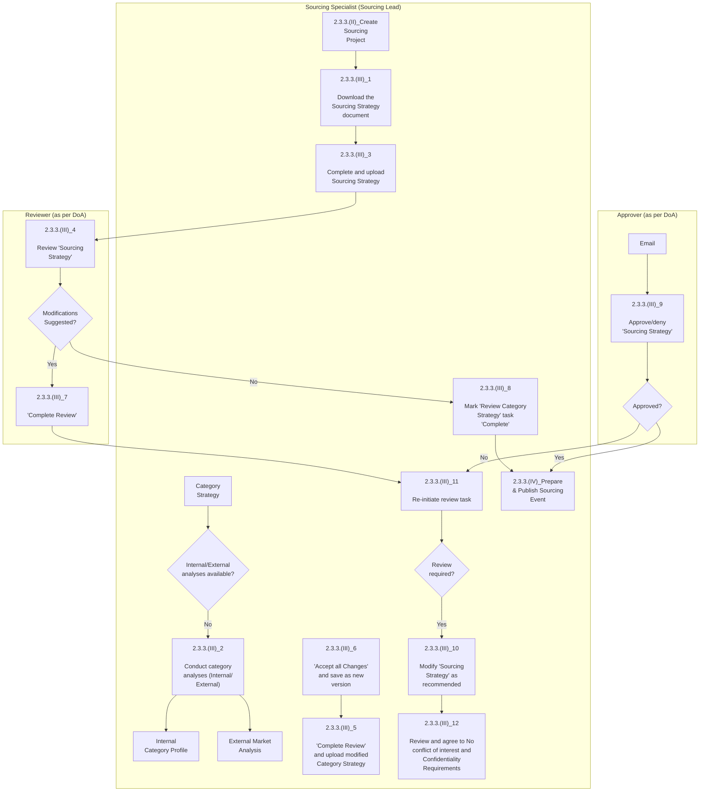

196
Procurement Manual (SAP Ariba Aligned)


---


دائرة الاسناد الحكومي
DEPARTMENT OF GOVERNMENT SUPPORT

## 2.3.3.(IV) Prepare and Publish Sourcing Event

```mermaid
flowchart TD
    subgraph "Sourcing Specialist / Sourcing Lead"
        A["2.3.3.(II)_Create<br/>'Sourcing<br/>Project'"] --> B["2.3.3.(IV)_1<br/><br/>Define rules for the<br/>Sourcing Event"]
        C["2.3.3.(III)_<br/>Develop and<br/>Approve<br/>'Sourcing<br/>Strategy'"] --> B
        D["2.3.3.(VI)_<br/>Evaluate Sourcing<br/>Event"] --> B
        E["2.3.3.(X)_<br/>Cancel Sourcing<br/>Event/'Sourcing<br/>Project'/'Sourcing<br/>Request'"] --> F["2.3.3.(IV)_2<br/><br/>Assign 'Team<br/>Members'"]
        
        B --> G{Project<br/>Type?}
        G -->|Quick| F
        G -->|Full| H{Sourcing<br/>Method?}
        
        H -->|Limited or<br/>Single/Sole| I["2.3.3.(IV)_4<br/><br/>Screen & shortlist<br/>Suppliers"]
        H -->|Public| J["2.3.3.(IV)_3<br/><br/>Create 'SAP Ariba<br/>Discovery' posting"]
        
        I --> K["2.3.3.(IV)_5<br/><br/>Edit Sourcing Event<br/>Content"]
        J --> K
        
        K --> L{Project<br/>Type?}
        L -->|Quick| M["2.3.3.(IV)_7<br/><br/>Publish Event"]
        L -->|Full Project| N{Event<br/>Type?}
        
        N -->|Auctions<br/>/RFI| M
        N -->|RFP / RFQ| O["2.3.3.(IV)_8<br/><br/>Approve/deny<br/>Sourcing Event"]
        
        M --> P["2.3.3.(V) Execute/<br/>Monitor Sourcing<br/>Event"]
    end
    
    subgraph "Approvers (As per DMA)"
        O --> Q{Approved?}
        Q -->|Y| M
        Q -->|N| R[Email]
        R --> O
    end
    
    subgraph "Contracts Manager"
        S["2.3.3.(IV)_6<br/><br/>Create draft 'Contract<br/>Workspace'"]
    end
```

197
Procurement Manual (SAP Ariba Aligned)


---


دائرة الاسناد الحكومي
DEPARTMENT OF GOVERNMENT SUPPORT

## 2.3.3.(V) Execute and Monitor Sourcing Event

```mermaid
flowchart TD
    subgraph "Suppliers"
        A["2.3.3.(IV)_Prepare<br/>and Publish Sourcing<br/>Event"] --> B["2.3.3.(V)_1<br/><br/>Review 'Pre<br/>requisites'"]
        B --> C{Agreed to Pre<br/>requisites?}
        C -->|N| D["2.3.3.(V)_2<br/><br/>Review the Sourcing<br/>Event content details"]
        C -->|Y| D
        D --> E{Is there a<br/>Preview<br/>Period?}
        E -->|N| F["2.3.3.(V)_3<br/><br/>Sourcing Event<br/>opens"]
        E -->|Y| F
        F --> G["2.3.3.(V)_4<br/><br/>Prepare/update<br/>response to the event"]
        G --> H[Email]
        H --> I{Additional<br/>Information<br/>required?}
        I -->|Y| J["2.3.3.(V)_5<br/><br/>Request Additional<br/>information"]
        I -->|N| K{Need<br/>Extension on<br/>Deadline?}
        K -->|Y| L["2.3.3.(V)_7<br/><br/>Request Extension<br/>on submission<br/>deadline"]
        K -->|N| M["2.3.3.(V)_9<br/><br/>Submit response to<br/>the Sourcing Event"]
        L --> M
        M --> N[Email]
    end
    
    subgraph "Sourcing Specialist & Sourcing Lead"
        J --> O[Email]
        O --> P["2.3.3.(V)_6<br/><br/>Provide Requested<br/>information to all<br/>Suppliers"]
        P --> Q[Email]
        Q --> R{Should<br/>deadline be<br/>modified?}
        R -->|Y| S["2.3.3.(V)_8<br/><br/>Modify deadline &<br/>inform all Suppliers"]
        R -->|N| T[Email]
        T --> U["2.3.3.(V)_10<br/><br/>Sourcing Event<br/>closes as per<br/>deadline"]
        S --> U
        U --> V[Email]
        V --> W["2.3.3.(VI)_Evaluate<br/>Sourcing Event"]
    end
```

198
Procurement Manual (SAP Ariba Aligned)


---


دائرة الاسناد الحكومي
DEPARTMENT OF GOVERNMENT SUPPORT

## 2.3.3.(VI) Evaluate Sourcing Event

```mermaid
flowchart TD
    A[2.3.3.V Execute and Monitor Sourcing Event] --> B{Sourcing Event Type}
    B -->|Auctions| C[2.3.3.VI_1 Open Technical and Commercial Envelope]
    B -->|RFI| D{Quick Project type}
    B -->|RFQ| D
    
    C --> E{Suppliers response acceptable}
    
    D -->|Quick| F[2.3.3.X Cancel Sourcing Event/Sourcing Request]
    D -->|Full| G[2.3.3.VI_2 Open Technical Envelope]
    
    E -->|No| H{Project type}
    E -->|Yes| I[2.3.3.VI_3 Conduct technical and commercial evaluations]
    
    H -->|Quick| J[2.3.3.VI_4 Review and agree to No conflict of interest and Confidentiality Requirements]
    H -->|Full| K[2.3.3.VI_5 Replace Team Grader]
    
    G --> L{Project type}
    L -->|Quick| M[2.3.3.VI_7 Obtain recommendations from End-User and necessary approvals]
    L -->|Full| N[2.3.3.VI_6 Review Team Grader comments]
    
    I --> O{Negotiations Required?}
    O -->|Yes| P[2.3.3.VII Conduct Negotiations]
    O -->|No| Q[2.3.3.IX Award & Close Out Event]
    
    M --> R[2.3.3.IV Prepare and Publish Sourcing Event]
    N --> S{Sourcing Event Type}
    S -->|RFI| R
    S -->|RFP/RFQ| T[2.3.3.VI_11 Open Commercial technically qualified Suppliers]
    
    T --> U[2.3.3.VI_8 Consolidate scores]
    U --> V[2.3.3.VI_12 Complete commercial evaluation]
    V --> W[2.3.3.VI_13 Upload commercial evaluation]
    
    J --> X[Email]
    X --> Y[2.3.3.VI_4 Review and agree to No conflict of interest and Confidentiality Requirements]
    Y --> Z{Agreed?}
    Z -->|Yes| AA[2.3.3.VI_9 Conduct technical evaluation]
    Z -->|No| BB[2.3.3.VI_5 Provide rationale]
```

199
Procurement Manual (SAP Ariba Aligned)


---


دائرة الاسناد الحكومي
DEPARTMENT OF GOVERNMENT SUPPORT

## 2.3.3.(VII) Conduct Negotiations

```mermaid
flowchart TD
    subgraph "Sourcing Specialist - Sourcing Lead"
        A["2.3.3.(VI)_Evaluate<br/>Sourcing Event"] --> B["2.3.3.(VII)_1<br/>Shortlist Suppliers for<br/>negotiations"]
        B --> C["2.3.3.(VII)_2<br/>Obtain approval for<br/>conducting<br/>negotiations"]
        D["Negotiation<br/>Bidder List<br/>Request"] --> B
        E["2.3.3.(VII)_4<br/>Create 'Negotiations<br/>Team'"] --> F["Negotiation<br/>Bidder List<br/>Request"]
        F --> G["Negotiation<br/>Plan"]
        G --> H["2.3.3.(VII)_6<br/>Invite shortlisted<br/>Suppliers for<br/>negotiations"]
        I["2.3.3.(VII)_5<br/>Download, complete<br/>and upload<br/'Negotiation Plan'"] --> J{"Agreement<br/>Reached?"}
        J -->|Y| K{"Pre-Neg. bids<br/>acceptable?"}
        K --> L["2.3.3.(VII)_Create<br/>and Execute<br/>Post-Negotiations<br/>Sourcing Event"]
        L --> M["2.3.3.(X)_Cancel<br/>Sourcing Event/<br/>'Sourcing Project'/<br/>'Sourcing Request'"]
        M --> N["2.3.3.(IX)_Award &<br/>Event Close Out"]
    end
    
    subgraph "Negotiations Team"
        O["2.3.3.(VII)_7<br/>Conduct negotiations"]
    end
    
    subgraph "Head of Procurement"
        P["2.3.3.(VII)_3<br/>Approve/deny<br/>negotiation<br/>requirement"] --> Q{"Approved?"}
        Q -->|N| R[End]
    end
    
    C --> P
    E --> I
    H --> O
    O --> J
    J -->|N| O
    Q -->|Y| E
```

Procurement Manual (SAP Ariba Aligned)
200


---


دائرة الاسناد الحكومي
DEPARTMENT OF GOVERNMENT SUPPORT

## 2.3.3.(VIII) Create and Execute Post-Negotiations Sourcing Event

```mermaid
flowchart TD
    subgraph Suppliers
        A[2.3.3.IX_Award & Event Close out]
        B[Email]
        C[2.3.3.VIII_6<br/>Submit negotiated Responses to the Sourcing Event]
    end
    
    subgraph "Sourcing Specialist / Sourcing Lead"
        D[2.3.3.VII_Conduct Negotiations]
        E{Additional Sourcing Event available?}
        F[2.3.3.VIII_1<br/>Create additional sub-project Quick for same SR]
        G[2.3.3.VIII_2<br/>Assign Team Members]
        H[2.3.3.VIII_4<br/>Import content from previous event and modify as required]
        I[2.3.3.VIII_3<br/>Set event rules and select Suppliers]
        J[2.3.3.VIII_5<br/>Publish Event]
        K[2.3.3.VIII_7<br/>Sourcing Event closes as per timing rules]
        L[2.3.3.VIII_8<br/>Review responses verify if in line with Negotiations]
        M{Pre-Neg. bids acceptable?}
        N{Responses in line with negotiations?}
        O[2.3.3.X_Cancel Sourcing Event/ Sourcing Project/ Sourcing Request]
        P[2.3.3.IX_Award & Event Close out]
    end
    
    D --> E
    E -->|Y| F
    F --> G
    G --> H
    H --> I
    I --> J
    J --> K
    K --> L
    L --> N
    N -->|Y| M
    M -->|Y| P
    M -->|N| O
    N -->|N| A
    E -->|N| H
    C --> B
    B --> K
```

201
Procurement Manual (SAP Ariba Aligned)


---


دائرة الاسناد الحكومي
DEPARTMENT OF GOVERNMENT SUPPORT

## 2.3.3.(IX) Award and Event Close Out

```mermaid
flowchart TD
    subgraph "Sourcing Specialist & Sourcing Lead"
        A[2.3.3.VIII Create and Execute Post Negotiations Sourcing Event] --> B[2.3.3.IX_1<br/>Download 'Award Recommendation Report']
        B --> C[2.3.3.IX_2<br/>Complete/update 'Award Recommendation Report']
        C --> D[2.3.3.IX_3<br/>Go to the event & update 'Award Scenario']
        D --> E{Suppliers Qualified?}
        E -->|Y| F[2.3.3.IX_4<br/>Upload 'Award Recommendation Report' and 'Award Scenario']
        E -->|N| G[2.8.3.IV_Qualify Suppliers]
        F --> H[2.3.3.IX_6<br/>Update 'Award Recommendation Report' and 'Award Scenario']
        H --> I[Award Recommendation Report]
    end
    
    subgraph "Supervisor"
        J[Email] --> K[2.3.3.IX_7<br/>Review award]
        K --> L{Accepted?}
        L -->|N| M[2.3.3.IX_9<br/>Communicate to non-winning Suppliers]
        M --> N{Contract Required?}
        N -->|Y| O[2.7.2._Create and Approve PO]
        N -->|N| P[2.4.3._Prepare and Publish Contract]
        L -->|Y| Q[2.3.3.IX_8<br/>Inform Finance to confiscate Bid Bond if applicable]
        Q --> R{Award the next best Bidder?}
        R -->|Y| S[2.3.3.VIII_Create and Execute Post-Negotiations Sourcing Event]
        R -->|N| T[2.3.3.X_Cancel Sourcing Event/'Sourcing Project'/'Sourcing Request']
    end
    
    subgraph "Procurement Manager (GM)"
        U[Email] --> V[2.3.3.IX_5<br/>Approve/deny award]
        V --> W{Approved?}
    end
    
    I --> J
    I --> U
    W -->|Y| K
    W -->|N| V
```

202
Procurement Manual (SAP Ariba Aligned)


---


DEPARTMENT OF GOVERNMENT SUPPORT

## 2.3.3.(X) Cancel Sourcing Event/"Sourcing Project"/"Sourcing Request"

```mermaid
flowchart TD
    A[2.3.3.VII_Conduct<br/>Negotiations] --> B[2.3.3.X_1<br/>Add Sourcing Event<br/>cancellation task<br/>through 'Overview'<br/>tab]
    
    C[2.3.3.IX_Award<br/>and<br/>Event Close Out] --> B
    
    B --> D{Are all Events<br/>within a project<br/>cancelled?}
    
    D -->|Y| E[2.3.3.X_6<br/>Cancel the 'Sourcing<br/>Project' through<br/>'Overview' tab]
    
    D -->|N| F{Sourcing<br/>Project to be<br/>cancelled?}
    
    F -->|Y| G{Is SR to be<br/>cancelled?}
    
    G -->|Y| H{All Projects<br/>within SR<br/>cancelled?}
    
    H -->|Y| I[2.3.3.X_7<br/>Cancel the 'Sourcing<br/>Request' through<br/>'Overview' tab]
    
    F -->|N| J[2.3.3.X_2<br/>Create/update 'Event<br/>Cancellation<br/>Request']
    
    K[Event Cancellation<br/>Request] --> J
    
    J --> L[2.3.3.X_4<br/>Download, complete<br/>and upload 'Event<br/>Cancellation Notice']
    
    J --> M[2.3.3.X_5<br/>Cancel the Sourcing<br/>Event through<br/>'Overview' tab]
    
    L --> N[Email]
    M --> N
    N --> O[End]
    
    P[2.3.3.X_3<br/>Approve/deny<br/>'Event Cancellation<br/>Request'] --> Q{Approved?}
    
    Q -->|Y| L
    Q -->|N| R{Another SR<br/>required?}
    
    I --> R
    E --> R
    
    R -->|Y| S[2.3.3.I_Prepare<br/>and Approve<br/>'Sourcing Request']
    R -->|N| O
    
    S --> O
```

203<br/>
Procurement Manual (SAP Ariba Aligned)


---


دائرة الاسناد الحكومي
DEPARTMENT OF GOVERNMENT SUPPORT

## 2.4.3.(I) Initiate and Review Contract

```mermaid
flowchart TD
    subgraph "Contracting Specialist/Lead"
        A["2.3.3.(IX)<br/>Award and<br/>Event Close<br/>Out"] --> B["2.4.3.(I)_1<br/>Create 'Contract<br/>Workspace'<br/>through 'SAP<br/>Ariba Dashboard'"]
        C["Contract<br/>Required"] --> B
        B --> D["'Contract<br/>Line Item<br/>Details'"]
        B --> E["'Main<br/>Contract<br/>Document'"]
        D --> F["2.4.3.(I)_4<br/>Prepare/update<br/>documents in the<br/>'Contract Folder'"]
        E --> F
        B --> G["2.4.3.(I)_2<br/>Complete and<br/>submit<br/>'Overview Form'"]
        H["2.3.3.(IV)<br/>Prepare and<br/>Publish Sourcing<br/>Event"] --> I["2.4.3.(I)_3<br/>Assign 'Team<br/>Members'"]
        F --> J["2.4.3.(I)_5<br/>(Start 'New<br/>Round' if req.)<br/>Provide 'Due date'<br/>to 'Reviewer'"]
        J --> K{All reviews<br/>completed?}
        K -->|Y| L["2.4.3.(I)_<br/>Approve and<br/>Publish Contract"]
        K -->|N| M["2.4.3.(I)_8<br/>'Accept all<br/>changes' and<br/>save as new<br/>version"]
        M --> N["2.4.3.(I)_10<br/>Mark 'Review<br/>Contract' task<br/>'Complete'"]
        N --> O["Email"]
        P["2.4.3.(I)_<br/>Approve and<br/>Publish<br/>Contract"] --> Q["Email"]
    end
    
    subgraph "Reviewers (as per PDOA)"
        R["Email"] --> S["2.4.3.(I)_6<br/>Download and<br/>review all<br/>documents in the<br/>'Contract Folder'"]
        S --> T{Modifications<br/>suggested?}
        T -->|N| U["2.4.3.(I)_9<br/>'Complete<br/>Review'"]
        T -->|Y| V["2.4.3.(I)_7<br/>'Complete<br/>Review' and<br/>upload modified<br/>documents"]
        V --> M
        U --> M
    end
```

204
Procurement Manual (SAP Ariba Aligned)


---


دائرة الاسناد الحكومي
DEPARTMENT OF GOVERNMENT SUPPORT

## 2.4.3.(II) Approve and Publish Contract

```mermaid
flowchart TD
    subgraph "Contracting Specialist/Lead"
        A["2.4.3.(I)_1<br/>(Start 'New Round' if req.)<br/>Provide 'Due date' to 'Approvers'"] --> B["2.4.3.(I)_Initiate and Review Contract"]
        B --> C{Review required?}
        C -->|Y| B
        C -->|N| D["2.4.3.(II)_3<br/>Modify documents in the 'Contract Folder'"]
        D --> E1[Email]
        E1 --> F["2.4.3.(II)_4<br/>Obtain contract signatures"]
        F --> E2[Email]
        E2 --> G["2.4.3.(II)_5<br/>Upload signed 'Main Contract Document' in the 'Contract Folder'"]
        G --> H["2.4.3.(II)_6<br/>Create 'Supplier Performance Management Project'"]
        H --> I["2.4.3.(II)_7<br/>Publish contract through 'Overview' tab"]
        I --> J["2.5.3.(III)_Evaluate Supplier Performance"]
        I --> K["2.6.3 Requisition to Pay"]
        I --> L["2.7.3.(II)_Identify and Assess Risk"]
        I --> M["2.4.3.(VIII)_Close Contract"]
    end
    
    subgraph "Approvers (as per PDOA)"
        N[Email] --> O["2.4.3.(I)_2<br/>Approve/deny all documents in 'Contract Folder'"]
        O --> P{Approved?}
        P -->|N| N
        P -->|Y| E1
    end
```

205
Procurement Manual (SAP Ariba Aligned)


---


دائرة الاسناد الحكومي
DEPARTMENT OF GOVERNMENT SUPPORT

## 2.4.3.(III) Initiate Contract Amendment

```mermaid
flowchart TD
    subgraph "Contract Administrator"
        A["Amendment required in the contract<br/>2.4.3.(VII)_Close Contract"] --> B["2.4.3.(III)_1<br/>Review amendment against contract, with the Budget Owner"]
        B --> C["2.4.3.(III)_3<br/>Communicate to the 'Project Owner'"]
    end
    
    subgraph "Contracting Specialist Lead"
        D["2.4.3.(III)_4<br/>Obtain details of the amendment from the 'Contract Administrator'"] --> E["2.4.3.(III)_5<br/>Initiate Amendment through 'Overview' tab"]
        E --> F["2.4.3.(III)_6<br/>Select amendment type and provide rationale"]
        F --> G{Amendment Type?}
        G -->|Administrative| H["2.4.3.(III)_7<br/>Edit 'Overview' details/'Team Members'"]
        H --> I["2.4.3.(III)_8<br/>Publish amendment through 'Overview' tab"]
        I --> J["2.6.3 Requisition to Pay"]
        J --> K["2.4.3.(VIII)_Close Contract"]
        
        G -->|Renewal/Amendment/Termination| L["2.4.3.(III)_9<br/>Amendment tasks auto-created in 'Contract Workspace'"]
        L --> M["2.4.3.(III)_10<br/>Modify 'Overview' information, if required"]
        M --> N{Termination Amendment?}
        N -->|Y| O["2.4.3.(III)_11<br/>Complete 'Termination Checklist'"]
        O --> P["2.4.3.(III)_12<br/>Upload 'Termination Notice' in the 'Contract Folder'"]
        P --> Q["2.4.3.(IV)_Review and finalize Contract Amendment"]
        N -->|N| R["2.4.3.(III)_13<br/>Modify documents in the 'Contracts Folder'"]
        R --> Q
    end
    
    S{Amendment valid?} -->|N| T["2.4.3.(III)_2<br/>Communicate to the stakeholder"]
    T --> U[End]
    S -->|Y| B
    
    V["2.4.3.(V)_Initiate Contract Claim/Penalty/Dispute"] --> E
    
    W["Termination Notice"] --> O
```

206
Procurement Manual (SAP Ariba Aligned)


---


دائرة الاسناد الحكومي
DEPARTMENT OF GOVERNMENT SUPPORT

## 2.4.3.(IV) Review and Finalize Contract Amendment

```mermaid
flowchart TD
    subgraph "Contracting Specialist Lead"
        A["2.4.3.(II)_Initiate<br/>Contract<br/>Amendment"] --> B["2.4.3.(IV)_1<br/>(Start 'New<br/>Round' if req.)<br/>Provide 'Due date'<br/>to 'Reviewer'"]
        B --> C{"All reviews<br/>completed?"}
        C -->|N| B
        C -->|Y| D["2.4.3.(IV)_7<br/>(Start 'New<br/>Round' if req.)<br/>Provide 'Due date'<br/>to 'Approvers'"]
        D --> E{"Review<br/>required?"}
        E -->|Y| F["2.4.3.(IV)_9<br/>Modify<br/>documents in the<br/>'Contract Folder'"]
        F --> G["2.4.3.(IV)_10<br/>Obtain contract<br/>signatures"]
        G --> H["2.4.3.(IV)_11<br/>Publish contract<br/>through<br/>'Overview' tab"]
        E -->|Termination| I["2.4.3.(VIII)_Close<br/>Contract"]
        E -->|Amendment<br/>type?<br/>Renewal/<br/>Extension,<br/>Amendment| J["2.6.3.(n)_Create<br/>and Approve PO"]
        J --> K["2.5.3.(III)<br/>Evaluate Supplier<br/>Performance"]
        K --> L["2.7.3.(II)_Identify<br/>and Assess Risk"]
        M["2.4.3.(IV)_6<br/>Mark 'Review<br/>Contract' task<br/>'Complete'"] --> F
        N["2.4.3.(IV)_5<br/>'Accept all<br/>changes' and save<br/>as new version"] --> M
        O[Email] --> N
    end
    
    subgraph "Reviewers (as per PDOA)"
        P[Email] --> Q["2.4.3.(IV)_2<br/>Download and<br/>review documents<br/>in the 'Contract<br/>Folder'"]
        Q --> R["2.4.3.(IV)_4<br/>'Complete<br/>Review' and<br/>upload modified<br/>documents"]
        R --> S{"modifications<br/>suggested?"}
        S -->|N| T["2.4.3.(IV)_3<br/>'Complete<br/>Review'"]
        S -->|Y| O
        T --> C
    end
    
    subgraph "Approvers (as per PDOA)"
        U[Email] --> V["2.4.3.(IV)_8<br/>Approve/deny<br/>documents in<br/>'Contract Folder'"]
        V --> W{"Approved?"}
        W --> E
    end
```

207
Procurement Manual (SAP Ariba Aligned)


---


دائرة الاسناد الحكومي
DEPARTMENT OF GOVERNMENT SUPPORT

## 2.4.3.(V) Initiate Contract Claim/Penalty/Dispute

```mermaid
flowchart TD
    subgraph "Contract Administrator"
        A[Claim/Penalty/<br/>Dispute raised] --> B[2.4.3.V_1<br/>Review Claim /<br/>Penalty / Dispute<br/>against the contract<br/>with the Budget<br/>Owner]
        C[2.4.3.VIII Close<br/>Contract]
        B --> D{Claim / dispute/<br/>penalty valid?}
        D -->|Y| E[2.4.3.V_3<br/>Communicate to<br/>the Project Owner]
        D -->|N| F[2.4.3.V_2<br/>Communicate to<br/>the stakeholder and<br/>resolve queries]
        F --> G[End]
        H[2.4.3.V_10<br/>Complete Claim /<br/>Dispute / Penalty<br/>Logging form]
        I[Claim/Penalty/<br/>Dispute Logging<br/>Form]
        H --> I
    end
    
    subgraph "Contracting Specialist Lead"
        E --> J[Email]
        J --> K[2.4.3.V_4<br/>Initiate amendment<br/>through Overview<br/>tab]
        J --> L[2.4.3.V_7<br/>Mark claims/<br/>penalties/disputes<br/>template question -<br/>Yes]
        J --> M[2.4.3.V_8<br/>Claim/ Penalty/<br/>Dispute tasks auto-<br/>created in Contract<br/>Workspace]
        J --> N[2.4.3.V_9<br/>Download and send<br/>Claim /Dispute /<br/>Penalty Logging<br/>Form]
        K --> O[2.4.3.V_5<br/>Select amendment<br/>type Amendment<br/>and provide<br/>rationale]
        L --> P[2.4.3.V_6<br/>Edit<br/>Overview and go<br/>to Template<br/>Questions tab]
        N --> Q[Claim/Penalty/<br/>Dispute Logging<br/>Form]
        N --> R[2.4.3.V_11<br/>Add the form to the<br/>Contract Folder<br/>along with<br/>supporting<br/>documents]
        R --> S[2.4.3.VI Review<br/>Contract Claim/<br/>Penalty/ Dispute]
    end
```

208
Procurement Manual (SAP Ariba Aligned)


---


دائرة الاسناد الحكومي
DEPARTMENT OF GOVERNMENT SUPPORT

## 2.4.3.(VI) Review Contract Claim/Penalty/Dispute

```mermaid
flowchart TD
    subgraph "Contracting Specialist Lead"
        A["2.4.3.(IV) Initiate<br/>Contract Claim/<br/>Penalty/ Dispute"] --> B["2.4.3.(VI)_1<br/>(Start New Round<br/>if reqd.)<br/>Provide 'Due date'"]
        B --> C["2.4.3.(VI)_4<br/>'Accept all<br/>changes' and save<br/>as new version"]
        C --> D["2.4.3.(VI)_6<br/>Email"]
        D --> E["Mark 'Review with<br/>Supervisor' task<br/>'Complete'"]
        
        F["2.4.3.(VI)_9<br/>Communicate to<br/>the stakeholder and<br/>resolve queries"] --> G["2.4.3.(VI)_8<br/>Mark Claim/<br/>Penalty/Dispute<br/>tasks 'Cancelled'"]
        
        H["2.4.3.(VI)_11<br/>'Accept all<br/>changes' and save<br/>as new version"] --> I["End"]
        
        J["Email"] --> K["2.4.3.(VI)_13<br/>Mark 'Consult with<br/>Finance' & 'Consult<br/>with Legal' task<br/>'Complete'"] --> L["2.4.3.(VII) Settle<br/>Contract Claim/<br/>Penalty/ Dispute"]
        K --> M["Email"]
    end
    
    subgraph "Supervisor"
        N["Email"] --> O["2.4.3.(VI)_2<br/>Download and<br/>review documents<br/>in the 'Contract'<br/>Folder"]
        O --> P{"Modifications<br/>suggested?"}
        P -->|Y| Q["2.4.3.(VI)_3<br/>'Complete Review'<br/>and upload<br/>modified<br/>documents"]
        P -->|N| R["2.4.3.(VI)_5<br/>'Complete Review'"]
    end
    
    subgraph "Finance/Legal"
        S["Email"] --> T["2.4.3.(VI)_7<br/>Download and<br/>review documents<br/>in the 'Contract'<br/>Folder"]
        T --> U{"Denied?"}
        U -->|Y| V["2.4.3.(VI)_10<br/>'Complete Review'<br/>and upload<br/>modified<br/>documents"]
        U -->|N| W{"Modifications<br/>suggested?"}
        W -->|Y| V
        W -->|N| X["2.4.3.(VI)_12<br/>'Complete Review'"]
    end
    
    Q --> F
    R --> H
    V --> J
    X --> J
```

209
Procurement Manual (SAP Ariba Aligned)


---


دائرة الاسناد الحكومي
DEPARTMENT OF GOVERNMENT SUPPORT

## 2.4.3.(VII) Settle Contract Claim/Penalty/Dispute

```mermaid
flowchart TD
    subgraph "Contracting Specialist Lead"
        A["2.4.3.(VI)_Review<br/>Contract Claim/<br/>Penalty/ Dispute"] --> B["2.4.3.(VII)_1<br/>(Start 'New Round'<br/>if req.)<br/>Provide 'Due date'"]
        B --> C["2.4.3.(VII)_3<br/>Discuss and<br/>resolve 'Claim /<br/>Penalty / Dispute<br/>with the Supplier"]
        F --> G["2.4.3.(VII)_5<br/>'Accept all<br/>changes' and save<br/>as new version"]
        G --> H["2.4.3.(VII)_8<br/>(Start 'New Round'<br/>if req.)<br/>Provide 'Due date'"]
        H --> I["2.4.3.(VII)_7<br/>Mark 'Discuss with<br/>Supplier' task<br/>'Complete'"]
        I --> J{Review<br/>required?}
        J -->|N| K["2.4.3.(VII)_12<br/>Settle Claim/<br/>Penalty/Dispute in<br/>coordination with<br/>Finance and Legal"]
        K --> L["2.4.3.(VII)_13<br/>Confirm settlement<br/>and upload<br/>supporting docs. in<br/>'Contracts Folder'"]
        J -->|Y| M["2.4.3.(VII)_10<br/>Modify documents<br/>in the 'Contract<br/>Folder'"]
        M --> N["2.4.3.(VII)_11<br/>Mark 'Review with<br/>Contract Admin.'<br/>task<br/>'Complete'"]
        L --> O[End]
        N --> Email1[Email]
        Email1 --> Email2[Email]
    end
    
    subgraph "Supplier"
        D[Email] --> E["2.4.3.(VII)_2<br/>Download and<br/>review documents<br/>in the 'Contract<br/>Folder'"]
        E --> F["2.4.3.(VII)_4<br/>Create 'Counter<br/>Proposal' and<br/>upload modified<br/>documents"]
        F --> P{Any<br/>modifications?}
        P -->|N| Q["2.4.3.(VII)_6<br/>'Accept Proposal'"]
    end
    
    subgraph "Approvers (as per PLOA)"
        R["2.4.3.(VII)_9<br/>Approve/deny<br/>documents in<br/>'Contract Folder'"] --> S{Approved?}
    end
    
    C --> D
    Q --> Email2
    S --> Email2
```

210
Procurement Manual (SAP Ariba Aligned)


---


DEPARTMENT OF GOVERNMENT SUPPORT

## 2.4.3.(VIII) Close Contract

```mermaid
flowchart TD
    A["2.4.3.(II)_Approve<br/>and Publish<br/>Contract"] --> B["2.4.3.(VIII)_1<br/>Monitor<br/>Contract for<br/>Closure/ Expiration"]
    
    B --> C{"Renewal/<br/>Extension<br/>Required?"}
    
    C -->|Y| D["2.4.3.(III)_Initiate<br/>Contract<br/>Amendment"]
    
    C -->|N| E["2.4.3.(VIII)_2<br/>Proceed to<br/>contract closure"]
    
    D --> F["2.4.3.(IV)_Review<br/>and finalize Contract<br/>Amendment"]
    
    F --> G["2.4.3.(VIII)_6<br/>Edit 'Overview'<br/>details and change<br/>'Expiration Date'"]
    
    G --> H["2.4.3.(VIII)_7<br/>Mark the 'Modify<br/>Expiration date'<br/>task 'Complete'<br/>and publish<br/>contract"]
    
    H --> I["2.5.3.(IV)_Manage<br/>Supplier Performance"]
    
    E --> J["Contract<br/>Closure<br/>Checklist"]
    
    J --> K["2.4.3.(VIII)_3<br/>Download and<br/>review 'Contract<br/>Closure Checklist'"]
    
    K --> L{"All req.<br/>met?"}
    
    L -->|N| M["2.4.3.(VIII)_4<br/>Complete relevant<br/>activities in the<br/>'Contract Closure<br/>Checklist'"]
    
    M --> N{"Claims/<br/>Penalties/<br/>Disputes?"}
    
    N -->|Y| O["2.4.3.(V)_Initiate<br/>Contract Claim/<br/>Penalty/ Dispute"]
    
    L -->|Y| P["2.4.3.(VIII)_5<br/>Upload completed<br/>checklist and<br/>supporting docs.,<br/>in the 'Contracts<br/>Folder'"]
    
    P --> Q{"Early<br/>Closure /<br/>Termination?"}
    
    Q -->|Y| R{"Contractual<br/>obligations met<br/>before<br/>expiry?"}
    
    R -->|Y| S["2.4.3.(VIII)_8<br/>'Contract<br/>Workspace' status<br/>changes to<br/>'Closed'<br/>automatically"]
    
    R -->|N| T["2.4.3.(VIII)_9<br/>'Contract<br/>Workspace' status<br/>changes to<br/>'Expired' on<br/>'Expiration Date'"]
    
    S --> U["2.4.3.(VIII)_10<br/>Communicate<br/>contract closure to<br/>stakeholders"]
    
    U --> V["2.3.3.(I)_Prepare<br/>and Approve<br/>Sourcing Request"]
    
    V --> W{"Sourcing<br/>required?"}
    
    W -->|Y| X["End"]
    
    Q -->|N| T
    T --> U
    W -->|N| X
```

211
Procurement Manual (SAP Ariba Aligned)


---


دائرة الاسناد الحكومي
DEPARTMENT OF GOVERNMENT SUPPORT

## 2.5.3.(I) Segment Suppliers

```mermaid
flowchart TD
    subgraph "SRM Specialist"
        A["2.5.3.(I)_2<br/>Complete 'Overview'<br/>details and select<br/>'Supplier<br/>Segmentation'<br/>Template"]
        B["2.5.3.(I)_3<br/>Assign Procurement<br/>Manager"]
        C["2.5.3.(I)_1<br/>Create 'Knowledge<br/>Project' from 'SAP<br/>Ariba Dashboard'"]
        D["2.5.3.(I)_4<br/>Prepare and publish<br/>'Supplier Segmentation<br/>Input Collection<br/>Survey'"]
        E["Annual Supplier<br/>Segmentation"]
        F["2.7.3.(I)_10<br/>Download and collate<br/>all survey responses"]
        G["2.7.3.(I)_11<br/>Download, complete/<br/>update and upload<br/>'Supplier Segmentation<br/>- Consolidated'"]
        H["2.7.3.(I)_13<br/>Execute Supplier<br/>Segment Strategy"]
    end
    
    subgraph "Survey Participants"
        I["Supplier Segmentation-<br/>Category Specific"]
        J["2.7.3.(I)_9<br/>Complete and upload<br/>the completed<br/>Supplier Segmentation<br/>- Category Specific"]
        K["2.5.3.(I)_5<br/>Download 'Supplier<br/>Segmentation-<br/>Category Specific'"]
        L{Additional<br/>inputs<br/>required?}
        M["2.7.3.(I)_6<br/>Share the 'Supplier<br/>Segmentation-<br/>Category Specific'"]
        N["2.7.3.(I)_8<br/>Consolidate inputs in a<br/>single 'Supplier<br/>Segmentation -<br/>Category Specific'"]
    end
    
    subgraph "One-to-Many Contract Admin"
        O["Supplier Segmentation-<br/>Category Specific"]
        P["2.7.3.(I)_7<br/>Complete 'Supplier<br/>Segmentation-<br/>Category Specific'"]
    end
    
    subgraph "Approvers (as per PDAM)"
        Q["2.5.3.(I)_12<br/>Approve/deny<br/>'Supplier Segmentation<br/>- Consolidated'"]
        R{Approved?}
    end
    
    subgraph "External"
        S["2.4.3.(V) Initiate<br/>Contract Claim/<br/>Penalty/Dispute"]
        T["2.7.3.(I) Profile<br/>Supplier Risk"]
        U["2.5.3.(I) Set<br/>Relationship with<br/>Selected Suppliers"]
    end

    E --> C
    C --> A
    A --> B
    B --> I
    I --> D
    D --> F
    F --> G
    G --> J
    J --> K
    K --> L
    L -->|Yes| M
    M --> N
    N --> P
    P --> O
    O --> Q
    Q --> R
    R -->|No| G
    R -->|Yes| H
    H --> S
    H --> T
    H --> U
    L -->|No| N
```

212
Procurement Manual (SAP Ariba Aligned)


---


دائرة الاسناد الحكومي
DEPARTMENT OF GOVERNMENT SUPPORT

## 2.5.3.(II) Set Relationship with Selected Suppliers

```mermaid
flowchart TD
    subgraph "SRM Specialist"
        A["2.5.3.(I)_Segment<br/>Suppliers"] --> B["2.5.3.(II)_1<br/><br/>Assign SPOC for<br/>shortlisted Suppliers"]
        B --> C["2.5.3.(II)_2<br/><br/>Conduct engagement<br/>session with the<br/>Supplier"]
        C --> D["2.5.3.(II)_3<br/><br/>Set up the Supplier<br/>Development and<br/>Collaboration Team"]
        D --> E["2.5.3.(II)_4<br/><br/>Download and<br/>complete the 'Supplier<br/>Development and<br/>Collaboration Plan'"]
        E --> F["2.5.3.(II)_5<br/><br/>Discuss and finalize the<br/>'Supplier Development<br/>and Collaboration Plan'"]
        F --> G["2.5.3.(II)_6<br/><br/>Share finalized<br/>'Supplier Development<br/>and Collaboration Plan'"]
        G --> H["2.5.3.(II)_7<br/><br/>Initiate periodic review<br/>to monitor progress<br/>against 'Supplier<br/>Development and<br/>Collaboration Plan'"]
    end
    
    subgraph "Relevant Stakeholders"
        I["2.5.3.(II)_8<br/><br/>Provide progress report<br/>against identified<br/>initiatives"]
        J["2.5.3.(II)_9<br/><br/>Collate inputs and<br/>update 'Supplier<br/>Development and<br/>Collaboration Plan'"]
    end
    
    H --> I
    I --> J
    J --> K{All initiatives<br/>closed?}
    K -->|N| H
    K -->|Y| L[End]
    
    style E fill:#87CEEB
    classDef processBox fill:#f9f9f9,stroke:#333,stroke-width:1px
    classDef decision fill:#fff,stroke:#333,stroke-width:1px
    classDef endNode fill:#000,color:#fff
    
    class A,B,C,D,F,G,H,I,J processBox
    class K decision
    class L endNode
```

213
Procurement Manual (SAP Ariba Aligned)


---


DEPARTMENT OF GOVERNMENT SUPPORT

## 2.5.3.(III) Evaluate Supplier Performance

```mermaid
flowchart TD
    subgraph Supplier
        A1[2.5.3.III_6<br/>View performance<br/>goals]
        A2[2.5.3.III_12<br/>View 'Supplier<br/>Performance<br/>Scorecard' and resolve<br/>queries]
        A3[2.5.3.III_9<br/>Respond to 'Supplier<br/>Performance Input<br/>Collection Survey']
    end
    
    subgraph "Contract Specialist Lead"
        B1[Need to<br/>assess Supplier<br/>Performance]
        B2[2.5.3.II_1<br/>Select 'Supplier<br/>Performance<br/>Management Project'<br/>template from 'SAP<br/>Ariba Dashboard']
        B3[2.5.3.II_2<br/>Complete 'Overview'<br/>details and select<br/>evaluation frequency]
        B4[2.5.3.II_3<br/>Assign 'Team<br/>Members']
        B5[2.5.3.III_4<br/>Set up 'Supplier<br/>Performance Input<br/>Collection Survey' and<br/>Supplier Performance<br/>Scorecard]
        B6[2.5.3.III_5<br/>Communicate<br/>performance goals to<br/>the Supplier]
        B7[2.5.3.III_7<br/>'Supplier Performance<br/>Input Collection<br/>Survey' as<br/>per set recurrence<br/>frequency]
        B8[2.5.3.III_8<br/>Review and update<br/>survey rules, content<br/>and participants]
        B9[2.5.3.III_10<br/>'Supplier Performance<br/>Scorecard' generated<br/>based on various<br/>survey responses]
        B10[2.5.3.III_11<br/>Publish 'Supplier<br/>Performance<br/>Scorecard' and share<br/>with Supplier]
        B11[2.5.3.II_13<br/>Download and<br/>complete/update the<br/>'Supplier Performance<br/>Management Plan' in<br/>coordination with<br/>Supplier]
        B12[2.5.3.II_14<br/>Upload 'Supplier<br/>Performance<br/>Management Plan' for<br/>approval]
        B13[2.5.3.II_16<br/>Share 'Supplier<br/>Performance<br/>Management Plan' with<br/>relevant stakeholders]
    end
    
    subgraph "Contract Admin (Survey Participant)"
        C1[Supplier Performance<br/>Input Collection Survey]
    end
    
    subgraph "Approver (as per DGA)"
        D1[2.5.3.II_15<br/>Approve/deny 'Supplier<br/>Performance<br/>Management Plan']
    end
    
    subgraph Decisions
        Dec1{goals met?}
        Dec2{Approved?}
    end
    
    subgraph External
        E1[2.4.3.IV<br/>Approve<br/>and Publish<br/>Contract]
        E2[2.5.3.IV<br/>Manage Supplier<br/>Performance]
        E3[Contract KPIs]
        E4['Supplier Performance<br/>Management Plan']
    end
    
    B1 --> B2
    B2 --> B3
    B3 --> B4
    B4 --> B5
    B5 --> B6
    B6 --> A1
    B5 --> B7
    B7 --> B8
    B8 --> C1
    C1 --> A3
    A3 --> B9
    B9 --> B10
    B10 --> A2
    A2 --> Dec1
    Dec1 -->|Y| E2
    Dec1 -->|N| B11
    B11 --> B12
    B12 --> D1
    D1 --> Dec2
    Dec2 -->|Y| B13
    Dec2 -->|N| B11
    E1 --> B4
    E3 --> C1
    B9 --> E4
```

214
Procurement Manual (SAP Ariba Aligned)


---


دائرة الاسناد الحكومي
DEPARTMENT OF GOVERNMENT SUPPORT

## 2.5.3.(IV) Manage Supplier Performance

```mermaid
flowchart TD
    subgraph "Supplier"
        A[2.5.3.(IV)_4<br/>Provide inputs for<br/>progress made in the<br/>'Progress Report' tab]
    end
    
    subgraph "Contract Specialist Lead"
        B[2.5.3.(III)<br/>Evaluate Supplier<br/>Performance]
        C[2.5.3.(IV)_1<br/>Complete 'Progress<br/>Report' tab of the 'SPM<br/>Plan' with approved<br/>high priority corrective<br/>actions]
        D[2.5.3.(IV)_2<br/>Share the 'Progress<br/>Report' tab with<br/>relevant stakeholders<br/>for execution]
        E[2.5.3.(IV)_3<br/>Periodically monitor<br/>progress against<br/>'Supplier Performance<br/>Management Plan']
        F[2.5.3.(IV)_5<br/>Consolidate inputs<br/>provided]
        G{All activities<br/>completed?}
        H[2.5.3.(IV)_6<br/>Upload updated<br/>'Progress Report' tab<br/>and close 'SPM Plan']
        I{Contract<br/>Expired/<br/>Closed?}
        J[2.5.3.(IV)_9<br/>Mark SPM project<br/>"Completed" through<br/>'Overview' tab]
        K{Actions pending<br/>from Supplier?}
        L[2.5.3.(IV)_7<br/>Communicate pending<br/>tasks to the Supplier]
        M[2.4.3.(VIII)<br/>Close<br/>Contract]
        N((End))
    end
    
    subgraph "Relevant Stakeholders"
        O[Supplier Performance<br/>Management Plan]
    end
    
    subgraph "Supplier"
        P[2.5.3.(IV)_8<br/>Review and complete<br/>the pending actions]
        Q{Pending actions<br/>completed?}
        R[2.7.3.(II)_Identify<br/>and Assess Risk]
        S[2.4.3.(V)_Initiate<br/>Contract Claim<br/>Penalty/Dispute]
        T[Email]
    end

    B --> C
    C --> D
    D --> E
    E --> A
    A --> F
    F --> G
    G -->|N| K
    K -->|Y| L
    L --> P
    P --> T
    T --> Q
    Q -->|Y| G
    Q -->|N| R
    R --> S
    G -->|Y| H
    H --> I
    I -->|N| J
    I -->|Y| M
    M --> N
    J --> N
```

215
Procurement Manual (SAP Ariba Aligned)


---


دائرة الاسناد الحكومي
DEPARTMENT OF GOVERNMENT SUPPORT

## 2.6.2.(I) Create and Approve PR

```mermaid
flowchart TD
    subgraph "End-User Department"
        A[Goods/Service/Project Requirement] --> B{Emergency Procurement?}
        B -->|Y| C[2.6.2.(IV) Conduct Emergency Purchase]
        B -->|N| D{Petty Cash/P-Card Purchase?}
        D -->|Y| E[2.6.2.(V) Conduct Petty Cash/P-Card Purchase]
        D -->|N| F[2.6.2.(I)_1<br/>Complete/Update and submit PR for review and approval]
        C --> G[2.6.2.(II) Create and Approve PO]
    end
    
    subgraph "Approvers (as per PDOA)"
        F --> H[2.6.2.(I)_2<br/>Approve/Deny PR]
        H --> I{Approved?}
        I -->|N| J[2.6.2.(I)_3<br/>Recommend modification to the PR]
        I -->|Y| K{Sourcing reqd.?}
        K -->|N| L[2.6.2.(II) Create and Approve PO]
        K -->|Y| M[2.3.3.(I) Prepare and Approve Sourcing Request]
    end
```

216
Procurement Manual (SAP Ariba Aligned)


---


دائرة الاسناد الحكومي
DEPARTMENT OF GOVERNMENT SUPPORT

# 2.6.2.(II) Create and Approve PO

```mermaid
flowchart TD
    subgraph Procurement
        A["2.6.2.(I)_Prepare<br/>and Approve PR"]
        B["2.3.3.(X)<br/>Award and Event<br/>Closeout"]
        C["2.4.3.(I)<br/>Approve and<br/>Publish Contract"]
        D["2.4.3.(IVI)<br/>Review and<br/>finalize Contract<br/>Amendment"]
        E["2.6.2.(II)_1<br/>Create/Update and<br/>submit PO for review<br/>and approval"]
        F["2.6.2.(I)_Prepare<br/>and Approve PR"]
        G["2.6.2.(III)_Receive<br/>Goods/Services<br/>and Confirm"]
        H["2.6.2.(II)_4<br/>Cancel PO and request<br/>End-User to cancel the<br/>PR"]
        I["2.6.2.(II)_6<br/>Send PO to Supplier"]
    end
    
    subgraph "End User"
        J["2.6.2.(II)_5<br/>Cancel PR"]
        K["End"]
    end
    
    subgraph "Approver<br/>(as per PDoA)"
        L["2.6.2.(II)_2<br/>Review PO details and<br/>Approve/Deny PO"]
        M["2.6.2.(II)_3<br/>Recommend<br/>modification to the PO"]
    end
    
    E --> N{Other PO<br/>linked to PR?}
    N -->|Cancel| F
    N -->|Y| F
    F --> G
    E --> O{Modify/<br/>Cancel PO?}
    O -->|Modify| E
    O -->|N| H
    H --> J
    J --> K
    O -->|Y| I
    L --> P{Approved?}
    P -->|N| M
    P -->|Y| I
    M --> E
```

217
Procurement Manual (SAP Ariba Aligned)


---


دائرة الاسناد الحكومي
DEPARTMENT OF GOVERNMENT SUPPORT

## 2.6.2.(III) Receive Goods/Services/Projects and Confirm

```mermaid
flowchart TD
    subgraph "End-User / Warehouse"
        A["2.6.2.(II)_Create<br/>and Approve PO"]
        B["2.6.2.(III)_1<br/>Receive goods/<br/>services/projects and<br/>match order against<br/>the PO"]
        D["2.6.2.(III)_4<br/>Accept Full/Partial<br/>delivery of goods/<br/>services"]
        E["2.6.2.(III)_5<br/>Create/Update Goods/<br/>Services/Projects<br/>Receipt"]
    end
    
    subgraph "Approvers (as per PO&A)"
        F["2.6.2.(III)_6<br/>Review and Approve/<br/>Deny Goods/Services/<br/>Projects Receipt"]
        G{Approved?}
        H["2.6.2.(V)_Create<br/>and Reconcile<br/>Invoice"]
    end
    
    subgraph "Supplier"
        C["2.6.2.(III)_3<br/>Repair/replace<br/>defective goods; rectify<br/>services; deliver<br/>missing goods/services"]
        I["2.6.2.(III)_2<br/>Reject 'Delivery Note';<br/>Communicate to End-<br/>User, Procurement and<br/>Supplier"]
    end
    
    A --> B
    B --> |Accept/Reject| J{Accept/<br/>Reject}
    J --> |Accept| D
    J --> |Reject| I
    I --> C
    C --> B
    D --> E
    E --> F
    F --> G
    G --> |Y| H
    G --> |N| E
```

218
Procurement Manual (SAP Ariba Aligned)


---


دائرة الاسناد الحكومي
DEPARTMENT OF GOVERNMENT SUPPORT

## 2.6.2.(IV) Conduct Emergency Purchase

```mermaid
flowchart TD
    subgraph "End User"
        A["2.6.2.(IV)_1<br/>Emergency<br/>Requirement<br/>Create/Update and<br/>submit PR and<br/>justification for<br/>Emergency purchase"]
    end
    
    subgraph "Procurement"
        B["2.6.2.(IV)_3<br/>Check if requested<br/>goods are available in<br/>inventory/store"]
        C{"Available?"}
        D["2.6.2.(IV)_4<br/>Coordinate with End-<br/>User and Warehouse to<br/>fulfill requirement"]
        E["2.6.2.(IV)_5<br/>Create/Update and<br/>submit PO"]
        F["2.6.3.(IV)_8<br/>Obtain goods/services<br/>and Invoice"]
        G["2.6.3.(IV)_7<br/>Identify and Engage<br/>Supplier"]
        H["2.6.2.(VII) Receive<br/>and Reconcile<br/>Invoice"]
    end
    
    subgraph "Approvers (as per PDOA)"
        I["2.6.3.(IV)_2<br/>Approve/Deny PR and<br/>justification for<br/>Emergency purchase"]
        J{"Approved?"}
        K["2.6.3.(IV)_6<br/>Approve/Deny PO"]
        L{"Approved?"}
    end
    
    A --> I
    I --> J
    J -->|N| End1[End]
    J -->|Y| B
    B --> C
    C -->|Y| D
    D --> End2[End]
    C -->|N| E
    E --> K
    K --> L
    L -->|N| G
    G --> F
    F --> H
    L -->|Y| F
```

219
Procurement Manual (SAP Ariba Aligned)


---


دائرة الاسناد الحكومي
DEPARTMENT OF GOVERNMENT SUPPORT

# 2.6.2.(V) Conduct Petty Cash/P-Card Purchase

```mermaid
flowchart TD
    A[Petty Cash/<br/>P-Card<br/>Requirement] --> B[2.6.2.V_1<br/>Obtain Inventory<br/>details from Material<br/>Management team]
    B --> C{Is the req.<br/>met through<br/>Inventory?}
    C -->|Y| D[2.6.2.V_2<br/>Obtain requested<br/>goods from Store/<br/>Inventory]
    C -->|N| E[2.6.2.V_3<br/>Identify and Engage<br/>Supplier]
    D --> F[End]
    E --> G[2.6.2.V_4<br/>Obtain goods/services<br/>and invoice]
    G --> H[2.6.2.VI_Create<br/>and Approve post<br/>factum PR- PO-GR/<br/>SCC]
    
    subgraph " "
        I[End-User Department]
    end
```

220
Procurement Manual (SAP Ariba Aligned)


---


دائرة الاسناد الحكومي
DEPARTMENT OF GOVERNMENT SUPPORT

## 2.6.2.(VI) Create and Approve post factum PR-PO- Goods/Services/Projects Receipt

```mermaid
flowchart TD
    subgraph "End-User"
        A["2.6.2.(V)_Conduct<br/>Petty Cash/P-Card<br/>Purchase"] --> B["2.6.2.(VI)_1<br/>Complete/Update and<br/>submit post factum PR"]
        B --> C["2.6.2.(VI)_5<br/>Create/Update post<br/>factum Goods/<br/>Services/Projects<br/>Receipt"]
    end
    
    subgraph "Approvers"
        D["2.6.2.(VI)_2<br/>Approve/Deny Post<br/>Factum PR"]
        E{"Approved?"}
        F["2.6.2.(VI)_4<br/>Approve/Deny post<br/>factum PO"]
        G{"Approved?"}
        H["2.6.2.(VI)_6<br/>Approve/Deny<br/>Goods/Services/<br/>Projects Receipt"]
        I{"Approved?"}
    end
    
    subgraph "Procurement"
        J["2.6.2.(VI)_3<br/>Create/Update and<br/>submit Post factum PO"]
    end
    
    K[["2.6.2.(VII)_Receive<br/>and Reconcile<br/>Invoice"]]
    
    B -->|N| D
    D --> E
    E -->|Y| F
    E -->|N| J
    J -->|N| F
    F --> G
    G -->|Y| C
    C -->|N| H
    H --> I
    I -->|Y| K
```

221
Procurement Manual (SAP Ariba Aligned)


---


دائرة الاسناد الحكومي
DEPARTMENT OF GOVERNMENT SUPPORT

## 2.6.2.(VII) Receive and Reconcile Invoice

```mermaid
flowchart TD
    subgraph Supplier
        A["2.6.2.(III) Receive<br/>Goods/Services and<br/>Confirm"]
        B["2.6.2.(IV) Conduct<br/>Emergency<br/>Purchase"]
    end
    
    subgraph Finance
        C["Goods/Services/<br/>Projects Receipt"]
        D["PO"]
        E["Contract"]
        F["2.6.2.(VII)_2<br/><br/>Review and Verify<br/>invoice completeness<br/>and reconciliation"]
        G{"Discrepancies?"}
        H["Process<br/>Invoice"]
    end
    
    subgraph End-User
        I["2.6.2.(VI) Create<br/>Post Factum<br/>PR-PO-GR/SCC"]
        J["2.6.3.(VII)_4<br/><br/>Submit Invoice, and<br/>post factum PO and GR"]
    end
    
    K["2.6.2.(VII)_1<br/><br/>Create/Update and<br/>submit Invoice<br/>(attach PO)"]
    L["2.6.2.(VII)_3<br/><br/>Recommend<br/>modifications"]
    
    A --> K
    B --> K
    K --> F
    C --> F
    D --> F
    E --> F
    F --> G
    G -->|Y| L
    G -->|N| H
    L --> H
    I --> J
    J --> F
```

222
Procurement Manual (SAP Ariba Aligned)


---


دائرة الاسناد الحكومي
DEPARTMENT OF GOVERNMENT SUPPORT

## 2.7.3.(I) Profile Supplier Risk

```mermaid
flowchart TD
    subgraph "SRM Specialist"
        A["2.7.3.(I)_1<br/>Create 'Knowledge Project' from 'SAP Ariba Dashboard' and complete 'Overview Form'"]
        B["2.7.3.(I)_2<br/>Select 'Supply Risk Management' template and 'Supplier Risk Profiling' as the risk profiling type"]
        C["2.7.3.(I)_3<br/>Prepare and Publish 'Supplier Risk Profile Input Collection Survey'"]
        D["2.7.3.(I)_9<br/>Download and collate all survey responses"]
        E["2.7.3.(I)_10<br/>Download, complete and upload the 'Supplier Risk Profiling - Consolidated'"]
        F["2.7.3.(I)_11<br/>Share 'Supplier Risk Profiling - Consolidated' with relevant stakeholders"]
        G["2.7.3.(I)_12<br/>Close 'Knowledge Project' through 'Overview' tab"]
        H["2.7.3.(II)_Identify and Assess Risk"]
    end
    
    subgraph "Survey Participants"
        I["2.7.3.(I)_4<br/>Download 'Supplier Risk Profiling'"]
        J{"Additional inputs required?"}
        K["2.7.3.(I)_8<br/>Complete and upload 'Supplier Risk Profiling'"]
        L["2.7.3.(I)_5<br/>Share the 'Supplier Risk Profiling'"]
        M["2.7.3.(I)_7<br/>Consolidate inputs in a single 'Supplier Risk Profiling'"]
    end
    
    subgraph "End User/Contracts Admin"
        N["2.7.3.(I)_6<br/>Complete the 'Supplier Risk Profiling'"]
    end
    
    Start["Annual Supplier Risk Profiling"] --> A
    A --> B
    B --> C
    C --> I
    I --> J
    J -->|Y| L
    J -->|N| K
    L --> N
    N --> M
    M --> K
    K --> D
    D --> E
    E --> F
    F --> G
    G --> H
    
    style A fill:#87CEEB
    style B fill:#87CEEB
    style C fill:#87CEEB
    style D fill:#87CEEB
    style E fill:#D3D3D3
    style F fill:#D3D3D3
    style G fill:#87CEEB
    style H fill:#D3D3D3
    style I fill:#87CEEB
    style K fill:#87CEEB
    style L fill:#D3D3D3
    style M fill:#D3D3D3
    style N fill:#D3D3D3
```

223
Procurement Manual (SAP Ariba Aligned)


---


دائرة الاسناد الحكومي
DEPARTMENT OF GOVERNMENT SUPPORT

## 2.7.3.(II) Identify and Assess Risk

```mermaid
flowchart TD
    subgraph "Risk Specialist"
        A["2.7.3.(I)_Profile<br/>Supplier Risk"]
        B["2.7.3.(II)_1<br/>Create 'Knowledge<br/>Project' from 'SAP<br/>Ariba Dashboard' and<br/>complete 'Overview<br/>Form'"]
        C["2.7.3.(II)_2<br/>Select 'Supply Risk<br/>Management'<br/>template and 'Risk<br/>Mitigation' as the risk<br/>profiling type"]
        D["2.7.3.(II)_3<br/>Assign Procurement<br/>Manager"]
        E["2.7.3.(II)_10<br/>Download and collate<br/>all survey responses"]
        F["2.7.3.(II)_11<br/>Download, complete/<br/>modify and upload<br/>Risk Register and<br/>Mitigation Tracker"]
        G["2.7.3.(II)_Mitigate<br/>and Close Risk"]
        H["Risk Register and<br/>Mitigation Tracker"]
    end
    
    subgraph "Supply Participants"
        I["2.2_Demand<br/>and Category<br/>Management"]
        J["2.3_Source to<br/>Contract"]
        K["2.4_Contract<br/>Lifecycle<br/>Management"]
        L["2.5_Supplier<br/>Performance and<br/>Relationship<br/>Management"]
        M["2.6_Requisition<br/>to Pay"]
        N["2.7.3.(II)_4<br/>Prepare and Publish<br/>'Risk Register Input<br/>Collection Survey'"]
        O["2.7.3.(II)_5<br/>Download 'Risk<br/>Identification,<br/>Assessment, and<br/>Mitigation'"]
        P["2.7.3.(II)_9<br/>Complete and upload<br/>completed 'Risk<br/>Identification,<br/>Assessment, and<br/>Mitigation'"]
        Q{{"Additional<br/>inputs<br/>required?"}}
        R["2.7.3.(II)_6<br/>Share 'Risk<br/>Identification,<br/>Assessment, and<br/>Mitigation'"]
        S["2.7.3.(II)_8<br/>Consolidate inputs<br/>in a single 'Risk<br/>Identification,<br/>Assessment, and<br/>Mitigation'"]
        T["Risk Identification,<br/>Assessment and<br/>Mitigation"]
        U["2.7.3.(II)_Mitigate<br/>and Close Risk"]
    end
    
    subgraph "Risk Specialist/Security Specialist"
        V["2.2_Demand<br/>and Category<br/>Management"]
        W["2.3_Source to<br/>Contract"]
        X["2.4_Contract<br/>Lifecycle<br/>Management"]
        Y["2.5_Supplier<br/>Performance and<br/>Relationship<br/>Management"]
        Z["2.6_Requisition<br/>to Pay"]
        AA["Risk Identification,<br/>Assessment and<br/>Mitigation"]
        BB["2.7.3.(II)_7<br/>Complete 'Risk<br/>Identification,<br/>Assessment, and<br/>Mitigation'"]
    end
    
    A --> B
    B --> C
    C --> D
    D --> N
    N --> O
    O --> P
    P --> Q
    Q -->|Yes| R
    R --> S
    S --> Q
    Q -->|No| E
    E --> F
    F --> G
    G --> H
    
    I --> N
    J --> N
    K --> N
    L --> N
    M --> N
    
    V --> AA
    W --> AA
    X --> AA
    Y --> AA
    Z --> AA
    AA --> BB
    BB --> T
    T --> R
    
    N --> U
```

224
Procurement Manual (SAP Ariba Aligned)


---


دائرة الاسناد الحكومي
DEPARTMENT OF GOVERNMENT SUPPORT

## 2.7.3.(III) Mitigate and Close Risk

```mermaid
flowchart TD
    Start([Risk Register and Mitigation Tracker]) --> A[2.7.3.III_1<br/>Review and Approve<br/>'Risk Register and<br/>Mitigation Tracker']
    
    A --> B{Approved?}
    B -->|N| A
    B -->|Y| C[2.7.3.II_Identify<br/>and Assess Risk]
    
    C --> D[2.7.3.III_2<br/>Download and<br/>complete 'Risk<br/>Mitigation Progress<br/>Report' for high priority<br/>risks]
    
    D --> E[2.7.3.III_3<br/>Share 'Risk Mitigation<br/>Progress Report' with<br/>relevant stakeholder]
    
    E --> F[2.7.3.III_4<br/>Initiate periodic review<br/>of the 'Risk Mitigation<br/>Progress Report']
    
    F --> G[2.7.3.III_5<br/>Update 'Risk Mitigation<br/>Progress Report' with<br/>the progress made and<br/>upload]
    
    G --> H[2.7.3.III_6<br/>Update 'Risk Register<br/>and Mitigation Tracker'<br/>including risk status]
    
    H --> I{Progress made<br/>as planned?}
    I -->|N| E
    
    I -->|Y| J[2.7.3.III_7<br/>Escalate to relevant<br/>stakeholders and take<br/>necessary action]
    
    J --> K{Specific Risk<br/>closed?}
    K -->|N| H
    
    K -->|Y| L[2.7.3.III_8<br/>Communicate risk<br/>closure to all<br/>stakeholders]
    
    L --> M{All Risks<br/>Closed?}
    M -->|N| K
    
    M -->|Y| N[2.7.3.III_9<br/>Close "Knowledge<br/>Project" through<br/>"Overview" tab]
    
    N --> End([End])
    
    subgraph "SME Specialist"
        E
        D
        C
    end
    
    subgraph "Approvers (as per PDOA)"
        A
    end
    
    subgraph "Relevant Stakeholders"
        G
    end
```

225
Procurement Manual (SAP Ariba Aligned)


---


دائرة الاسناد الحكومي
DEPARTMENT OF GOVERNMENT SUPPORT

## 2.7.3.(IV) Implement Regulation Change

```mermaid
flowchart TD
    Start([Changes in Regulations]) --> Decision1{Impact on Procurement?}
    Decision1 -->|Y| Step1[2.7.3.IV_1<br/>Create "Knowledge Project" from "SAP Ariba Dashboard" and complete "Overview Form"]
    Decision1 -->|N| End1([End])
    
    Step1 --> Step2[2.7.3.IV_2<br/>Select "Supply Risk Management" template and "Regulation Change" as the risk profiling type]
    Step1 --> Step3[2.7.3.IV_3<br/>Download, complete/ update and upload 'Regulation Change']
    
    Step3 --> Step4[2.7.3.IV_4<br/>Approve/deny 'Regulation Change']
    Step4 --> Decision2{Approved?}
    Decision2 -->|N| Step5[2.7.3.IV_5<br/>Share 'Regulation Change' with relevant stakeholders]
    Decision2 -->|Y| Step5
    
    Step5 --> Step8[2.7.3.IV_8<br/>Update and upload 'Regulation Change' document as per the inputs received]
    Step8 --> Step6[2.7.3.IV_6<br/>Initiate periodic review to monitor progress against 'Regulation Change']
    Step6 --> Decision3{All activities completed?}
    Decision3 -->|N| Step6
    Decision3 -->|Y| Step9[2.7.3.IV_9<br/>Close "Knowledge Project" through "Overview" tab]
    Step9 --> End2([End])
    
    Step8 --> Step7[2.7.3.IV_7<br/>Provide progress report for the implementation of 'Regulation Change']
    
    subgraph "Risk and Regulation Lead - CPD"
        Start
        Decision1
        Step1
        Step2
        Step3
        Step6
        Step9
        End1
        End2
    end
    
    subgraph "Approvers (as per PCDA)"
        Step4
        Decision2
    end
    
    subgraph "Relevant Stakeholders"
        Step7
    end
```

226
Procurement Manual (SAP Ariba Aligned)


---


دائرة الاسناد الحكومي
DEPARTMENT OF GOVERNMENT SUPPORT

## 2.8.3.(I) Initiate Supplier Request

### 2.8.3.(I) Initiate Supplier Registration

```mermaid
flowchart TD
    A[Initiate Registration Request on eGate] --> B{AD-DED Supplier?}
    B -->|Y| C[2.8.3.1_1<br/>Email Entity to raise request]
    B -->|N| D[2.8.3.1_2<br/>Complete and Submit Self-Registration Request Form]
    
    C --> E[Email]
    D --> F[Email]
    
    E --> G[2.8.3.1_3<br/>Complete and Submit Entity Raised Request Form]
    F --> G
    
    G --> H[2.8.3.1_4<br/>Review Request]
    G --> I[2.8.3.1_5<br/>Request additional Information]
    
    H --> J{Duplicate Supplier?}
    I --> K{Additional information required?}
    
    J -->|Y| L[2.8.3.1_6<br/>Deny Request and provide justification]
    J -->|N| M{Form Submitted by Entity or Supplier?}
    
    K -->|Y| I
    K -->|N| N{Requested Categories allowed as commercial activities in DED license?}
    
    N -->|Y| O[2.8.3.1_8<br/>Set "Supplier Manager"]
    N -->|N| L
    
    O --> P[2.8.3.II Register Supplier]
    O --> Q[2.8.3.1_7<br/>Approve Request]
    
    M --> R[Email]
    R --> S[Email]
    
    subgraph "Supplier"
        A
        D
        F
    end
    
    subgraph "Entity User"
        C
        E
        G
    end
    
    subgraph "Supplier Data Management Specialist"
        H
        I
        J
        K
        L
        M
        N
        O
        P
        Q
        R
        S
    end
```

227
Procurement Manual (SAP Ariba Aligned)


---


دائرة الاستناد الحكومي
DEPARTMENT OF GOVERNMENT SUPPORT

## 2.8.3.(II) Register Supplier

```mermaid
flowchart TD
    subgraph Supplier
        A["2.8.3.(I) Initiate<br/>Supplier Request"]
        B["2.8.3.(II)_1<br/>Start Registration<br/>Create or Use existing<br/>ARIBA account"]
        C{"Foreign<br/>Supplier?"}
        D["2.8.3.(II)_2<br/>Review attestation<br/>requirements"]
        E["2.8.3.(II)_3<br/>Complete / Update<br/>Registration<br/>Questionnaire"]
    end
    
    subgraph "Support Manager"
        F["2.8.3.(II)_4<br/>Review and approve/<br/>deny 'General<br/>Registration<br/>Questionnaire'"]
        G{"Approved?"}
        H["2.8.3.(II)_5<br/>Request Additional/<br/>modified Information"]
        I["2.8.3.(II)_9<br/>Supplier 'Registered' in<br/>Supplier Master<br/>Database"]
        J["2.8.3.(II)_8<br/>Complete / Update<br/>Internal Questionnaire"]
        K["2.8.3.(IV) Qualify/<br/>Disqualify Supplier"]
    end
    
    subgraph "Bank Information Specialist"
        L["2.8.3.(II)_6<br/>Review and approve/<br/>deny 'Payment and<br/>Bank Questionnaire'"]
        M{"Approved?"}
        N["2.8.3.(II)_7<br/>Request Additional/<br/>modified Information"]
    end
    
    A --> B
    B --> C
    C -->|Y| D
    C -->|N| E
    D --> E
    E --> F
    F --> G
    G -->|N| H
    H --> F
    G -->|Y| L
    L --> M
    M -->|N| N
    N --> L
    M -->|Y| J
    J --> I
    I --> K
```

## 2.8.3.(III) Update Supplier Registration

228
Procurement Manual (SAP Ariba Aligned)


---


دائرة الاسناد الحكومي
DEPARTMENT OF GOVERNMENT SUPPORT

# 2.8.3.(III) Update Supplier Registration

```mermaid
flowchart TD
    subgraph "Bank Information Specialist"
        A[2.8.3.(III)_9<br/>Request additional/<br/>modified information]
        B[2.8.3.(III)_7<br/>Review and approve/<br/>deny the updates made]
        C{Approved?}
        D[2.8.3.(III)_8<br/>Information updated in<br/>Supplier Master<br/>Database]
    end
    
    subgraph "Supplier"
        E[Need to change<br/>Registration details]
        F[2.8.3.(III)_1<br/>Update required<br/>information in<br/>"Registration<br/>Questionnaire"]
        G[Payment and Bank<br/>Questionnaire<br/>Info.<br/>Updated in?]
    end
    
    subgraph "Entity User"
        H[Need to activate a<br/>Non AD-DED<br/>Supplier]
        I[2.8.3.(III)_2<br/>Complete/Update and<br/>send quick survey from<br/>SAP Ariba Dashboard]
        J["General Registration<br/>Questionnaire"]
    end
    
    subgraph "Supplier Manager"
        K[2.8.3.(III)_3<br/>Review and approve/<br/>deny request/updates]
        L[2.8.3.(III)_4<br/>Request additional/<br/>modified information]
        M{Approved?}
        N{Request<br/>type?}
        O[2.8.3.(III)_6<br/>Information updated in<br/>Supplier Master<br/>Database]
        P[2.8.3.(III)_5<br/>Update "Internal<br/>Questionnaire"]
        Q[End]
        R{New<br/>Category<br/>Added?}
        S[2.8.3.(IV) Qualify/<br/>Disqualify Supplier]
    end
    
    E --> F
    F --> G
    G --> B
    B --> C
    C -->|Yes| D
    C -->|No| A
    A --> B
    
    H --> I
    I --> J
    J --> K
    K --> M
    M -->|No| L
    L --> K
    M -->|Yes| N
    N -->|Non AD-DED activation| Q
    N -->|Info Update| O
    O --> R
    R -->|Yes| S
    R -->|No| Q
    N -->|Non AD-DED activation| P
    P --> S
```

229
Procurement Manual (SAP Ariba Aligned)


---


دائرة الاسناد الحكومي
DEPARTMENT OF GOVERNMENT SUPPORT

## 2.8.3.(IV) Qualify/Disqualify Supplier

```mermaid
flowchart TD
    subgraph Supplier
        A[2.2.2 Register Supplier]
        B[Supplier registered for additional Category]
    end
    
    subgraph "Supplier Manager"
        C[2.2.4.1<br/>Send qualification questionnaire]
        D[2.2.4.2<br/>Submit/Update Qualification Questionnaire Responses]
        E[2.2.4.3<br/>Review Questionnaire responses]
        F[2.2.4.4<br/>Request Additional information]
        G{Approved?}
        H[2.2.4.7<br/>Set qualification Expiry Date]
        I[Notification Email]
    end
    
    subgraph "Supplier Data Management Lead"
        J[2.2.4.7<br/>Request Additional information]
        K[2.2.4.6<br/>Review Qualification Evaluation]
        L{Approved?}
        M[2.2.4.7<br/>Supplier status changes to 'Qualified']
    end
    
    A --> C
    B --> C
    C --> D
    D --> E
    E --> F
    F --> G
    G -->|Yes| H
    G -->|No| F
    H --> I
    H --> J
    J --> K
    K --> L
    L -->|Yes| M
    L -->|No| J
```

230
Procurement Manual (SAP Ariba Aligned)


---


دائرة الاسناد الحكومي
DEPARTMENT OF GOVERNMENT SUPPORT

## 2.8.3.(V) Identify "Preferred" Supplier

```mermaid
flowchart TD
    A[Yearly Review of Supplier Database] --> B[Select Supplier-Category combination]
    B --> C{Is Supplier MSME, Start-up, Emirati Entrepreneur?}
    C -->|Y| D{GWA Supplier?}
    C -->|N| D
    D -->|N| E{Supplier in Top 80% of Cat. Spend?}
    D -->|Y| F{Supplier Performance Rating > 85%?}
    E -->|Y| F
    E -->|N| G[End]
    F -->|Y| H[Mark Supplier "Preferred" for the category]
    F -->|N| G
    H --> G
    
    subgraph "2.8.3.(V)_1"
        I[Supplier Scorecard]
        J[Supplier Spend Profile]
    end
    
    subgraph "2.8.3.(V)_2"
        K[End Process]
    end
```

231
Procurement Manual (SAP Ariba Aligned)


---


دائرة الاسناد الحكومي
DEPARTMENT OF GOVERNMENT SUPPORT

## 2.8.3.(VI) Deactivate Supplier

### 2.8.3.(VI) Deactivate Supplier

```mermaid
flowchart TD
    subgraph Supplier
        A[Start]
    end
    
    subgraph "Supplier Data Management Specialist"
        B[Quarterly Review of Supplier Master Database]
        C{DED License renewed?}
        D[2.8.3.(III)_ Update Supplier Registration]
        E[Email]
        F[2.8.3.(VI)_1<br/>Request supplier to renew License]
        G[Supplier Master Database]
        H{Commercial/ industrial license expired?}
        I{Is supplier a second time offender?}
        J[2.8.3.(VI)_2<br/>Deactivate Supplier in "SAPAriba" and provide justification]
        K[2.8.3.(VII) Reactivate Supplier]
    end
    
    A --> B
    B --> H
    H -->|Y| I
    H -->|N| B
    I -->|Yes| J
    I -->|No| F
    F --> E
    E --> C
    C -->|Yes| D
    C -->|No| K
    G -.-> F
```

232
Procurement Manual (SAP Ariba Aligned)


---


دائرة الاسناد الحكومي
DEPARTMENT OF GOVERNMENT SUPPORT

## 2.8.3.(VII) Reactivate Supplier

```mermaid
flowchart TD
    subgraph Supplier
        A["2.8.3.(VI)<br/>Deactivate<br/>Supplier"] --> B["2.8.3.(VII)_1<br/>Renew Commercial/<br/>industrial license"]
    end
    
    subgraph "CPO Helpdesk"
        C["2.8.3.(VII)_3<br/>Forward the request<br/>to the Supplier<br/>Registration Team"]
    end
    
    subgraph "Supplier Manager"
        D["2.8.3.(VII)_4<br/>Open the<br/>'Registration<br/>Questionnaire'"]
        E["2.8.3.(VII)_6<br/>Review and approve/<br/>deny updated 'General<br/>Registration<br/>Questionnaire'"]
        F["2.8.3.(VII)_7<br/>Request Additional/<br/>modified Information"]
        G["2.8.3.(VII)_8<br/>'Reactivate' Supplier"]
        H[End]
    end
    
    B --> I{"Registration<br/>Questionnaire<br/>open?"}
    I -->|N| J["2.8.3.(VII)_2<br/>Request to open the<br/>Registration<br/>Questionnaire"]
    I -->|Y| K["2.8.3.(VII)_5<br/>Update 'General<br/>Registration<br/>Questionnaire' with<br/>renewed license"]
    J --> C
    K --> D
    C --> D
    D --> E
    E --> L{Approved?}
    L -->|N| F
    L -->|Y| G
    F --> G
    G --> H
```

233
Procurement Manual (SAP Ariba Aligned)


---


دائرة الاسناد الحكومي
DEPARTMENT OF GOVERNMENT SUPPORT

## 2.10.3.(I) Enable/Modify/Deactivate User

### 2.10 User Master Data Management
#### 2.10.3.(I) Enable/Modify/Deactivate User

```mermaid
flowchart TD
    Start([Need to Enable/Modify/Deactivate User]) --> A[2.10.3.I_1<br/>Download the 'SAP Ariba Enablement Form' from "Al-Maqta'a portal"]
    
    A --> B[2.10.3.I_2<br/>Complete/update, sign and submit the form for approval]
    
    B --> C[2.10.3.I_5<br/>Upload the approved form in "Al-Maqta'a portal" and select second level approver]
    
    C --> D{Request Valid?}
    
    D -->|N| E[2.10.3.I_4<br/>Provide justification and/or ask for additional information]
    
    D -->|Y| F[2.10.3.I_11<br/>Set password using instructions provided in the email]
    
    F --> End1([End])
    
    E --> G[2.10.3.I_3<br/>Review and 'Approve/Deny' the 'SAP Ariba Enablement Form']
    
    G --> H{Approved?}
    
    H -->|N| I[2.10.3.I_7<br/>Provide justification and/or ask for additional information]
    
    H -->|Y| J[2.10.3.I_6<br/>Review and approve/deny the 'SAP Ariba Enablement Form']
    
    J --> K{Approved?}
    
    K -->|N| I
    
    K -->|Y| L[2.10.3.I_8<br/>Log into "Al-Maqta'a portal" and assign the request to specific user]
    
    L --> M[2.10.3.I_9<br/>Perform required steps in "SAP Ariba" and close the request in "Al-Maqta'a porta"]
    
    M --> N[2.10.3.I_10<br/>Trigger notification email for requestor]
    
    N --> O{Enable/Modify/Reactivate?}
    
    O -->|Enable/Modify/Reactivate| End1
    O -->|Modify/Deactivate| End1
    
    subgraph "Security Requestor"
        Start
        A
        B
        C
    end
    
    subgraph "Head of Procurement"
        G
        E
    end
    
    subgraph "eGov Approver"
        J
        I
    end
    
    subgraph "User Enablement Team"
        L
        M
        N
    end
    
    style A fill:#87CEEB
    style B fill:#87CEEB
    style C fill:#87CEEB
    style E fill:#87CEEB
    style F fill:#87CEEB
    style G fill:#87CEEB
    style I fill:#87CEEB
    style J fill:#87CEEB
    style L fill:#87CEEB
    style M fill:#87CEEB
    style N fill:#87CEEB
```

**Email Notifications:**
- Instructions to set the user password: Email
- Between process steps: Email notifications are sent at various stages

234
Procurement Manual (SAP Ariba Aligned)


---


دائرة الاسناد الحكومي
DEPARTMENT OF GOVERNMENT SUPPORT

## 2.10.3.(II) Delegate User/Reset "SAP Ariba" Password

### 2.10 User Master Data Management

#### 2.10.3.(II) Delegate User/Reset "SAP Ariba" Password

```mermaid
flowchart TD
    A[Request Password Reset/User Delegation] --> B[2.10.3.II_1<br/>Submit request to the helpdesk]
    B --> C[2.10.3.II_2<br/>Submit the request to the Ariba User Enablement Team]
    C --> D[2.10.3.II_3<br/>Review request and take required action in ARIBA]
    D --> E[2.10.3.II_4<br/>Communicate request completion to helpdesk]
    E --> F[2.10.3.II_5<br/>Communicate request completion to the Requestor]
    
    B --> G[Instructions to set the user password For reset password request]
    G --> H[Email]
    H --> I[Password Reset/Delegation]
    I --> J[Password Reset]
    J --> K[2.10.3.II_6<br/>Set password using instructions provided in the email]
    K --> L[Email]
    L --> M[End]
    I --> M
    F --> M
    
    subgraph "Entity Requestor"
        A
        K
    end
    
    subgraph "GPO Helpdesk"
        B
        C
        F
    end
    
    subgraph "User Enablement Team"
        D
        E
    end
```

235
Procurement Manual (SAP Ariba Aligned)


---


دائرة الدعم الحكومي
DEPARTMENT OF GOVERNMENT SUPPORT

## 3.2 List of Figures

Figure 1.2.1 Procurement Capability Model ....................................................................................................................7
Figure 1.2.2 Common vs. Entity Specific Categories .........................................................................................................8
Figure 1.2.3 UNSPSC Categorizations in "SAP Ariba modules" .........................................................................................9
Figure 1.3.1 Procurement Capability Model ....................................................................................................................9
Figure 2.1.1 Value Proposition – Procurement Strategy.................................................................................................18
Figure 2.1.2 Initiatives Prioritization ..............................................................................................................................21
Figure 2.1.3 Example - Implementation Plan .................................................................................................................21
Figure 2.2.1 DCM Procurement Processes (Level 3) ......................................................................................................23
Figure 2.2.2 DCM processes and "SAP Ariba" Stages.....................................................................................................23
Figure 2.2.3 Category Management Cycle .....................................................................................................................25
Figure 2.2.4 Process Flow and Key Tasks - Prepare and Approve 'Category Strategy' ...................................................25
Figure 2.2.5 Category Segmentation..............................................................................................................................29
Figure 2.2.6 Engagement levels.....................................................................................................................................30
Figure 2.2.7 Process Summary – Prepare and Approve 'Category Strategy' ..................................................................32
Figure 2.2.8 Process Flow and Key Tasks - Execute and Monitor 'Category Strategy'....................................................33
Figure 2.2.9 Process Summary – Execute and Monitor 'Category Strategy' ...................................................................34
Figure 2.2.10 Process Flow and Key Tasks - Prepare 'Procurement Plan'.......................................................................35
Figure 2.2.11 Procurement Plan creation ......................................................................................................................38
Figure 2.2.12 Process Summary – Prepare 'Procurement Plan'......................................................................................39
Figure 2.2.13 Process Flow and Key Tasks - Review and Approve 'Procurement Plan' ..................................................40
Figure 2.2.14 Process Summary – Review and Approve 'Procurement Plan' .................................................................41
Figure 2.2.15 Process Flow and Key Tasks - Execute and Monitor 'Procurement Plan'..................................................41
Figure 2.2.16 Process Summary – Execute and Monitor 'Procurement Plan' ................................................................43
Figure 2.3.1 S2C procurement processes (Level 3) ........................................................................................................44
Figure 2.3.2 PDoA guidelines for decision making – S2C processes...............................................................................45
Figure 2.3.3 S2C processes and "SAP Ariba" stages .......................................................................................................46
Figure 2.3.4 Process Flow and Key Tasks - Prepare and Approve "Sourcing Request"...................................................47
Figure 2.3.5 Procurement processes across "ORACLE ADERP" and "SAP Ariba" ............................................................48
Figure 2.3.6 Process Summary – Prepare and Approve "Sourcing Request"..................................................................51
Figure 2.3.7 Process Flow and Key Tasks - Create "Sourcing Project" ...........................................................................51
Figure 2.3.8 "Sourcing Project" types in "SAP Ariba".....................................................................................................52
Figure 2.3.9 "Full Sourcing Project" process flow ..........................................................................................................53
Figure 2.3.10 "Quick Sourcing Project" process flow .....................................................................................................53
Figure 2.3.11 Process Summary – Create "Sourcing Project" .........................................................................................56
Figure 2.3.12 Process Flow and Key Tasks - Develop and Approve 'Sourcing Strategy' .................................................57
Figure 2.3.13 Process Summary - Develop and Approve 'Sourcing Strategy' .................................................................60

P.O.Box 981 Abu Dhabi, United Arab Emirates الإمارات العربية المتحدة، أبوظبي، ص.ب 981

T +971 (0)2 508 8888 F +971 (0)2 699 7420

dgs.gov.ae


---


دائرة الإسناد الحكومي
DEPARTMENT OF GOVERNMENT SUPPORT

Figure 2.3.14 Process Flow and Key Tasks - Prepare and Publish Sourcing Event ..........................................................60
Figure 2.3.15 Process Summary – Prepare and Publish Sourcing Event ..........................................................................65
Figure 2.3.16 Process Flow and Key Tasks - Execute and Monitor Sourcing Event..........................................................65
Figure 2.3.17 Process Summary – Execute and Monitor Sourcing Event.........................................................................67
Figure 2.3.18 Process Flow and Key Tasks - Evaluate Sourcing Event.............................................................................68
Figure 2.3.19 Process Summary – Evaluate Sourcing Event............................................................................................69
Figure 2.3.20 Process Flow and Key Tasks - Conduct Negotiations ................................................................................70
Figure 2.3.21 Process Summary – Conduct Negotiations ...............................................................................................72
Figure 2.3.22 Process Flow and Key Tasks – Create and Execute Post-Negotiations Sourcing Event..............................73
Figure 2.3.23 Process Summary – Create and Execute Post-Negotiations Sourcing Event .............................................74
Figure 2.3.24 Process Flow and Key Tasks - Award and Event Close Out .......................................................................75
Figure 2.3.25 Process Summary – Award and Event Closeout.........................................................................................78
Figure 2.3.26 Process Flow and Key Tasks - Cancel Sourcing Event/"Sourcing Project"/"Sourcing Request".................79
Figure 2.3.27 Process Summary – Cancel Sourcing Event/"Sourcing Project"/"Sourcing Request"................................80
Figure 2.4.1 CLM Procurement Processes (Level 3) ........................................................................................................83
Figure 2.4.2 Procurement processes across "ORACLE" and "SAP Ariba.".......................................................................84
Figure 2.4.3 Procurement Processes - "SAP Ariba" .........................................................................................................84
Figure 2.4.4 CLM processes and "SAP Ariba" stages.......................................................................................................85
Figure 2.4.5 Process Flow and Key Tasks - Initiate and Review Contract........................................................................86
Figure 2.4.6: Link between "Sourcing Module" and "CLM module." ..............................................................................86
Figure 2.4.7: Master Agreement – Sub-agreement Hierarchy type ................................................................................88
Figure 2.4.8 Process Summary – Initiate and Review Contract.......................................................................................92
Figure 2.4.9 Process Flow and Key Tasks - Approve and Publish Contract .....................................................................93
Figure 2.4.10 Process Summary – Approve and Publish Contract ...................................................................................94
Figure 2.4.11 Contract amendments in "Contract Workspace."......................................................................................95
Figure 2.4.12 Process Flow and Key Tasks - Initiate Contract Amendment ....................................................................96
Figure 2.4.13 Process Summary – Initiate Contract Amendment....................................................................................98
Figure 2.4.14 Process Flow and Key Tasks - Review and Finalize Contract Amendment.................................................99
Figure 2.4.15 Process Summary – Review and Finalize Contract Amendment..............................................................100
Figure 2.4.16 Process Flow and Key Tasks - Initiate Contract Claim/Penalty/Dispute...................................................101
Figure 2.4.17 Process Summary – Initiate Contract Claim/Penalty/Dispute.................................................................102
Figure 2.4.18 Process Flow and Key Tasks - Review Contract Claim/Penalty/Dispute ..................................................103
Figure 2.4.19 Process Summary – Review Contract Claim/Penalty/Dispute .................................................................104
Figure 2.4.20 Process Flow and Key Tasks - Settle Contract Claim/Penalty/Dispute.....................................................104
Figure 2.4.21 Process Summary – Settle Contract Claim/Penalty/Dispute....................................................................106
Figure 2.4.22 Process Flow and Key Tasks - Close Contract ..........................................................................................106
Figure 2.4.23 Process Summary – Close Contract.........................................................................................................108
Figure 2.5.1 SPRM Procurement Processes (Level 3)....................................................................................................110
Figure 2.5.2 SPRM processes and "SAP Ariba" stages...................................................................................................111
Figure 2.5.3 Process Flow and Key Tasks - Segment Suppliers .....................................................................................112

237
Procurement Manual (SAP Ariba Aligned)


---


دائرة الإسناد الحكومي
DEPARTMENT OF GOVERNMENT SUPPORT

Figure 2.5.4 Supplier Segmentation Matrix...................................................................................................................115
Figure 2.5.5 Supplier Segment Strategy .........................................................................................................................117
Figure 2.5.6 Process Summary – Segment Suppliers .....................................................................................................118
Figure 2.5.7 Process Flow and Key Tasks - Set Relationship with Selected Supplier .....................................................119
Figure 2.5.8 Process Summary – Set Relationship with Selected Suppliers...................................................................121
Figure 2.5.9 Example – Supplier Performance Creation ................................................................................................122
Figure 2.5.10 Process Flow and Key Tasks - Evaluate Supplier Performance.................................................................123
Figure 2.5.11 Supplier Performance KPIs and default survey questions .......................................................................125
Figure 2.5.12 Process Summary – Evaluate Supplier Performance ...............................................................................128
Figure 2.5.13 Process Flow and Key Tasks - Manage Supplier Performance .................................................................128
Figure 2.5.14 Process Summary – Manage Supplier Performance .................................................................................129
Figure 2.6.1 Requisition to Pay (R2P) – Procurement Processes ...................................................................................131
Figure 2.6.2 Process Flow and Key Tasks - Create and Approve PR...............................................................................132
Figure 2.6.3 Process Summary – Create and Approve PR ..............................................................................................133
Figure 2.6.4 Process Flow and Key Tasks - Create and Approve PO...............................................................................134
Figure 2.6.5 Process Summary – Create and Approve PO..............................................................................................135
Figure 2.6.6 Process Flow and Key Tasks - Receive Goods/Services/Projects and Confirm...........................................136
Figure 2.6.7 Process Summary – Receive Goods/Services/Projects and Confirm..........................................................138
Figure 2.6.8 Process Flow and Key Tasks - Conduct Emergency Purchase.....................................................................138
Figure 2.6.9 Process Summary – Conduct Emergency Purchase....................................................................................140
Figure 2.6.10 Process Flow and Key Tasks - Conduct Petty Cash/P-Card Purchase.......................................................140
Figure 2.6.11 Process Summary – Conduct Petty Cash/P-Card Purchase......................................................................141
Figure 2.6.12 Process Flow and Key Tasks - Create and Approve post factum PR - PO – Goods/Services/Projects
Receipt...........................................................................................................................................................................141
Figure 2.6.13 Process Summary – Create and Approve post factum PR-PO-Goods/Services/Projects Receipt............143
Figure 2.6.14 Process Flow and Key Tasks - Receive and Reconcile Invoice..................................................................143
Figure 2.6.15 Process Summary – Receive and Reconcile Invoice .................................................................................144
Figure 2.7.1 Sources of procurement risks.....................................................................................................................146
Figure 2.7.2 Risk and Regulations – Procurement Processes (Level 3) ..........................................................................146
Figure 2.7.3 R&R processes and "SAP Ariba" stages......................................................................................................147
Figure 2.7.4 Process Flow and Key Tasks - Profile Supplier Risk ...................................................................................148
Figure 2.7.5 Process Summary – Profile Supplier Risk ..................................................................................................151
Figure 2.7.6 Process Flow and Key Tasks - Identify and Assess Risk ..............................................................................152
Figure 2.7.7 Process Summary – Identify and Assess Risk ............................................................................................155
Figure 2.7.8 Process Flow and Key Tasks - Mitigate and Close Risk...............................................................................155
Figure 2.7.9 Process Summary – Mitigate and Close Risks ...........................................................................................157
Figure 2.7.10 Process Flow and Key Tasks - Implement Regulation Change .................................................................158
Figure 2.7.11 Process Summary – Manage Regulation Change .....................................................................................160
Figure 2.8.1 Supplier MDM – Procurement Processes (Level 3) ....................................................................................162
Figure 2.8.2 Supplier MDM processes and "SAP Ariba" stages......................................................................................163

238
Procurement Manual (SAP Ariba Aligned)


---


دائرة الإسناد الحكومي
DEPARTMENT OF GOVERNMENT SUPPORT

Figure 2.8.3 Process Flow & Key Tasks - Initiate Supplier Request ................................................................................164
Figure 2.8.4 Supplier Classification................................................................................................................................164
Figure 2.8.5 "SAP ARIBA - Communication Channels" ..................................................................................................166
Figure 2.8.6 Process Summary - Initiate Supplier Registration ......................................................................................167
Figure 2.8.7 Process Flow & Key Tasks - Register Supplier............................................................................................168
Figure 2.8.8 Supplier Registration - Attestation requirements ......................................................................................169
Figure 2.8.9 Process Summary – Register Supplier .......................................................................................................171
Figure 2.8.10 Process Flow & Key Tasks - Update Supplier Registration .......................................................................172
Figure 2.8.11 Process Summary – Update Supplier Registration...................................................................................174
Figure 2.8.12 Process Flow & Key Tasks – Qualify/Disqualify Suppliers ........................................................................174
Figure 2.8.13 Process Summary – Qualify/Disqualify Supplier ......................................................................................176
Figure 2.8.14 Process Flow & Key Tasks – Identify "Preferred" Supplier.......................................................................177
Figure 2.8.15 Process Summary –Identify "Preferred" Supplier ....................................................................................178
Figure 2.8.16 Process Flow and Key Tasks - Deactivate Supplier ..................................................................................178
Figure 2.8.17 Process Summary – Deactivate Supplier.................................................................................................179
Figure 2.8.18 Process Flow and Key Tasks - Reactivate Supplier ..................................................................................180
Figure 2.8.19 Process Summary – Reactivate Supplier .................................................................................................181
Figure 2.10.1 User MDM Procurement Processes (Level 3)..........................................................................................184
Figure 2.10.2 Process Flow and Key Tasks – Enable/Modify/Deactivate User...............................................................185
Figure 2.10.3 Process Summary - Enable/Modify/Deactivate User...............................................................................186
Figure 2.10.4 Process Flow and Key Tasks – Delegate User / Reset "SAP Ariba" Password ..........................................187
Figure 2.10.5 Process Summary – Delegate User/Reset "SAP Ariba" Password............................................................188

## 3.3 List of Tables

Table 1.4.1 Procurement Benefits Classification.............................................................................................................11
Table 1.4.2 Volume Estimation Methodologies ..............................................................................................................12
Table 1.4.3 Historic Baseline Price - Calculation Methodologies ....................................................................................13
Table 1.5.1 MSME Classification....................................................................................................................................16
Table 2.1.1 Examples - Procurement Objectives.............................................................................................................20
Table 2.1.2 Examples – Procurement Initiatives and Outputs ........................................................................................20
Table 2.1.3 Roles and Responsibilities – Create and Execute 'Procurement Strategy' ...................................................22
Table 2.1.4 RACI Matrix – Procurement Strategy process group ...................................................................................22
Table 2.2.1 'Internal Category Profile' document structure ...........................................................................................27
Table 2.2.2 'External Market Analysis' document structure ...........................................................................................28
Table 2.2.3 'Category Strategy' document structure ......................................................................................................29
Table 2.2.4 Roles and Responsibilities - Prepare and Approve 'Category Strategy' .......................................................32
Table 2.2.5 Roles and Responsibilities - Execute and Monitor 'Category Strategy' ........................................................34
Table 2.2.6 'Demand Gathering Form' document structure ..........................................................................................37
Table 2.2.7 'Procurement Plan' document structure......................................................................................................37

239
Procurement Manual (SAP Ariba Aligned)


---


DEPARTMENT OF GOVERNMENT SUPPORT

Table 2.2.8 Roles and Responsibilities - Prepare 'Procurement Plan'..............................................................................39
Table 2.2.9 Roles and Responsibilities - Review and Approve 'Procurement Plan' .........................................................41
Table 2.2.10 Roles and Responsibilities – Execute and Monitor 'Procurement Plan'......................................................42
Table 2.2.11 Work Aids – Forms and Documents - DCM process group..........................................................................43
Table 2.2.12 RACI Matrix – DCM process group...............................................................................................................44
Table 2.3.1 Summary of features – Sourcing Methods ...................................................................................................49
Table 2.3.2 Roles and Responsibilities – Prepare and Approve "Sourcing Request" .......................................................50
Table 2.3.3 Roles and Responsibilities – Create "Sourcing Project" ................................................................................56
Table 2.3.4 'Sourcing Strategy' document structure........................................................................................................57
Table 2.3.5 Roles and Responsibilities – Develop and Approve 'Sourcing Strategy' .......................................................59
Table 2.3.6 Roles and Responsibilities – Prepare and Publish Sourcing Event ................................................................64
Table 2.3.7 Roles and Responsibilities – Execute and Monitor Sourcing Event...............................................................66
Table 2.3.8 Roles and Responsibilities – Evaluate Sourcing Event...................................................................................69
Table 2.3.9 'Negotiation Plan' document sections...........................................................................................................71
Table 2.3.10 Roles and Responsibilities – Conduct Negotiations.....................................................................................72
Table 2.3.11 Roles and Responsibilities – Create and Execute Post-Negotiation Sourcing Event....................................74
Table 2.3.12 'Award Recommendation Report' in "SAP Ariba" .......................................................................................76
Table 2.3.13 Roles and Responsibilities – Award and Event Closeout .............................................................................78
Table 2.3.14 Roles and Responsibilities – Cancel Sourcing Event/"Sourcing Project"/"Sourcing Request" ....................80
Table 2.3.15 Work Aids – Forms and Documents – S2C process group...........................................................................81
Table 2.3.16 RACI Matrix – S2C process group................................................................................................................82
Table 2.4.1 Roles and Responsibilities – Initiate and Review Contract............................................................................92
Table 2.4.2 Roles and Responsibilities – Approve and Publish Contract .........................................................................94
Table 2.4.3 Roles and Responsibilities – Initiate Contract Amendment ..........................................................................97
Table 2.4.4 Roles and Responsibilities – Review and Finalize Contract Amendment ....................................................100
Table 2.4.5 Roles and Responsibilities – Initiate Contract Claim/Penalty/Dispute........................................................102
Table 2.4.6 Roles and Responsibilities – Review Contract Claim/Penalty/Dispute........................................................103
Table 2.4.7 Roles and Responsibilities – Settle Contract Claim/Penalty/Dispute ..........................................................105
Table 2.4.8 Roles and Responsibilities – Close Contract ................................................................................................108
Table 2.4.9 Work Aids – Forms and Documents - CLM process group ..........................................................................109
Table 2.4.10 RACI Matrix – CLM process group .............................................................................................................110
Table 2.5.1 'Supplier Segmentation – Category Specific' document structure...............................................................113
Table 2.5.2 Roles and Responsibilities – Segment Suppliers..........................................................................................118
Table 2.5.3 'Supplier Development and Collaboration Team' roles...............................................................................119
Table 2.5.4 'Supplier Development and Collaboration Plan' document structure ........................................................120
Table 2.5.5 Roles and Responsibilities – Set Relationships with Selected Suppliers .....................................................121
Table 2.5.6 'Supplier Performance Management Plan' document structure ................................................................126
Table 2.5.7 Roles and Responsibilities – Evaluate Supplier Performance......................................................................127
Table 2.5.8 Roles and Responsibilities – Manage Supplier Performance ......................................................................129
Table 2.5.9 Work Aids – Forms and Documents – SPRM process group .......................................................................130

240
Procurement Manual (SAP Ariba Aligned)


---


دائرة الإسناد الحكومي
DEPARTMENT OF GOVERNMENT SUPPORT

Table 2.5.10 RACI Matrix – SPRM process group .........................................................................................................130
Table 2.6.1 Roles and Responsibilities – Create and Approve PR .................................................................................133
Table 2.6.2 Roles and Responsibilities – Create and Approve PO.................................................................................135
Table 2.6.3 Roles and Responsibilities – Receive Goods/Services/Projects and Confirm.............................................137
Table 2.6.4 Roles and Responsibilities - Conduct Emergency Purchase .......................................................................139
Table 2.6.5 Roles and Responsibilities – Conduct Petty Cash/ P-Card Procurement ....................................................141
Table 2.6.6 Roles and Responsibilities – Create and Approve post factum PR-PO- Goods/Services/Projects Receipt .142
Table 2.6.7 Roles and Responsibilities – Receive and Reconcile Invoice ......................................................................144
Table 2.6.8 Work Aids – Forms and Documents - R2P process group ...........................................................................144
Table 2.6.9 RACI Matrix – R2P process group ................................................................................................................145
Table 2.7.1 'Supplier Risk Profiling' document structure ..............................................................................................149
Table 2.7.2 Roles and Responsibilities – Profile Supplier Risk.......................................................................................151
Table 2.7.3 'Risk Register and Mitigation Tracker' document structure.......................................................................153
Table 2.7.4 'Risk Mitigation Progress Report' document structure ...............................................................................154
Table 2.7.5 Roles and Responsibilities – Identify and Assess Risks ...............................................................................154
Table 2.7.6 'Risk Mitigation Progress Report' document structure ...............................................................................156
Table 2.7.7 Roles and Responsibilities – Mitigate and Close Risks................................................................................157
Table 2.7.8 'Regulation Change' document structure...................................................................................................159
Table 2.7.9 Roles and Responsibilities – Implement Regulation Change......................................................................160
Table 2.7.10 Work Aids – Forms and Documents – R&R process group.......................................................................161
Table 2.7.11 RACI Matrix – R&R process group ............................................................................................................161
Table 2.8.1 Roles and Responsibilities – Initiate Supplier Registration ........................................................................167
Table 2.8.2 Roles and Responsibilities - Register Supplier ............................................................................................171
Table 2.8.3 Roles and Responsibilities - Update Supplier Registration.........................................................................173
Table 2.8.4 Roles and Responsibilities – Qualify/Disqualify Supplier............................................................................176
Table 2.8.5 Roles and Responsibilities – Identify Preferred Supplier............................................................................177
Table 2.8.6 Roles and Responsibilities – Deactivate Supplier .......................................................................................179
Table 2.8.7 Roles and Responsibilities –Reactivate Supplier ........................................................................................180
Table 2.8.8 Work Aids – Forms and Documents – Supplier MDM process group ........................................................181
Table 2.8.9 RACI Matrix – Supplier MDM process group ..............................................................................................182
Table 2.9.1 RACI Matrix – Item MDM process group....................................................................................................183
Table 2.10.1 Roles and Responsibilities – Enable/Modify/Deactivate User .................................................................186
Table 2.10.2 Roles and Responsibilities – Delegate User/Reset "SAP Ariba" Password ...............................................187
Table 2.10.3 Work Aids – Forms and Documents - User MDM process group .............................................................188
Table 2.10.4 RACI Matrix – User MDM process group..................................................................................................188

241
Procurement Manual (SAP Ariba Aligned)


---


دائرة الإسناد الحكومي
DEPARTMENT OF GOVERNMENT SUPPORT

## 3.4 Glossary of Terms

The table below lists the abbreviations used in this Manual:

<table>
<tr><td>AD-DED</td><td>Abu Dhabi Department of Economic Development</td></tr>
<tr><td>ADLC</td><td>Abu Dhabi Local Content Program</td></tr>
<tr><td>AED</td><td>United Arab Emirates Dirham</td></tr>
<tr><td>AP</td><td>Accounts Payable</td></tr>
<tr><td>BATNA</td><td>Best Alternative to Negotiated Agreement</td></tr>
<tr><td>CLID</td><td>Contract Line Item Details</td></tr>
<tr><td>CLM</td><td>Contract Lifecycle Management</td></tr>
<tr><td>DCM</td><td>Demand and Category Management</td></tr>
<tr><td>DGS</td><td>Department of Government Support</td></tr>
<tr><td>EC</td><td>Executive Council</td></tr>
<tr><td>GPO</td><td>Government Procurement Office</td></tr>
<tr><td>ICV</td><td>In-Country Value</td></tr>
<tr><td>KPI</td><td>Key Performance Indicator</td></tr>
<tr><td>LAS</td><td>Least Acceptable Solution</td></tr>
<tr><td>MDM</td><td>Master Data Management</td></tr>
<tr><td>MSME</td><td>Micro, Small, and Medium Enterprises</td></tr>
<tr><td>MSS</td><td>Maximum Supportable Situation</td></tr>
<tr><td>PDoA</td><td>Procurement Delegation of Authority</td></tr>
<tr><td>PO</td><td>Purchase Order</td></tr>
<tr><td>PR</td><td>Purchase Requisition</td></tr>
<tr><td>R&R</td><td>Risk and Regulation</td></tr>
<tr><td>R2P</td><td>Requisition to Pay</td></tr>
<tr><td>RACI</td><td>Responsible, Accountable, Consulted and Informed</td></tr>
<tr><td>RFI</td><td>Request for Information</td></tr>
<tr><td>RFP</td><td>Request for Proposal</td></tr>
<tr><td>RFQ</td><td>Request for Quotation</td></tr>
<tr><td>S2C</td><td>Source to Contract</td></tr>
<tr><td>SLA</td><td>Service Level Agreement</td></tr>
<tr><td>SME</td><td>Subject Matter Expert</td></tr>
<tr><td>SOW</td><td>Scope of Work</td></tr>
<tr><td>SPM</td><td>Supplier Performance Management</td></tr>
<tr><td>SPOC</td><td>Single Point of Contact</td></tr>
<tr><td>SPRM</td><td>Supplier Performance and Relationship Management</td></tr>
</table>

242
Procurement Manual (SAP Ariba Aligned)


---


دائرة الإسناد الحكومي
DEPARTMENT OF GOVERNMENT SUPPORT

<table>
<tr>
<td>SR</td>
<td>Sourcing Request</td>
</tr>
<tr>
<td>SRM</td>
<td>Supplier Relationship Management</td>
</tr>
<tr>
<td>TCO</td>
<td>Total Cost of Ownership</td>
</tr>
<tr>
<td>UAE</td>
<td>United Arab Emirates</td>
</tr>
</table>

## 3.5 Glossary of Definitions

The table below lists the definitions used in this Manual:

<table>
<tr>
<td>"Abu Dhabi Procurements Portal"</td>
<td>Digital Marketplace presenting information, enabling access to procurement services and consolidating information across all Entities.</td>
</tr>
<tr>
<td>"Approver"</td>
<td>A system role assigned for reviewing and approving/denying documents/tasks as per the Procurement Delegation of Authority (PDoA).</td>
</tr>
<tr>
<td>"Bank Information Specialist"</td>
<td>A system role assigned for validating the information provided in the "Payment and Bank Questionnaire".</td>
</tr>
<tr>
<td>Baseline Spend</td>
<td>Addressable spend against which any benefit is measured.</td>
</tr>
<tr>
<td>Bid Bond</td>
<td>A bank guarantee submitted with bids to assure serious participation in the tender.</td>
</tr>
<tr>
<td>"Bid Console"</td>
<td>A functionality within "SAP Ariba" (for eAuctions) to receive and monitor commercial bids.</td>
</tr>
<tr>
<td>Budget Owner</td>
<td>A business role accountable for spending decisions of the section/department.</td>
</tr>
<tr>
<td>Catalogue</td>
<td>A database of goods/services/projects readily available for raising a PR.</td>
</tr>
<tr>
<td>'Category'</td>
<td>Groupings of similar goods/services/projects.</td>
</tr>
<tr>
<td>Category Management</td>
<td>A strategic approach to procurement by segmenting spend into categories for driving savings, consolidation and efficiency.</td>
</tr>
<tr>
<td>"Commercial Envelope"</td>
<td>Envelope enabled in "SAP Ariba" Sourcing Event to record and evaluate Suppliers' commercial responses.</td>
</tr>
<tr>
<td>Common Category</td>
<td>Category procured by five or more Entities.</td>
</tr>
<tr>
<td>"Contract Folder"</td>
<td>A folder within the "Contract Workspace" where all relevant documents related to the contract are stored.</td>
</tr>
<tr>
<td>"Contract Manager"</td>
<td>"SAP Ariba" Project Group including Contract Specialist/Contract Lead assigned for creating and managing the "Contract Workspace".</td>
</tr>
<tr>
<td>"Contract Workspace"</td>
<td>"SAP Ariba" workspace (within "SAP Ariba" CLM module) where activities related to creating, publishing, managing and closing contracts are executed.</td>
</tr>
<tr>
<td>End-User</td>
<td>The requesters or requesting parties of goods, services and projects.</td>
</tr>
<tr>
<td>Entity</td>
<td>Local departments and every juridical person reporting to the Government and having full legal capacity to act and manage a public facility or aiming to provide a public service.</td>
</tr>
<tr>
<td>Entity-Specific Category</td>
<td>Category procured by less than five Entities</td>
</tr>
<tr>
<td>Finance</td>
<td>The function within the government entity dedicated to financial affairs.</td>
</tr>
</table>

243
Procurement Manual (SAP Ariba Aligned)


---


دائرة الإسناد الحكومي
DEPARTMENT OF GOVERNMENT SUPPORT

<table>
<tr>
<td>"Full Sourcing Project"</td>
<td>Type of the "Sourcing Project" preferred for strategic sourcing initiatives requiring creation of 'Sourcing Strategy'.</td>
</tr>
<tr>
<td>Goods/Services/Projects Receipt</td>
<td>A document issued to acknowledge the receipt of goods/services/projects.</td>
</tr>
<tr>
<td>"GPO Approver"</td>
<td>Designated approvers from the GPO.</td>
</tr>
<tr>
<td>Head of Procurement</td>
<td>Individual assigned to lead the procurement unit.</td>
</tr>
<tr>
<td>Legal</td>
<td>The function within the government entity dedicated to legal affairs.</td>
</tr>
<tr>
<td>Limited Tender</td>
<td>A tendering method that is open to predefined number of registered Suppliers.</td>
</tr>
<tr>
<td>Non-Catalogue</td>
<td>Goods/services not part of the Catalogue.</td>
</tr>
<tr>
<td>Payment Terms</td>
<td>Terms specifying the number of days available and other conditions for transferring the payment of accepted goods/services/projects to the Supplier.</td>
</tr>
<tr>
<td>P-Card</td>
<td>Corporate card issued to authorized employees for making electronic payments for goods/service/projects.</td>
</tr>
<tr>
<td>Performance Bond</td>
<td>A bank guarantee provided by the supplier or contractor to secure good performance and compliance with of the contract terms and conditions.</td>
</tr>
<tr>
<td>Petty Cash</td>
<td>Small amounts of discretionary funds in the form of cash (defined in the PDoA) used for expenditures.</td>
</tr>
<tr>
<td>Procurement</td>
<td>The procurement function existing within or outside the government entity.</td>
</tr>
<tr>
<td>Procurement Benefits</td>
<td>Benefits that result in Cost Reduction, Cost Avoidance, and Cash Impact for procurement.</td>
</tr>
<tr>
<td>Procurement Charter</td>
<td>A formal document defining the roles and committees required for the procurement operations.</td>
</tr>
<tr>
<td>Procurement Delegation of Authority (PDoA)</td>
<td>A formal document defining division of authority and powers in the government entity related to procurement operations.</td>
</tr>
<tr>
<td>Procurement Framework</td>
<td>A set of interrelated documents devised to help procurement professionals in their work.</td>
</tr>
<tr>
<td>Procurement Standards</td>
<td>An integrated set of principles that harmonize the way of working, establish a unified operating model and define the performance of the Procurement.</td>
</tr>
<tr>
<td>"Project Groups"</td>
<td>The groups of participants involved in the design and execution of various activities within "SAP Ariba" projects (e.g. "Sourcing Project", "Contract Workspace").</td>
</tr>
<tr>
<td>"Project Owner"</td>
<td>A system role assigned for execution of "SAP Ariba" projects (e.g. "Sourcing Project", "Contract Workspace").</td>
</tr>
<tr>
<td>Public Tender</td>
<td>A tendering method that is open to all Suppliers, and where the bids are invited through public announcements.</td>
</tr>
</table>

244
Procurement Manual (SAP Ariba Aligned)


---


دائرة الإسناد الحكومي
DEPARTMENT OF GOVERNMENT SUPPORT

<table>
<tr>
<td>Purchase Order</td>
<td>A legally binding document issued by the government entity to Suppliers in reference to the Contract or the Price List Agreement or on a standalone basis, indicating key parameters of purchase such as quantities, agreed prices, delivery schedule, payment terms and other relevant information and committing both parties upon explicit or implicit confirmation by Supplier.</td>
</tr>
<tr>
<td>Purchase Requisition</td>
<td>A request generated by an End-User for securing goods/services/projects.</td>
</tr>
<tr>
<td>"Quick Sourcing Project"</td>
<td>Type of the "Sourcing Project" preferred for non-strategic sourcing initiative without 'Sourcing Strategy'.</td>
</tr>
<tr>
<td>Request for Information (RFI)</td>
<td>Sourcing Event used for screening Suppliers and gathering information or budget estimates from a broad base of potential Suppliers.</td>
</tr>
<tr>
<td>Request for Proposal (RFP)</td>
<td>Sourcing Event used for seeking technical and commercial proposals from Suppliers.</td>
</tr>
<tr>
<td>Request for Quotation (RFQ)</td>
<td>Sourcing Event used for seeking pricing information for a defined scope of work or supply of specified goods or services.</td>
</tr>
<tr>
<td>Requestor</td>
<td>Any government employee raising a request for goods/services/projects or other services provided by the GPO.</td>
</tr>
<tr>
<td>Reverse Auction (eAuction)</td>
<td>Sourcing Event used for seeking competitive bids in real time for highly commoditized goods, services and projects where specifications have already been fully acknowledged by participating Suppliers.</td>
</tr>
<tr>
<td>"Reviewer"</td>
<td>A system role assigned for reviewing documents/tasks as per the Procurement Delegation of Authority (PDoA).</td>
</tr>
<tr>
<td>"SAP Ariba Dashboard"</td>
<td>"SAP Ariba" home screen available after login, providing navigation elements, common actions, and relevant content based on user role.</td>
</tr>
<tr>
<td>"SAP Ariba Discovery"</td>
<td>A free business-to-business (B2B) marketplace designed to connect buyers and suppliers.</td>
</tr>
<tr>
<td>Service Completion Certificate</td>
<td>A document issued to acknowledge the completion of a service.</td>
</tr>
<tr>
<td>Sole/Single Source</td>
<td>A tendering method that is open to only one qualified Supplier capable of supplying the required goods, services and projects or a single Supplier is selected from a pool of qualified Suppliers.</td>
</tr>
<tr>
<td>"Sourcing Library"</td>
<td>Repository of standard (best practice) documents, templates and questions that may be used in a Sourcing Event.</td>
</tr>
<tr>
<td>"Sourcing Project"</td>
<td>"SAP Ariba" workspace for conducting sourcing activities and awarding Suppliers.</td>
</tr>
</table>

245
Procurement Manual (SAP Ariba Aligned)


---


دائرة الإسناد الحكومي
DEPARTMENT OF GOVERNMENT SUPPORT

<table>
<tr>
<td>"Sourcing Request"</td>
<td>A request to find the supply source for the required goods/services/projects.</td>
</tr>
<tr>
<td>"SPM Project"</td>
<td>"SAP Ariba" workspace that enables evaluation, monitoring, and management of the Supplier performance against contracts.</td>
</tr>
<tr>
<td>"Supervisor"</td>
<td>Immediate manager of the "Project Owner".</td>
</tr>
<tr>
<td>Supplier</td>
<td>An individual or an organization engaged to supply the goods, services or projects.</td>
</tr>
<tr>
<td>"Supplier Manager"</td>
<td>A system role assigned for registering and qualifying Suppliers.</td>
</tr>
<tr>
<td>"System Groups"</td>
<td>The groups of participants pre-determined in "SAP Ariba" for reviews and approvals as per the Procurement Delegation of Authority (PDoA).</td>
</tr>
<tr>
<td>"Team Grader"</td>
<td>A system role assigned for reviewing 'Sourcing Strategy' and performing evaluation of Sourcing Event.</td>
</tr>
<tr>
<td>"Technical and Commercial Envelope"</td>
<td>A single envelop enabled in "SAP Ariba" for obtaining technical and commercial bids together.</td>
</tr>
<tr>
<td>"Technical Envelope"</td>
<td>Envelope enabled in "SAP Ariba" for obtaining technical bids separately.</td>
</tr>
<tr>
<td>Tendering Committee</td>
<td>A committee established to evaluate the results of relevant tenders and encourage cross-functional collaboration.</td>
</tr>
<tr>
<td>"User Enablement Team"</td>
<td>A team in the GPO responsible for implementing requests in "SAP Ariba" related to the user enablement, modification, delegation and deletion.</td>
</tr>
</table>

246
Procurement Manual (SAP Ariba Aligned)
