دائرة الأسناد الحكومي
DEPARTMENT OF GOVERNMENT SUPPORT

# Procurement Manual

## (Business Processes)

Issued pursuant to the Abu Dhabi Procurement Standards

P.O.Box 981 Abu Dhabi, United Arab Emirates الإمارات العربية المتحدة، أبوظبي 981 ص.ب

T +971 (0)2 508 8888  F +971 (0)2 699 7420

dgs.gov.ae


---


دائرة الأسناد الحكومي
DEPARTMENT OF GOVERNMENT SUPPORT

<table>
<tr>
<td>Document Title</td>
<td>Procurement Manual (Business Processes)</td>
</tr>
<tr>
<td>Version</td>
<td>V 1.0</td>
</tr>
<tr>
<td>Date Published</td>
<td>18th April 2021</td>
</tr>
</table>

<table>
<thead>
<tr>
<th>Version</th>
<th>Date</th>
<th>Author</th>
<th>Approver</th>
</tr>
</thead>
<tr>
<td>V 1.0</td>
<td>24th March 2021</td>
<td>Government Procurement Office</td>
<td>Abu Dhabi Executive Council</td>
</tr>
</table>

<table>
<tr>
<td>Issued By</td>
<td>H.E. Ali Rashed Al Ketbi<br>Chairman, Department of Government Support - Abu Dhabi</td>
</tr>
</table>

1
Procurement Manual (Business Processes)


---


DEPARTMENT OF GOVERNMENT SUPPORT

# List of Content

**1. Introduction ........................................................................................ 5**

1.1 Introduction to the Procurement Manual ................................................................5

1.1.1 Purpose of the Procurement Manual.................................................................5

1.1.2 Scope of the Procurement Manual ....................................................................5

1.1.3 Structure of the Manual.....................................................................................6

1.2 Procurement Operating Model................................................................................7

1.2.1 Category Classification .......................................................................................8

1.2.2 Category Taxonomy............................................................................................8

1.3 Procurement Capability Model...............................................................................10

1.3.1 Strategic Procurement Capability (Level 1).......................................................10

1.3.2 Tactical Procurement Capability (Level 1).........................................................10

1.3.3 Operational Procurement Capability (Level 1)..................................................10

1.3.4 Supporting Capability (Level 1)..........................................................................11

1.4 Procurement Benefits............................................................................................11

1.4.1 Definitions ........................................................................................................11

1.4.2 General Principles.............................................................................................12

1.4.3 Calculation Methodologies................................................................................13

1.5 Legislations applicable for Procurement................................................................16

1.5.1 Abu Dhabi Local Content (ADLC).......................................................................16

1.5.2 Economic Incentives for MSMEs (Micro, Small, and Medium Enterprises).......16

1.5.3 Economic Incentives for Emirati Entrepreneurs................................................17

**2. Procurement Processes Groups ...........................................................................................18**

2.1 Procurement Strategy............................................................................................18

2.1.1 Overview...........................................................................................................18

2.1.2 Details of Level 3 Processes..............................................................................18

2.1.3 RACI Matrix.......................................................................................................22

2.2 Demand and Category Management (DCM)...........................................................22

2.2.1 Overview...........................................................................................................22

2.2.2 Details of Level 3 Processes..............................................................................22

2.2.3 Work Aids – Forms and Documents..................................................................28

2.2.4 RACI Matrix.......................................................................................................29

2
Procurement Manual (Business Processes)


---


DEPARTMENT OF GOVERNMENT SUPPORT

<table>
<tr>
<td><strong>2.3</strong></td>
<td><strong>Source to Contract (S2C)</strong></td>
<td><strong>29</strong></td>
</tr>
<tr>
<td>2.3.1</td>
<td>Overview</td>
<td>29</td>
</tr>
<tr>
<td>2.3.2</td>
<td>Details of Level 3 Processes</td>
<td>31</td>
</tr>
<tr>
<td>2.3.3</td>
<td>Work Aids – Forms and Documents</td>
<td>39</td>
</tr>
<tr>
<td>2.3.4</td>
<td>RACI Matrix</td>
<td>40</td>
</tr>
<tr>
<td><strong>2.4</strong></td>
<td><strong>Contract Lifecycle Management (CLM)</strong></td>
<td><strong>40</strong></td>
</tr>
<tr>
<td>2.4.1</td>
<td>Overview</td>
<td>40</td>
</tr>
<tr>
<td>2.4.2</td>
<td>Details of Level 3 Processes</td>
<td>41</td>
</tr>
<tr>
<td>2.4.3</td>
<td>Work Aids – Forms and Documents</td>
<td>47</td>
</tr>
<tr>
<td>2.4.4</td>
<td>RACI Matrix</td>
<td>47</td>
</tr>
<tr>
<td><strong>2.5</strong></td>
<td><strong>Supplier Performance and Relationship Management (SPRM)</strong></td>
<td><strong>48</strong></td>
</tr>
<tr>
<td>2.5.1</td>
<td>Overview</td>
<td>48</td>
</tr>
<tr>
<td>2.5.2</td>
<td>Details of the Level 3 Processes</td>
<td>48</td>
</tr>
<tr>
<td>2.5.3</td>
<td>Work Aids – Forms and Documents</td>
<td>55</td>
</tr>
<tr>
<td>2.5.4</td>
<td>RACI Matrix</td>
<td>56</td>
</tr>
<tr>
<td><strong>2.6</strong></td>
<td><strong>Requisition to Pay (R2P)</strong></td>
<td><strong>56</strong></td>
</tr>
<tr>
<td>2.6.1</td>
<td>Overview</td>
<td>56</td>
</tr>
<tr>
<td>2.6.2</td>
<td>Details of Level 3 Processes</td>
<td>56</td>
</tr>
<tr>
<td>2.6.3</td>
<td>RACI Matrix</td>
<td>63</td>
</tr>
<tr>
<td><strong>2.7</strong></td>
<td><strong>Risk and Regulations (R&R)</strong></td>
<td><strong>63</strong></td>
</tr>
<tr>
<td>2.7.1</td>
<td>Overview</td>
<td>63</td>
</tr>
<tr>
<td>2.7.2</td>
<td>Details of Level 3 Processes</td>
<td>64</td>
</tr>
<tr>
<td>2.7.3</td>
<td>Work Aids – Forms and Documents</td>
<td>69</td>
</tr>
<tr>
<td>2.7.4</td>
<td>RACI Matrix</td>
<td>69</td>
</tr>
<tr>
<td><strong>2.8</strong></td>
<td><strong>Supplier Master Data Management</strong></td>
<td><strong>69</strong></td>
</tr>
<tr>
<td>2.8.1</td>
<td>Overview</td>
<td>69</td>
</tr>
<tr>
<td>2.8.2</td>
<td>Details of Level 3 Processes</td>
<td>70</td>
</tr>
<tr>
<td>2.8.3</td>
<td>RACI Matrix</td>
<td>80</td>
</tr>
<tr>
<td><strong>2.9</strong></td>
<td><strong>Item Master Data Management</strong></td>
<td><strong>80</strong></td>
</tr>
<tr>
<td>2.9.1</td>
<td>Overview</td>
<td>80</td>
</tr>
<tr>
<td>2.9.2</td>
<td>Details of the level 3 Processes</td>
<td>81</td>
</tr>
</table>

3
Procurement Manual (Business Processes)


---


دائرة الأسناد الحكومي
DEPARTMENT OF GOVERNMENT SUPPORT

### 2.9.3 RACI Matrix.........................................................................................................................................82

## 2.10 User Master Data Management ............................................................................................................82

### 2.10.1 Overview.............................................................................................................................................82

### 2.10.2 Details of the level 3 Processes ..........................................................................................................83

### 2.10.3 RACI Matrix.........................................................................................................................................83

# 3. Appendix..............................................................................................................................84

## 3.1 Process Maps........................................................................................................................................84

## 3.2 List of Figures .....................................................................................................................................113

## 3.3 List of Tables.......................................................................................................................................113

## 3.4 Glossary of Terms ...............................................................................................................................115

## 3.5 Glossary of Definitions ........................................................................................................................116

4
Procurement Manual (Business Processes)


---


دائرة الدعم الحكومي
DEPARTMENT OF GOVERNMENT SUPPORT

# 1. Introduction

## 1.1 Introduction to the Procurement Manual

### 1.1.1 Purpose of the Procurement Manual
The Procurement Manual provides operational procedures to the Procurement practitioners. It reinforces the Procurement Standards, the Procurement Charter, and the Procurement Delegation of Authority (PDoA), giving a more detailed explanation of their application.

### 1.1.2 Scope of the Procurement Manual
The Procurement Manual applies to all procurement activities conducted by the government Entities and the Government Procurement Office (GPO). The Executive Council (EC), or a relevant body authorised by the EC, may exclude an Entity from the application of the Procurement Manual. The Procurement Manual covers all relevant procurement processes and serves as the operational framework.

### 1.1.2.(I) List of Exemptions
The Procurement Manual does not apply to:

a) Staff salaries and benefits

b) Direct employment contracts or the engagement of individual experts which cannot be subject to tender

c) General and administration expenses for non-predefined technical specifications, electricity, water, utilities, accommodation rentals provided to the employees and governed by the housing policies, professional and non-professional bodies' subscriptions, fee paid to organisers of conferences/exhibitions

d) Agreements among government Entities or with international professional bodies for the purposes of research/collaboration/promotions

e) Sponsorships and grants

f) Purchase of artworks, artifacts, and associated ancillary expenses

g) Copyrights license fees except where there is a contractual obligation to purchase goods, services or projects

h) Reimbursement of adhoc expenses incurred during travel (below Petty Cash threshold).

i) Mandatory or Regulatory fees (such as court fees, duties and taxes, bank fees etc.)

j) Any other exceptions approved by the Executive Council (EC)

5
Procurement Manual (Business Processes)


---


DEPARTMENT OF GOVERNMENT SUPPORT

## 1.1.3 Structure of the Manual

The structure of the Procurement Manual is aligned to the Procurement Capability Model (refer to Figure 1.3.1):

a) **Level 1** - Procurement capabilities are classified into Strategic, Tactical, Operational, and Support capabilities.

b) **Level 2** - Each procurement capability includes one or more procurement process group.

c) **Level 3** - Each procurement process group consists of procurement processes.

*Important Note: All procurement processes must be executed in line with the Procurement Standards.*

Procurement process groups are covered in the manual as per the following structure:

1. Overview
2. Details of level 3 Processes
   i. Scope and Purpose
   ii. Procedures and Methodologies
   iii. Roles and Responsibilities
3. Work Aids – Forms and Documents
4. RACI Matrix

Work Aids – Forms and Documents section is only provided where applicable. Best practice templates of these work aids are issued and maintained by the GPO. Entities may either use the templates provided by the GPO, or use another approved template covering required elements.

Procurement process maps, lists of tables and figures, and glossary of terms and definitions are covered in Appendix.

Procurement practitioners reading this manual should consider the following points:

a) Key roles and functions are covered in the Procurement Manual in ***bold Italic*** (e.g., *Sourcing Specialist*, *Tendering Committee*, *Contract Administrator* etc.).

b) Key business terms and keywords are covered in the Procurement Manual in Upper Case and defined in the Glossary (e.g., Negotiations Team, Common Category, Entity Specific Category, etc.).

c) Key documents are covered in the Procurement Manual in 'single quotes' (e.g., 'Supplier Segmentation Report', 'Sourcing Strategy', 'Category Strategy', etc.).

d) Supplier Master Data Management process group is executed entirely by Government Procurement Office (GPO) using "SAP Ariba". For this process group, key SAP Ariba terms, roles, statuses, templates, etc. are covered in the Procurement Manual in "double quotes" (e.g., "Supplier Manager", "General Registration Questionnaire" etc.).

6
Procurement Manual (Business Processes)


---


DEPARTMENT OF GOVERNMENT SUPPORT

e) Matters critical from a feasibility or compliance perspective are highlighted as *Important Note* (e.g., *Important Note: All Procurement processes must be executed in line with the Procurement Standards*).

f) Reference to other documents or sections within the Procurement Manual are highlighted as <ins>underlined italics</ins> (e.g., Please refer to <ins>*Section 2.5.3.(II)*</ins> for the details of the 'Supplier Development and Collaboration' processes).

## 1.2 Procurement Operating Model

The *Procurement* consists of the Government Procurement Office (GPO) and Entity *Procurement*. The Procurement Operating Model provides mandate, empowerment, and responsibilities of the Government Procurement Office (GPO) and Entity *Procurement*.

<table>
<thead>
<tr>
<th>Entity Type</th>
<th>Government Procurement Framework</th>
<th>Support Functions</th>
</tr>
</thead>
<tbody>
<tr>
<td rowspan="3">EC<br>GPO<br>ADGEs</td>
<td>MDM → Vendor Management → Source to Contract → Request to Pay</td>
<td rowspan="4">Trainings and Framework Maintenance</td>
</tr>
<tr>
<td rowspan="3">Government Procurement Office (GPO)</td>
</tr>
<tr></tr>
<tr>
<td>CAPEX Projects</td>
</tr>
<tr>
<td>Common Categories</td>
<td rowspan="2">Government Procurement Office (GPO)</td>
<td rowspan="3"></td>
</tr>
<tr>
<td>Entity Specific Categories</td>
</tr>
<tr>
<td colspan="2">Maintenance of the Procurement eGate</td>
</tr>
</tbody>
</table>

**Figure 1.2.1 Procurement Capability Model**

The Government Procurement Office (GPO) is established to fulfil the following objectives:

a) Acting on behalf of the Entities to consolidate demand for achieving economies of scale. The GPO is authorized to manage and execute sourcing for Common Categories.

b) Providing shared services such as Supplier Registration, Item Master Management, User Master Management, and Training.

c) Maintaining the Procurement Framework ensuring a standardized and efficient way of working of the *Procurement*.

d) Developing and operating the information technology platform for government procurement (eGate).

e) Running market development initiatives and managing partnerships with the private sector in coordination with the relevant authorities.

7
Procurement Manual (Business Processes)


---


DEPARTMENT OF GOVERNMENT SUPPORT

Entity *Procurement* is responsible for procurement of the Entity-Specific Categories including sourcing, contracting, ordering, and managing *Supplier* performance. The Entity *Procurement* utilizes the shared services provided by the GPO.

The GPO engages stakeholders from the Entities and dedicated *Finance*, *Legal* or other resources as needed for procuring Common Categories. The Entity *Procurement* engages *End-Users* and dedicated *Finance*, *Legal* or other resources for procuring Entity-Specific Categories.

## 1.2.1 Category Classification

Classification of a category as a Common Category or an Entity-Specific Category depends on the category spend value and its commonality across Entities. A category that is procured by five or more Entities may be considered as a Common Category.

<table>
<tr>
<td rowspan="2" style="writing-mode: vertical-lr; text-orientation: mixed;">Category Spend Value</td>
<td style="background-color: #4472C4; color: white;"><strong>C</strong><br><strong>High Value, common to few entities</strong><br>• Owned by: Entities<br>• Exception: Cross-Entities initiative if GPO has the expertise to coordinate</td>
<td style="background-color: #D9D9D9;"><strong>A</strong><br><strong>High Value, common to most entities</strong><br>• Owned by GPO<br>• Exception: N/A</td>
</tr>
<tr>
<td><strong>D</strong><br><strong>Low Value, common to few entities</strong><br>• Owned by: Entities<br>• Exception: N/A</td>
<td style="background-color: #5B9BD5; color: white;"><strong>B</strong><br><strong>Low Value, common to most entities</strong><br>• Owned by GPO<br>• Exception: GWA would not add any additional value</td>
</tr>
<tr>
<td></td>
<td colspan="2" style="text-align: center;"><strong>Categories common to Entities</strong></td>
</tr>
</table>

**Figure 1.2.2 Common vs. Entity Specific Categories**

## 1.2.2 Category Taxonomy

Category taxonomy refers to a hierarchical assignment of goods/services. In line with global best practices, UNSPSC (United Nations Standard Products and Services Code) taxonomy is recommended to be adopted by GPO and Entity *Procurement*. UNSPSC is a four-level taxonomy with each record represented with an eight-digit number and unique name, illustrated below:

8
Procurement Manual (Business Processes)


---


دائرة الأسناد الحكومي
DEPARTMENT OF GOVERNMENT SUPPORT

<table>
<tr>
<td>Level 1 (57)<br>Combined <em>Segment</em> Title</td>
<td>76000000<br><em>Industrial Cleaning Services</em></td>
</tr>
<tr>
<td>Level 2 (493)<br>Combined <em>Family</em> Title</td>
<td>76110000<br><em>Cleaning and janitorial services</em></td>
</tr>
<tr>
<td>Level 3 (6,482)<br>Combined <em>Class</em> Title</td>
<td>76111500<br><em>General building and office cleaning and maintenance services</em></td>
</tr>
<tr>
<td>Level 4 (80,178)<br>Combined <em>Commodity</em> Title</td>
<td>76111501<br><em>Building cleaning services</em></td>
</tr>
</table>

**Figure 1.2.3 UNSPSC Categorizations**

The four primary levels of the UNSPSC are Segment, Family, Class, and Commodity. Each level is identified by two digits, that constitute together an overall eight-digit code.

Standard categorization of goods/services/projects may be used for:

a) Consolidation of demand requirements
b) Development of 'Category Strategy'
c) Segmentation of <em>Suppliers</em>, and
d) Identification of <em>Supplier</em> risk profiles.

Best practice templates provided for these processes already include UNSPSC taxonomy. All Abu Dhabi DED activities are mapped to Level 2 UNSPSC categories. A comprehensive 'DED-UNSPSC Mapping Report' is provided in <em>Section 2.2.3</em> for reference.

9
Procurement Manual (Business Processes)


---


DEPARTMENT OF GOVERNMENT SUPPORT

## 1.3 Procurement Capability Model

The Procurement Capability Model comprises of four types of procurement capabilities: Strategic, Tactical, Operational, and Support as illustrated below:

<table>
<thead>
<tr>
<th>Strategic</th>
<th>Procurement Strategy</th>
<th colspan="2">Demand and Category Management</th>
</tr>
</thead>
<tbody>
<tr>
<td>Tactical</td>
<td>Source to Contract</td>
<td>Contract Lifecycle Management</td>
<td>Supplier Performance and Relationship Management</td>
</tr>
<tr>
<td>Operational</td>
<td colspan="3">Requisition to Pay</td>
</tr>
<tr>
<td>Support</td>
<td>Risk and Regulation</td>
<td>Supplier Master Data Management</td>
<td>Item Master Data Management</td>
<td>User Master Data Management</td>
</tr>
</tbody>
</table>

*Figure 1.3.1 Procurement Capability Model*

### 1.3.1 Strategic Procurement Capability (Level 1)
a) **Procurement Strategy (Level 2)** process group includes procedures to develop strategy for the *Procurement* function in line with the overall Entity strategy.

b) **Demand and Category Management (Level 2)** process group includes procedures to develop 'Category Strategy' to deliver value and drive cost savings, and 'Procurement Plan' to bridge the demand-supply gap.

### 1.3.2 Tactical Procurement Capability (Level 1)
a) **Source to Contract (Level 2)** process group includes procedures to conduct sourcing and award *Suppliers*.

b) **Contract Lifecycle Management (Level 2)** process group includes procedures to create and manage contracts.

c) **Supplier performance and Relationship Management (Level 2)** process group includes the procedures to segment *Suppliers*, manage relationships with selected *Suppliers*, and evaluate and manage performance of *Suppliers*.

### 1.3.3 Operational Procurement Capability (Level 1)
a) **Requisition to Pay (Level 2)** process group includes procedures to create Purchase Requisition (PR), create Purchase Order (PO), receive goods/services, create Goods/Services/Project Receipt, and reconcile invoice.

10
Procurement Manual (Business Processes)


---


DEPARTMENT OF GOVERNMENT SUPPORT

## 1.3.4 Supporting Capability (Level 1)

a) **Risk and Regulation (Level 2)** process group includes procedures to conduct risk profiling for *Suppliers*, identify and mitigate procurement risks, and implement regulatory changes.

b) **Supplier Master Data Management (Level 2)** process group includes procedures to register, qualify, disqualify, deactivate, and reactivate *Suppliers*.

c) **Item Master Data Management (Level 2)** process group includes procedures to add, modify, and remove goods/services/projects from the master database.

d) **User Master Data Management (Level 2)** process group includes procedures to add, modify, and delete users in User Master Data.

## 1.4 Procurement Benefits

This section provides the details regarding:

a) Definition of Baseline Spend and Procurement Benefits
b) General principles that apply to Baseline Spend and Procurement Benefits
c) Methodologies to calculate the Baseline Spend and Procurement Benefits

### 1.4.1 Definitions

1. **Baseline Spend**
   
   Baseline Spend is the foundation of the Procurement Benefits calculation. It is the value of addressable spend against which any benefit is measured. Establishing a baseline is the first step in the Procurement Benefits calculations process.

2. **Classification of Procurement Benefits**
   
   Procurement Benefits can be classified into Cost Reduction, Cost Avoidance, and Cash Impact. Details of the same are provided below:

<table>
<thead>
<tr>
<th></th>
<th>Cost Reduction<br><i>'same for less'</i></th>
<th>Cost Avoidance<br><i>'avoiding future cost'</i></th>
<th>Cash Impact</th>
</tr>
</thead>
<tbody>
<tr>
<td>Definition</td>
<td>
• Benefits that directly reduce the cost base compared to the baseline<br>
• Costs can be one-offs or recurring/sustainable
</td>
<td>
• Cost was not included in the original baseline<br>
• Action taken now to avoid future incremental costs<br>
• Could include initiatives that lead to cost reduction in the future
</td>
<td>
• One - time impact of increased cash
</td>
</tr>
</tbody>
</table>

11
Procurement Manual (Business Processes)


---


DEPARTMENT OF GOVERNMENT SUPPORT

<table>
<thead>
<tr>
<th></th>
<th>Cost Reduction<br>'same for less'</th>
<th>Cost Avoidance<br>'avoiding future cost'</th>
<th>Cash Impact</th>
</tr>
</thead>
<tbody>
<tr>
<td>Example</td>
<td>• Reduction in cost of software licenses resulting from optimization<br>• A one-time saving such as a rebate or volume reduction in the prior year.</td>
<td>• Consumption reduced because of increase in efficiency or optimization<br>• Price increase as a result of external factors, e.g. an increase in regulatory minimum wage, is offset by a reduced agency fee mark-up</td>
<td>• Cash impact due to outstanding payables with <em>Supplier</em> (increased 'Payment Terms')<br>• Sale or decrease of inventory</td>
</tr>
<tr>
<td>Measurement</td>
<td>• Hard benefits (savings or additional revenue) vs Baseline Spend<br>• Spend reduction year-over-year</td>
<td>• No increase in year-over-year spend particular to the relevant cost avoidance initiative (e.g., demand optimization)<br>• Cost avoidance demonstrated by comparing the variance in volume and price.</td>
<td>• One - time impact demonstrated by estimating benefits.</td>
</tr>
</tbody>
</table>

**Table 1.4.1 Procurement Benefits Classification**

## 1.4.2 General Principles

Following general principles apply to the calculation of Baseline Spend and Procurement Benefits:

1. **Baseline principles**
   i. An agreed baseline is required for Procurement Benefits calculations and must be signed-off by the relevant stakeholders from the *End-User*, the *Finance* and the *Procurement*.

   ii. Baseline could be historic actuals (e.g., prior year spend, budgeted spend, etc.).

   iii. The baseline must be supported by one or multiple data sets, such as Accounts Payable (AP) data, Purchase Orders (PO) data, Contracts data, etc.

   iv. An appropriate method to calculate the Baseline Spend should be determined for each type of procurement benefit.

2. **Procurement Benefits calculation principles**
   i. Procurement Benefits can be calculated after acceptance of a final, binding offer from one or more *Supplier(s)* and the acknowledgment of offer conditions (with written confirmation, Letter of Intent, contract amendment, etc.).

   ii. Benefits implementation costs (one-time investments) are excluded from the benefits calculation.

12
Procurement Manual (Business Processes)


---


DEPARTMENT OF GOVERNMENT SUPPORT

## 1.4.3 Calculation Methodologies

### 1. Baseline Spend

Baseline Spend is based on two parameters and is calculated as following:

*Baseline Spend = Total Volume * Baseline Unit Price*

Total volume may be known or unknown. However, two methods can be used for calculations to estimate volume, as detailed:

<table>
<thead>
<tr>
<th>Method</th>
<th>Situation</th>
<th>Method</th>
</tr>
</thead>
<tbody>
<tr>
<td>Demand Plan Forecast Volume</td>
<td>Forecast is known</td>
<td>• 100% of forecast volume for the specific spend area</td>
</tr>
<tr>
<td>Historic forecast volume</td>
<td>Forecast is unknown</td>
<td>• 50% of historic volume + (50% of historic volume * category demand growth forecast %)<br>In general, previous year volumes are used as historic volumes; if this data is not available, the period that is used to calculate historic volume should be mentioned.</td>
</tr>
</tbody>
</table>

**Table 1.4.2 Volume Estimation Methodologies**

Baseline unit price may be estimated using one of the following methodologies:

i. Historic price baseline

Historic price baseline is relevant when the goods/services/projects were purchased previously (in last year). Below are the details of various methods to create a historic price baseline:

<table>
<thead>
<tr>
<th>Price Method</th>
<th>Situation</th>
<th>Method</th>
</tr>
</thead>
<tbody>
<tr>
<td>Last Price Paid</td>
<td>Used where market is not volatile (applicable for components and traded items like office furniture, etc.).</td>
<td>• Last actual paid price in the Purchase Order (PO), or<br>• Contracted price, if last actual paid price is not available</td>
</tr>
<tr>
<td>Average Price</td>
<td>Used in case of a volatile market (applicable for e.g., 100% index-based commodities)</td>
<td>• Average Price paid over the last year</td>
</tr>
<tr>
<td>Average quoted Market Price</td>
<td>Used in case of a volatile market (Commodities for which transparent and independent index are not available)</td>
<td>• Average Price of historical offers after clarification from the <ins>Suppliers</ins></td>
</tr>
</tbody>
</table>

**Table 1.4.3 Historic Baseline Price Calculation Methodologies**

ii. Comparable price baseline

If a certain goods/service has not been purchased previously, historic price baseline cannot be established. In such cases, the baseline price can be estimated using comparable goods/services/projects (identical or similar specifications) where the price is known. (e.g., estimating the baseline price for a car rental service by comparing it with similar services previously purchased by another Entity).

13
Procurement Manual (Business Processes)


---


دائرة الأسناد الحكومي
DEPARTMENT OF GOVERNMENT SUPPORT

iii. New price baseline
If neither a historic nor a comparable baseline can be established, a new baseline can be developed based on the initial RFI or RFP/RFQ responses provided by the **Suppliers**. The baseline price will be calculated as an average of the approved initial quotes. Any price reductions received through follow-on RFP/ auction/negotiation is considered as benefits.

## 2. Procurement Benefits

As illustrated in *Table 1.4.1*, Procurement Benefits are classified into three buckets:

### i. Cost Savings

Following are the various Cost Savings scenarios:

a. **Standard Method (last paid price – new price)**
   This method is used when the savings result from the difference between baseline and negotiated price. For example, when **Suppliers** are changed or when similar goods/services/projects are bundled, resulting in a better price per item. Savings in this scenario are calculated as follows:

   *Savings = (baseline price – negotiated price) * volume*

b. **Free of charges Extra**
   These are the savings realized when contracts negotiated with **Suppliers** include 'extras' that have not been part of the goods/service offering of past purchases. Savings in this scenario are calculated as follows:

   *Savings = Savings from free of charge 'extra' per unit * volume*

c. **Fluctuating market price with market Index**
   This method of calculation is used when the cost savings can be attributed to a changing market index that results in a better future price (with respect to the market price). This method is applicable for commodities (crude oil, metals, Agri-commodities, etc.) where prices are linked to indices and change frequently. Savings in this scenario are calculated as follows:

   *Savings = Forecasted spend with historical index value – forecasted spend with new index value*

d. **Fluctuating market price without market Index**
   This method of calculation is used when there are no market price references available. There may be no good benchmarks to indicate the savings w.r.t the market. Savings in this scenario are calculated as follows:

   *Savings = (Initial offer – negotiated offer) * expected volume*

14
Procurement Manual (Business Processes)


---


دائرة الدعم الحكومي
DEPARTMENT OF GOVERNMENT SUPPORT

e. **Volume Rebate**
   This method of calculation is used when the *Supplier* offers rebates on volume or similar incentives, which have not been included in previous purchases. Savings in this scenario are calculated as follows:

   *Savings = (new rebate per unit – old rebate per unit) * volume*

f. **Re-engineered specification (substitution) / rationalization**
   For some goods/services/projects, the specification can be changed to reduce the price. New specifications examples may include (but not limited to) using black and white printers instead of coloured printers, using standard cars instead of high-end cars for rentals, and using standard event designs instead of specialized events. Savings in this scenario are calculated as follows:

   *Savings = (Cost for original item/service – cost for substitute item/service) * volume*

g. **In-house vs. Outsourcing**
   For some categories, where services are provided in-house, outsourcing of services might be a viable option. Savings in this scenario are calculated as follows:

   *Savings = (In-house cost (i.e. labor cost + material cost + overhead cost) – purchase price) x volume*

h. **Lease vs. Buy**
   For some categories lease of goods might be a viable alternative to buying (or vice versa). To compare the savings between leasing and buying options for goods, the cost per one unit needs to be calculated and compared. Savings in this scenario are calculated as follows:

   *Savings = (Cost of purchasing per unit - leasing cost per unit) * volume*

i. **Reduced Cost of Disposal**
   At the end of their lifetime, some goods (e.g., Laptop) may be recycled. These costs need to be considered to determine the actual price of a product. Savings in this scenario are calculated as follows:

   *Savings = Historic cost for disposal – new cost for disposal*

ii. **Cost Avoidance**
    Following are various Cost Avoidance scenario:

    a. **Demand reduction/yield improvement**
       This method of calculation is used when the volume of a defined goods/service has been reduced through active negotiations by *Procurement*, (i.e., demand control). Savings in this scenario are calculated as follows:

       *Savings = (Last volume – negotiated new volume) * last price*

15
Procurement Manual (Business Processes)


---


DEPARTMENT OF GOVERNMENT SUPPORT

b. **Reduced cost of service**
   This method is used to calculate the cost reductions for service (e.g., reduced maintenance cost through introduction of preventive measures). Savings in this scenario are calculated as follows:

   *Savings = (Historic service cost – new service cost)*

iii. Cash Impact
     Following are the various Cash Impact scenarios:

     a. **Inventory reduction**
        This method is used when the involvement of *Procurement* leads to a reduction of inventories (e.g., stock) and results in significant cost savings. Savings in this scenario are calculated as follows:

        *Savings = (Old Inventory levels – New Inventory levels) x WACC*
        (WACC – Weighted Average Cost of Capital)

     b. **Payment term extension**
        This method is used when the involvement of *Procurement* results in a change of 'Payment Terms' and leads to a working capital improvement. Savings in this scenario are calculated as follows:

        *Savings = Working Capital Improvement = Average monthly invoice from supplier (VAT included) * New Payment terms (in days) / 30 * WACC*

        (VAT – Value added tax; WACC – Weighted Average Cost of Capital)

## 1.5 Legislations applicable for Procurement

### 1.5.1 Abu Dhabi Local Content (ADLC)
The Abu Dhabi Local Content Program aims to direct government spending towards the development of the local economy in the Emirate of Abu Dhabi. The tenders published by government entities must ask for the submission of the ICV Certificate, sponsored by the Department of Economic Development of Abu Dhabi.

The weight given to the local content must constitute 40% of the overall score allocated to the financial/commercial evaluation score. The program will encourage suppliers to participate in government tenders to increase their economic contribution in Abu Dhabi through Emiratization, Investments, and Locally procured goods and services. For further information regarding the Abu Dhabi Local Content program, please visit https://idb.added.gov.ae/

### 1.5.2 Economic Incentives for MSMEs (Micro, Small, and Medium Enterprises)
The Abu Dhabi Department of Economic Development (AD-DED) recognizes the following types of businesses as MSMEs:

16
Procurement Manual (Business Processes)


---


DEPARTMENT OF GOVERNMENT SUPPORT

<table>
<thead>
<tr>
<th></th>
<th>Economic Facilities</th>
<th>Number of employees</th>
<th>Annual Revenue (AED)</th>
</tr>
</thead>
<tbody>
<tr>
<td rowspan="3">Trade Sector</td>
<td>Micro</td>
<td>5 or less</td>
<td>< 3 million</td>
</tr>
<tr>
<td>Small</td>
<td>6 to 50</td>
<td>3 to less than 50 million</td>
</tr>
<tr>
<td>Medium</td>
<td>51 to 100</td>
<td>50 to 250 million</td>
</tr>
<tr>
<td rowspan="3">Industry Sector</td>
<td>Micro</td>
<td>9 or less</td>
<td>< 3 million</td>
</tr>
<tr>
<td>Small</td>
<td>10 to 100</td>
<td>3 to less than 50 million</td>
</tr>
<tr>
<td>Medium</td>
<td>101 to 250</td>
<td>50 to 250 million</td>
</tr>
<tr>
<td rowspan="3">Services Sector</td>
<td>Micro</td>
<td>5 or less</td>
<td>< 2 million</td>
</tr>
<tr>
<td>Small</td>
<td>6 to 50</td>
<td>2 to less than 20 million</td>
</tr>
<tr>
<td>Medium</td>
<td>51 to 250</td>
<td>20 to 250 million</td>
</tr>
</tbody>
</table>

*Table 1.5.1 MSME Classification*

The Department of Government Support (DGS) has announced the following economic incentives in government *Procurement* for MSMEs:

a) All Entities/GPO shall allocate 15% of their annual purchases and contracts to MSMEs.
b) All MSMEs shall be exempted from submitting the Bid Bond bank guarantee.
c) All MSMEs shall be exempted from submitting the Performance Bond bank guarantee, provided that the Entities reserves 5% of the value of each invoice due for a period of 3 months after the final delivery.
d) All dues shall be paid to the MSMEs within a period of 15 days from the date of the invoice.
e) The Entity must submit quarterly reports to the GPO on the implementation of the above guidelines.

## 1.5.3 Economic Incentives for Emirati Entrepreneurs

The organizations having Abu Dhabi DED commercial licenses and owned in 100% by UAE nationals (including partners) are recognized as Emirati Entrepreneurs by the Abu Dhabi Department of Economic Development (AD-DED).

The Department of Government Support (DGS) has announced the following economic incentives in government *Procurement* for Emirati Entrepreneurs:

a) All Emirati Entrepreneurs shall be exempted from submitting the Bid Bond bank guarantee.
b) All Emirati Entrepreneurs shall be exempted from submitting the Performance Bond bank guarantee, provided that the Entity reserves 5% of the value of each invoice due for a period of 3 months after the final delivery.
c) All dues shall be paid to the Emirati Entrepreneurs within a period of 15 days from the date of the invoice.
d) The Entities must submit quarterly reports to the GPO on the implementation of the above guidelines.

17
Procurement Manual (Business Processes)


---


DEPARTMENT OF GOVERNMENT SUPPORT

## 2. Procurement Processes Groups

### 2.1 Procurement Strategy

#### 2.1.1 Overview

'Procurement Strategy' is a high-level document that states an Entity's approach to achieving its procurement objectives, executing its activities and key initiatives. It guides on allocation of resources and budget for strategic initiatives and aligns procurement activities with Entity strategy and Abu Dhabi Governmental initiatives.

The 'Procurement Strategy' is created with mid-to-long term perspective and updated yearly. Key elements of value proposition addressed by the 'Procurement Strategy' include (but not limited to):

a) Increased value to the Entity
b) Improved efficiency and effectiveness
c) Greater stakeholder alignment
d) Enhanced external partnerships

The *Head of Procurement* is responsible for the creation of the Procurement Strategy. The *Head of Procurement* assigns key members from *Procurement* to create and monitor execution of the 'Procurement Strategy'.

#### 2.1.2 Details of Level 3 Processes

##### 2.1.2.(I) Create and Execute 'Procurement Strategy'

1. **Scope and Purpose**
   The purpose of this process is to create, approve, and execute 'Procurement Strategy'.

2. **Procedures and Methodologies**
   i. Conduct Internal and External Analysis
      Assigned key members conduct internal and external analyses as follows, to develop a 'Procurement Strategy':

      a. **Analyse *Procurement*** - The assigned key members conduct an analysis of the Entity *Procurement* on following aspects to identify procurement optimization initiatives:

         a1. People
         a2. Processes
         a3. Technology
         a4. Governance

         This analysis leads to a better understanding the *Procurement* from the perspective of operating processes, organizational excellence, and knowledge and information

18
Procurement Manual (Business Processes)


---


دائرة الأسناد الحكومي
DEPARTMENT OF GOVERNMENT SUPPORT

management. Post this analysis, various models (such as SWOT analysis) can be utilized to identify the key competencies and major areas of improvement.

b. **Conduct Spend analysis** - In addition to above, spend data is collated and analysed for additional optimization opportunities. This analysis provides insights into historical spend, Supplier base, and spend categories to identify the focus areas for improvement.

c. **Conduct Market analysis** - Assigned key members analyse the evolution of markets, trends and conditions to assess their impact on the *Procurement*. The necessary data may be collected through primary and secondary sources. This data is updated over time, to maintain relevance. Various methodologies, such as Porter's five forces (industry rivalry, buyer power, Supplier power, threat to new entrant, substitution possibilities), TOWS (Threat, Opportunities, Weakness, and Strengths) and PESTLE (political, economic, social, technological, legal and environmental) analysis may be used.

d. **Conduct Benchmarking** - A 'Competitive Assessment', conducted through survey and benchmarking, may show Entity's strengths / weaknesses with respect to industry best practices.

The '*Procurement* Strategy' addresses the areas of improvements and adjustments required to remain relevant with respect to the changes in the market.

ii. Develop '*Procurement* Strategy'
The '*Procurement* Strategy' includes the following:

a. **Vision and Mission** - The vision and mission of the *Procurement* is derived from the vision and mission of the Entity.

b. **Goals / Objectives** - Based on the analysis done in previous sections, assigned members develop clear objectives for the *Procurement*. Following are few examples of objectives and associated guiding principles for the *Procurement*:

<table>
<thead>
<tr>
<th>Guiding Principles</th>
<th>Procurement Objective Examples</th>
</tr>
</thead>
<tbody>
<tr>
<td>Align to Abu Dhabi government strategy</td>
<td>• Scale procurement capabilities to enable alignment with agenda of the Entity<br>• Promote MSMEs and Emirati Entrepreneurs<br>• Empower green procurement through awareness & specifications enhancement</td>
</tr>
<tr>
<td>Deliver Processes and Cost Efficiencies</td>
<td>• Reduce cycle time for procurement processes<br>• Execute Strategic Sourcing to meet requirements at a competitive cost<br>• Bring innovations and spend insights to the Entity</td>
</tr>
<tr>
<td>Improve Governance</td>
<td>• Enhance visibility and control on Entity spend</td>
</tr>
</tbody>
</table>

*Table 2.1.1 Examples - Procurement Objectives*

c. **Key Initiatives** - The objectives identified in the '*Procurement* Strategy' are achieved through initiatives. The initiatives are expressed with measurable outputs. These identified initiatives

19
Procurement Manual (Business Processes)


---


DEPARTMENT OF GOVERNMENT SUPPORT

must be SMART (specific, measurable, achievable, realistic, and timely). Following are the examples of initiatives and outputs:

<table>
<thead>
<tr>
<th>Procurement Objective</th>
<th>Initiatives</th>
<th>Output</th>
</tr>
</thead>
<tbody>
<tr>
<td>Execute Strategic Sourcing to meet requirements at competitive cost</td>
<td>• Conduct Strategic Sourcing for categories contributing to top 80% of the Entity Spend</td>
<td>• Achieve xx% annual savings across Common Categories</td>
</tr>
<tr>
<td>Enhance visibility and control on Entity spend</td>
<td>• Conclude demand gathering by Q3<br>• Analyse tail spend (bottom 20%) to identify opportunities of increasing spend under compliance</td>
<td>• Decrease unplanned spend by xx %<br>• Increase spend coverage under PR-PO by xx%</td>
</tr>
<tr>
<td>Reduce cycle times for procurement processes</td>
<td>• Include draft contract agreements in 100% of tenders</td>
<td>• Decrease cycle time of contract signing by x%</td>
</tr>
</tbody>
</table>

**Table 2.1.2 Examples – Procurement Initiatives and Outputs**

Following details should be provided for each initiative in the 'Procurement Strategy' document:

c1. Name and short description with expected outputs
c2. Implementation plan (including timelines and milestones)
c3. Business case indicating costs and expected impact, if applicable
c4. Potential challenges, risks and issues
c5. Initiative Owner and resources required to execute
c6. RACI for key activities

d. **Prioritization of Initiatives** - The initiatives should be prioritized considering the ease of implementation and their impact/value. Initiatives may also be classified as quick wins, if applicable. Below is an illustrative example of prioritization of initiatives:

<table>
<thead>
<tr>
<th></th>
<th colspan="2">Value</th>
</tr>
<tr>
<th>Ease of Implementation</th>
<th>Low</th>
<th>High</th>
</tr>
</thead>
<tbody>
<tr>
<td>High</td>
<td>Quick Wins</td>
<td>High Priority</td>
</tr>
<tr>
<td>Low</td>
<td></td>
<td>Medium Priority</td>
</tr>
</tbody>
</table>

**Figure 2.1.1 Initiative Prioritization**

20
Procurement Manual (Business Processes)


---


DEPARTMENT OF GOVERNMENT SUPPORT

e. **Implementation plan** - An overall high-level implementation plan and a short-term detailed action plan must be prepared for the execution of the 'Procurement Strategy'. Below is an illustrative example of an implementation plan:

<table>
<thead>
<tr>
<th></th>
<th></th>
<th>Month 1</th>
<th>Month 2</th>
<th>Month 3</th>
</tr>
</thead>
<tbody>
<tr>
<td rowspan="3">Initiative 1</td>
<td>Activity 1</td>
<td style="background-color: #6699cc;"></td>
<td></td>
<td></td>
</tr>
<tr>
<td>Activity 2</td>
<td style="background-color: #6699cc;"></td>
<td style="background-color: #6699cc;"></td>
<td style="background-color: #6699cc;"></td>
</tr>
<tr>
<td>Activity 3</td>
<td></td>
<td style="background-color: #9bb3d9;"></td>
<td style="background-color: #9bb3d9;"></td>
</tr>
<tr>
<td rowspan="2">Initiative 2</td>
<td>Activity 1</td>
<td style="background-color: #9bb3d9;"></td>
<td style="background-color: #9bb3d9;"></td>
<td></td>
</tr>
<tr>
<td>Activity 2</td>
<td></td>
<td style="background-color: #9bb3d9;"></td>
<td style="background-color: #9bb3d9;"></td>
</tr>
</tbody>
</table>

*Figure 2.1.2 Example - Implementation Plan*

iii. Approve 'Procurement Strategy'
   a. The 'Procurement Strategy' is reviewed and approved by approvers designated *as per the PDoA*.

iv. Execute 'Procurement Strategy'
   a. Execution of the 'Procurement Strategy' may require involvement from other business functions (e.g., *Finance, End-User etc.*).

   b. Execution of the 'Procurement Strategy' must be regularly monitored by the team that created the 'Procurement Strategy' and reported to involved stakeholders.

   c. The *Head of Procurement* remains responsible for the execution of the 'Procurement Strategy'.

## 3. Roles and Responsibilities

<table>
<thead>
<tr>
<th>Role</th>
<th>Responsibilities</th>
</tr>
</thead>
<tbody>
<tr>
<td>Head of Procurement</td>
<td>1. Assign members from the Procurement to develop and execute 'Procurement Strategy'.<br>2. Ensure execution of 'Procurement Strategy'.</td>
</tr>
<tr>
<td>Assigned members</td>
<td>3. Conduct internal and external analyses.<br>4. Develop 'Procurement Strategy'.<br>5. Execute 'Procurement Strategy'.</td>
</tr>
<tr>
<td>Approvers (as per PDoA)</td>
<td>6. Approve/deny the 'Procurement Strategy'.</td>
</tr>
</tbody>
</table>

*Table 2.1.3 Roles and Responsibilities – Create and Execute 'Procurement Strategy'*

21
Procurement Manual (Business Processes)


---


DEPARTMENT OF GOVERNMENT SUPPORT

## 2.1.3 RACI Matrix

Below are the details of the RACI (R – Responsible, A – Accountable, C – Consult, and I – Inform) for the Procurement Strategy process group:

<table>
<thead>
<tr>
<th>L3 Processes</th>
<th>Head of Procurement</th>
<th>Assigned members</th>
<th>Approvers (as per PDoA)</th>
<th>Procurement Scope</th>
</tr>
</thead>
<tbody>
<tr>
<td>2.1.2. (I) Develop and Execute 'Procurement Strategy'</td>
<td>R, A</td>
<td>R</td>
<td>R</td>
<td>Entity/GPO</td>
</tr>
</tbody>
</table>

*Table 2.1.4 RACI Matrix – Procurement Strategy process group*

## 2.2 Demand and Category Management (DCM)

### 2.2.1 Overview

a) Demand and Category Management (DCM) process group consists of procedures to create, review, approve, execute, and monitor 'Category Strategy' and 'Procurement Plan'.

b) This section explains the activities, decisions involved, documents used, outcomes, and the stakeholders involved in the DCM processes.

c) The following Level 3 processes are included in the DCM process group:

   1. Create and Monitor 'Category Strategy'
   2. Create and Monitor 'Procurement Plan'

### 2.2.2 Details of Level 3 Processes

### 2.2.2.(I) Create and Monitor 'Category Strategy'

1. **Scope and Purpose**

   i. The purpose of this process is to create, review, approve, and monitor 'Category Strategy'.

   ii. 'Category Strategy' enables management of *Procurement* spend in groups of similar or related goods/services/projects, leading to consolidation and optimization opportunities.

   iii. 'Category Strategy' is created periodically, preferably once a year, for:
        a. All Common Categories
        b. Entity-Specific Categories contributing to the top 80% of the Entity spend

   iv. A *Sourcing Specialist/Lead* may be assigned as the Category Manager to manage the category. The Category Manager is responsible for creation and monitoring of 'Category Strategy'.

22
Procurement Manual (Business Processes)


---


دائرة الأسناد الحكومي
DEPARTMENT OF GOVERNMENT SUPPORT

## 2. Procedures and Methodologies

### i. Conduct category analyses

a. To create a 'Category Strategy', the Category Manager conducts following category analyses:

#### a1. 'Internal Category Profile'

The 'Internal Category Profile' is developed by spend analysis and insights from supplementary documentation (supplier contracts, PO). It includes details such as (but not limited to) category description, annual spend and volume, **Supplier** base, top 10 **Suppliers** by spend, and spend by sub-category. Each detail provided in the 'Internal Category Profile' must be supported by relevant analysis.

#### a2. External Market Analysis

'External Market Analysis' includes details of the industry structure and **Supplier** market for the category. It includes details such as (but not limited to):

**I. Category Definition** – includes description of the category, its characteristics and other relevant information

**II. Value Chain** – includes graphical representation of activities/processes performed or undertaken to deliver the goods/services/projects

**III. Demand Drivers** – includes details regarding historic and expected demand, key demand segments, unit price and price movement, policies and other Govt. mandates that impact demand etc.

**IV. Supply Market Dynamics** - includes details regarding market size, overall industry capacity, key **Suppliers**, market growth and trends, mergers and acquisitions, etc. It covers Porter's five forces analysis (buyer power, supplier power, threat to new entrants, substitutes, and industry rivalry).

**V. Cost Structure** - includes details regarding Total Cost of Ownership (TCO) (including but not limited to unit cost, logistics, maintenance, warranty, insurance, wear and tear, administrative, taxes and overheads). TCO provides visibility on cost heads, helping estimate potential areas of cost improvement which can generate savings and spend optimization opportunities.

**VI. Supplier Landscape** - includes details regarding key **Suppliers**, brands, products available in the geography.

b. Various information sources can be used to develop 'External Market Analysis'. These sources may include (but not limited to):

#### b1. Primary Sources

* *End-Users* and buyers of goods/services/projects
* *Suppliers* and industry associations

23
Procurement Manual (Business Processes)


---


دائرة الأسناد الحكومي
DEPARTMENT OF GOVERNMENT SUPPORT

b2. **Secondary Sources**
* Internet searches and company-specific publications
* Online databases and media sources
* Specialist public sector organisations
* Private-sector research organisations

c. It is recommended that publicly available secondary sources are researched before conducting primary research. The Category Manager should explore paid market research reports only if publicly available secondary sources and primary sources are not sufficient.

d. The Category Manager may either use the provided template for 'Internal Category Profile' and 'External Market Analysis' or another approved template covering required elements.

ii. Create 'Category Strategy'
a. The 'Internal Category Profile' and 'External Category Analysis' provide actionable insights that serve as inputs to the 'Category Strategy'.

b. 'Category Strategy' should cover (but not limited to) following sections:

b1. **Category Segmentation**
Category Segmentation depends on the following criteria:

I. **Criticality of the Category** is determined by factors such as (but not limited to) impact on Entity's operations in case of unavailability, and critical factors such as Health, Safety and Environment.

II. **Complexity of the Category** defines the inherent nature of a category that is governed by several factors including (but not limited to) availability of *Suppliers*, market structure (monopolistic, oligopolistic, competitive etc.), ability to switch *Suppliers*, possibility of substitution, lead times and regulations governing the category.

Based on above parameters, the category may be classified into the following segments:

<table>
<tr>
<td rowspan="2" style="writing-mode: vertical-lr; text-align: center;"><strong>Complexity of<br>the Category</strong><br>↑</td>
<td><strong>Bottleneck Items</strong></td>
<td><strong>Strategic Items</strong></td>
</tr>
<tr>
<td><strong>Non-Critical Items</strong></td>
<td><strong>Leverage Items</strong></td>
</tr>
<tr>
<td></td>
<td colspan="2" style="text-align: center;">←——————— <strong>Criticality of the Category</strong> ———————→</td>
</tr>
</table>

*Figure 2.2.1 Category Segmentation*

24
Procurement Manual (Business Processes)


---


دائرة الأسناد الحكومي
DEPARTMENT OF GOVERNMENT SUPPORT

b2. **Strategic Levers**
    Based on the Category Segmentation, category optimization and improvement strategies (and associated levers) are selected. These strategies (and associated levers) are divided into following areas:

    I. Usage and Innovation
    II. Price
    III. Process and Operational Efficiency
    IV. Risk and Sustainability

b3. **Initiatives and Execution Plan**
    Initiatives are identified against various strategic levers and an execution plan is developed for each initiative.

b4. **Supplier Engagement Model**
    The engagement model suggests the level at which the *Supplier* should be engaged as illustrated below:

    

<table>
    <tr>
    <td>Manufacturer</td>
    <td>Wholesaler</td>
    <td>Distributor</td>
    <td>Reseller</td>
    </tr>
    </table>

    ***Figure 2.2.2 Engagement levels***

b5. **Develop Business Case**
    Business case provides a quantitative estimate of the potential savings that can be achieved by executing all selected initiatives within a category/sub-category. The Category Manager may upload additional documents to support the business case calculations.

c. The Category Manager may either use the provided template for 'Category Strategy' or another approved template covering required elements.

iii. **Review and approve 'Category Strategy'**
     a. Completed 'Category Strategy', along with supporting documents, is reviewed by reviewers designated *as per the PDoA*.

     b. Reviewed 'Category Strategy' is approved by approvers designated *as per the PDoA*.

iv. **Monitor 'Category Strategy'**
    a. The approved 'Category Strategy' is shared with the relevant stakeholders for execution. Initiatives identified in the 'Category Strategy' are implemented through various procurement process groups.

25
Procurement Manual (Business Processes)


---


DEPARTMENT OF GOVERNMENT SUPPORT

b. Execution of 'Category Strategy' is reviewed periodically by the Category Manager. During each review, individuals assigned to execute 'Category Strategy' provide updated status of respective initiatives.

c. Any modifications made to the 'Category Strategy' go through reviews and approval *as per the PDoA*.

d. 'Category Strategy' is considered complete when all identified initiatives are executed. Completion of 'Category Strategy' is communicated to all relevant stakeholders.

3. Roles and Responsibilities

<table>
<thead>
<tr>
<th>Role</th>
<th>Responsibilities</th>
</tr>
</thead>
<tbody>
<tr>
<td>Category Manager</td>
<td>1. Complete 'Internal Category Profile' and 'External Category Analysis'.<br>
2. Create 'Category Strategy'.<br>
3. Share approved 'Category Strategy' with relevant stakeholders.<br>
4. Conduct periodic reviews of the 'Category Strategy' execution.<br>
5. Communicate 'Category Strategy' completion to relevant stakeholders.</td>
</tr>
<tr>
<td>Reviewers<br>(as per PDoA)</td>
<td>6. Review the 'Category Strategy' and suggest modifications, if any.</td>
</tr>
<tr>
<td>Approvers<br>(as per PDoA)</td>
<td>7. Approve/deny the 'Category Strategy'.</td>
</tr>
</tbody>
</table>

**Table 2.2.1 Roles and Responsibilities - Create and Monitor 'Category Strategy'**

Please refer to *Appendix 3.1 – 2.2.2(I) Create and Monitor Category Strategy'* for the process map.

## 2.2.2.(II)Create and Monitor 'Procurement Plan'

1. Scope and Purpose
   i. The purpose of this process is to create, review, approve, and monitor a 'Procurement Plan'.
   
   ii. 'Procurement Plan' lists sourcing initiatives to bridge the demand-supply gap in line with the 'Procurement Strategy' and 'Category Strategy'.
   
   iii. 'Procurement Plan' is created periodically, preferably once a year.
   
   iv. A *Sourcing Specialist/Lead* from the Entity/GPO is assigned to create and monitor respective 'Procurement Plan'.

2. Procedures and Methodologies
   i. Collate demand requirements
      a. The assigned *Sourcing Specialist/Lead* shares the 'Demand Gathering Form' with *Budget Owners*.
      
      b. *Budget Owners* collate demand requirements in the 'Demand Gathering Form' and validate the budget availability. In case the budget is not available, the *Budget Owner* may arrange for additional budget or decrease the demand requirements accordingly.

26
Procurement Manual (Business Processes)


---


DEPARTMENT OF GOVERNMENT SUPPORT

c. For an Entity level 'Procurement Plan', demand requirements are collated across departments within the Entity. For a GPO level 'Procurement Plan', demand requirements are collated across Entities.

d. The assigned *Sourcing Specialist/Lead* may either use the provided template for 'Demand Gathering Form' or another approved template covering required elements.

ii. Prepare 'Procurement Plan'
    a. The 'Procurement Plan' consists of following sections:

        a1. **Demand and Supply Analysis** – to identify the demand-supply gap for upcoming period

        a2. **Initiative Pipeline** – includes sourcing initiatives identified through 'Category Strategy'

        a3. **Procurement Plan** – includes sourcing initiatives required to bridge the identified demand-supply gap and cover Initiative Pipeline

    b. The assigned *Sourcing Specialist/Lead* may either use the provided template for 'Procurement Plan' or another approved template covering required elements.

iii. Review and approve 'Procurement Plan'
    a. Completed 'Procurement Plan' is reviewed by reviewers designated *as per the PDoA*.

    b. Reviewed 'Procurement Plan' is approved by approvers designated *as per the PDoA*.

iv. Monitor 'Procurement Plan'
    a. The approved 'Procurement Plan' is shared with the relevant *Sourcing Specialists/ Leads*, for execution.

    b. Sourcing initiatives identified in the 'Procurement Plan' are executed through the S2C processes. The progress against these initiatives is reviewed periodically by the *Sourcing Specialist/Lead* assigned to execute and monitor the 'Procurement Plan.

    c. During each review, relevant *Sourcing Specialist/Leads* provide updated status of the respective initiative.

    d. Any modifications made to the 'Procurement Plan' go through reviews and approval *as per the PDoA*.

    e. 'Procurement Plan' is considered complete when all identified sourcing initiatives are executed. Completion of 'Procurement Plan' is communicated to all relevant stakeholders.

27
Procurement Manual (Business Processes)


---


DEPARTMENT OF GOVERNMENT SUPPORT

# 3. Roles and Responsibilities

<table>
<thead>
<tr>
<th>Role</th>
<th>Responsibilities</th>
</tr>
</thead>
<tbody>
<tr>
<td rowspan="5">Sourcing Specialist/Lead</td>
<td>1. Share 'Demand Gathering Form' with Budget Owners.</td>
</tr>
<tr>
<td>2. Create/update and submit 'Procurement Plan'.</td>
</tr>
<tr>
<td>3. Communicate the approved 'Procurement Plan' to relevant stakeholders.</td>
</tr>
<tr>
<td>4. Conduct periodic reviews of the 'Procurement Plan' execution.</td>
</tr>
<tr>
<td>5. Communicate 'Procurement Plan' completion to relevant stakeholders.</td>
</tr>
<tr>
<td rowspan="2">Budget Owners</td>
<td>6. Complete and submit the 'Demand Gathering Form'.</td>
</tr>
<tr>
<td>7. Ensure budget availability</td>
</tr>
<tr>
<td>Reviewers (as per PDoA)</td>
<td>8. Review the 'Procurement Plan' and suggest modifications, if any.</td>
</tr>
<tr>
<td>Approvers (as per PDoA)</td>
<td>9. Approve/deny the 'Procurement Plan'.</td>
</tr>
</tbody>
</table>

**Table 2.2.2 Roles and Responsibilities – Create and Monitor 'Procurement Plan'**

Please refer to *Appendix 3.1 – 2.2.2.(II) Create and Monitor 'Procurement Plan'* for the process map.

## 2.2.3 Work Aids – Forms and Documents

<table>
<thead>
<tr>
<th>Procurement Processes</th>
<th>Work Aids</th>
</tr>
</thead>
<tbody>
<tr>
<td rowspan="4">2.2.2. (I) Create and Monitor 'Category Strategy'</td>
<td>DED-UNSPSC Mapping Report</td>
</tr>
<tr>
<td>Internal Category Profile</td>
</tr>
<tr>
<td>External Category Analysis</td>
</tr>
<tr>
<td>Category Strategy</td>
</tr>
<tr>
<td rowspan="2">2.2.2. (II) Create and Monitor 'Procurement Plan'</td>
<td>Demand Gathering Form</td>
</tr>
<tr>
<td>Procurement Plan</td>
</tr>
</tbody>
</table>

**Table 2.2.3 Work Aids – Forms and Documents - DCM process group**

28
Procurement Manual (Business Processes)


---


DEPARTMENT OF GOVERNMENT SUPPORT

## 2.2.4 RACI Matrix
Below are the details of the RACI (R – Responsible, A – Accountable, C – Consult, and I – Inform) for the DCM process group:

<table>
<thead>
<tr>
<th>L3 Process</th>
<th>Sourcing Specialist / Lead</th>
<th>Budget Owners</th>
<th>Contract Administrator</th>
<th>Contracting Specialist / Lead</th>
<th>Reviewers (as per PDoA)</th>
<th>Approvers (as per PDoA)</th>
<th>Procurement Scope</th>
</tr>
</thead>
<tbody>
<tr>
<td>2.2.2. (I) Create and Monitor 'Category Strategy'</td>
<td>R, A</td>
<td></td>
<td>C</td>
<td>C</td>
<td>R</td>
<td>R</td>
<td>GPO / Entity</td>
</tr>
<tr>
<td>2.2.2. (II) Create and Monitor 'Procurement Plan'</td>
<td>R, A</td>
<td>R</td>
<td>C</td>
<td>C</td>
<td>R</td>
<td>R</td>
<td>GPO / Entity</td>
</tr>
</tbody>
</table>

*Table 2.2.4 RACI Matrix – DCM process group*

## 2.3 Source to Contract (S2C)

### 2.3.1 Overview
a) The Source to Contract (S2C) process group consists of procedures to conduct sourcing with a focus on maximizing value, minimizing risk, and fulfilling the requirements for goods/services/projects.

b) This section explains the activities, decisions involved, documents used, outcomes, and the stakeholders involved in the S2C processes.

c) The following Level 3 processes are included in the S2C process group:

1. Initiate Sourcing
2. Prepare, Publish, and Monitor Sourcing Event
3. Evaluate Sourcing Event
4. Conduct Negotiations and Award
5. Cancel Sourcing Event

d) The S2C process group requires cross-functional collaboration and an appropriate level of governance for decision making and approvals.

e) A *Sourcing Specialist/Lead* is assigned to execute sourcing against an identified requirement. In case of an Entity Specific Category, the *Sourcing Specialist/Lead* is assigned from the Entity managing the category while in case of a Common Category, the *Sourcing Specialist/Lead* is assigned from the GPO.

f) Following is an illustration of the guidelines provided in the PDoA to enable decision making for the S2C processes:

29
Procurement Manual (Business Processes)


---


DEPARTMENT OF GOVERNMENT SUPPORT

<table>
<thead>
<tr>
<th colspan="2">Sourcing execution by Procurement - Optional</th>
<th colspan="2">Sourcing executed by Procurement</th>
</tr>
</thead>
<tbody>
<tr>
<td rowspan="4"><strong>Buying / Sourcing Channels</strong></td>
<td>Petty Cash</td>
<td>Non-Strategic Sourcing</td>
<td>Strategic Sourcing →</td>
</tr>
<tr>
<td>P - Card</td>
<td></td>
<td></td>
</tr>
<tr>
<td>Spot Buy<sup>#</sup></td>
<td></td>
<td></td>
</tr>
<tr>
<td></td>
<td></td>
<td></td>
</tr>
<tr>
<td rowspan="2"><strong>"Sourcing Project"</strong></td>
<td colspan="2">Sourcing Strategy is Optional<br>("Quick Sourcing Project")</td>
<td>Sourcing Strategy Mandatory<br>("Full Sourcing Project" recommended)</td>
</tr>
<tr>
<td></td>
<td></td>
<td></td>
</tr>
<tr>
<td rowspan="2"><strong>Sourcing Methods</strong></td>
<td></td>
<td>Limited Tender →</td>
<td>Public Tender →</td>
</tr>
<tr>
<td></td>
<td colspan="2">Single / Sole Source* →</td>
</tr>
<tr>
<td rowspan="3"><strong>Committees</strong></td>
<td colspan="2">Tendering Committee – Optional<br>(previously known as Tech. Evaluators)</td>
<td>Tendering Committee – Mandatory (Sourcing Strategy and Technical Evaluation)<br><br>Procurement Committee<br>(previously known as 'TAC')</td>
</tr>
<tr>
<td></td>
<td></td>
<td></td>
</tr>
<tr>
<td></td>
<td></td>
<td></td>
</tr>
<tr>
<td><strong>Bonds</strong></td>
<td></td>
<td></td>
<td>Bid Bond<br>Performance Bond</td>
</tr>
<tr>
<td colspan="4" style="text-align: center;">
<strong>5 K      50 K            1M       5 M</strong><br>
<strong>Spend Threshold (AED)</strong><br>
← ——————————————————————————————————————————————— →
</td>
</tr>
</tbody>
</table>

\* requires endorsement from the **Head of Procurement**  
Purchases without sourcing executed by **the Procurement**; min. 2 quotations required  
\# Post factum PR,PO, and GR created for Petty Cash and P-Card purchases

**Figure 2.3.1 PDoA guidelines for decision making – S2C processes**

g) All exceptions to the authorizations mandated in the PDoA must be supplemented with documentary justifications and require approval from relevant authorities.

h) Members of the **Tendering Committee** are nominated by the respective department heads and endorsed by the **Head of Procurement**. Creation of **Tendering Committee** is documented through the 'Tendering Committee Creation Form'.

i) The assigned **Sourcing Specialist/Lead** may either use the provided template for 'Tendering Committee Creation Form' or another approved template covering the required elements.

30  
Procurement Manual (Business Processes)


---


دائرة الأسناد الحكومي
DEPARTMENT OF GOVERNMENT SUPPORT

## 2.3.2 Details of Level 3 Processes

### 2.3.2.(I) Initiate Sourcing

1. **Scope and Purpose**
   i. The purpose of this process is to create and approve 'Sourcing Request'. This process also enables the assigned *Sourcing Specialist/Lead* to create a 'Sourcing Strategy', if required.

2. **Procedures and Methodologies**
   i. Prepare and Approve 'Sourcing Request'
      a. An approved 'Sourcing Request' is mandatory to conduct sourcing. 'Sourcing Request' is created if the goods/service/project requirement cannot be fulfilled by existing contracts and inventories.
      
      b. 'Sourcing Request' can be created against an approved PR or a sourcing initiative in the 'Procurement Plan'.

      *Important Note: The approved procurement requirement is not to be split into multiple 'Sourcing Requests' to bypass approval authorities. Any split must be documented and approved by the Head of Procurement*

      c. The assigned *Sourcing Specialist/Lead* may submit additional documents (e.g., details of the approved PR, approved 'Procurement Plan', Scope of Work, etc.) with the 'Sourcing Request' for review and approval.

      d. The assigned *Sourcing Specialist/Lead* may either use the provided template for 'Sourcing Request' or another approved template covering the required elements.

      e. The completed 'Sourcing Request' is approved by the approvers designated *as per the PDoA*.

   ii. Prepare and Approve 'Sourcing Strategy'
       a. The assigned *Sourcing Specialist/Lead* completes the 'Sourcing Strategy' in collaboration with the *End-User*, the *Tendering Committee*, and the Subject Matter Experts (SMEs), as required.

       b. Requirement for 'Sourcing Strategy', in relation to the tender value, has been specified *in the PDoA* (Please refer to *Figure 2.3.1*).

       c. 'Sourcing Strategy' may include (but not limited to) following details regarding the sourcing initiative:

31
Procurement Manual (Business Processes)


---


DEPARTMENT OF GOVERNMENT SUPPORT

## c1. Sourcing Method

Following are the types of Sourcing Methods:

<table>
<thead>
<tr>
<th>Aspects</th>
<th>Public Tender</th>
<th>Limited Tender</th>
<th>Sole/Single Source</th>
</tr>
</thead>
<tbody>
<tr>
<td># of Suppliers</td>
<td>Open to all Suppliers willing to participate</td>
<td>Open to Suppliers which have been screened and shortlisted to submit bids/offers</td>
<td>Single Supplier is selected to submit bids/offers</td>
</tr>
<tr>
<td>Tender Visibility</td>
<td>Any Supplier</td>
<td>Shortlisted Suppliers from Supplier Master Database maintained by the DGS</td>
<td>Selected Supplier from Supplier Master Database maintained by the DGS</td>
</tr>
<tr>
<td>Tender Participation</td>
<td>Any Supplier</td>
<td>Shortlisted Suppliers from Supplier Master Database maintained by the DGS</td>
<td>Selected Supplier from Supplier Master Database maintained by the DGS</td>
</tr>
<tr>
<td>Tender Award</td>
<td colspan="3">Winning Supplier – must be "Qualified" in the Supplier Database maintained by the DGS (DGS - Department of Government Support)</td>
</tr>
</tbody>
</table>

**Table 2.3.1 Types of Sourcing Methods**

I. Recommended Sourcing Method, in relation to the tender value, has been specified <ins>in the PDoA</ins> (Please refer to Figure 2.3.1).

II. In case Single/Sole source is selected as the Sourcing Method or in case of deviation from the Sourcing Methods prescribed <ins>in the PDoA</ins>, rationale and business case must be provided for approval.

III. Sole/Single source is selected as the last option, and the *Procurement* must endeavor to suggest suitable alternatives wherever possible.

## c2. Sourcing Event Type

Depending upon the requirement, single or multiple Sourcing Events may be planned for a sourcing initiative. The following Sourcing Event types may be used for the sourcing initiative:

<table>
<thead>
<tr>
<th>Sourcing Event type</th>
<th>Details</th>
</tr>
</thead>
<tbody>
<tr>
<td>Request for Information (RFI)</td>
<td>Used to gather information (market/spend/Supplier base) or to shortlist Suppliers for RFP/ RFQ</td>
</tr>
<tr>
<td>Request for Proposal (RFP)</td>
<td>Used for seeking proposals from Suppliers; best suited for services or cases where the Procurement relies on the experience and creativity of Suppliers to define the best solution</td>
</tr>
<tr>
<td>Request for Quotes (RFQ)</td>
<td>Used for seeking pricing information for a well-defined scope of work or supply of specified goods/services/projects; usually preferred for commoditized goods/services/projects where substitutes/ alternatives are allowed</td>
</tr>
<tr>
<td>Reverse Auctions</td>
<td>Used as an alternative to the RFQ for highly commoditized goods/services/projects, or where participating Suppliers have fully acknowledged specifications (substitutes/alternatives not allowed); multiple Suppliers are invited to maximize savings</td>
</tr>
</tbody>
</table>

**Table 2.3.2 Types of Sourcing Events**

32
Procurement Manual (Business Processes)


---


دائرة الأسناد الحكومي
DEPARTMENT OF GOVERNMENT SUPPORT

c3. **Supplier Long List (not applicable for Public Tenders)** – exhaustive list of *Suppliers* who can potentially supply the required goods/services/projects and are considered for screening and shortlisting for Sourcing Events.

c4. **Detailed plan and timelines** – includes detailed plan of Sourcing Events including milestones, timelines and involved stakeholders

c5. **RACI Matrix** - describes the level and nature of participation by various stakeholders for completing the activities planned for the Sourcing Event. RACI is an acronym derived from the four key responsibilities most typically used: responsible, accountable, consulted, and informed.

d. In the absence of information required to create 'Sourcing Strategy' , the assigned *Sourcing Specialist/Lead* may conduct RFI event and market research activities.

e. The assigned *Sourcing Specialist/Lead* may either use the provided template for 'Sourcing Strategy' or another approved template covering the required elements.

f. The completed 'Sourcing Strategy' is reviewed and approved by the reviewers and approvers designated *as per the PDoA*.

g. The assigned *Sourcing Specialist/Lead* must review and agree to the 'No Conflict of Interest and Confidentiality Requirements' before commencing Sourcing Event preparations.

h. The assigned *Sourcing Specialist/Lead* may either use the provided templates for 'No Conflict of Interest and Confidentiality Requirements' or another approved template covering the required elements.

i. In case of a potential/actual conflict of interest, another *Sourcing Specialist/Lead* is assigned to lead the sourcing initiative.

## 3. Roles and Responsibilities

<table>
<thead>
<tr>
<th>Role</th>
<th>Responsibilities</th>
</tr>
</thead>
<tbody>
<tr>
<td rowspan="3">Sourcing Specialist/Lead</td>
<td>1. <em>Create/update 'Sourcing Request'.</em></td>
</tr>
<tr>
<td>2. <em>Create/update 'Sourcing Strategy'.</em></td>
</tr>
<tr>
<td>3. <em>Review and agree to 'Confidentiality Requirements' and 'No Conflict of Interest'.</em></td>
</tr>
<tr>
<td>Reviewers (as per PDoA)</td>
<td>4. <em>Review the 'Sourcing Strategy' and recommend modification, if any.</em></td>
</tr>
<tr>
<td rowspan="2">Approvers (as per PDoA)</td>
<td>5. <em>Approve/deny the 'Sourcing Request'.</em></td>
</tr>
<tr>
<td>6. <em>Approve/deny the 'Sourcing Strategy'.</em></td>
</tr>
</tbody>
</table>

**Table 2.3.3 Roles and Responsibilities – Initiate Sourcing**

Please refer to *Appendix 3.1 – 2.3.2.(I) Initiate Sourcing* for the process map.

33
Procurement Manual (Business Processes)


---


DEPARTMENT OF GOVERNMENT SUPPORT

## 2.3.2.(II) Prepare, Publish, and Monitor Sourcing Events

### 1. Scope and Purpose
i. The purpose of this process is to prepare, publish, execute, and monitor the Sourcing Events.

### 2. Procedures and Methodologies

i. Prepare and Publish Sourcing Event

a. The assigned *Sourcing Specialist/Lead*, in collaboration with other stakeholders, creates the required documentation for the Sourcing Events.

b. The completed Sourcing Event documentation, along with list shortlisted *Suppliers* and scoring methodology (for technical and commercial evaluations), is approved by approvers designated *as per the PDoA*.

c. The approved Sourcing Event is published for the *Suppliers* to respond.

d. *Suppliers* with "Disqualified" status in the Supplier Master Database, maintained by the DGS should not be invited for Sourcing Events.

ii. Monitor Sourcing Event

a. While responding to the Sourcing Event, *Suppliers* may seek clarifications or ask for additional information.

b. The assigned *Sourcing Specialist/Lead* responds to Suppliers' queries. The responses are recommended to be made available to all participating *Suppliers* for transparency. However, while sharing the responses the *Sourcing Specialist/Lead* must ensure that identity of competing *Suppliers'* is kept confidential.

c. If required, the assigned *Sourcing Specialist/Lead* may modify a Sourcing Event, provided modifications are compliant with the Procurement Standards. No new *Supplier* can be invited while modifying a published event.

*Important Note: In case a new Supplier is to be added, the published event is cancelled, and another event is published with the updated list of Suppliers. This event will be considered as a new Sourcing Event.*

d. The assigned *Sourcing Specialist/Lead* may extend Sourcing Event timelines under the following scenarios:

e. Modifications/additions have been made to the published Sourcing Event, due to which *Suppliers* require additional time to respond to the event.

f. *Suppliers* have requested additional time to respond to the published event;

g. There must be a valid justification for modifying a published Sourcing Event. Modifications made to the Sourcing Event (along with the rationale) are approved by approvers *as per the PDoA* and are uniform for all participating *Suppliers*.

h. The *Suppliers* must respond to the Sourcing Event in line with the terms and conditions of the Sourcing Event.

34
Procurement Manual (Business Processes)


---


DEPARTMENT OF GOVERNMENT SUPPORT

## 3. Roles and Responsibilities

<table>
<thead>
<tr>
<th>Role</th>
<th>Responsibilities</th>
</tr>
</thead>
<tbody>
<tr>
<td>Sourcing Specialist/Lead</td>
<td>1. Prepare and Publish Sourcing Event.<br>2. Clarify *Suppliers'* queries.<br>3. Modify Sourcing Event package/timelines, if required.</td>
</tr>
<tr>
<td>Approvers (as per PDoA)</td>
<td>4. Approve/deny Sourcing Event Package.<br>5. Approve/deny modifications made to the Sourcing Event.</td>
</tr>
<tr>
<td>Suppliers</td>
<td>6. Respond to the Sourcing Event.</td>
</tr>
</tbody>
</table>

**Table 2.3.4 Roles and Responsibilities – Prepare, Publish, and Monitor Sourcing Events**

Please refer to *Appendix 3.1 – 2.3.2.(II) Prepare, Publish, and Monitor Sourcing Events* for the process map.

### 2.3.2.(III) Evaluate Sourcing Event

#### 1. Scope and Purpose
i. The purpose of the process is to conduct technical and commercial evaluations of *Suppliers'* responses to the Sourcing Event, as required.

#### 2. Procedures and Methodologies
i. The technical and commercial evaluations of a Sourcing Event are conducted in one of the following ways:

<table>
<thead>
<tr>
<th>Type</th>
<th>Details</th>
</tr>
</thead>
<tbody>
<tr>
<td>Single Stage Evaluation</td>
<td><em>Single Stage evaluation is required in case :</em><br>• Only technical or commercial evaluation is required. (e.g., RFI, Reverse Auctions), or<br>• Technical and commercial evaluations are conducted simultaneously (and not sequentially).</td>
</tr>
<tr>
<td>Two-Stage Evaluation</td>
<td>Technical and commercial evaluations are conducted sequentially. Commercial evaluations are conducted for <em>Suppliers</em> that have qualified the technical evaluations.</td>
</tr>
</tbody>
</table>

**Table 2.3.5 Sourcing Event Evaluation methodologies**

ii. In case *Tendering Committee* is mandated, the *Tendering Committee* conducts technical evaluations. In case the *Tendering Committee* is not mandated, technical evaluations are done by the *End-Users*.

iii. Commercial evaluation of technically qualified *Suppliers* is done by the assigned *Sourcing Specialist/Lead*, engaging the *End-user*, the *Finance*, and the *Tendering Committee*, as required

iv. The stakeholders involved in evaluations must review and agree to the 'Confidentiality Requirements' and 'No Conflict of Interest' before commencing evaluations.

35
Procurement Manual (Business Processes)


---


DEPARTMENT OF GOVERNMENT SUPPORT

v. In case of a potential/actual conflict of interest, the involved stakeholder is replaced upon recommendation of the respective function head. The *Head of Procurement* endorses this replacement.

vi. Evaluations are done in line with the approved scoring methodology.

## 3. Roles and Responsibilities

<table>
<thead>
<tr>
<th>Role</th>
<th>Responsibilities</th>
</tr>
</thead>
<tbody>
<tr>
<td>Tendering Committee/ End-user</td>
<td>1. <em>Conduct technical evaluation.</em><br>2. <em>Recommend Suppliers for commercial evaluations.</em><br>3. <em>Conduct commercial evaluations (if requested).</em></td>
</tr>
<tr>
<td>Sourcing Specialist / Lead</td>
<td>4. <em>Conduct evaluations, in case of single stage evaluations.</em><br>5. <em>In case of two- stage evaluations, open technical envelopes, open commercial envelopes of technically qualified Suppliers, and conduct commercial evaluations.</em></td>
</tr>
</tbody>
</table>

**Table 2.3.6 Roles and Responsibilities – Evaluate Sourcing Event**

Please refer to *Appendix 3.1 – 2.3.2.(III) Evaluate Sourcing Events* for the process map.

### 2.3.2.(IV) Conduct Negotiations and Create Award

#### 1. Scope and Purpose

i. The purpose of this process is to conduct negotiations (if required), execute post negotiation Sourcing Event (if required), and create awards.

ii. *Supplier's* response may be negotiated on the following aspects (including but not limited to):

   a. Departures from the draft contract
   b. Commercial and technical offers made by the *Supplier*

#### 2. Procedures and Methodologies

i. Conduct Negotiations

   a. In case negotiations are required, the assigned *Sourcing Specialist/Lead* invites shortlisted *Suppliers* for negotiations, based on the technical and commercial evaluations.

   b. The assigned *Sourcing Specialist/Lead* sets up a team to conduct negotiations. The Negotiations Team must consist of a minimum of two members. An individual can perform multiple roles within the Negotiations Team, as required.

   c. The Negotiations Team develops a 'Negotiation Plan' and conducts negotiations. The 'Negotiation Plan' may include (but not limited to):

      c1. Bid Summary (of all offers received from Suppliers)
      c2. Summary of the Entity and Supplier needs to be addressed during the negotiation
      c3. Negotiation Case
      c4. List of points of leverage to be used during negotiations
      c5. Schedule of the negotiations

36
Procurement Manual (Business Processes)


---


DEPARTMENT OF GOVERNMENT SUPPORT

c6. Outcomes of the negotiations (after negotiations are conducted)

d. The assigned *Sourcing Specialist/Lead* may either use the provided template for 'Negotiations Plan' or another approved template covering the required elements.

e. In case, negotiations are not required, the assigned *Sourcing Specialist/Lead* proceeds to create 'Award Recommendation Report'.

ii. Obtain Post Negotiations responses
    a. In case an agreement cannot be reached post-negotiations, the assigned *Sourcing Specialist/Lead* may either proceed to create 'Award Recommendation Report' with original bids (if they are acceptable) or cancel the Sourcing Event.

    b. In case an agreement is reached post-negotiations, the assigned *Sourcing Specialist/Lead* formally obtains the negotiated best and final offer from the *Suppliers*.

*Important Note: All Suppliers participating in the negotiations are invited to provide best and final offer post-negotiations.*

iii. Prepare and Approve 'Award Recommendation Report'
     a. *Suppliers* considered for an award must be "Qualified" in the Supplier Master Database maintained by the DGS. The process to "Qualify" a *Supplier* in the Supplier Master Database is explained in Section 2.8.2.(IV).

     b. The assigned *Sourcing Specialist/Lead* creates an 'Award Recommendation Report' to summarize the sourcing initiative and provides details of the award. The 'Award Recommendation Report' may include (but not limited to):

        b1. Executive Summary
        b2. Evaluation Criteria
        b3. Technical and Commercial Evaluation Summary
        b4. Negotiation Summary (if conducted)
        b5. Recommendation Summary (including allocation of line-items to winning *Suppliers*)
        b6. Savings Summary

     c. The assigned *Sourcing Specialist/Lead* may either use the provided template for 'Awards Recommendation Report' or another approved template covering the required elements.

     d. The completed 'Award Recommendation Report' is approved by approvers designated as per the PDoA.

iv. Communicate award
    a. The assigned *Sourcing Specialist/Lead* communicates award to winning *Suppliers* after approval of the 'Award Recommendation Report'.

    b. In case the winning *Supplier* rejects the award, the assigned *Sourcing Specialist/Lead* may choose one of the following next steps, as endorsed by the Head of Procurement:

37
Procurement Manual (Business Processes)


---


DEPARTMENT OF GOVERNMENT SUPPORT

b1. Either revise the 'Award Recommendation Report' to award the next eligible *Supplier*, or

b2. Cancel the Sourcing Event.

c. The assigned *Sourcing Specialist/Lead* may recommend adding *Suppliers*, that reject the award, to the list of blacklisted *Suppliers* in the Supplier Master Database maintained by the DGS.

3. Roles and Responsibilities

<table>
<thead>
<tr>
<th>Role</th>
<th>Responsibilities</th>
</tr>
</thead>
<tbody>
<tr>
<td rowspan="7">Sourcing Specialist/Lead</td>
<td>1. Shortlist <em>Suppliers</em> for negotiations and invite them.</td>
</tr>
<tr>
<td>2. Create a 'Negotiation Team'.</td>
</tr>
<tr>
<td>3. Create a 'Negotiation Plan'.</td>
</tr>
<tr>
<td>4. Ensure that the 'Negotiations Team' conducts negotiations.</td>
</tr>
<tr>
<td>5. Create/update and submit the 'Award Recommendation Report'.</td>
</tr>
<tr>
<td>6. Communicate award to winning <em>Suppliers</em> and confirm acceptance/rejection.</td>
</tr>
<tr>
<td>7. Decide on the next course of action, in case the winning <em>Supplier</em> rejects the award.</td>
</tr>
<tr>
<td>Approvers (as per PDoA)</td>
<td>8. Review and approve/deny the 'Award Recommendation Report'.</td>
</tr>
<tr>
<td rowspan="2">Suppliers</td>
<td>9. Update and submit responses to the post negotiations Sourcing Event.</td>
</tr>
<tr>
<td>10. Review and approve/deny the award.</td>
</tr>
</tbody>
</table>

**Table 2.3.7 Roles and Responsibilities – Conduct Negotiations and Create Award**

Please refer to *Appendix 3.1 – 2.3.2.(IV) Conduct Negotiations and Create Award* for the process map.

## 2.3.2.(V) Cancel Sourcing Event

### 1. Scope and Purpose

i. The purpose of this process is to cancel the Sourcing Event and inform relevant stakeholders.

ii. Cancellation of a Sourcing Event implies lost time and resources and should only be done as a last resort. However, in certain circumstances, it might be necessary to cancel a Sourcing Event. Such scenarios may include (but not limited to):

a. 'Sourcing Request' is no longer valid (requested goods/services/projects are not required anymore).

b. *Suppliers* shortlisted for the Sourcing Event did not respond to the event.

c. *Suppliers'* responses to a Sourcing Event are invalid and cannot be evaluated.

d. No agreement reached post-negotiations, and original bids are not acceptable.

e. Winning *Suppliers* reject the award.

### 2. Procedures and Methodologies

i. Cancel Sourcing Event

a. The assigned *Sourcing Specialist/Lead* creates an 'Event Cancellation Request' and submits it for approval by the approvers designated *as per the PDoA*.

38
Procurement Manual (Business Processes)


---


DEPARTMENT OF GOVERNMENT SUPPORT

b. The assigned *Sourcing Specialist/Lead* may either use the provided template for 'Event Cancellation Request' or another approved template covering the required elements.

c. The assigned *Sourcing Specialist/Lead* can cancel the Sourcing Event after the 'Event Cancellation Request' is approved.

d. The assigned *Sourcing Specialist/Lead* communicates cancellation of the event to all stakeholders and coordinates with the *Finance* to return the Bid Bond amount to participating *Suppliers*, if applicable.

## 3. Roles and Responsibilities

<table>
<thead>
<tr>
<th>Role</th>
<th>Responsibilities</th>
</tr>
</thead>
<tbody>
<tr>
<td rowspan="3">Sourcing Specialist/Lead</td>
<td>1. Prepare and submit the 'Event Cancellation Request'.</td>
</tr>
<tr>
<td>2. Cancel the Sourcing Event and notify stakeholders.</td>
</tr>
<tr>
<td>3. Coordinate with the <em>Finance</em> to return the Bid Bond amount to participating <em>Suppliers</em>, if applicable.</td>
</tr>
<tr>
<td>Approvers (as per PDoA)</td>
<td>4. Approve/deny the 'Event Cancellation Request'.</td>
</tr>
</tbody>
</table>

**Table 2.3.8 Roles and Responsibilities – Cancel Sourcing Event**

Please refer to *Appendix 3.1 – 2.3.2.(V) Cancel Sourcing Event* for the process map.

### 2.3.3 Work Aids – Forms and Documents

<table>
<thead>
<tr>
<th>Procurement Processes</th>
<th>Work Aids</th>
</tr>
</thead>
<tbody>
<tr>
<td rowspan="4">2.3.2. (I) Initiate and Publish Sourcing Event</td>
<td>Sourcing Request</td>
</tr>
<tr>
<td>Sourcing Strategy</td>
</tr>
<tr>
<td>No Conflict of Interest and Confidentiality Requirements</td>
</tr>
<tr>
<td>Tendering Committee Creation Form</td>
</tr>
<tr>
<td>2.3.2. (II) Execute and Monitor Sourcing Event</td>
<td>Not Applicable</td>
</tr>
<tr>
<td rowspan="2">2.3.2. (IV) Conduct Negotiations and Create Awards</td>
<td>Negotiation Plan</td>
</tr>
<tr>
<td>Award Recommendation Report</td>
</tr>
<tr>
<td>2.3.2. (V) Cancel Sourcing Event</td>
<td>Event Cancellation Request</td>
</tr>
</tbody>
</table>

**Table 2.3.9 Work Aids –Forms and Document - S2C process group**

39
Procurement Manual (Business Processes)


---


DEPARTMENT OF GOVERNMENT SUPPORT

### 2.3.4 RACI Matrix
Below are the details of the RACI (R – Responsible, A – Accountable, C – Consult, and I – Inform) for the S2C process group:

<table>
    <thead>
    <tr>
        <th>L3 Process</th>
        <th></th>
        <th>Requestor</th>
        <th>User Dept.)
-
(End</th>
        <th></th>
        <th>SourcingSpecialist/ Lead</th>
        <th>Supplier</th>
        <th>Reviewers(as per PDoA)</th>
        <th>Approvers(as per PDoA)</th>
        <th>TenderingCommittee</th>
        <th>ProcurementScope</th>
    </tr>
    </thead>
    <tr>
        <td>2.3.2. (I) Initiate and Publish Sourcing

Event</td>
        <td colspan="4">C</td>
        <td>R, A</td>
        <td></td>
        <td>R</td>
        <td>R</td>
        <td></td>
        <td>GPO /
Entity</td>
    </tr>
    <tr>
        <td>2.3.2. (II) Execute & Monitor Sourcing

Event</td>
        <td colspan="4">C</td>
        <td>R, A</td>
        <td>R</td>
        <td></td>
        <td></td>
        <td></td>
        <td>GPO /
Entity</td>
    </tr>
    <tr>
        <td>2.3.2. (III) Evaluate Sourcing Event</td>
        <td colspan="4"></td>
        <td>R, A</td>
        <td></td>
        <td></td>
        <td></td>
        <td>C</td>
        <td>GPO /
Entity</td>
    </tr>
    <tr>
        <td>2.3.2. (IV) Conduct Negotiations and

Create Awards</td>
        <td colspan="4">C</td>
        <td>R, A</td>
        <td>R</td>
        <td></td>
        <td>R</td>
        <td>C</td>
        <td>GPO /
Entity</td>
    </tr>
    <tr>
        <td>2.3.2.(V) Cancel Sourcing Event</td>
        <td colspan="4">C</td>
        <td>R, A</td>
        <td>I</td>
        <td></td>
        <td>R</td>
        <td>C</td>
        <td>GPO /
Entity</td>
    </tr></table>

*Table 2.3.10 RACI Matrix – S2C process group*

## 2.4 Contract Lifecycle Management (CLM)

### 2.4.1 Overview
a) The Contract Lifecycle Management (CLM) process group consists of procedures to create, manage, and close contracts.

b) This section explains the activities, decisions involved, documents used, outcomes, and the stakeholders involved in the CLM processes.

c) The following Level 3 processes are included in the CLM process group:

1. Create and Publish Contract
2. Manage Contract Amendments
3. Manage Contract Claims/Penalties/Disputes
4. Close/Terminate Contract

d) Contracts may be stand-alone or organized into hierarchies where a master agreement (also known as framework agreement) is the parent to one or more sub-agreements (also known as call-off contract). Below is an illustrative example of contract hierarchy:

40
Procurement Manual (Business Processes)


---


دائرة الأسناد الحكومي
DEPARTMENT OF GOVERNMENT SUPPORT

<table>
<tr>
<td rowspan="3">FRAMEWORK AGREEMENT<br>MANAGEMENT PLAN</td>
<td>CONTRACT<br>MANAGEMENT</td>
<td>Master<br>Agreement</td>
<td>Contains elements common to multiple Entities<br><strong>e.g., pricing (3AED per apple), guarantees, overall terms and conditions</strong></td>
</tr>
<tr>
<td rowspan="2">CONTRACT<br>MANAGEMENT</td>
<td>Sub<br>Agreement<br>1</td>
<td rowspan="2">Contains elements specific to each Entity<br><strong>e.g., delivery locations (Corniche 1), authorized requesters, SLAs</strong></td>
</tr>
<tr>
<td>Sub<br>Agreement<br>2</td>
</tr>
<tr>
<td></td>
<td>CONTRACT<br>EXECUTION</td>
<td>Order Order Order Order Order<br>Order Order Order Order Order</td>
<td>Contains delivery request(s) issues by each Entity defining date(s), quantity etc. in line with the provisions on FA and call off contract.<br><strong>e.g., PO for entity 1 for 3 apples at 3AED each to be delivered at Corniche</strong></td>
</tr>
</table>

**Figure 2.4.1: Master Agreement – Sub-agreement Hierarchy**

e) Stand-alone agreement is the most commonly used contract type, entered between an Entity and **Supplier** for specific requirements. The Stand-alone agreement is not part of contract hierarchy.

f) A **Contracting Specialist/Lead** is assigned to execute CLM processes. For a contract against an Entity-Specific Category, the **Contracting Specialist/Lead** is assigned from the Entity managing the category. For a contract created against a Common Category, the **Contracting Specialist/Lead** is assigned from the GPO.

g) **Contract Administrators** are **End-Users** assigned to execute the contract.

## 2.4.2 Details of Level 3 Processes

### 2.4.2.(I) Create and Publish Contract

1. Scope and Purpose
   i. The purpose of this process is to create, review, approve, and publish a contract.
   
   ii. Contract should not be created against **Supplier** with "Disqualified" status in the Supplier Master Database, maintained by the DGS.

2. Procedures and Methodologies
   i. Create contract
      a. The assigned **Contracting Specialist/Lead** creates a contract against an approved 'Award Recommendation Report'.
      
      b. The contract could be the master agreement, sub-agreement or stand-alone agreement.

41
Procurement Manual (Business Processes)


---


DEPARTMENT OF GOVERNMENT SUPPORT

ii. Review and approve contract
   a. Completed contract is reviewed by reviewers designated *as per the PDoA*.

   b. Reviewed contract is approved by approvers designated *as per the PDoA*.

iii. Publish contract
   a. The assigned **Contracting Specialist/Lead** obtains signatures on two copies of the approved contract from authorized signatories, starting with the *Supplier*. One copy is shared with the *Supplier* while the other hard copy is retained by the *Procurement*.

   b. Signed contract is shared with relevant internal stakeholders.

   c. The assigned **Contracting Specialist/Lead** initiates procedures to evaluate and manage *Supplier* performance against each contract. These procedures are detailed in *Section 2.5.2.(III)*.

3. Roles and Responsibilities

<table>
<thead>
<tr>
<th>Role</th>
<th>Responsibilities</th>
</tr>
</thead>
<tbody>
<tr>
<td>Contracting Specialist/Lead</td>
<td>1. Prepare and submit contract.<br>2. Obtain signatures from relevant stakeholders on the contract.<br>3. Share copy of signed contract with relevant stakeholders.</td>
</tr>
<tr>
<td>Reviewers (as per PDoA)</td>
<td>4. Review contract and recommend modification, if any.</td>
</tr>
<tr>
<td>Approvers (as per PDoA)</td>
<td>5. Approve/deny the contract.</td>
</tr>
</tbody>
</table>

**Table 2.4.1 Roles and Responsibilities – Create and Publish Contract**

Please refer to *Appendix 3.1 – 2.4.2.(I) Create and Publish Contract* for the process map.

## 2.4.2.(II) Manage Contract Amendments

1. Scope and Purpose
   i. Contract amendment allows to make modifications to the existing contract, which have been approved and agreed with the *Supplier*.
   ii. An amendment may be an addition, deletion, or modification to the existing contract. The original contract remains in place, along with changes made via the amendment.
   iii. Following types of amendments can be made to a contract:

<table>
<thead>
<tr>
<th>Type</th>
<th>Details</th>
</tr>
</thead>
<tbody>
<tr>
<td>Administrative Amendment</td>
<td>• Allows for changes that do not affect or alter the rights of the Entity/Supplier and do not have any financial/material impact (e.g., changes in billing instruction or address, correction of typographical errors, etc.)</td>
</tr>
<tr>
<td>Substantive Amendment</td>
<td>• Includes modifications such as change orders, change requests, scope modification, price updates.</td>
</tr>
</tbody>
</table>

42
Procurement Manual (Business Processes)


---


DEPARTMENT OF GOVERNMENT SUPPORT

<table>
<thead>
<tr>
<th>Type</th>
<th>Details</th>
</tr>
</thead>
<tbody>
<tr>
<td rowspan="4">Renewal/Extension</td>
<td>• Allows for changes in the contract by adding, removing, or modifying the obligations or benefits</td>
</tr>
<tr>
<td>• Requested by <em>Contract Administrator</em></td>
</tr>
<tr>
<td>• Permitted only if relevant provisions exist in the contract</td>
</tr>
<tr>
<td>• <em>Procurement</em> must verify that sufficient approved budget is available for Renewal/ Extension before initiating the amendment.</td>
</tr>
</tbody>
</table>

**Table 2.4.2 Types of Contract Amendments**

## 2. Procedures and Methodologies

i. Validate amendment
   a. An amendment is raised either by the *Supplier* or the *Contract Administrator*. In either case, the *Contract Administrator* confirms the validity of the amendment. In case there is an associated budget requirement, the proposed amendment is reviewed in collaboration with the *Budget Owner*.

   b. In case the amendment is valid, and the budget availability is confirmed, the *Contract Administrator* communicates the amendment details to the assigned *Contracting Specialist/Lead*.

   c. If the amendment is invalid, it is communicated to respective stakeholders, and any relevant query is resolved.

ii. Amend contract
   a. In case of an Administrative amendment, the assigned *Contracting Specialist/Lead* may make the changes and publish them to relevant stakeholders.

   b. In case of Substantive amendments and Renewal/Extension, the assigned *Contracting Specialist/Lead* creates contract amendment documentation which is reviewed and approved *as per the PDoA*.

iii. Review and Approve amended contract
   a. Contract amendment documentation are reviewed by reviewers designated *as per the PDoA*.

   b. Reviewed contract amendment documentation is approved by approvers designated *as per the PDoA*.

iv. Publish amended contract
   a. The assigned *Contracting Specialist/Lead* obtains signatures on two copies of the approved contract amendment documentation from authorized signatories, starting with the *Supplier*. One copy is shared with the *Supplier* while the other hard copy is retained by the *Procurement*.

   b. Approved contract amendment documentation is shared with relevant internal stakeholders.

43
Procurement Manual (Business Processes)


---


DEPARTMENT OF GOVERNMENT SUPPORT

## 3. Roles and Responsibilities

<table>
<thead>
<tr>
<th>Role</th>
<th>Responsibilities</th>
</tr>
</thead>
<tbody>
<tr>
<td>Contract Administrator</td>
<td>1. Review raised amendment with <strong>Budget Owner</strong>.<br>
2. Confirm validity and budget availability (if required).<br>
3. Communicate details of valid amendments to the <strong>Contracting Specialist/Lead</strong>.</td>
</tr>
<tr>
<td>Contracting Specialist/Lead</td>
<td>4. In case of Administrative amendment, modify and publish the contract amendment documentation.<br>
5. In case of Substantive amendments and Extension/Renewal, prepare the contract amendment documentation and submit for review and approval.<br>
6. Obtain contract signatures from relevant stakeholders.<br>
7. Share signed contract amendment documentation with relevant stakeholders.</td>
</tr>
<tr>
<td>Reviewers (as per PDoA)</td>
<td>8. Review the contract amendment documentation, along with supporting documents, and recommend modification, if any.</td>
</tr>
<tr>
<td>Approvers (as per PDoA)</td>
<td>9. Approve/deny the contract amendment documentation, along with supporting documents.</td>
</tr>
</tbody>
</table>

**Table 2.4.3 Roles and Responsibilities – Manage Contract Amendments**

Please refer to <ins>Appendix 3.1 – 2.4.2.(II) Manage Contract Amendments</ins> for the process map.

### 2.4.2.(III) Manage Contract Claims/Penalties/Disputes

1. **Scope and Purpose**
   a. The purpose of this process is to initiate, review, approve, and settle contract claims/penalties/disputes.

2. **Procedures and Methodologies**
   i. Validate claim/penalty/dispute
      a. Claim/penalty/dispute is raised either by the **Contract Administrator** or the **Supplier**. In either case, the **Contract Administrator** confirms the validity of the claim/penalty/dispute. In case there is an associated budget requirement, the claim/penalty/dispute is reviewed in collaboration with the **Budget Owner**.

      b. In case the claim/penalty/dispute is valid, and the budget availability is confirmed, the **Contract Administrator** communicates details of the claim/penalty/dispute to the assigned **Contracting Specialist/Lead**.

      c. If case the claim/penalty/dispute is invalid, it is communicated to respective stakeholders, and any relevant query is resolved.

      d. The assigned **Contracting Specialist/Lead** completes and submits the 'Claim/Penalty/Dispute Logging Form', along with any supporting document, for reviews and approvals.

44
Procurement Manual (Business Processes)


---


DEPARTMENT OF GOVERNMENT SUPPORT

e. The assigned *Contracting Specialist/Lead* may either use the provided template for 'Claim/Penalty/Dispute Logging Form' or another approved template covering the required elements.

ii. Review, approve, and settle claim/penalty/dispute
    a. 'Claim/Penalty/Dispute Logging Form', along with supporting documents, is reviewed by reviewers designated *as per the PDoA*.
    
    b. Reviewed 'Claim/Penalty/Dispute Logging Form', along with supporting documents, is approved by approvers designated *as per the PDoA*.
    
    c. Approved claim/penalty/dispute is settled with the *Supplier*, engaging the *Finance* and the *Legal*.

3. Roles and Responsibilities

<table>
<thead>
<tr>
<th>Role</th>
<th>Responsibilities</th>
</tr>
</thead>
<tbody>
<tr>
<td>Contract Administrator</td>
<td>1. Review raised claim/penalty/dispute with <em>Budget Owner</em>.<br>
2. Communicate details of valid claim/penalty/dispute to the <em>Contracting Specialist/Lead</em>.</td>
</tr>
<tr>
<td>Contracting Specialist/Lead</td>
<td>3. Complete the 'Claim/Penalty/Dispute Logging Form', provide supporting documents, and submit for review and approval.<br>
4. Settle approved claim/penalty/dispute with the <em>Supplier</em> engaging the <em>Finance</em> and the <em>Legal</em>.</td>
</tr>
<tr>
<td>Reviewers (as per PDoA)</td>
<td>5. Review the 'Claim/Penalty/Dispute Logging Form', along with supporting documents, and recommend modification, if any.</td>
</tr>
<tr>
<td>Approvers (as per PDoA)</td>
<td>6. Approve/deny the 'Claim/Penalty/Dispute Logging Form', along with supporting documents.</td>
</tr>
</tbody>
</table>

**Table 2.4.4 Roles and Responsibilities – Manage Contract Claims/Penalties/Disputes**

Please refer to *Appendix 3.1 – 2.4.2.(III) Manage Contract Claims/Penalties/Disputes* for the process map.

## 2.4.2.(IV) Close/Terminate Contract

1. Scope and Purpose
   a. The purpose of this process is to close or terminate the contract, under following circumstances:
      a1. All contractual obligations are met.
      a2. The contract is expired.
      a3. The contract is being terminated.

45
Procurement Manual (Business Processes)


---


DEPARTMENT OF GOVERNMENT SUPPORT

## 2. Procedures and Methodologies

### i. Close Contract

a. The assigned **Contracting Specialist/Lead** monitors the contract for upcoming expiry and closure.

b. In case the contract is about to expire, while contractual obligations are pending, the assigned **Contracting Specialist/Lead** may extend the contract to allow the **Supplier** to meet all contractual obligations. Any contract extension/renewal must be requested by **Contract Administrator** and duly approved.

c. The process for Extension/Renewal amendment is explained in **Section 2.4.2.(II)**.

d. In case the contract is not to be renewed or extended, the assigned **Contracting Specialist/Lead** reviews the 'Contract Closure Checklist', completes relevant activities, collate required documents to close the contract.

e. The assigned **Contracting Specialist/Lead** may either use the provided template for 'Contract Closure Checklist' or another approved template covering the required elements.

### ii. Terminate Contract

a. Request to terminate contract is raised by the **Contract Administrator**.

b. Based on the request, a 'Termination Notice' is prepared by the assigned **Contracting Specialist/Lead** in collaboration with the **Contract Administrator** and the **Legal**.

c. Completed 'Termination Notice', along with supporting documents, is reviewed by reviewers designated **as per the PDoA**.

d. Reviewed 'Termination Notice', along with supporting documents, is approved by approvers designated **as per the PDoA**.

e. Approved 'Termination Notice' is sent to the **Supplier**.

### iii. Communicate contract termination/closure/expiration

a. Closure/expiry/termination of the contract is communicated to relevant stakeholders.

b. The assigned **Contracting Specialist/Lead** coordinate with the **Finance** for release of the Performance Bond or retentions (as applicable), post-closure/ termination of the contract.

## 3. Roles and Responsibilities

<table>
<thead>
<tr>
<th>Role</th>
<th>Responsibilities</th>
</tr>
</thead>
<tbody>
<tr>
<td>Contracting Specialist/Lead</td>
<td>
1. Monitor contract for expiry/closure.<br>
2. Review and complete relevant activities in the 'Contract Closure Checklist'.<br>
3. Create 'Termination Notice' in collaboration with the <strong>Contract Administrator</strong> and the <strong>Legal</strong>.<br>
4. Send the approved 'Termination Notice' to the <strong>Supplier</strong>.<br>
5. Communicate contract expiry/closure/termination to the relevant stakeholders.
</td>
</tr>
</tbody>
</table>

46
Procurement Manual (Business Processes)


---


DEPARTMENT OF GOVERNMENT SUPPORT

<table>
<thead>
<tr>
<th>Role</th>
<th>Responsibilities</th>
</tr>
</thead>
<tbody>
<tr>
<td rowspan="4">Contract Administrator<br>Reviewers (as per PDoA)<br>Approvers (as per PDoA)</td>
<td>6. Coordinate with the Finance for release of the Performance Bond or retentions, as applicable.</td>
</tr>
<tr>
<td>7. Raise request to terminate contract.</td>
</tr>
<tr>
<td>8. Review 'Termination Notice' along with supporting documents.</td>
</tr>
<tr>
<td>9. Approve/deny 'Termination Notice' along with supporting documents.</td>
</tr>
</tbody>
</table>

**Table 2.4.5 Roles and Responsibilities – Close/Terminate Contract**

Please refer to *Appendix 3.1 – 2.4.2.(IV) Close Contract* for the process map.

## 2.4.3 Work Aids – Forms and Documents

<table>
<thead>
<tr>
<th>Procurement Processes</th>
<th>Work Aids</th>
</tr>
</thead>
<tbody>
<tr>
<td>**2.4.2. (I)** Create and Publish Contract</td>
<td>Not Applicable</td>
</tr>
<tr>
<td>**2.4.2. (II)** Manage Contract Amendment</td>
<td>Not Applicable</td>
</tr>
<tr>
<td>**2.4.2. (III)** Manage Contract Claims/Penalties/ Disputes</td>
<td>Claim/Penalty/Dispute Logging Form</td>
</tr>
<tr>
<td>**2.4.2.(IV)** Close/Terminate Contract</td>
<td>Contract Closure Checklist</td>
</tr>
</tbody>
</table>

**Table 2.4.6 Work Aids – Forms and Document - CLM process group**

## 2.4.4 RACI Matrix

Below are the details of the RACI (R – Responsible, A – Accountable, C – Consult, and I – Inform) for the CLM process group:

<table>
<thead>
<tr>
<th>L3 Process</th>
<th>Contracting Specialist/ Lead</th>
<th>Contract Administrator</th>
<th>Supplier</th>
<th>Reviewers (as per PDoA)</th>
<th>Approvers (as per PDoA)</th>
<th>Procurement Scope</th>
</tr>
</thead>
<tbody>
<tr>
<td>**2.4.2. (I) Create and Publish Contract**</td>
<td>R, A</td>
<td>R</td>
<td>I</td>
<td>R</td>
<td>R</td>
<td>GPO / Entity</td>
</tr>
<tr>
<td>**2.4.2. (II) Manage Contract Amendment**</td>
<td>R, A</td>
<td>R</td>
<td>I</td>
<td>R</td>
<td>R</td>
<td>GPO / Entity</td>
</tr>
<tr>
<td>**2.4.2. (III) Manage Contract Claim/Penalty/ Dispute**</td>
<td>R,A</td>
<td>R</td>
<td>R</td>
<td>R</td>
<td>R</td>
<td>GPO / Entity</td>
</tr>
<tr>
<td>**2.4.2. (IV) Close/Terminate Contract**</td>
<td>R, A</td>
<td>C</td>
<td>I</td>
<td>R</td>
<td>R</td>
<td>GPO / Entity</td>
</tr>
</tbody>
</table>

**Table 2.4.7 RACI Matrix – CLM process group**

47
Procurement Manual (Business Processes)


---


دائرة الأسناد الحكومي
DEPARTMENT OF GOVERNMENT SUPPORT

## 2.5 Supplier Performance and Relationship Management (SPRM)

### 2.5.1 Overview

a) Supplier Performance and Relationship Management (SPRM) process group consists of procedures to segment *Suppliers*, manage relationships with selected *Suppliers*, and manage performance of *Suppliers* against open contracts.

b) This section explains the activities, decisions involved, documents used, outcomes, and the stakeholders involved in the SPRM processes.

c) The following Level 3 processes are included in the SPRM process group:

   1. Segment Suppliers
   2. Set Relationships with Selected Suppliers
   3. Evaluate and Manage Supplier Performance

### 2.5.2 Details of the Level 3 Processes

#### 2.5.2.(I) Segment Suppliers

1. **Scope and Purpose**

   i. The purpose of this process is to classify *Suppliers* into following pre-defined segments:

      a. **Strategic Suppliers** – show potential of innovation and collaboration, have a proven track record, and are some of the highest spend *Suppliers*.

      b. **Critical Suppliers** – are critical to everyday operations and any failure by such *Suppliers* has a significant impact on the Entity's operations.

      c. **Operational Suppliers** – have contracted commitments that require operational tracking and delivery monitoring.

      d. **Transactional Suppliers** – have minimal contracted spend with the least impact.

   ii. Common Category *Suppliers* are considered as Strategic *Suppliers*.

   iii. Segment Suppliers process is executed periodically, preferably once a year.

   iv. While segmenting Suppliers, it is crucial to consider the contracted spend with each *Supplier* for the same period to maintain a fair comparison. Only *Suppliers* with contracted spend during the period of review may be considered for this process.

   v. An *SRM Specialist* is assigned to segment *Suppliers*. To segment *Suppliers* catering to Common Categories, *SRM Specialist* is assigned from the GPO and to segment *Suppliers* catering to Entity-Specific Categories, *SRM Specialist* is assigned from the Entity managing the category.

48
Procurement Manual (Business Processes)


---


DEPARTMENT OF GOVERNMENT SUPPORT

## 2. Procedures and Methodologies

i. Complete 'Supplier Segmentation Report'
   a. The provided 'Supplier Segmentation Input Collection Form' template is designed to segment *Suppliers*, based on following two parameters:

      **a1. Business Impact of the Supplier** - implies how vital the *Supplier* is to business operations and future initiatives.
      **a2. Supplier Risk /Complexity** - implies the dependence on the *Supplier* and ease of switching the *Supplier*, if required.

      Higher score implies higher business impact/complexity of the *Supplier* as illustrated below:

<table>
<thead>
<tr>
<th>Supplier Risk / Complexity</th>
<th>Business Impact (1)</th>
<th>Business Impact (2)</th>
<th>Business Impact (3)</th>
<th>Business Impact (4)</th>
</tr>
</thead>
<tbody>
<tr>
<td>4</td>
<td>CRITICAL</td>
<td></td>
<td>Supplier J</td>
<td>STRATEGIC</td>
</tr>
<tr>
<td>3</td>
<td>OPERATIONAL</td>
<td>Supplier I</td>
<td>Supplier H, Supplier K</td>
<td>Supplier L</td>
</tr>
<tr>
<td>2</td>
<td></td>
<td></td>
<td>Supplier G</td>
<td></td>
</tr>
<tr>
<td>1</td>
<td>TRANSACTIONAL<br>Supplier A</td>
<td>Supplier F<br>Supplier B</td>
<td>Supplier E</td>
<td></td>
</tr>
<tr>
<td>0</td>
<td>Supplier C</td>
<td>Supplier D</td>
<td></td>
<td></td>
</tr>
</tbody>
</table>

**Figure 2.5.1 Supplier Segmentation**

   b. The assigned *SRM Specialist* shares the 'Supplier Segmentation Input Collection Form' with Category Managers to collate required scores for *Suppliers* specific to their category.

   c. In case of categories without assigned Category Managers, 'Supplier Segmentation Input Collection Form' is shared with *Contract Administrators* or *End-Users*.

   d. The assigned *SRM Specialist* collates various 'Supplier Segmentation Input Collection Form' received into the 'Supplier Segmentation Report' template provided.

   e. There should only be one 'Supplier Segmentation Report' for an Entity/GPO.

ii. Approve consolidated 'Supplier Segmentation Report'
    a. 'Supplier Segmentation Report' is approved by approvers designated *as per the PDoA*.

iii. Implement Supplier Segment Strategy
     a. Approved 'Supplier Segmentation Report' is shared with the relevant stakeholders for execution of Supplier Segment Strategy.

49
Procurement Manual (Business Processes)


---


DEPARTMENT OF GOVERNMENT SUPPORT

b. Following are the elements of the Supplier Segment Strategy:

<table>
<thead>
<tr>
<th>Actions</th>
<th>Transactional</th>
<th>Operational</th>
<th>Critical</th>
<th>Strategic</th>
</tr>
</thead>
<tbody>
<tr>
<td>Contract Compliance</td>
<td>✓</td>
<td>✓</td>
<td>✓</td>
<td>✓</td>
</tr>
<tr>
<td>Performance Evaluation</td>
<td>✓</td>
<td>✓</td>
<td>✓</td>
<td>✓</td>
</tr>
<tr>
<td>Supplier Risk Profiling</td>
<td>✗</td>
<td>?</td>
<td>✓</td>
<td>✓</td>
</tr>
<tr>
<td>Supplier Development</td>
<td>?</td>
<td>?</td>
<td>✓</td>
<td>✓</td>
</tr>
<tr>
<td>Supplier Collaboration</td>
<td>✗</td>
<td>✗</td>
<td>✓</td>
<td>✓</td>
</tr>
<tr>
<td colspan="5">✓ Required      ✗ Not required      ? May be required</td>
</tr>
</tbody>
</table>

**Figure 2.5.2 Supplier Segment Strategy**

c. The Supplier Segment Strategy is executed across procurement processes as follows:

   c1. **Contract Compliance** – Please refer to <ins>Section 2.4.2.(III)</ins> for details of Manage Contract Claims/Penalties/Disputes process.

   c2. **Performance Evaluation** – Please refer to <ins>Section 2.5.2.(III)</ins> for the details of the Evaluate and Manage Supplier Performance process.

   c3. **Supplier Risk Profiling** – Please refer to <ins>Section 2.7.2.(I)</ins> for the details of the Profile Supplier Risk process.

   c4. **Supplier Development and Supplier Collaboration** – Please refer to <ins>Section 2.5.2.(II)</ins> for the details of the Set Relationships with Selected Suppliers process.

d. An *SRM Specialist* is assigned as the single point of contact (SPOC) for following *Suppliers* to ensure execution of Supplier Segment Strategy:

   d1. All Strategic and Critical *Suppliers*
   d2. Operational and Transactional *Suppliers* in the top 80% of the Entity spend.

50
Procurement Manual (Business Processes)


---


دائرة الدعم الحكومي
DEPARTMENT OF GOVERNMENT SUPPORT

## 3. Roles and Responsibilities

<table>
<thead>
<tr>
<th>Role</th>
<th>Responsibilities</th>
</tr>
</thead>
<tbody>
<tr>
<td>SRM Specialist</td>
<td>1. Share 'Supplier Segmentation Input Collection Form' with Category Managers/End-Users/ Contract Administrators.<br>
2. Collate responses and prepare 'Supplier Segmentation Report'.<br>
3. Share consolidated 'Supplier Segmentation Report' with relevant stakeholders.<br>
4. In case of shortlisted Suppliers, ensure execution of Supplier Segment Strategy.</td>
</tr>
<tr>
<td>Category Managers/ End-Users/ Contract Administrators</td>
<td>5. Complete and submit the 'Supplier Segmentation Input Collection Form'.</td>
</tr>
<tr>
<td>Approvers (as per PDoA)</td>
<td>6. Approve/deny the consolidated 'Supplier Segmentation Report'.</td>
</tr>
</tbody>
</table>

**Table 2.5.1 Roles and Responsibilities – Segment Suppliers**

Please refer to **Appendix 3.1 – 2.5.2.(I) Segment Suppliers** for the process map.

### 2.5.2.(II) Set Relationships with Selected Suppliers

#### 1. Scope and Purpose
i. The purpose of this process is to manage development and collaboration initiatives for shortlisted **Suppliers**.

#### 2. Procedures and Methodologies
i. Set up the Supplier Development and Collaboration Team
   a. The assigned **SRM Specialist** engages with the **Supplier** to discuss the development and collaboration initiative and the way forward.
   
   b. The assigned **SRM Specialist** sets up a Supplier Development and Collaboration Team. This team may include the following roles:

<table>
<thead>
<tr>
<th>Roles</th>
<th>Responsibility</th>
</tr>
</thead>
<tbody>
<tr>
<td>Contract Lead</td>
<td>Ensures that <strong>Supplier</strong> collaboration process incorporates key aspects of the contractual relationship between the Entity and <strong>Supplier</strong>.</td>
</tr>
<tr>
<td>Business Lead</td>
<td>Provides business/functional inputs in the development of <strong>Supplier</strong> collaboration strategies, processes and actions.</td>
</tr>
<tr>
<td>Technical Lead</td>
<td>Provides technical inputs in development of <strong>Supplier</strong> collaboration strategies, processes and actions</td>
</tr>
<tr>
<td>Executive Sponsor</td>
<td>Executive level member responsible for success of the initiative; has authority to make decisions</td>
</tr>
<tr>
<td>Supplier Representative</td>
<td>SPOC from <strong>Supplier</strong> organization for development/ collaboration activities</td>
</tr>
</tbody>
</table>

**Table 2.5.2 Supplier Development and Collaboration Team members**

51
Procurement Manual (Business Processes)


---


DEPARTMENT OF GOVERNMENT SUPPORT

ii. Prepare 'Supplier Development and Collaboration Plan'
    a. The assigned *SRM Specialist*, in consultation with the Supplier Development and Collaboration Team, identifies relevant opportunities and completes the 'Supplier Development and Collaboration Plan'.

    b. The assigned *SRM Specialist* may either use the provided template for 'Supplier Development and Collaboration Plan' or another approved template covering the required elements.

    c. The development and collaboration opportunities may be derived from the 'Procurement Strategy' and relevant 'Category Strategy'.

    d. Identified opportunities are finalized and high priority opportunities are identified in collaboration with the *Supplier*.

    e. The completed 'Supplier Development and Collaboration Plan' is shared with relevant stakeholders for execution.

iii. Monitor 'Supplier Development and Collaboration Plan'
    a. Execution of 'Supplier Development and Collaboration Plan' is reviewed periodically by the assigned *SRM Specialist*. During each review, relevant stakeholders provide updated status.

    b. 'Supplier Development and Collaboration Plan' is considered complete when all high priority opportunities are realized. Completion of 'Supplier Development and Collaboration Plan' is communicated to all relevant stakeholders.

3. Roles and Responsibilities

<table>
<thead>
<tr>
<th>Role</th>
<th>Responsibilities</th>
</tr>
</thead>
<tbody>
<tr>
<td rowspan="7">SRM Specialist</td>
<td>1. Shortlist <em>Suppliers</em> for development and collaboration initiatives.</td>
</tr>
<tr>
<td>2. Conduct engagement sessions with the <em>Supplier</em>, as required.</td>
</tr>
<tr>
<td>3. Assign members to the Supplier Development and Collaboration Team.</td>
</tr>
<tr>
<td>4. Prepare the 'Supplier Development and Collaboration Plan'.</td>
</tr>
<tr>
<td>5. Share the 'Supplier Development and Collaboration Plan' for execution.</td>
</tr>
<tr>
<td>6. Monitor and close the 'Supplier Development and Collaboration Plan'.</td>
</tr>
<tr>
<td>7. Communicate closure of 'Supplier Development and Collaboration Plan'.</td>
</tr>
<tr>
<td rowspan="3">Supplier</td>
<td>8. Nominate a representative as SPOC for the development and collaboration initiative.</td>
</tr>
<tr>
<td>9. Provide inputs for finalization of the 'Supplier Development and Collaboration Plan'.</td>
</tr>
<tr>
<td>10. Execute the 'Supplier Development and Collaboration Plan'.</td>
</tr>
<tr>
<td>Supplier Development and Collaboration Team</td>
<td>11. Execute, monitor, and close the 'Supplier Development and Collaboration Plan'</td>
</tr>
</tbody>
</table>

**Table 2.5.3 Roles and Responsibilities – Set Relationships with Selected Suppliers**

Please refer to *Appendix 3.1 – 2.5.2.(II) Set Relationship with Selected Suppliers* for the process map.

52
Procurement Manual (Business Processes)


---


DEPARTMENT OF GOVERNMENT SUPPORT

## 2.5.2.(III) Evaluate and Manage Supplier Performance

### 1. Scope and Purpose

i. The purpose of this process is to evaluate and manage *Supplier* performance.

ii. *Supplier* performance is evaluated and managed against each open contract, separately. Each evaluation leads to a 'Supplier Performance Scorecard', which summarizes performance against the KPIs of the contract.

iii. The *Contracting Specialist/Lead*, assigned to execute the CLM processes, is responsible for evaluating and managing *Supplier* performance against the respective contract.

### 2. Procedures and Methodologies

i. Collect *Supplier* performance inputs

   a. The assigned *Contracting Specialist/Lead* identifies the frequency of *Supplier* performance evaluation and customizes the 'Supplier Performance Input Collection Form'.

   b. The provided 'Supplier Performance Input Collection Form' template is designed to evaluate *Supplier* performance against the following KPIs:

      b1. Account Management
      b2. Cost
      b3. Quality
      b4. Delivery
      b5. Innovation
      b6. Risk and Compliance

   c. The *Supplier* performance evaluation criteria (weightage, target grade, and questions within each KPI) is decided by the nature of the contract.

   d. Details of *Supplier* performance evaluation criteria and frequency are communicated to the *Supplier*.

   e. For each performance evaluation cycle, the assigned *Contracting Specialist/Lead* shares the 'Supplier Performance Evaluation Form' with relevant *Contract Administrators* and *End-Users*.

   f. Relevant *Contract Administrators* and *End-Users* fill the 'Supplier Performance Input Collection Form' with details of the *Supplier* performance for the specific period.

ii. Publish 'Supplier Performance Scorecard'

   a. The assigned *Contracting Specialist/Lead* collates various 'Supplier Performance Input Collection Form' and fills the provided 'Supplier Performance Scorecard' template.

   b. The 'Supplier Performance Scorecard' is shared with relevant stakeholders (including the *Supplier*) and the performance cycle is considered closed, if the *Supplier* meets the target grade for all KPIs.

53
Procurement Manual (Business Processes)


---


دائرة الأسناد الحكومي
DEPARTMENT OF GOVERNMENT SUPPORT

iii. Create and approve 'Supplier Performance Management (SPM) Plan'
   a. If the *Supplier* fails to meet the target grades, the assigned *Contracting Specialist/Lead* creates a 'Supplier Performance Management Plan' to rectify *Supplier* performance.

   b. The assigned *Contracting Specialist/Lead* may either use the provided template for 'Supplier Performance Management Plan' or another approved template covering required elements.

   c. The completed 'Supplier Performance Management Plan' is reviewed with the *Supplier*, to finalize and prioritize corrective actions.

   d. Reviewed 'Supplier Performance Management Plan' is approved by the approvers designated *as per the PDoA*.

iv. Monitor 'Supplier Performance Management (SPM) Plan'
   a. Approved 'Supplier Performance Management Plan' is shared with relevant stakeholders for execution.

   b. The assigned *Contracting Specialist/Lead* conducts periodic reviews to monitor execution of the 'Supplier Performance Management Plan'. During each review, relevant stakeholders provide updated status of respective actions.

   c. Any modifications made to the 'Supplier Performance Management Plan' are reviewed and approved *as per the PDoA*.

   d. The 'Supplier Performance Management Plan' is completed when all high priority corrective actions are executed. Completion of 'Supplier Performance Management Plan' is communicated to relevant stakeholders.

54
Procurement Manual (Business Processes)


---


DEPARTMENT OF GOVERNMENT SUPPORT

## 3. Roles and Responsibilities

<table>
<thead>
<tr>
<th>Role</th>
<th>Responsibilities</th>
</tr>
</thead>
<tbody>
<tr>
<td>SRM Specialist</td>
<td>1. <em>Identify Supplier</em> performance evaluation frequency.<br>
2. <em>Customize</em> (if required) 'Supplier Performance Evaluation Form' and share with <em>Contract Administrators</em> and <em>End-Users</em>.<br>
3. <em>Communicate</em> performance evaluation criteria to the <em>Supplier</em>.<br>
4. <em>Collate</em> responses and prepare the 'Supplier Performance Scorecard'.<br>
5. <em>Share</em> the 'Supplier Performance Scorecard' with relevant stakeholders.<br>
6. <em>Develop</em> 'Supplier Performance Management Plan' , if required.<br>
7. <em>Finalize</em> 'Supplier Performance Management Plan' with <em>Supplier</em>.<br>
8. <em>Share</em> 'Supplier Performance Management Plan' with relevant stakeholders.<br>
9. <em>Monitor</em> execution of the 'Supplier Performance Management Plan'.<br>
10. <em>Communicate</em> completion of 'Supplier Performance Management Plan' to relevant stakeholders.</td>
</tr>
<tr>
<td>Contract Administrators/ End-Users</td>
<td>11. <em>Complete</em> and submit the 'Supplier Performance Evaluation Form'.</td>
</tr>
<tr>
<td>Approvers (as per PDoA)</td>
<td>12. <em>Approve/deny</em> 'Supplier Performance Management Plan'.</td>
</tr>
</tbody>
</table>

**Table 2.5.4 Roles and Responsibilities – Evaluate and Manage Supplier performance**

Please refer to *Appendix 3.1 – 2.5.2.(III) Evaluate and Manage Supplier Performance* for the process map.

### 2.5.3 Work Aids – Forms and Documents

<table>
<thead>
<tr>
<th>Procurement Processes</th>
<th>Work Aids</th>
</tr>
</thead>
<tbody>
<tr>
<td><strong>2.5.2. (I)</strong> Segment Suppliers</td>
<td>Supplier Segmentation Input Collection Form<br>Supplier Segmentation Report</td>
</tr>
<tr>
<td><strong>2.5.2. (II)</strong> Set Relationships with Selected Suppliers</td>
<td>Supplier Development and Collaboration Plan<br>Supplier Performance Input Collection Form</td>
</tr>
<tr>
<td><strong>2.5.2. (III)</strong> Evaluate and Manage Supplier Performance</td>
<td>Supplier Performance Scorecard<br>Supplier Performance Management Plan</td>
</tr>
</tbody>
</table>

**Table 2.5.5 Work Aids – Forms and Documents – SPRM process group**

55
Procurement Manual (Business Processes)


---


DEPARTMENT OF GOVERNMENT SUPPORT

## 2.5.4 RACI Matrix
Below are the details of the RACI (R – Responsible, A – Accountable, C – Consult, and I – Inform) for the CLM process group:

<table>
<thead>
<tr>
<th>L3 Processes</th>
<th>SRM Specialist</th>
<th>Contracting Specialist/ Lead</th>
<th>Contract admin. End User</th>
<th>Supplier Development</th>
<th>Collaboration Team</th>
<th>Supplier</th>
<th>Approvers (as per PDoA)</th>
<th>Procurement Scope</th>
</tr>
</thead>
<tbody>
<tr>
<td>2.5.2. (I) Segment Supplier</td>
<td>R, A</td>
<td></td>
<td>R</td>
<td></td>
<td></td>
<td>I</td>
<td>R</td>
<td>GPO / Entity</td>
</tr>
<tr>
<td>2.5.2. (II) Set Relationship with Selected Supplier</td>
<td>R, A</td>
<td></td>
<td></td>
<td>R</td>
<td></td>
<td>R</td>
<td></td>
<td>GPO / Entity</td>
</tr>
<tr>
<td>2.5.2. (III) Evaluate and Manage Supplier Performance</td>
<td></td>
<td>R, A</td>
<td>R</td>
<td></td>
<td></td>
<td>R</td>
<td>R</td>
<td>GPO / Entity</td>
</tr>
</tbody>
</table>

Table 2.5.6 RACI Matrix – SPRM process group

# 2.6 Requisition to Pay (R2P)

## 2.6.1 Overview
a) The Requisition to Pay (R2P) process group consists of procedures for creation and approval of Purchase Requisitions (PR), Purchase Orders (PO) and Goods/Services/Projects Receipt. It also details the procedures for conducting Emergency, Petty Cash, and P-Card purchases and receiving goods/services/projects.

b) This section explains the activities, decisions involved, documents used, outcomes, and the stakeholders involved in the R2P processes.

c) The following Level 3 processes are included in the R2P process group:

1. Create and Approve PR
2. Create and Approve PO
3. Receive Goods/Services/Projects
4. Conduct Emergency/Petty Cash/P-Card Purchase
5. Create and Approve Post Factum PR, PO, Goods/Services/Project Receipt
6. Receive and Reconcile Invoice

## 2.6.2 Details of Level 3 Processes

### 2.6.2.(I) Create and Approve PR
#### 1. Scope and Purpose
i. The purpose of this process is to create and approve the Purchase Requisition (PR).

56
Procurement Manual (Business Processes)


---


DEPARTMENT OF GOVERNMENT SUPPORT

## 2. Procedures and Methodologies

i. Create and Approve PR

a. The *End User* creates the PR to request goods/services/projects and obtain necessary approvals for the purchase.

*Important Note: A procurement requirement is not to be split into multiple PRs to bypass approval authorities.*

b. Completed PR is approved by approvers designated *as per the PDoA*.

## 3. Roles and Responsibilities

<table>
<thead>
<tr>
<th>Role</th>
<th>Responsibilities</th>
</tr>
</thead>
<tbody>
<tr>
<td>End-User</td>
<td>1. Complete/Update and submit PR.</td>
</tr>
<tr>
<td>Approvers<br>(as per PDoA)</td>
<td>2. Approve/deny PR.</td>
</tr>
</tbody>
</table>

*Table 2.6.1 Roles and Responsibilities – Create and Approve PR*

Please refer to *Appendix 3.1 - 2.6.2.(I) Create and Approve PR* for the process map.

### 2.6.2.(II) Create and Issue PO

#### 1. Scope and Purpose

i. The purpose of this process is to create, get relevant approvals and issue PO to the *Supplier*. The *Supplier* also confirms the receipt of the PO as a part of this process.

ii. An approved PR leads directly to PO, if goods/services/projects requested in the PR are covered under an existing contract.

iii. An approved PR may also lead directly to PO, if the spend threshold of goods/services/projects requested in the PR is below 50,000 AED. In such cases, involvement of *Procurement* is not mandatory as long as the *End-User* has a minimum of 2 quotations.

iv. In case the source of supply or conditions of purchase for the requested goods/services/projects are not known, 'Sourcing Request' is created by the *Procurement* for execution of Sourcing.

*Important Note: Approved PR is verified by the Procurement against existing contracts to identify if the requirement can be fulfilled without entering into new obligations.*

#### 2. Procedures and Methodologies

i. Create and Approve PO

a. A Purchase Order (PO) includes details such as description, quantity, price, discount, payment terms etc. required to fulfil the order.

b. Multiple PR may either be consolidated into an aggregate PO or single PR may be split into multiple POs for the following reasons:

57
Procurement Manual (Business Processes)


---


DEPARTMENT OF GOVERNMENT SUPPORT

b1. **Same/Different Suppliers** – Goods/services/projects requested in the PR are procured through one or multiple *Suppliers*.

b2. **Same/Different Ship to Address** – Goods/services/projects requested in the PR are to be delivered across one or more locations.

b3. **Contracted vs Non-Contracted** - Goods/services/projects requested in the PR may be partially fulfilled through an existing contract.

c. A PR may be converted into a PO directly, through an existing contract, or through sourcing and contracting processes. PO is created by the *Procurement*.

> *Important Note: An approved PR is not to be split into multiple POs to bypass approval authorities.*

d. Completed PO is approved by the approvers designated *as per the PDoA*.

e. Approved PO is shared with the *Supplier*.

3. Roles and Responsibilities

<table>
<thead>
<tr>
<th>Role</th>
<th>Responsibilities</th>
</tr>
</thead>
<tbody>
<tr>
<td>Procurement</td>
<td>1. <em>Create/update and submit PO.</em><br>2. <em>Send approved PO to the Supplier.</em></td>
</tr>
<tr>
<td>Approvers<br>(as per PDoA)</td>
<td>3. <em>Approve/deny PO.</em></td>
</tr>
<tr>
<td>Supplier</td>
<td>4. <em>Confirm receipt of the PO.</em></td>
</tr>
</tbody>
</table>

**Table 2.6.2 Roles and Responsibilities – Create and Approve PO**

Please refer to *Appendix 3.1 - 2.6.2.(II) Prepare and Approve PO* for the process map.

## 2.6.2.(III) Receive Goods/Services/Projects

1. **Scope and Purpose**
   
   i. The purpose of this process is to confirm acceptance of the goods/services/projects and create a receipt for the accepted delivery.
   
   ii. The process includes quality inspection and management of return of goods to the *Suppliers*.

2. **Procedures and Methodologies**
   
   i. Receive goods/services/projects and match against PO
      
      a. The goods received by the *End-User* or the store/warehouse are reviewed to ensure that the quantity delivered and specifications match with the PO and the delivery documents.
      
      b. Based on the review, one of the following approaches may be taken:
         
         b1. **Delivery of goods**
             
             I. Delivery of goods is accepted by the *End-User* or store/warehouse if the quantity and specification match with that provided in the PO or are within acceptable tolerances specified in the PO.

58
Procurement Manual (Business Processes)


---


DEPARTMENT OF GOVERNMENT SUPPORT

II. Delivery of goods can be rejected completely or partially (e.g., % of goods delivered are not as per the specification in the PO). In case of partial or complete rejection, the discrepancy is communicated to the *Procurement* and the *Supplier*.

III. Depending on the reason for rejection, the *Supplier* either replaces the defective/damaged goods or delivers the missing goods.

**b2. Delivery of services/projects**

I. Delivery of services/projects is accepted by the *End-User* if the specification match with that provided in the PO or are within acceptable tolerances specified in the PO. The *End-User* provides inputs on delivery with respect to milestones, KPI's/SLA, timelines etc.

II. Delivery of services/projects can be rejected completely or partially. In case of partial or complete rejection, the discrepancy is communicated to the *Procurement* and the *Supplier*.

ii. Create and approve Goods/Service/Projects Receipt

a. *End-User* creates Goods/Service/Projects Receipt reflecting the goods/services/projects accepted upon delivery or post inspection.

b. In case of goods/services/projects with high value (as defined in the *PDoA*) the Entity may choose to form a committee to conduct the inspection.

c. The Goods/Service/Projects Receipt is approved by the approvers designated *as per the PDoA*.

d. The Goods/Service/Projects Receipt and PO are used as reference documents for invoice reconciliation process and authorizing payment to the *Supplier*.

## 3. Roles and Responsibilities

<table>
<thead>
<tr>
<th>Role</th>
<th>Responsibilities</th>
</tr>
</thead>
<tbody>
<tr>
<td>Store/<br>Warehouse<br>(if applicable)</td>
<td>1. <em>Receive goods and match against the PO.</em><br>2. <em>Accept/reject delivery.</em><br>3. <em>Communicate delivery rejection to Procurement and Supplier.</em><br>4. <em>Create GR.</em></td>
</tr>
<tr>
<td>End-User</td>
<td>5. <em>Receive goods/services/projects and match against the PO.</em><br>6. <em>Accept/reject delivery.</em><br>7. <em>Communicate delivery rejection to Procurement and Supplier.</em><br>8. <em>Create Goods/Service/Projects Receipt .</em></td>
</tr>
<tr>
<td>Approvers<br>(as per PDoA)</td>
<td>9. <em>Approve/deny the Goods/Service/Projects Receipt .</em></td>
</tr>
<tr>
<td>Supplier</td>
<td>10. <em>Repair/replace defective goods, rectify services, or deliver missing goods/services/projects.</em></td>
</tr>
</tbody>
</table>

**Table 2.6.3 Roles and Responsibilities – Receive Goods/Services/Projects**

59
Procurement Manual (Business Processes)


---


دائرة الأسناد الحكومي
DEPARTMENT OF GOVERNMENT SUPPORT

Please refer to *Appendix 3.1- 2.6.2.(III) Receive Goods/Services* for the process map.

## 2.6.2.(IV) Conduct Emergency/Petty Cash/P-Card Purchase

### 1. Scope and Purpose

i. The purpose of this process is to enable expedited purchases in case of operational or personal emergencies as defined in the Procurement Standards.

ii. The *Procurement* must ensure that emergency purchase is not used as an excuse for failing to plan.

iii. This process also enables Petty Cash/P-Card purchases below certain spend thresholds specified *in the PDoA*. Petty Cash/P-Card purchases can be fulfilled without the involvement of the *Procurement*.

### 2. Procedures and Methodologies

i. Conduct emergency purchase

   a. Emergency purchase implies an expedited purchase above the spend threshold specified for P-Card or Petty Cash purchases *in the PDoA*.

   b. The *End-User* creates the PR and provides a justification for the emergency purchase.

   c. The PR and justification for emergency purchase is approved by approvers designated *as per the PDoA*.

   d. *Procurement* creates the PO which is approved by approvers designated *as per the PDoA*.

   e. *Procurement* engages with the *Supplier* and procures the required goods/services/projects.

ii. Conduct Petty Cash/P-Card purchase

   a) For purchases below the spend threshold specified for P-Card or Petty Cash purchases *in the PDoA*, the *End-user* directly engages with the *Supplier* and procures required goods/services/projects.

   b) PR and PO are created and approved post-factum.

60
Procurement Manual (Business Processes)


---


DEPARTMENT OF GOVERNMENT SUPPORT

## 3. Roles and Responsibilities

<table>
<thead>
<tr>
<th>Role</th>
<th>Responsibilities</th>
</tr>
</thead>
<tbody>
<tr>
<td>End-User</td>
<td>1. In case of Emergency purchase,<br>
a) Create PR and provide justification for emergency purchase.<br>
b) Complete/update and submit justification for the emergency purchase.<br>
2. In case of Petty Cash/P-Card purchase,<br>
a) Engage with the *Supplier* and procure required goods/services.</td>
</tr>
<tr>
<td>Procurement</td>
<td>3. Coordinate with *End-User* and store/warehouse to fulfill requirement, if possible.<br>
4. Create PO and engage *Supplier* (in case of Emergency purchase).<br>
5. Procure requested goods/services/projects.</td>
</tr>
<tr>
<td>Approvers<br>(as per PDoA)</td>
<td>6. Approve/deny PR and justification for the emergency purchase.<br>
7. Approve/deny PO.</td>
</tr>
</tbody>
</table>

**Table 2.6.4 Roles and Responsibilities – Conduct Emergency/ Petty Cash/ P-Card Purchase**

Please refer to *Appendix 3.1- 2.6.2.(IV) Conduct Emergency/Petty Cash/P-Card Purchase* for the process map.

### 2.6.2.(V)Create and Approve Post Factum PR, PO, Goods/Services/Projects Receipt

1. **Scope and Purpose**
   i. Post factum PR, PO, and Goods/Services/Projects Receipt are required when goods/services/projects have been purchased without authorisation (i.e., Petty Cash, and P-Card purchases).

   ii. Post factum PR, PO, and Goods/Services/Projects Receipt are used to record the purchase and reconcile spend.

2. **Procedures and Methodologies**
   i. Create and Approve post factum PR, PO, Goods/Services/Projects Receipt
      a. *End-User* completes and submits the post factum PR for approval by the approvers designated *as per the PDoA*.

      b. *Procurement* creates and submits the post factum PO for approval by the approvers designated *as per the PDoA*

      c. *End-User* creates and submits the post factum Goods/Services/Projects Receipt for approval by the approvers designated *as per the PDoA*.

61
Procurement Manual (Business Processes)


---


دائرة الدعم الحكومي
DEPARTMENT OF GOVERNMENT SUPPORT

### 3. Roles and Responsibilities

<table>
<thead>
<tr>
<th>Role</th>
<th>Responsibilities</th>
</tr>
</thead>
<tbody>
<tr>
<td>End-User</td>
<td>1. Complete/update post factum PR.<br>2. Create/update post factum Goods/Services/Projects Receipt .</td>
</tr>
<tr>
<td>Procurement</td>
<td>3. Create/Update and submit post factum PO.</td>
</tr>
<tr>
<td>Approvers<br>(as per PDoA)</td>
<td>4. Approve/deny post factum PR, PO, and Goods/Services/Projects Receipt .</td>
</tr>
</tbody>
</table>

**Table 2.6.5 Roles and Responsibilities – Create and Approve Post Factum PR, PO, Goods/Services/Projects Receipt**

Please refer to *Appendix 3.1- 2.6.2.(V) Create and Approve Post Factum PR, PO, Goods/Services/Projects Receipt* for the process map.

#### 2.6.2.(VI) Receive and Reconcile Invoice

##### 1. Scope and Purpose
i. The objective of this process is to receive invoices from the *Supplier*, reconcile it against the PO and the Goods/Services/Project Receipt, and trigger payment to the *Supplier*.

##### 2. Procedures and Methodologies
i. Receive and reconcile invoice
   a. The *Finance* reconciles the invoices with the PO, Goods/Services/Project Receipt, and contract, for releasing payment to the *Supplier*.

##### 3. Roles and Responsibilities

<table>
<thead>
<tr>
<th>Role</th>
<th>Responsibilities</th>
</tr>
</thead>
<tbody>
<tr>
<td>End-User</td>
<td>1. Submit Invoice to <em>Finance</em>, in case of post factum PR-PO.<br>2. Submit PR / Post factum PR to <em>Finance</em>.<br>3. Submit Goods/Services/Project Receipt to <em>Finance</em>, in case of regular purchase.</td>
</tr>
<tr>
<td>Supplier</td>
<td>4. Submit Invoice (along with the details of the PO), in case of regular and Emergency purchase.</td>
</tr>
<tr>
<td>Finance</td>
<td>5. Review and verify invoice completeness and reconciliation.<br>6. Approve/deny invoice and trigger payment to the <em>Supplier</em>.</td>
</tr>
</tbody>
</table>

**Table 2.6.6 Roles and Responsibilities – Receive and Reconcile Invoice**

Please refer to *Appendix 3.1 -*

*2.6.2. (VI) Receive and Reconcile* Invoice for the process map.

62
Procurement Manual (Business Processes)


---


دائرة الأسناد الحكومي
DEPARTMENT OF GOVERNMENT SUPPORT

## 2.6.3 RACI Matrix
Below are the details of the RACI (R – Responsible, A – Accountable, C – Consult, and I – Inform) for the R2P process group:

<table>
    <thead>
    <tr>
        <th>L3 Process</th>
        <th>User
-
End</th>
        <th>Supplier</th>
        <th>Procurement</th>
        <th></th>
        <th>Approvers</th>
        <th>(as per PDoA)</th>
        <th></th>
        <th>Finance</th>
        <th>Store/Warehouse</th>
        <th>ProcurementScope</th>
    </tr>
    </thead>
    <tr>
        <td>2.6.2.(I) Create and Approve PR</td>
        <td>R, A</td>
        <td></td>
        <td></td>
        <td colspan="4">R</td>
        <td></td>
        <td>C</td>
        <td>Entity</td>
    </tr>
    <tr>
        <td>2.6.2.(II) Create and Issue PO</td>
        <td>I</td>
        <td>I</td>
        <td>R, A</td>
        <td colspan="4">R</td>
        <td></td>
        <td></td>
        <td>Entity</td>
    </tr>
    <tr>
        <td>2.6.2.(III) Receive Goods/Services/Projects</td>
        <td>R, A</td>
        <td>R</td>
        <td>I</td>
        <td colspan="4"></td>
        <td></td>
        <td>R</td>
        <td>Entity</td>
    </tr>
    <tr>
        <td>2.6.2.(IV) Conduct Emergency/Petty Cash/P-

Card Purchase</td>
        <td>R, A</td>
        <td></td>
        <td>R</td>
        <td colspan="4">R</td>
        <td></td>
        <td>C</td>
        <td>Entity</td>
    </tr>
    <tr>
        <td>2.6.2.(V) Create and Approve Post Factum PR

and Goods/Services/Project Receipt</td>
        <td>R,A</td>
        <td></td>
        <td>I</td>
        <td colspan="4">R</td>
        <td></td>
        <td></td>
        <td>Entity</td>
    </tr>
    <tr>
        <td>2.6.2.(V) Create and Approve Post Factum PO</td>
        <td>I</td>
        <td></td>
        <td>R, A</td>
        <td colspan="4">R</td>
        <td></td>
        <td></td>
        <td>Entity</td>
    </tr>
    <tr>
        <td>2.6.2.(VI) Create and Reconcile Invoice</td>
        <td>R</td>
        <td>R</td>
        <td>I</td>
        <td colspan="4"></td>
        <td>R, A</td>
        <td>C</td>
        <td>Entity</td>
    </tr></table>

*Table 2.6.7 RACI Matrix – R2P process group*

## 2.7 Risk and Regulations (R&R)

### 2.7.1 Overview
a) The Risk and Regulation (R&R) process group consists of procedures for identification of high-risk *Suppliers*, and management of procurement risks and regulatory changes.

b) This section explains the activities, decisions involved, documents used, outcomes, and the stakeholders involved in the R&R processes.

c) *Procurement* risk is defined as a potential for failure of any of the procurement processes. They may be associated with *Supplier*, supply chain, and procurement organization as following:

<table>
<thead>
<tr>
<th>Type of Risk</th>
<th>Description</th>
</tr>
</thead>
<tbody>
<tr>
<td>Supplier Risk</td>
<td>Risks emerging from <em>Suppliers'</em> end and are specific to <em>Supplier</em> (e.g., bankruptcies, location change, price increase, quality/delivery failure, mergers and acquisitions etc.)</td>
</tr>
<tr>
<td>Supply Chain Risk</td>
<td>Risks emerging from unexpected external market events (e.g., environmental disasters causing supply chain disruption, price and supply volatility, supply shock, etc.)</td>
</tr>
</tbody>
</table>

63
Procurement Manual (Business Processes)


---


DEPARTMENT OF GOVERNMENT SUPPORT

<table>
<thead>
<tr>
<th>Type of Risk</th>
<th>Description</th>
</tr>
</thead>
<tbody>
<tr>
<td>Organizational Risk</td>
<td>Risks emerging from internal processes/organization (e.g., incorrect approach to market, insufficient procurement resources, absence of category expertise, etc.)</td>
</tr>
</tbody>
</table>

**Table 2.7.1 Roles and Responsibilities – Sources of procurement risks**

d) The following Level 3 processes are included in the R&R process group:

1. **Conduct Supplier Risk Profiling**
2. **Manage Procurement Risks**
3. **Manage Regulation Change**

## 2.7.2 Details of Level 3 Processes

### 2.7.2.(I) Conduct Supplier Risk Profiling

**1. Scope and Purpose**

i. The purpose of this process is to identify high risk *Suppliers* and optimize the risk mitigation efforts.

ii. Conduct Supplier Risk Profiling process is conducted periodically, preferably once a year.

iii. An *SRM Specialist* is assigned to conduct risk profiling for *Suppliers*. To conduct risk profiling of *Suppliers* catering to Entity-Specific Categories, the *SRM Specialist* is assigned from the Entity. To conduct risk profiling of *Suppliers* catering to Common Categories, the *SRM Specialist* is assigned from the GPO.

iv. As per the Supplier Segment Strategy (please refer to *Figure 2.5.2*), the risk profiling is conducted for following *Suppliers*:

a. All Strategic and Critical *Suppliers*.
b. Operational *Suppliers* with spend in the top 80% of the Entity spend.

**2. Procedures and Methodologies**

i. Complete 'Supplier Risk Profiling Report'

a. 'Supplier Risk Profiling Input Collection Form' template is designed to assess following types of *Supplier* risks:

a1. Financial Risk
a2. Operational Risk
a3. Environmental Risk
a4. Legislative Risk

b. *Suppliers* are evaluated on above mentioned risk types on a four-point scale (0 – No risk, 1 – Low Risk, 2- Medium risk, 3 – High risk, and 4 – Significant risk).*Suppliers* with a score of 3 (or above) on any of the risk types are considered as high-risk *Suppliers*.

64
Procurement Manual (Business Processes)


---


DEPARTMENT OF GOVERNMENT SUPPORT

c. The assigned *SRM Specialist* shares the 'Supplier Risk Input Collection Form' with Category Managers to collate risk scores for *Suppliers* specific to their category.

d. In case of categories without assigned Category Managers, 'Supplier Risk Input Collection Form' is shared with *Contract Administrators* or *End-Users*.

e. The assigned *SRM Specialist* collates various 'Supplier Risk Input Collection Form', completes the 'Supplier Risk Profiling Report' template, and identifies high risk *Suppliers*.

f. There can only be one 'Supplier Risk Profiling Report' for an Entity/GPO which is shared with the relevant stakeholders.

3. Roles and Responsibilities

<table>
<thead>
<tr>
<th>Role</th>
<th>Responsibilities</th>
</tr>
</thead>
<tbody>
<tr>
<td rowspan="4">SRM Specialist</td>
<td>1. Share 'Supplier Risk Profiling Input Collection Form' with Category Managers/End-Users/ Contract Administrators.</td>
</tr>
<tr>
<td>2. Collate responses and prepare consolidated 'Supplier Risk Profiling Report'.</td>
</tr>
<tr>
<td>3. Identify high risk <em>Suppliers</em>.</td>
</tr>
<tr>
<td>4. Share consolidated 'Supplier Risk Profiling Report' with relevant stakeholders.</td>
</tr>
<tr>
<td>Category Managers/ End-Users/ Contract Administrators</td>
<td>5. Complete and submit the 'Supplier Risk Input Collection Form'.</td>
</tr>
</tbody>
</table>

**Table 2.7.2 Roles and Responsibilities – Conduct Supplier Risk Profiling**

Please refer to *Appendix 3.1 – 2.7.2.(I) Conduct Supplier Risk Profiling* for the process map.

## 2.7.2.(II) Manage Procurement Risks

1. Scope and Purpose
   i. The purpose of this process is to identify, assess, mitigate, and close procurement risks.
   ii. An *SRM Specialist* is assigned to manage respective procurement risks. To manage risks at the Entity level, the *SRM Specialist* is assigned from the Entity and to manage risks at the GPO level, the *SRM Specialist* is assigned from the GPO.

2. Procedures and Methodologies
   i. Collate inputs regarding procurement risks
      a. The assigned *SRM Specialist* shares the 'Risk Identification, Assessment, and Mitigation Form' with relevant Category Managers, *Sourcing Leads* and *Contracting Administrators* to collate details of existing/potential procurement risks.

      b. The 'Risk Identification, Assessment, and Mitigation Form' template contains following sections:

         **b1. Risk Identification** – to list existing/potential procurement risks
         **b2. Risk Assessment** – to assess the severity and likelihood of identified risks

65
Procurement Manual (Business Processes)


---


DEPARTMENT OF GOVERNMENT SUPPORT

**b3. Risk Mitigation** – to identify an appropriate mitigation approach for identified risks

c. *Sourcing Leads* and *Contracting Administrators* must ensure that all risks associated with high risk *Suppliers* (identified in previous sections) are covered in the 'Risk Identification, Assessment, and Mitigation Form'.

ii. Create and approve 'Risk Register and Mitigation Tracker'
    a. The assigned *SRM Specialist* collates various 'Risk Identification, Assessment, and Mitigation Form', completes the provided 'Risk Register and Mitigation Tracker' template and identifies high priority risks.

    b. The assigned *SRM Specialist* ensures that all risks associated with high risk *Suppliers* (identified in previous sections) are covered in the 'Risk Register and Mitigation Tracker'.

    c. Completed 'Risk Register and Mitigation Tracker' is approved by approvers designated *as per the PDoA*.

iii. Monitor mitigation of high priority risks
    a. Approved 'Risk Register and Mitigation Tracker' is shared with relevant stakeholders to mitigate high priority risks.

    b. Closure of high priority risks is reviewed periodically by the assigned *SRM Specialist*. During each review, relevant stakeholders provide updated status of respective high priority risks. The assigned *SRM Specialist* updates the status of risks in 'Risk Register and Mitigation Tracker', as applicable.

    c. 'Risk Register and Mitigation Tracker' is closed once all identified high-priority risks are mitigated. Closure of 'Risk Register and Mitigation Tracker' is communicated to relevant stakeholders.

66
Procurement Manual (Business Processes)


---


DEPARTMENT OF GOVERNMENT SUPPORT

## 3. Roles and Responsibilities

<table>
<thead>
<tr>
<th>Role</th>
<th>Responsibilities</th>
</tr>
</thead>
<tbody>
<tr>
<td>SRM Specialist</td>
<td>
1. Share 'Risk Identification, Assessment, and Mitigation Form' with <strong>Sourcing Leads and Contract Administrators</strong><br>
2. Consolidate responses and create 'Risk Register and Mitigation Tracker'.<br>
3. Identify high priority procurement risks.<br>
4. Share approved 'Risk Register and Mitigation Tracker' with relevant stakeholders for mitigation of high priority risks.<br>
5. Monitor mitigation of high priority risks.<br>
6. Communicate closure of 'Risk Register and Mitigation Tracker' to relevant stakeholders.
</td>
</tr>
<tr>
<td>Sourcing Leads / Contract Administrators</td>
<td>7. Complete and submit 'Risk Identification, Assessment, and Mitigation Form'.</td>
</tr>
<tr>
<td>Approvers (as per PDoA)</td>
<td>8. Approve/deny the 'Risk Register and Mitigation Tracker'.</td>
</tr>
</tbody>
</table>

**Table 2.7.3 Roles and Responsibilities – Manage Procurement Risks**

Please refer to *Appendix 3.1 – 2.7.2.(II) Manage Procurement Risks* for the process map.

### 2.7.2.(III) Manage Regulation Change

#### 1. Scope and Purpose

i. The purpose of this process is to prepare, approve, execute, and close the 'Regulation Change Plan'.

ii. The Manage Regulation Change process is conducted as and when a regulation change, effecting the *Procurement*, is introduced.

iii. The Manage Regulation Change process is entirely managed by GPO through "SAP Ariba Knowledge Project (Supply Risk) – Regulation Change".

iv. A *Risk and Regulations Lead* from GPO is assigned to prepare, monitor, and close the 'Regulation Change Plan'. Stakeholders from relevant Entities may be assigned to execute the 'Regulation Change Plan'.

#### 2. Procedures and Methodologies

i. Assess regulation change for impact on Procurement

a. The assigned *Risk and Regulation Lead* reviews and assess potential impacts of the upcoming regulation changes on *Procurement*.

b. In case of potential impacts, the assigned *Risk and regulation Lead* creates the 'Regulation Change Plan'.

67
Procurement Manual (Business Processes)


---


DEPARTMENT OF GOVERNMENT SUPPORT

ii. Complete the 'Regulation Change Plan'
    a. The 'Regulation Change Plan' contains following sections:
       a1. Regulation Overview
       a2. Impact on the *Procurement*
       a3. Implementation activities, plan and timelines
       a4. Communication Plan
       a5. Potential risks and issues

    b. The assigned *Risk and Regulation Lead* may either use the provided template for 'Regulation Change Plan' or another approved template covering the required elements.

iii. Approve 'Regulation Change Plan'
     a. Completed 'Regulation Change Plan' is approved by approvers designated *as per the PDoA*.

iv. Monitor 'Regulation Change Plan'
    a. Approved 'Regulation Change Plan' is shared with relevant stakeholders for execution.

    b. The assigned *Risk and Regulation Lead* initiates periodic reviews of the 'Regulation Change Plan' to monitor the progress. During each review, relevant stakeholders provide updates on respective activities.

    c. Any modifications made to the 'Regulation Change Plan' are approved by approvers designated *as per the PDoA*.

    d. 'Regulation Change Plan' is completed once all identified activities are completed. Completion of 'Regulation Change Plan' is communicated to relevant stakeholders.

## 3. Roles and Responsibilities

<table>
<thead>
<tr>
<th>Role</th>
<th>Responsibilities</th>
</tr>
</thead>
<tbody>
<tr>
<td rowspan="5">Risk and Regulation Lead</td>
<td>1. Assess upcoming regulation change to identify impacts on the <em>Procurement</em>.</td>
</tr>
<tr>
<td>2. Complete and share the 'Regulation Change Plan'.</td>
</tr>
<tr>
<td>3. Share the approved 'Regulation Change Plan' with relevant stakeholders.</td>
</tr>
<tr>
<td>4. Conduct periodic reviews of the 'Regulation Change Plan'.</td>
</tr>
<tr>
<td>5. Communicate completion of 'Regulation Change Plan' to relevant stakeholders.</td>
</tr>
<tr>
<td>Approvers (as per PDoA)</td>
<td>6. Approve/deny the 'Regulation Change Plan'.</td>
</tr>
</tbody>
</table>

**Table 2.7.4 Roles and Responsibilities – Manage Regulation Change**

Please refer to *Appendix 3.1 – 2.7.2.(III) Manage Regulation Change* for the process map.

68
Procurement Manual (Business Processes)


---


DEPARTMENT OF GOVERNMENT SUPPORT

## 2.7.3 Work Aids – Forms and Documents

<table>
<thead>
<tr>
<th>Procurement Processes</th>
<th>Work Aids</th>
</tr>
</thead>
<tbody>
<tr>
<td>2.7.2. (I)</td>
<td>Profile Supplier Risk</td>
<td>Supplier Risk Profiling Input Collection Form<br>Supplier Risk Profiling Report</td>
</tr>
<tr>
<td>2.7.2. (II)</td>
<td>Manage Procurement Risks</td>
<td>Risk Identification, Assessment, and Mitigation Form<br>Risk Register and Mitigation Tracker</td>
</tr>
</tbody>
</table>

**Table 2.7.5 Work Aids – Forms and Documents – R&R process group**

## 2.7.4 RACI Matrix

Below are the details of the RACI (R – Responsible, A – Accountable, C – Consult, and I – Inform) for the R&R process group:

<table>
<thead>
<tr>
<th>L3 Process</th>
<th>SRM Specialist</th>
<th>GPO Regulation and Risk Lead</th>
<th>Contract Administrator / End Users</th>
<th>Category Managers</th>
<th>Supplier</th>
<th>Sourcing Lead</th>
<th>Finance / Legal</th>
<th>Approvers (as per PDoA)</th>
<th>Procurement Scope</th>
</tr>
</thead>
<tbody>
<tr>
<td>2.7.2. (I) Profile Supplier Risk</td>
<td>R, A</td>
<td></td>
<td>R</td>
<td>R</td>
<td>I</td>
<td></td>
<td></td>
<td></td>
<td>GPO / Entity</td>
</tr>
<tr>
<td>2.7.2. (II) Manage Procurement Risks</td>
<td>R, A</td>
<td></td>
<td>R</td>
<td>R</td>
<td>R</td>
<td>R</td>
<td></td>
<td>R</td>
<td>GPO / Entity</td>
</tr>
<tr>
<td>2.7.2. (IV) Manage Regulation Change</td>
<td></td>
<td>R, A</td>
<td></td>
<td></td>
<td></td>
<td></td>
<td>C</td>
<td>R</td>
<td>GPO</td>
</tr>
</tbody>
</table>

**Table 2.7.6 RACI Matrix – R&R process group**

## 2.8 Supplier Master Data Management

### 2.8.1 Overview

a) The Supplier Master Data Management (Supplier MDM) process group consists of procedures associated with the creation and maintenance of the procurement Supplier Master Database.

b) It includes procedures for registration of procurement *Supplier*, and their qualification, disqualification, deactivation, and reactivation. The Supplier Master Database contains unique record of each *Supplier*.

c) This section explains the activities, decisions involved, documents and templates used, the outcomes, and the stakeholders involved in the Supplier MDM processes.

d) The following Level 3 processes are included in the Supplier MDM process group:

1. Initiate Supplier Request
2. Register Supplier

69
Procurement Manual (Business Processes)


---


DEPARTMENT OF GOVERNMENT SUPPORT

3. Update Supplier Registration
4. Qualify/Disqualify Supplier
5. Identify "Preferred" Supplier
6. Deactivate/Reactivate Supplier

e) The *Supplier Registration Team*, at the Department of Government Support (DGS), is responsible for onboarding *Suppliers* and maintaining the Supplier Master Database.

f) The Supplier MDM process group is enabled through the "SAP Ariba Supplier Lifecycle and Performance (SLP) module"

## 2.8.1.(I) Supplier Classification

The onboarding process of a *Supplier* varies with the type of *Supplier*. *Suppliers* can be broadly classified into the following two categories:

1. <ins>Abu Dhabi Suppliers (AD-DED)</ins>
   This category includes *Suppliers* that operate in the Abu Dhabi & have a valid Abu Dhabi DED license.

2. <ins>Non-Abu Dhabi Suppliers (Non-AD-DED)</ins>
   This category includes *Suppliers* that do not have a valid Abu Dhabi DED license. Such *Suppliers* may further be classified into:

   i. Local Suppliers (UAE Mainland and Freezone)
   ii. Foreign Suppliers

## 2.8.2 Details of Level 3 Processes

## 2.8.2.(I) Initiate Supplier Request

1. ### Scope and Purpose
   i. The *Supplier* onboarding process starts with a valid "Registration Request".
   
   ii. The purpose of this process is to create, review, and approve the "Registration Request" and ensure that *Supplier* records are not duplicated in the Supplier Master Database.

70
Procurement Manual (Business Processes)


---


DEPARTMENT OF GOVERNMENT SUPPORT

## 2. Procedures and Methodologies

i. Raise "Registration Request"

   a. "Registration Request" and registration requirements change based on the *Supplier* classification, as illustrated below:

<table>
<tr>
<td>Self - Request</td>
<td>Supplier Classification</td>
<td>Entity Raised Request</td>
</tr>
<tr>
<td></td>
<td>Abu Dhabi Suppliers<br>(AD - DED)</td>
<td>Non-Abu Dhabi Suppliers<br>(Non- AD - DED)</td>
</tr>
<tr>
<td></td>
<td>Local Suppliers<br>(UAE Mainland + Free zone)</td>
<td>Foreign Suppliers</td>
</tr>
<tr>
<td></td>
<td>Suppliers that operate inside UAE;<br>*No Attestation required*</td>
<td>Suppliers that only operate outside UAE;<br>*Attestation required*</td>
</tr>
</table>

*Figure 2.8.1 Supplier Classification*

   b. *AD-DED Suppliers* raise a "Supplier Self-Registration Request" by opening the "SAP Ariba Supplier Self-Registration Request link" and completing and submitting the "Self-Registration Request form".

   c. *Non- AD-DED Suppliers* request an Entity to raise an "Entity Raised Supplier Request", on their behalf. In such cases, the Entity user logs into "SAP Ariba Supplier Entity-Request Page", completes and submits the "Entity Raised Request Form", and uploads the required documents.

   d. The Entity user should validate the information provided by the *Supplier* before submitting the request and confirm that the business requirements which are met by the *Non - AD-DED Supplier* cannot be met by an *AD-DED Supplier*.

   e. The Entity user, while completing the "Entity-Raised Request Form" must confirm the expected spend with the *Supplier*. In case of *Foreign Suppliers*, this expected spend decides the attestation requirements.

ii. Review and Approve "Registration Request"

   a. The *Supplier Registration Team Lead*, upon receiving on the "Registration Request", assigns the request to a *Supplier Data Management Specialist* for review and approval.

   b. The *Supplier Data Management Specialist* reviews the "Registration Request" for duplication and validity of the information provided.

71
Procurement Manual (Business Processes)


---


DEPARTMENT OF GOVERNMENT SUPPORT

c. If the "Registration Request" is unique and provided information is accurate, the **Supplier Data Management Specialist** approves the request and assigns himself/herself as the "Supplier Manager" for the **Supplier**. The "Supplier Manager" acts as the single point of contact for the **Supplier** during the registration and qualification processes.

d. As soon as the "Registration Request" is approved, the **Supplier** receives an invitation to register with "SAP Ariba Network". This email includes the "SAP Ariba Registration Link".

e. In case of Entity raised request, the Entity users is notified about the request status (approval/denied).

f. Suitable communication channels are established to support **Suppliers** during the registration process. The **Supplier Registration Team** must only use these channels to communicate with the **Suppliers**. The channels set up are:

<table>
<tr>
<td>
<strong>SAP ARIBA</strong><br>
<strong>"Request Additional Info"</strong><br>
<strong>functionality</strong><br><br>
<em>Supplier Registration Team can communicate with the Supplier via "Request Additional info" functionality after Supplier has submitted the "Registration Questionnaires"</em>
</td>
<td>
<strong>Helpdesk</strong><br>
<strong>Email</strong><br><br><br>
<em>Supplier Registration team may also communicate with the Supplier using the helpdesk email:</em><br>
<strong>srs@dgs.gov.ae</strong>
</td>
</tr>
</table>

**Figure 2.8.2 Communication Channels**

The "Request Additional Info" functionality is only active in "SAP Ariba" after the **Supplier** has completed and submitted "Registration Questionnaires". Hence it is not available during the Initiate Supplier Request process.

## 3. Roles and Responsibilities

<table>
<thead>
<tr>
<th>Role</th>
<th>Responsibilities</th>
</tr>
</thead>
<tbody>
<tr>
<td rowspan="3"><strong>Supplier</strong></td>
<td>1. Raise "Self Registration Request", in case of <strong>AD-DED Suppliers</strong>.</td>
</tr>
<tr>
<td>2. Request an Entity to raise "Entity Raised Supplier Request", in case of <strong>Non - AD-DED Suppliers</strong>.</td>
</tr>
<tr>
<td>3. Provide all information and documentation requested by the Entity to raise the "Entity Raised Supplier Request".</td>
</tr>
<tr>
<td><strong>Entity user</strong></td>
<td>4. Complete and submit the "Entity-Raised Supplier Request" for <strong>Non - AD-DED Suppliers</strong>.</td>
</tr>
</tbody>
</table>

72
Procurement Manual (Business Processes)


---


DEPARTMENT OF GOVERNMENT SUPPORT

<table>
<thead>
<tr>
<th>Role</th>
<th>Responsibilities</th>
</tr>
</thead>
<tbody>
<tr>
<td>Supplier Data Management Lead</td>
<td>5. Assign "Registration Request" to one of the **Supplier Data Management Specialists**.</td>
</tr>
<tr>
<td>Supplier Data Management Specialist</td>
<td>6. Review the "Registration Request" for accuracy and duplication.<br>7. Assign "Supplier Manager".</td>
</tr>
</tbody>
</table>

**Table 2.8.1 Roles and Responsibilities – Initiate Supplier Registration**

Please refer to **Appendix 3.1 - 2.8.2.(I) Initiate Supplier Request** for the process map.

## 2.8.2.(II) Register Supplier

1. **Scope and Purpose**
   i. The purpose of this process is to register a **Supplier** in the Supplier Master Database, maintained by the DGS.

   ii. The **Supplier** is required to register with the "SAP Ariba Network", and then complete and submit the "Registration Questionnaires" to register in the Supplier Master Database, maintained by the DGS.

   iii. "Registration Questionnaires" are divided into:
        a. "General Registration Questionnaire", and
        b. "Payment and Bank Questionnaire"

2. **Procedures and Methodologies**
   i. Complete and submit the "Registration Questionnaires"
      a. **Suppliers** create an "SAP Ariba Network Standard Account", using the "Registration Link" from "SAP Ariba".

      b. **Suppliers** already registered in "ORACLE ADERP" need to re-register in the Supplier Master Database, maintained by the DGS in "SAP Ariba".

      c. Following "Registration Questionnaires" are filled and submitted by the **Supplier**:

         **c1. "General Registration Questionnaire"**
         I. Used to obtain information such as (but not limited to) license and tax information, contact details, goods & services, and authorized representatives.

            While filling the "General Registration Questionnaire", **Foreign Suppliers** must download, review, and agree to the 'Attestation Requirements'.

         **c2. "Payment and Bank Questionnaire"**
         I. The **Supplier** fills the "Payment and Bank Questionnaire" upon completion and submission of the "General Registration Questionnaire".

73
Procurement Manual (Business Processes)


---


DEPARTMENT OF GOVERNMENT SUPPORT

II. The "Payment and Bank Questionnaire" is used to obtain essential financial information such as (but not limited to) payment Information and primary/ secondary bank details.

d. To be registered as a Supplier in the Supplier Master Database, Foreign Suppliers must get certain documents attested by the UAE embassy in the country of their establishment. A summary of the attestation requirements is illustrated below:

<table>
<tr>
<th>Supplier Classification</th>
<th>Spend Threshold</th>
<th>Attestation Requirement</th>
</tr>
<tr>
<td rowspan="2">Foreign Suppliers</td>
<td>>500K AED/ Yr.</td>
<td>
<strong>Attestation Not Required:</strong><br>
• Hotels<br>
• Other Travel modes (such as Road/Rail Transportation)<br>
• Training fees for Universities and training programs<br>
• Telecommunication Services<br>
• Goods and Services to Presidential Flights<br><br>
<strong>Attestation Required</strong>
</td>
</tr>
<tr>
<td><500K AED/ Yr.</td>
<td><strong>No Attestation Required</strong></td>
</tr>
</table>

**Figure 2.8.3 Supplier Registration - Attestation requirements**

d1. **Documents to be attested:**
   I. Commercial/Industrial License or Valid Justification on Company letterhead
   II. Tax Registration Number Certificate or Valid Justification on Company letterhead
   III. Articles of Association / Partnership Agreement
   IV. Bank Account Confirmation letter

d2. **Exceptions to the attestation requirements:**
   I. **Exception 1:** Foreign Suppliers with current/expected spend of less than 500,000 AED/year with all Entities combined.
   II. **Exception 2:** Foreign Suppliers providing goods/services related to the following categories:
       (i) Hotels
       (ii) Other travel modes (such as Road/Rail transportation)
       (iii) Training Fees for universities and training programs
       (iv) Telecommunication services
       (v) Goods/services on Presidential Flights

74
Procurement Manual (Business Processes)


---


DEPARTMENT OF GOVERNMENT SUPPORT

e. All *Foreign Suppliers* must download, review and agree to the 'Attestation Requirements' document, as applicable.

ii. Review and Approve "Registration Questionnaires"
    a. The "Supplier Manager" reviews the "General Registration Questionnaire" to validate the information provided, check if attestation requirements are met (if applicable), and categories requested are valid.

    b. "Supplier Manager" approves the "General Registration Questionnaire" for the *Supplier*, post validation.

    c. The review of the "Payment and Bank Questionnaire" and completion of the "Internal Questionnaire" are initiated in parallel after the approval of the "General Registration Questionnaire".

    d. The "Bank Information Specialist" (within the *Supplier Registration Team*) ensures that the information provided in the "Payment and Bank Questionnaire" is accurate, and the attestation requirements are met (if applicable).

iii. Complete "Internal Questionnaire"
     a. The "Internal Questionnaire" is an "SAP Ariba" template that decides the *Supplier* enablement and restrictions.

     b. Based on the approved "Registration Questionnaires", the "Supplier Manager" adds information about the *Supplier* such as goods/services categories, Entities, and ADERP Number (if applicable) in the "Internal Questionnaire".

     c. The Supplier status changes to "Registered" (automatically) once the "Registration Questionnaires" are approved and "Internal Questionnaire" is completed.

     d. *AD-DED Suppliers* are "Registered" for all Entities. While *Non – AD-DED Suppliers* are "Registered" for the Entity raising the "Entity Raised Request" for the *Supplier*. "Registered" *Suppliers* can participate in tenders across Entities and categories.

     e. Entities specified in the "Internal Questionnaire" can conduct business (i.e., raise PO) with the *Supplier* after it is "Qualified".

## 3. Roles and Responsibilities

<table>
<thead>
<tr>
<th>Role</th>
<th>Responsibilities</th>
</tr>
</thead>
<tbody>
<tr>
<td rowspan="4">Supplier</td>
<td>1. Create the "SAP Ariba Network Light Account".</td>
</tr>
<tr>
<td>2. Complete and submit the "General Registration Questionnaire" and the "Payment and Bank Questionnaire".</td>
</tr>
<tr>
<td>3. Download and review the 'Attestation Requirements' (only applicable for <em>Foreign Suppliers</em>).</td>
</tr>
<tr>
<td>4. Provide requested attested documents (only applicable for <em>Foreign Suppliers</em>).</td>
</tr>
</tbody>
</table>

75
Procurement Manual (Business Processes)


---


DEPARTMENT OF GOVERNMENT SUPPORT

<table>
<thead>
<tr>
<th>Role</th>
<th>Responsibilities</th>
</tr>
</thead>
<tbody>
<tr>
<td rowspan="2">Supplier Manager</td>
<td>5. Review and approve the "General Registration Questionnaire".</td>
</tr>
<tr>
<td>6. Complete the "Internal Questionnaire"</td>
</tr>
<tr>
<td>Bank Information Specialist</td>
<td>7. Review and approve the "Payment and Bank Questionnaire".</td>
</tr>
</tbody>
</table>

**Table 2.8.2 Roles and Responsibilities - Register Supplier**

Please refer to *Appendix 3.1 - 2.8.2.(II) Register Supplier* for the process map.

## 2.8.2.(III) Update Supplier Registration

1. **Scope and Purpose**
   i. The purpose of this process is to update the information provided by the **Supplier** in "Registration Questionnaires" and activate a "Registered" **Non – AD-DED Supplier** for additional Entities.

2. **Procedures and Methodologies**
   i. Update Supplier information in Supplier Master Database
      a. The **Supplier** may need to update the information provided in the "Registration Questionnaires" due to multiple reasons including (but not limited to):

         a1. Add/modify a category in the "Registration Questionnaire"
         a2. Modify information due to an update at the **Supplier** end
         a3. Modification in the "Registration Questionnaire" template due to a regulation change

      b. The **Supplier** modifies/updates the information provided (including updated documents, if required) and submits the relevant "Registration Questionnaires" for review and approval.

      *Important Note: Changes in the Company name or Commercial/Industrial License Number of the Supplier are not allowed. The Supplier should raise a new "Registration Request" if modifications in these fields are required.*

      c. Updated information in "Registration Questionnaires" is reviewed and approved, as explained in *Section 2.8.2.(II)2.ii*. If required, "Internal Questionnaire" is updated as explained in *Section2.8.2.(II)2.iii*.

      d. If the **Supplier** has added another category of goods/services while updating information, the "Supplier Manager" qualifies the **Supplier** for the added category. The criteria and process for qualifying a **Supplier** are explained in *Section 2.8.2.(IV)*.

   ii. Add Entities to "Registered" Non – AD-DED Supplier
       a. An Entity can create a quick survey from the "SAP Ariba dashboard" to activate a "Registered" **Non - Abu Dhabi DED Supplier** for itself.

       b. The Entity user provides the details of the **Non-AD-DED Supplier** to be activated, adds the "Supplier Manager" as the survey participant, and submits the survey. Upon receiving the survey, the "Supplier Manager" asks the **Supplier** to update the "General Registration

76
Procurement Manual (Business Processes)


---


DEPARTMENT OF GOVERNMENT SUPPORT

Questionnaire" and adds this Entity to the "Internal Questionnaire" of the *Non-AD-DED Supplier*.

3. Roles and Responsibilities

<table>
<thead>
<tr>
<th>Role</th>
<th>Responsibilities</th>
</tr>
</thead>
<tbody>
<tr>
<td>Supplier</td>
<td>1. Update information in the "General Registration Questionnaire" and "Payment and Bank Questionnaire"</td>
</tr>
<tr>
<td>Entity User</td>
<td>2. Prepare and Publish quick survey to activate a "Registered" Non - AD-DED Supplier to the Entity's scope.</td>
</tr>
<tr>
<td>Supplier Manager</td>
<td>3. Review and approve the "General Registration Questionnaire", (if updated)<br>4. Update the "Internal Questionnaire" (if reqd.)</td>
</tr>
<tr>
<td>Bank Information Specialist</td>
<td>5. Review and approve the "Payment and Bank Questionnaire" (if updated)</td>
</tr>
</tbody>
</table>

*Table 2.8.3 Roles and Responsibilities - Update Supplier Registration*

Please refer to *Appendix 3.1 – 2.8.2.(III) Update Supplier Registration* for the process map.

## 2.8.2.(IV) Qualify/Disqualify Supplier

1. ### Scope and Purpose
   i. The purpose of this process is to qualify/disqualify a *Supplier*. *Supplier* must be "Qualified" to be awarded or for issuance of PO.

2. ### Procedures and Methodologies
   i. Qualify Supplier
      a. The "Supplier Manager" completes the "Pre-Qualification Questionnaire" and specifies the category, region and entity for which the *Supplier* is to be "Qualified".

      b. The "Supplier Manager" sends the "Qualification Questionnaire" to the *Supplier*. The "Qualification Questionnaire" contains sections for the *Supplier* to provide declarations with respect to business standing, financial standing, and previous experience.

      c. The *Supplier* receives and responds to all sections in the "Qualification Questionnaire".

      d. The responses to "Qualification Questionnaire" are reviewed by the "Supplier Manager" and, subsequently, the *Supplier Data Management Lead*.

      e. The Supplier status changes to "Qualified" (automatically) once the "Qualification Questionnaire" is "Approved" by the *Supplier Data Management Lead*.

      f. *Suppliers* can be awarded and conduct business for categories for which they are "Qualified".

   ii. Disqualify Supplier
       a. *Suppliers* can be blacklisted using disqualification functionality. The guidelines for *Supplier* blacklisting are provided in *section 12* of the Procurement Standards.

77
Procurement Manual (Business Processes)


---


DEPARTMENT OF GOVERNMENT SUPPORT

b. An Entity user can publish a "Supplier Disqualification Survey", from the "SAP Ariba dashboard" requesting the "Supplier Manager" to blacklist a *Supplier*.

c. The "Supplier Manager" can disqualify a *Supplier* through the "Supplier profile" page provided in "SAP Ariba" by providing a 'Disqualification Start Date' and a 'Disqualification End Date'.

d. When the 'Disqualification Expiry Date' has passed, the "Supplier Manager" may re-initiate the qualification process for the *Supplier*, as explained above.

## 3. Roles and Responsibilities

<table>
<thead>
<tr>
<th>Role</th>
<th>Responsibilities</th>
</tr>
</thead>
<tbody>
<tr>
<td>Supplier</td>
<td>1. Receive the "Qualification Questionnaire".<br>2. Complete and submit "Qualification Questionnaire".</td>
</tr>
<tr>
<td>Entity User</td>
<td>3. Request "Supplier Manager" to disqualify a <em>Supplier</em>.</td>
</tr>
<tr>
<td>Supplier Manager</td>
<td>4. Send "Qualification Questionnaire" to the <em>Supplier</em>.<br>5. Review and approve the "Qualification Questionnaire".<br>6. Disqualify <em>Supplier</em>.</td>
</tr>
<tr>
<td>Supplier Data Management Lead</td>
<td>7. Review and approve the "Qualification Questionnaire".</td>
</tr>
</tbody>
</table>

*Table 2.8.4 Roles and Responsibilities – Qualify/Disqualify Supplier*

## 2.8.2.(V) Identify "Preferred" Supplier

### 1. Scope and Purpose

i. The purpose of this process is to identify and mark "Preferred" *Suppliers* for a goods/service category.

ii. A *Supplier* can be considered as a "Preferred" *Supplier* only after, at least, one year of continual business. During this year, the *Supplier* performance is monitored to decide if the *Supplier* should be considered as a "Preferred" *Supplier* for the category.

### 2. Procedures and Methodologies

i. Identify "Preferred" Supplier

a. The "Preferred" status of the *Supplier* depends on meeting the following criteria:

a1. The *Supplier*'s 'Performance Score' must be > 85% and;
a2. The *Supplier* should either be a Common Category *Supplier* or in the top 80% spend of an Entity-Specific Category spend

b. Suppliers categorized as MSME, Start-up, Emirati Entrepreneurs or Freelancers (refer to *Section 1.5*) are marked "Preferred" for the respective categories.

c. A "Preferred" *Supplier* appears on top of the search list for the respective category, when creating a Sourcing Event.

78
Procurement Manual (Business Processes)


---


DEPARTMENT OF GOVERNMENT SUPPORT

## 3. Roles and Responsibilities

<table>
<thead>
<tr>
<th>Role</th>
<th>Responsibilities</th>
</tr>
</thead>
<tbody>
<tr>
<td>Supplier Manager</td>
<td>1. Decide if the *Supplier* should be marked as "Preferred" for a category or not.<br>2. Mark the *Supplier* "Preferred", if required.</td>
</tr>
</tbody>
</table>

**Table 2.8.5 Roles and Responsibilities – Identify Preferred Supplier**

Please refer to *Appendix 3.1 - 2.8.2.(V) Identify "Preferred" Supplier* for the process map.

### 2.8.2.(VI) Deactivate/Reactivate Supplier

1. **Scope and Purpose**
   i. The purpose of this process is to deactivate *Suppliers* with an expired commercial/industrial license and reactivate them once the commercial/industrial License is renewed.

2. **Procedures and Methodologies**
   i. Deactivate Supplier
      a. "Deactivated" status implies that the "SAP Ariba" profile of the *Supplier* is no longer active. *Suppliers* in "Deactivated" status are not visible in any search list, cannot participate in tenders, and cannot be awarded.

      b. All existing contracts with the *Supplier* must be terminated before deactivating a *Supplier*.

      c. A *Supplier Data Management Specialist* is assigned to conduct quarterly reviews of the Supplier Master Database and identify *Suppliers* with expired commercial/industrial license.

      d. The *Suppliers* with expired commercial/industrial license receive an email requesting to renew the license. The email mentions that if the renewed license is not reflected in "SAP Ariba" before the next quarterly review, the *Supplier* may be "Deactivated".

      e. In case the assigned *Supplier Data Management Specialist* identifies a *Supplier* with an expired commercial/industrial license in the next quarterly review as well (even after reminder), the "Supplier Manager" may "Deactivate" the *Supplier* and provide a valid justification for the same.

   ii. Reactivate Supplier
       a. *Supplier* must update the "Registration Questionnaire" with the renewed Commercial/ industrial license information to continue business. This is done through the Update Supplier Registration process explained in *Section 2.8.2.(III)*.

       b. Upon review of the renewed commercial/industrial license, the "Supplier Manager" may "Reactivate" the *Supplier*. A reactivated *Supplier* resumes the same status as it had before deactivation.

79
Procurement Manual (Business Processes)


---


DEPARTMENT OF GOVERNMENT SUPPORT

## 3. Roles and Responsibilities

<table>
<thead>
<tr>
<th>Role</th>
<th>Responsibilities</th>
</tr>
</thead>
<tbody>
<tr>
<td>Supplier Registration Team<br>Supplier Data<br>Management Specialist</td>
<td>1. Inform the Supplier of the expired commercial/industrial license.<br><br>2. Mark the Supplier "Deactivated" and provide justification.</td>
</tr>
<tr>
<td>Supplier</td>
<td>3. Update the commercial/industrial License in "General Registration Questionnaire"</td>
</tr>
<tr>
<td>Supplier Manager</td>
<td>4. Review and approve request to open the "General Registration Questionnaire".<br>5. Review the renewed commercial/industrial license.<br>6. Mark the supplier "Reactivated" and provide justification.</td>
</tr>
</tbody>
</table>

**Table 2.8.6 Roles and Responsibilities – Deactivate/Reactivate Supplier**

### 2.8.3 RACI Matrix

Below are the details of the RACI (R – Responsible, A – Accountable, C – Consult, and I – Inform) for the Supplier MDM process group:

<table>
    <thead>
    <tr>
        <th>L3 Process</th>
        <th></th>
        <th>Supplier</th>
        <th>Management</th>
        <th>Data Lead</th>
        <th></th>
        <th>SupplierManagementData Specialist</th>
        <th>Entity User</th>
        <th>Supplier</th>
        <th>SupplierManager</th>
        <th>BankInformationSpecialist</th>
        <th>ProcurementScope</th>
    </tr>
    </thead>
    <tr>
        <td>2.8.3.(I) Initiate and approve Supplier

Request</td>
        <td colspan="5">R</td>
        <td>R, A</td>
        <td>R</td>
        <td>R</td>
        <td></td>
        <td></td>
        <td>GPO</td>
    </tr>
    <tr>
        <td>2.8.3.(II) Register Supplier</td>
        <td colspan="5"></td>
        <td></td>
        <td></td>
        <td>R</td>
        <td>R, A</td>
        <td>R</td>
        <td>GPO</td>
    </tr>
    <tr>
        <td>2.8.3.(III) Update Supplier Registration</td>
        <td colspan="5"></td>
        <td></td>
        <td></td>
        <td>R</td>
        <td>R, A</td>
        <td>R</td>
        <td>GPO</td>
    </tr>
    <tr>
        <td>2.8.3.(IV) Qualify/ Disqualify Supplier</td>
        <td colspan="5">R</td>
        <td></td>
        <td>R</td>
        <td>R</td>
        <td>R, A</td>
        <td></td>
        <td>GPO</td>
    </tr>
    <tr>
        <td>2.8.3.(V) Identify Preferred Suppliers</td>
        <td colspan="5"></td>
        <td></td>
        <td>I</td>
        <td>I</td>
        <td>R, A</td>
        <td></td>
        <td>GPO</td>
    </tr>
    <tr>
        <td>2.8.3.(VI) Deactivate/Reactivate Supplier</td>
        <td colspan="5">I</td>
        <td>R</td>
        <td>I</td>
        <td>R</td>
        <td>R, A</td>
        <td></td>
        <td>GPO</td>
    </tr></table>

**Table 2.8.7 RACI Matrix – Supplier MDM process group**

### 2.9 Item Master Data Management

#### 2.9.1 Overview

a) Item Master Data Management (Item MDM) process group consists of procedures associated with the creation and maintenance of records of items representing unique goods/services/projects.

b) The Item Master Data provides accurate, consistent and complete record of goods/services/ projects procured.

c) The responsibility for maintaining Item Master Data is centralized.

80
Procurement Manual (Business Processes)


---


DEPARTMENT OF GOVERNMENT SUPPORT

d) Following guidelines must be adhered to during creation and maintenance of the Item Master Database:

1. Records of Item Master Data are created for frequently purchased goods/services/projects.

2. Each item is identified by a unique code in the Item Master Data.

3. The record of each item contains (but not limited to):
   i. Item Code
   ii. Description
   iii. Item type
   iv. Item group
   v. Unit of Measurement
   vi. Unit Price

4. Each item belongs to one of the UNSPSC Level 3 'Classes'. UNSPSC classification is explained in section 1.2.2.

5. Item Master Database is regularly cleansed to identify and remove duplicate records and rectify incomplete and inconsistent records, to ensure data integrity.

6. The following Level 3 processes is included in the Item MDM process group:

   1. Add/modify/delete Item record

## 2.9.2 Details of the level 3 Processes

### 2.9.2.(I) Add/modify/Delete Item record

#### 1. Scope and Purpose
i. The purpose of this process is to add/modify/delete item records in the Item Master Data.

#### 2. Procedures and Methodologies
i. Entity requestor can raise a request to add/modify/delete an item record in the Item Master Data.

ii. The raised request is approved by designated approvers.

iii. In case the request is accurate, complete, and valid, Master Data team executes the request and communicates the completion to the Entity requestor.

81
Procurement Manual (Business Processes)


---


DEPARTMENT OF GOVERNMENT SUPPORT

## 2.9.3 RACI Matrix

Below are the details of the RACI (R – Responsible, A – Accountable, C – Consult, and I – Inform) for the Item MDM process group:

<table>
<thead>
<tr>
<th>L3 Process</th>
<th>Entity Requestor</th>
<th>Master Data Team</th>
<th>Designated Approvers</th>
<th>Procurement Scope</th>
</tr>
</thead>
<tbody>
<tr>
<td>2.9.2.(I) Add/modify/delete Item record</td>
<td>R</td>
<td>R, A</td>
<td>R</td>
<td>GPO / Entity</td>
</tr>
</tbody>
</table>

**Table 2.9.1 RACI Matrix – Item MDM process group**

# 2.10 User Master Data Management

## 2.10.1 Overview

a) User Master Data Management (User MDM) process group consists of procedures associated with the creation and maintenance of records of individuals involved in procurement activities including.

b) User Master Data provides accurate, consistent and complete record of procurement practitioners.

c) The responsibility for maintaining User Master Data is centralized.

d) Following guidelines must be adhered to during creation and maintenance of the User Master Database:

   1. Records of User Master Data are created for all procurement practitioners.

   2. Each User is identified by a User ID in the User Master Data.

   3. The record of each user contains (but not limited to):
      i. User ID
      ii. Name
      iii. Designation
      iv. Entity
      v. Contact Details
      vi. Function
      vii. Role and Authorizations

   4. User Master Database is regularly cleansed to identify and remove duplicate records and rectify incomplete and inconsistent records, to ensure data integrity.

   5. The following Level 3 processes is included in the User MDM process group:

      i. Add/modify/delete User record

82
Procurement Manual (Business Processes)


---


دائرة الأسناد الحكومي
DEPARTMENT OF GOVERNMENT SUPPORT

## 2.10.2 Details of the level 3 Processes

### 2.10.2.(I) Add/modify/Delete User record

1. **Scope and Purpose**
   i. The purpose of this process is to add/modify/delete User record in the User Master Data.

2. **Procedures and Methodologies**
   i. Entity requestor creates the request to add/modify/delete a user from the User Master Data.
   
   ii. This request is approved by designated approvers.
   
   iii. In case the request is accurate, complete, and valid, it is executed, and the completion is communicated to the Entity requestor.

## 2.10.3 RACI Matrix

Below are the details of the RACI (R – Responsible, A – Accountable, C – Consult, and I – Inform) for the Item MDM process group:

<table>
<thead>
<tr>
<th>L3 Process</th>
<th>Entity Requestor</th>
<th>Master Data Team</th>
<th>Designated Approvers</th>
<th>Procurement Scope</th>
</tr>
</thead>
<tbody>
<tr>
<td>2.9.2.(I) Add/modify/delete User record</td>
<td>R</td>
<td>R, A</td>
<td>R</td>
<td>GPO / Entity</td>
</tr>
</tbody>
</table>

**Table 2.10.1 RACI Matrix – Item MDM process group**

83
Procurement Manual (Business Processes)


---


DEPARTMENT OF GOVERNMENT SUPPORT

# 3. Appendix

## 3.1 Process Maps

### 2.2.2(I) Create and Monitor Category Strategy

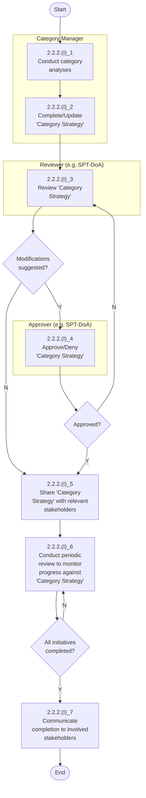

Procurement Manual (Business Processes)                                84


---


DEPARTMENT OF GOVERNMENT SUPPORT

## 2.2.2.(II) Create and Monitor 'Procurement Plan'

```mermaid
flowchart TD
    Start([Start]) --> A["2.2.2.(II)_1<br/>Share 'Demand<br/>Gathering Form' with<br/>relevant stakeholders"]
    
    A --> B["Demand<br/>Gathering Form"]
    
    B --> C["2.2.2.(II)_2<br/>Complete 'Demand<br/>Gathering Form' and<br/>validate budget<br/>availability"]
    
    C --> D{"Budget<br/>available?"}
    
    D -->|Y| E["2.2.2.(II)_3<br/>Submit completed<br/>'Demand Gathering<br/>Form'"]
    
    D -->|N| F["2.2.2.(II)_4<br/>Coordinate with<br/>Finance to increase<br/>budget availability"]
    
    F --> G{"Budget<br/>increased?"}
    
    G -->|Y| E
    G -->|N| H["2.2.2.(II)_5<br/>Decrease demand<br/>requirement to match<br/>budget availability"]
    
    H --> E
    
    E --> I["2.2.2.(II)_6<br/>Collate 'Demand<br/>Gathering Forms' and<br/>create the<br/>'Procurement Plan'"]
    
    I --> J["2.2.2.(II)_7<br/>Review 'Procurement<br/>Plan'"]
    
    J --> K{"Modifications<br/>suggested?"}
    
    K -->|Y| L["2.2.2.(II)_8<br/>Update 'Procurement<br/>Plan'"]
    K -->|N| M["2.2.2.(II)_9<br/>Approve/Deny<br/>'Procurement Plan'"]
    
    L --> M
    
    M --> N{"Approved?"}
    
    N -->|N| J
    N -->|Y| O["2.2.2.(II)_10<br/>Share 'Procurement<br/>Plan' with relevant<br/>stakeholders"]
    
    O --> P["2.2.2.(II)_11<br/>Conduct periodic<br/>review to monitor<br/>'Procurement Plan'"]
    
    P --> Q{"All initiatives<br/>complete?"}
    
    Q -->|N| P
    Q -->|Y| R["2.2.2.(II)_12<br/>Communicate<br/>completion to involved<br/>stakeholders"]
    
    R --> End([End])
```

Procurement Manual (Business Processes)85


---


DEPARTMENT OF GOVERNMENT SUPPORT

# 2.3.2.(I) Initiate Sourcing

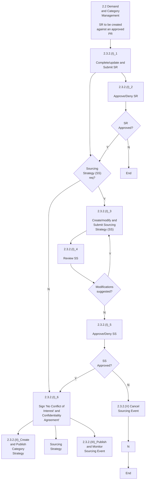

Procurement Manual (Business Processes)                                                86


---


DEPARTMENT OF GOVERNMENT SUPPORT

## 2.3.2.(II) Prepare, Publish, and Monitor Sourcing Events

```mermaid
flowchart TD
    subgraph Supplier
        A[2.3.2.(II)_1<br/>Prepare / Update<br/>response to the event]
        B{Additional<br/>Information<br/>required?}
        C{Need<br/>Extension on<br/>Deadline?}
        D[2.3.2.(II)_6<br/>Submit Response to<br/>the event<br/>(Including Bid bond<br/>receipt # if valid)]
        E[2.3.2.(II)_2<br/>Request Additional<br/>Information]
        F[2.3.2.(II)_4<br/>Request Extension<br/>on submission<br/>deadline]
    end
    
    subgraph "Sourcing Specialist - Sourcing Lead"
        G[2.3.2.(II)_Initiate<br/>Sourcing]
        H[2.3.2.(II)_6<br/>Create/Update and<br/>submit tender package]
        I[2.3.2.(II)_8<br/>Publish Sourcing Event<br/>(SE)]
        J[2.3.2.(II)_3<br/>Provide Requested<br/>Information]
        K{Should<br/>deadline be<br/>modified?}
        L[2.3.2.(II)_5<br/>Modify Sourcing<br/>Event deadline]
        M[2.3.2.(II)_7<br/>Close Sourcing Event<br/>as per deadline]
        N[2.3.2.(IV)_Evaluate<br/>Sourcing Event]
    end
    
    subgraph "Approver (as per DGA)"
        O[2.3.2.(II)_7<br/>Approve/Deny tender<br/>package]
        P{tender<br/>package<br/>Approved?}
    end
    
    G --> H
    H --> |tender<br/>package| O
    O --> P
    P --> |Y| I
    P --> |N| H
    I --> A
    A --> B
    B --> |Y| E
    B --> |N| C
    C --> |Y| F
    C --> |N| D
    E --> J
    F --> K
    J --> A
    K --> |Y| L
    K --> |N| M
    L --> A
    D --> M
    M --> N
```

87
Procurement Manual (Business Processes)


---


DEPARTMENT OF GOVERNMENT SUPPORT

# 2.3.2.(III) Evaluate Sourcing Events

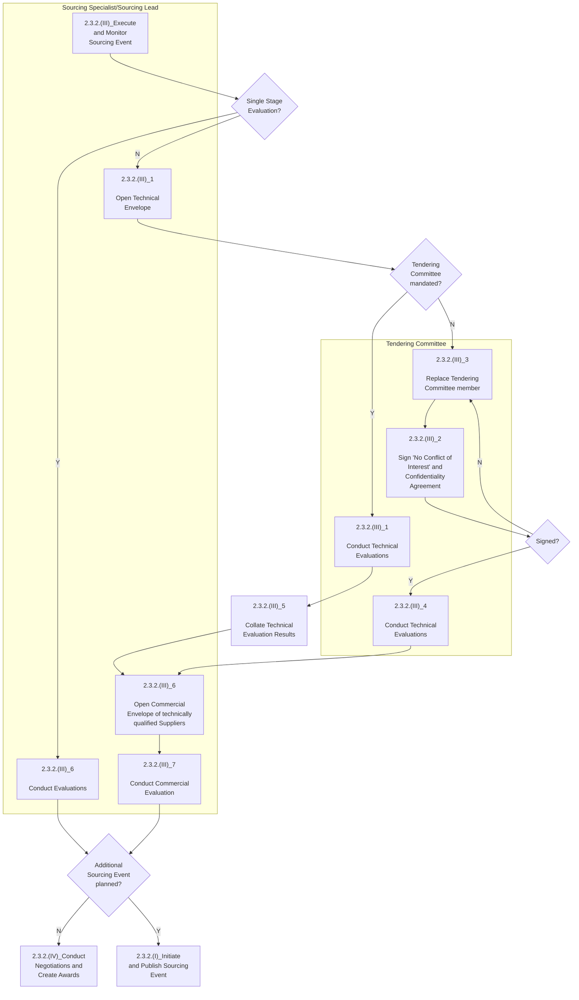

88
Procurement Manual (Business Processes)


---


DEPARTMENT OF GOVERNMENT SUPPORT

## 2.3.2.(IV) Conduct Negotiations and Create Award

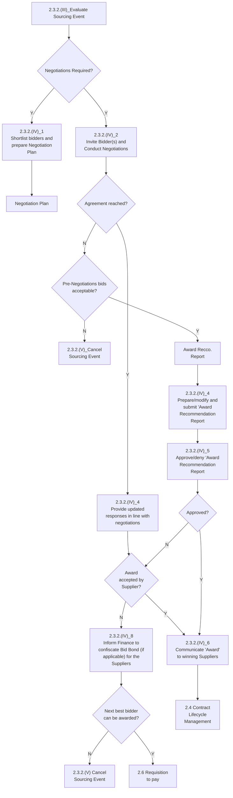

Procurement Manual (Business Processes)                                                89


---


DEPARTMENT OF GOVERNMENT SUPPORT

## 2.3.2.(V) Cancel Sourcing Event

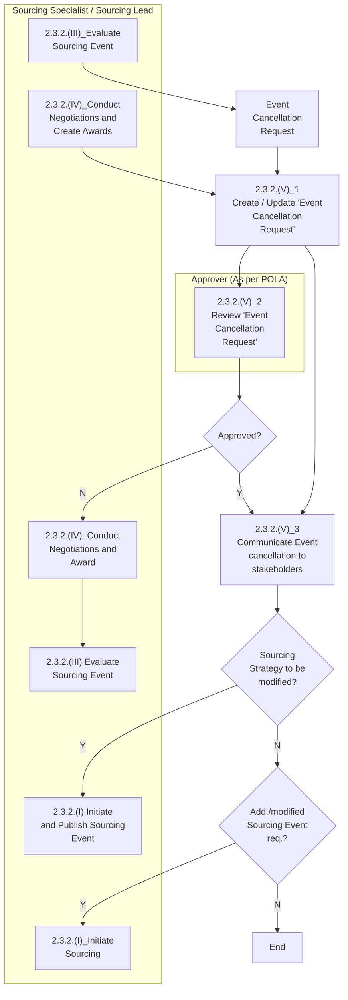

Procurement Manual (Business Processes)                                                                90


---


دائرة الدعم الحكومي
DEPARTMENT OF GOVERNMENT SUPPORT

## 2.4.2.(I) Create and Publish Contract

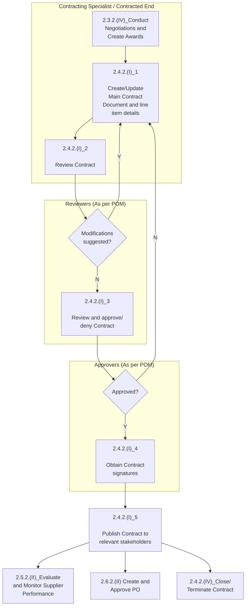

91
Procurement Manual (Business Processes)


---


DEPARTMENT OF GOVERNMENT SUPPORT

## 2.4.2.(II) Manage Contract Amendments

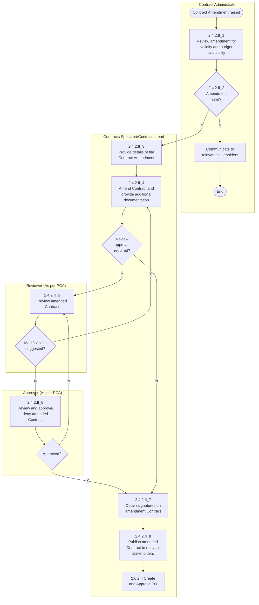

92
Procurement Manual (Business Processes)


---


DEPARTMENT OF GOVERNMENT SUPPORT

## 2.4.2.(III) Manage Contract Claims/Penalties/Disputes

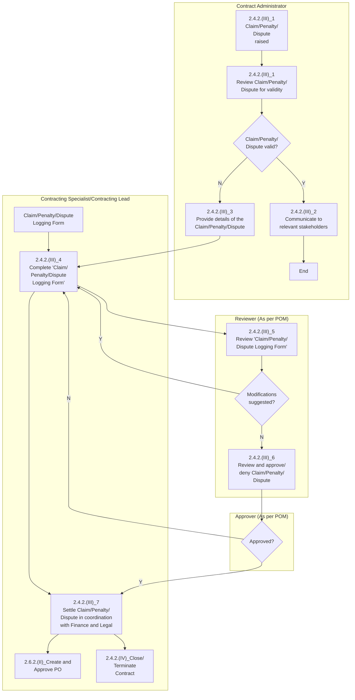

Procurement Manual (Business Processes)                                                                                                                          93


---


DEPARTMENT OF GOVERNMENT SUPPORT

## 2.4.2.(IV) Close Contract

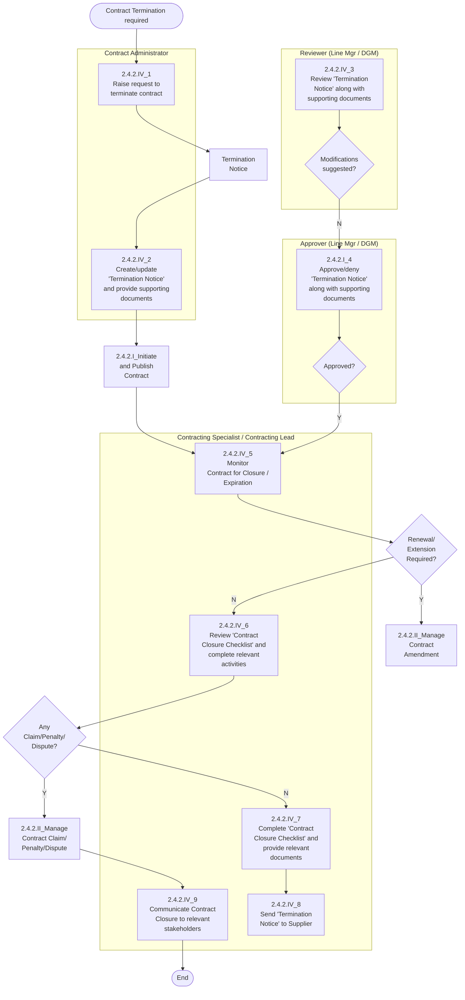

94
Procurement Manual (Business Processes)


---


DEPARTMENT OF GOVERNMENT SUPPORT

## 2.5.2.(I) Segment Suppliers

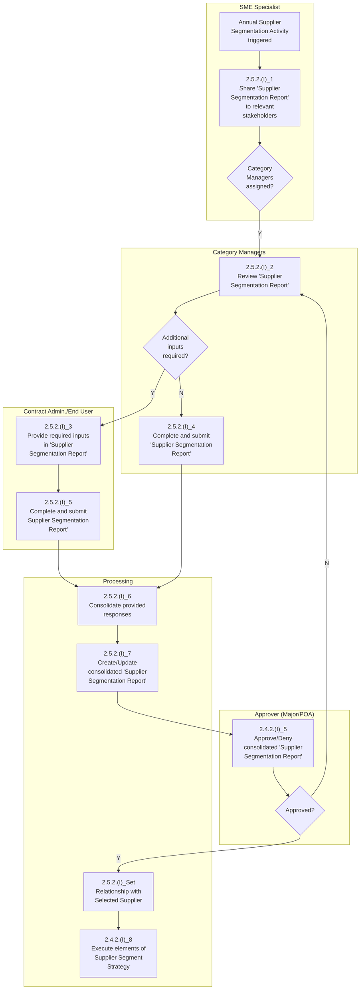

Procurement Manual (Business Processes)


---


DEPARTMENT OF GOVERNMENT SUPPORT

## 2.5.2.(II) Set Relationship with Selected Suppliers

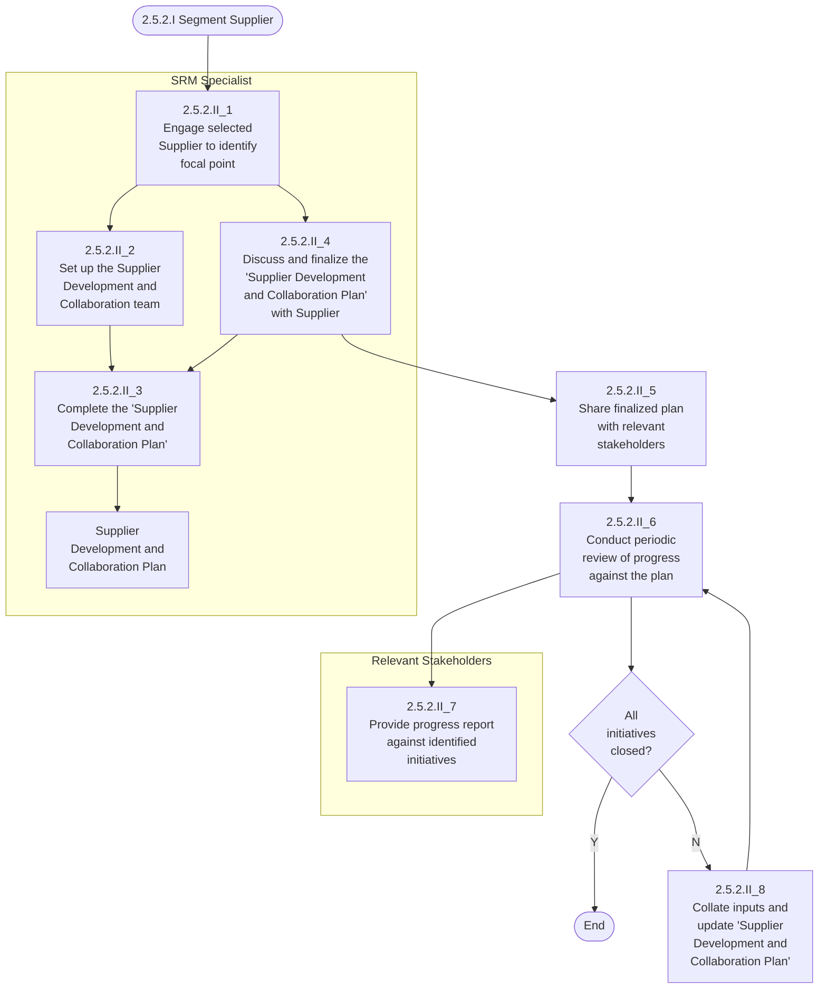

96
Procurement Manual (Business Processes)


---


DEPARTMENT OF GOVERNMENT SUPPORT

## 2.5.2.(III) Evaluate and Manage Supplier Performance

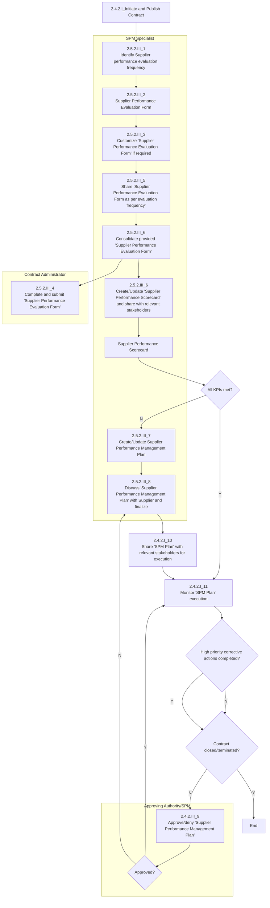

97
Procurement Manual (Business Processes)


---


DEPARTMENT OF GOVERNMENT SUPPORT

# 2.6.2.(I) Create and Approve PR

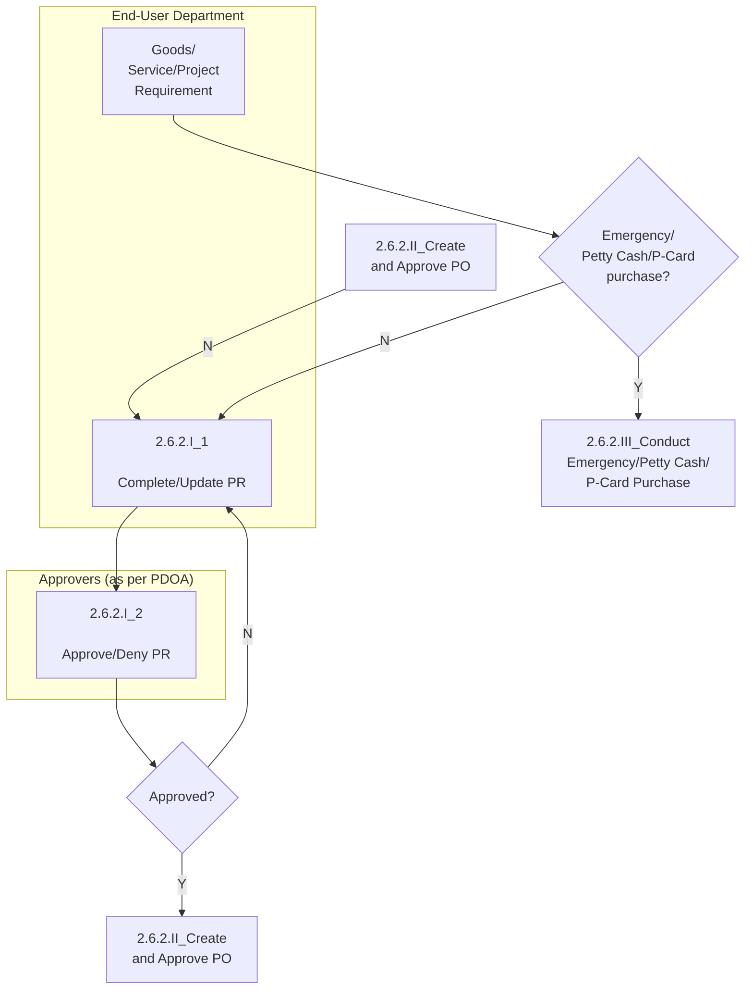

98
Procurement Manual (Business Processes)


---


DEPARTMENT OF GOVERNMENT SUPPORT

# 2.6.2.(II) Prepare and Approve PO

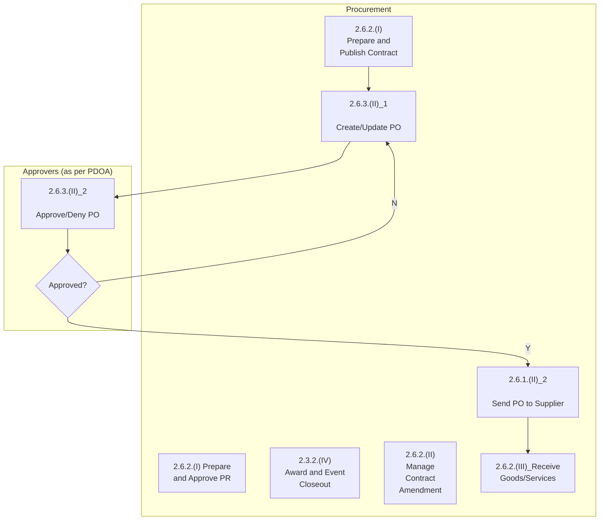

99
Procurement Manual (Business Processes)


---


DEPARTMENT OF GOVERNMENT SUPPORT

## 2.6.2.(III) Receive Goods/Services/Projects

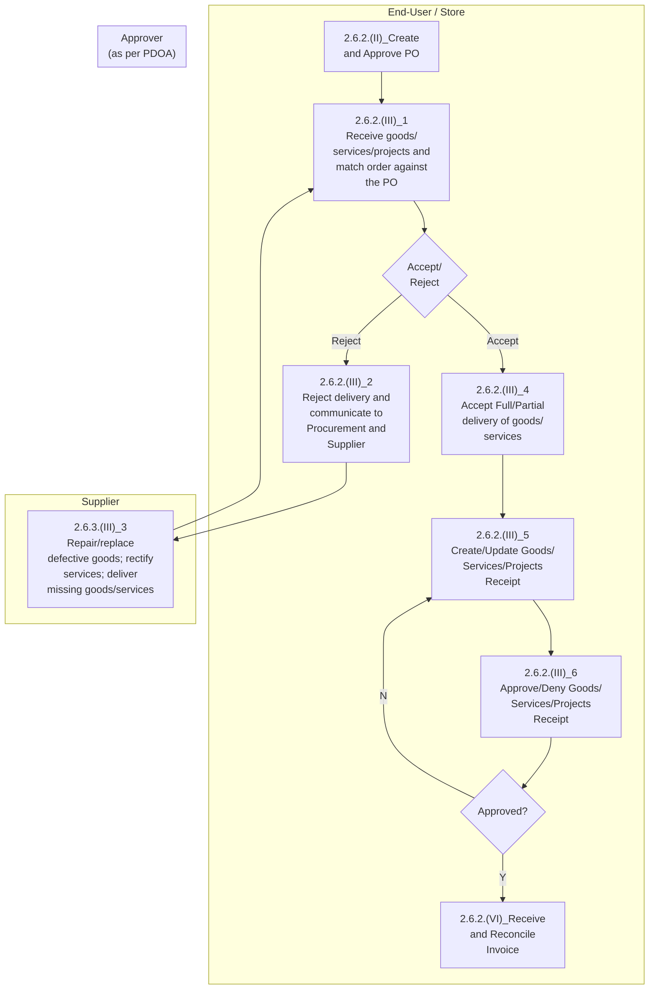

Procurement Manual (Business Processes)
<page_header>
DEPARTMENT OF GOVERNMENT SUPPORT
</page_header>

## 2.6.2.(III) Receive Goods/Services/Projects


<page_footer>
Procurement Manual (Business Processes)

100


---


DEPARTMENT OF GOVERNMENT SUPPORT

## 2.6.2.(IV) Conduct Emergency/Petty Cash/P-Card Purchase

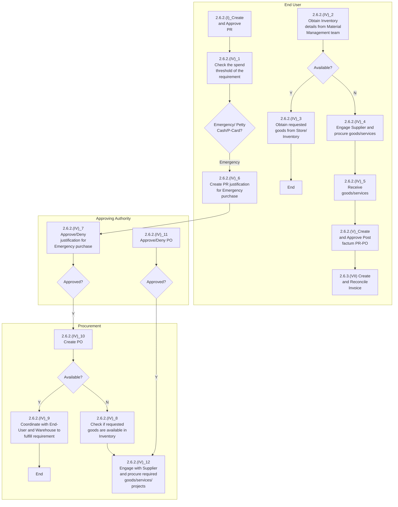

101
Procurement Manual (Business Processes)


---


DEPARTMENT OF GOVERNMENT SUPPORT

# 2.6.2.(V) Create and Approve Post Factum PR, PO, Goods/Services/Projects Receipt

```mermaid
flowchart TD
    A[2.6.2.(IV)_Conduct<br/>Emergency/Petty Cash/<br/>P-Card Purchase] --> B[2.6.2.(V)_1<br/>Complete/Update post<br/>factum PR]
    
    B --> C[2.6.2.(V)_2<br/>Approve/Deny post<br/>factum PR]
    
    C --> D{Approved?}
    
    D -->|Y| E[2.6.2.(V)_3<br/>Create/Update Post<br/>factum PO]
    
    D -->|N| F[2.6.2.(V)_4<br/>Approve/Deny post<br/>factum PO]
    
    E --> F
    
    F --> G{Approved?}
    
    G -->|Y| H[2.6.2.(V)_5<br/>Create/Update post<br/>factum Goods/<br/>Services/Projects<br/>Receipt]
    
    H --> I[2.6.2.(V)_6<br/>Approve/Deny post<br/>factum Goods/<br/>Services/Projects<br/>Receipt]
    
    I --> J{Approved?}
    
    J -->|Y| K[2.6.2.(VI)_Receive<br/>and Reconcile<br/>Invoice]
    
    J -->|N| L[End]
    
    G -->|N| M[End]
```

Procurement Manual (Business Processes)                                                                                     102


---


DEPARTMENT OF GOVERNMENT SUPPORT

## 2.6.2. (VI) Receive and Reconcile Invoice

```mermaid
flowchart TD
    subgraph Supplier
        A[2.6.2.(III)_Receive<br/>Goods/Services] --> B[2.6.2.(VI)_1<br/>Create/Update and<br/>submit Invoice<br/>(attach PO)]
    end
    
    subgraph Finance
        B --> C[Goods/<br/>Services/<br/>Projects<br/>Receipt<br/>PO]
        C --> D[Contract]
        D --> E[2.6.2.(VI)_3<br/>Review and Verify<br/>invoice completeness<br/>and reconciliation]
        E --> F{Discrepancies?}
        F -->|N| G[Process<br/>Invoice]
        F -->|Y| H[2.6.2.(VI)_4<br/>Reject Invoice and<br/>recommend<br/>modifications]
        H --> E
    end
    
    subgraph End-User
        I[2.6.2.(V)_Post<br/>Factum PR-PO-GR] --> J[2.6.2.(VI)_2<br/>Submit Invoice, and<br/>post factum PO and GR]
        J --> E
    end
```

Procurement Manual (Business Processes)
103


---


DEPARTMENT OF GOVERNMENT SUPPORT

## 2.7.2.(I) Conduct Supplier Risk Profiling

```mermaid
flowchart TD
    subgraph "SRM Specialist"
        A[Annual Supplier Risk Profiling] --> B["2.7.2.(I)_1<br/>Share 'Supplier Risk Profiling Report' to relevant stakeholders"]
        B --> C{Category Managers assigned?}
        C -->|N| D["2.7.2.(I)_2<br/>Review 'Supplier Risk Profiling Report'"]
        H["2.7.2.(I)_6<br/>Create/Update consolidated 'Supplier Risk Profiling Report'"] --> I["2.7.2.(I)_7<br/>Identify high risk Suppliers"] --> J["2.7.2.(II)_Manage Procurement Risks"]
    end
    
    subgraph "Category Managers"
        D --> E{Additional inputs required?}
        E -->|N| F["2.7.2.(I)_4<br/>Complete and submit Supplier Risk Profiling Report"]
        E -->|Y| G["2.7.2.(I)_3<br/>Provide required inputs in 'Supplier Risk Profiling Report'"]
    end
    
    subgraph "Contract Administrator / End User"
        G --> K["2.7.2.(I)_5<br/>Complete and submit 'Supplier Risk Profiling Report'"]
    end
    
    C -->|Y| D
    F --> H
    K --> H
    
    style A fill:#e1f5fe
    style B fill:#f3e5f5
    style D fill:#f3e5f5
    style F fill:#f3e5f5
    style G fill:#fff3e0
    style K fill:#fff3e0
    style H fill:#f3e5f5
    style I fill:#f3e5f5
    style J fill:#e8f5e8
```

104
Procurement Manual (Business Processes)


---


DEPARTMENT OF GOVERNMENT SUPPORT

## 2.7.2.(II) Manage Procurement Risks

<table>
<thead>
<tr>
<th>Role</th>
<th colspan="7">2.7.2.(II) Manage Procurement Risks</th>
</tr>
</thead>
<tbody>
<tr>
<td rowspan="2">SRM Specialist</td>
<td>Risk Identification, Assessment, and Mitigation</td>
<td>Risk Register and Mitigation Tracker</td>
<td></td>
<td></td>
<td></td>
<td>End</td>
</tr>
<tr>
<td>2.7.2.(II)_1<br>Share 'Risk Identification, Assessment, and Mitigation' document</td>
<td>2.7.2.(II)_3<br>Collate responses; complete/update 'Risk Register and Mitigation Tracker'</td>
<td>2.7.2.(II)_5<br>Share 'Risk Register and Mitigation Tracker' with relevant stakeholders</td>
<td>2.7.2.(II)_6<br>Conduct periodic reviews to monitor execution and update risk status</td>
<td>All high priority risks mitigated? → N</td>
<td>2.7.2.(II)_7<br>Communicate completion to involved stakeholders</td>
</tr>
<tr>
<td rowspan="7">Sourcing Lead/Contract Admin</td>
<td>2.7.2.(I) Profile Supplier Risk</td>
<td>↓</td>
<td>↑</td>
<td></td>
<td>↓ Y</td>
<td></td>
</tr>
<tr>
<td>2.2_Demand and Category Management</td>
<td>2.7.2.(II)_2<br>Complete and submit 'Risk Identification, Assessment, and Mitigation' document</td>
<td></td>
<td></td>
<td></td>
<td></td>
</tr>
<tr>
<td>2.3_Source to Contract</td>
<td>↓</td>
<td></td>
<td></td>
<td></td>
<td></td>
</tr>
<tr>
<td>2.4_Contract Lifecycle Management</td>
<td></td>
<td></td>
<td></td>
<td></td>
<td></td>
</tr>
<tr>
<td>2.5_Supplier Performance and Relationship Management</td>
<td></td>
<td></td>
<td></td>
<td></td>
<td></td>
</tr>
<tr>
<td>2.6_Requisition to Pay</td>
<td></td>
<td></td>
<td></td>
<td></td>
<td></td>
</tr>
<tr>
<td></td>
<td></td>
<td></td>
<td></td>
<td></td>
<td></td>
</tr>
<tr>
<td>Approvers (as per DoAs)</td>
<td></td>
<td>2.7.2.(II)_4<br>Approve/Deny 'Risk Register and Mitigation Tracker'</td>
<td>Approved? →</td>
<td></td>
<td></td>
<td></td>
</tr>
</tbody>
</table>

105
Procurement Manual (Business Processes)


---


DEPARTMENT OF GOVERNMENT SUPPORT

## 2.7.2.(III) Manage Regulation Change

```mermaid
flowchart TD
    Start([Regulation Change Plan]) --> A{Impact on Procurement?}
    
    A -->|Y| B[2.7.2.III_2<br/>Create/Update<br/>'Regulation Change<br/>Plan']
    A -->|N| C[2.7.2.III_1<br/>Communicate to the<br/>Relevant Stakeholder]
    
    C --> End1([End])
    
    B -->|N| D[2.7.2.III_3<br/>Approve/Deny 'Risk<br/>Register and Mitigation<br/>Tracker']
    
    D --> E{Approved?}
    E -->|Y| F[2.7.2.III_4<br/>Share 'Regulation<br/>Change Plan' with<br/>relevant stakeholders]
    
    F --> G[2.7.2.III_5<br/>Initiate periodic review<br/>of 'Regulation Change<br/>Plan' and monitor<br/>progress]
    
    G --> H{All initiatives<br/>completed?}
    H -->|Y| End2([End])
    H -->|N| G
    
    subgraph "Risk and Regulations Lead"
        A
        B
        C
        F
        G
        H
    end
    
    subgraph "Approver (As per DGA)"
        D
        E
    end
```

Procurement Manual (Business Processes)                                                106


---


DEPARTMENT OF GOVERNMENT SUPPORT

# 2.8.2.(I) Initiate Supplier Request

```mermaid
flowchart TD
    subgraph Supplier
        A[Initiate Registration Request on eGate] --> B{AD-DED Supplier?}
        B -->|N| C[2.8.2.I_1<br/>Email Entity to raise request]
        B -->|Y| D[2.8.2.I_2<br/>Complete and Submit Self-Registration Request Form]
        D --> E[Email]
        E --> F[Email]
    end
    
    subgraph "Entity User"
        C --> G[2.8.2.I_3<br/>Complete and Submit Entity Raised Request Form]
        G --> H[Entity]
        H --> I[Email]
    end
    
    subgraph "Supplier Data Management Specialist"
        F --> J[2.8.2.I_4<br/>Review Request]
        I --> J
        J --> K[2.8.2.I_5<br/>Request additional Information]
        K --> L{Form Submitted by Entity or Supplier?}
        L --> M{Duplicate Supplier?}
        M -->|N| N{Additional information required?}
        N -->|N| O{Requested Categories allowed as commercial activities in DED license?}
        O -->|Y| P[2.8.2.I_8<br/>Set Supplier Manager]
        P --> Q[2.8.2.I_7<br/>Approve Request]
        Q --> R[2.8.2.I Register Supplier]
        O -->|N| S[2.8.2.I_6<br/>Deny Request and provide justification]
        N -->|Y| K
        M -->|Y| S
    end
```

Procurement Manual (Business Processes)
107


---


DEPARTMENT OF GOVERNMENT SUPPORT

## 2.8.2.(II) Register Supplier

```mermaid
flowchart TD
    subgraph Supplier ["Supplier"]
        A["2.8.2.(I) Initiate<br/>Supplier Request"]
        B["2.8.2.(II)_1<br/>Start Registration<br/>(Create or Use existing<br/>ARIBA account)"]
        C{"Foreign<br/>Supplier?"}
    end
    
    subgraph SupplierManager ["Supplier Manager"]
        D["2.8.2.(II)_2<br/>Review attestation<br/>requirements"]
        E["2.8.2.(II)_3<br/>Complete / Update<br/>Registration<br/>Questionnaire"]
        F["2.8.2.(II)_4<br/>Review and approve/<br/>deny 'General<br/>Registration<br/>Questionnaire'"]
        G["2.8.2.(II)_5<br/>Request Additional/<br/>modified Information"]
        H{"Approved?"}
        I["2.8.2.(II)_9<br/>Supplier 'Registered' in<br/>Supplier Master<br/>Database"]
        J["2.8.2.(II)_8<br/>Complete / Update<br/>Internal Questionnaire"]
        K["2.8.2.(IV) Qualify/<br/>Disqualify Supplier"]
    end
    
    subgraph BankSpecialist ["Bank Information Specialist"]
        L["2.8.2.(II)_6<br/>Review and approve/<br/>deny 'Payment and<br/>Bank Questionnaire'"]
        M["2.8.2.(II)_7<br/>Request Additional/<br/>modified Information"]
        N{"Approved?"}
    end
    
    A --> B
    B --> C
    C -->|Y| D
    C -->|N| E
    D --> E
    E --> F
    F --> H
    H -->|N| G
    G --> F
    H -->|Y| L
    L --> N
    N -->|N| M
    M --> L
    N -->|Y| I
    I --> J
    J --> K
```

Procurement Manual (Business Processes)
108


---


DEPARTMENT OF GOVERNMENT SUPPORT

## 2.8.2.(III) Update Supplier Registration

```mermaid
flowchart TD
    subgraph "Data Maintenance Specialist"
        A[2.8.2.(III)_9<br/>Request additional/<br/>modified information]
        B[2.8.2.(III)_7<br/>Review and approve/<br/>deny the updates made]
        C{Approved?}
        D[2.8.2.(III)_8<br/>Information updated in<br/>Supplier Master<br/>Database]
    end
    
    subgraph "Supplier"
        E[Need to change<br/>Registration details]
        F[2.8.2.(III)_1<br/>Update required<br/>information in<br/>"Registration<br/>Questionnaire"]
        G{Payment and Bank<br/>Questionnaire<br/>Info.<br/>Updated in?}
    end
    
    subgraph "Entry User"
        H[Need to activate a<br/>Non AD-DED<br/>Supplier]
        I[2.8.2.(III)_2<br/>Complete/Update and<br/>send quick survey from<br/>"SAP Ariba Dashboard"]
    end
    
    subgraph "Supplier Manager"
        J[2.8.2.(III)_3<br/>Review and approve/<br/>deny request/updates]
        K[2.8.2.(III)_4<br/>Request additional/<br/>modified information]
        L{Request<br/>type?}
        M[2.8.2.(III)_6<br/>Information updated in<br/>Supplier Master<br/>Database]
        N{New<br/>Category<br/>Added?}
        O[2.8.2.(III)_5<br/>Update "Internal<br/>Questionnaire"]
        P[2.8.2.(IV) Qualify<br/>Disqualify Supplier]
    end
    
    E --> F
    F --> G
    G -->|Info. Update| I
    H --> I
    I -->|"General Registration<br/>Questionnaire"| J
    J --> K
    K --> L
    L -->|Non AD-DED activation| End1[End]
    L --> M
    M -->|Info.<br/>Update| N
    N --> P
    L -->|Non AD-DED<br/>activation| O
    
    B --> C
    C -->|Approved?| D
    C --> A
    A --> B
```

109
Procurement Manual (Business Processes)


---


DEPARTMENT OF GOVERNMENT SUPPORT

## 2.8.2.(IV) Qualify/Disqualify Supplier

```mermaid
flowchart TD
    subgraph Supplier
        A[2.8.2.(II) Register Supplier]
        B[Supplier registered for additional Category]
        C[Submit/Update Qualification Questionnaire Responses]
    end
    
    subgraph "Supplier Manager"
        D[2.8.2.(IV)_1<br/>Send qualification questionnaire]
        E[2.8.2.(IV)_3<br/>Review Questionnaire responses]
        F[2.8.2.(IV)_4<br/>Request Additional information]
        G{Approved?}
        H[2.8.2.(IV)_5<br/>Set qualification Expiry Date]
        I[Notification Email]
    end
    
    subgraph "Supplier Data Management Lead"
        J[2.8.2.(IV)_6<br/>Review Qualification Evaluation]
        K{Approved?}
        L[2.8.2.(IV)_7<br/>Request Additional information]
        M[2.8.2.(IV)_8<br/>Supplier status changes to 'Qualified']
    end
    
    A --> B
    B --> D
    D --> C
    C --> E
    E --> F
    F --> G
    G -->|Y| H
    H --> J
    J --> K
    K -->|Y| M
    K -->|N| L
    H --> I
```

110
Procurement Manual (Business Processes)


---


DEPARTMENT OF GOVERNMENT SUPPORT

## 2.8.2.(V) Identify "Preferred" Supplier

```mermaid
flowchart TD
    A[Yearly Review of Supplier Database] --> B[Select Supplier-Category combination]
    B --> C{Is Supplier MSME, Start-up, Emirati Entrepreneur?}
    C -->|Y| D{GWA Supplier?}
    C -->|N| E{Supplier in Top 80% of Cat. Spend}
    D -->|N| E
    D -->|Y| F{Supplier Performance Rating > 85%?}
    E -->|Y| F
    E -->|N| G[End]
    F -->|Y| H[Mark Supplier 'Preferred' for the category]
    F -->|N| G
    H --> G
    
    B1[Supplier Scorecard] -.-> B
    B2[Supplier Spend Profile] -.-> B
    
    subgraph "2.8.2.(V)_1"
        B
        B1
        B2
    end
    
    subgraph "2.8.2.(V)_2"
        H
    end
    
    style A fill:#e1f5fe
    style B fill:#4fc3f7
    style H fill:#4fc3f7
    style G fill:#424242,color:#fff
```

111
Procurement Manual (Business Processes)


---


DEPARTMENT OF GOVERNMENT SUPPORT

## 2.8.2.(VI) Deactivate/Reactivate Supplier

```mermaid
flowchart TD
    subgraph Supplier
        A[2.8.2.VI_3<br/>Renew Commercial/<br/>Industrial license]
    end
    
    subgraph "DED Helpdesk"
        B{DED License<br/>renewed?}
        C[2.8.2.VI_4<br/>Request to open the<br/>"Registration<br/>Questionnaire"]
        D[2.8.2.VI_7<br/>Update "General<br/>Registration<br/>Questionnaire" with<br/>renewed license]
        E[2.8.2.VI_5<br/>Forward the request<br/>to the Supplier<br/>Registration Team]
    end
    
    subgraph "Supplier Manager"
        F[2.8.2.VI_6<br/>Open the<br/>"Registration<br/>Questionnaire"]
        G[2.8.2.VI_8<br/>Request Additional/<br/>modified Information]
        H[2.8.2.VI_9<br/>"Reactivate" Supplier]
        I{Approved?}
        J((End))
    end
    
    subgraph "Supplier Data Management Specialist"
        K((Email))
        L[2.8.2.VI_1<br/>Request supplier to<br/>renew License]
        M[Supplier Master<br/>Database]
        N[Quarterly Review<br/>of Supplier Master<br/>Database]
        O{Commercial/<br/>industrial license<br/>expired?}
        P{Is supplier a second<br/>time offender?}
        Q[2.8.2.VI_2<br/>Deactivate Supplier<br/>in "SAPAriba" and<br/>provide justification]
        R{Registration<br/>Questionnaire<br/>open?}
    end
    
    N --> O
    O -->|Yes| P
    P -->|Yes| Q
    P -->|No| L
    L --> K
    K --> B
    B -->|Yes| R
    R -->|Yes| C
    C --> D
    R -->|No| E
    E --> F
    F --> G
    G --> I
    I -->|No| H
    H --> I
    I -->|Yes| J
    B -->|No| A
    A --> B
```

112


---


دائرة الدعم الحكومي
DEPARTMENT OF GOVERNMENT SUPPORT
[UAE Coat of Arms]

## 3.2 List of Figures

Figure 1.2.1 Procurement Capability Model .......................................................................................................... 7
Figure 1.2.2 Common vs. Entity Specific Categories .............................................................................................. 8
Figure 1.2.3 UNSPSC Categorizations ..................................................................................................................... 9
Figure 1.3.1 Procurement Capability Model ........................................................................................................ 10
Figure 2.1.1 Initiative Prioritization ...................................................................................................................... 20
Figure 2.1.2 Example - Implementation Plan ....................................................................................................... 21
Figure 2.2.1 Category Segmentation .................................................................................................................... 24
Figure 2.2.2 Engagement levels ........................................................................................................................... 25
Figure 2.3.1 PDoA guidelines for decision making – S2C processes ..................................................................... 30
Figure 2.4.1: Master Agreement – Sub-agreement Hierarchy ............................................................................. 41
Figure 2.5.1 Supplier Segmentation ..................................................................................................................... 49
Figure 2.5.2 Supplier Segment Strategy ............................................................................................................... 50
Figure 2.8.1 Supplier Classification ...................................................................................................................... 71
Figure 2.8.2 Communication Channels ................................................................................................................. 72
Figure 2.8.3 Supplier Registration - Attestation requirements ............................................................................. 74

## 3.3 List of Tables

Table 1.4.1 Procurement Benefits Classification .................................................................................................. 12
Table 1.4.2 Volume Estimation Methodologies ................................................................................................... 13
Table 1.4.3 Historic Baseline Price Calculation Methodologies ............................................................................ 13
Table 1.5.1 MSME Classification .......................................................................................................................... 17
Table 2.1.1 Examples - Procurement Objectives .................................................................................................. 19
Table 2.1.2 Examples – Procurement Initiatives and Outputs .............................................................................. 20
Table 2.1.3 Roles and Responsibilities – Create and Execute 'Procurement Strategy' ......................................... 21
Table 2.1.4 RACI Matrix – Procurement Strategy process group ......................................................................... 22
Table 2.2.1 Roles and Responsibilities - Create and Monitor 'Category Strategy' ................................................ 26
Table 2.2.2 Roles and Responsibilities – Create and Monitor 'Procurement Plan' ............................................... 28
Table 2.2.3 Work Aids – Forms and Documents - DCM process group ................................................................ 28
Table 2.2.4 RACI Matrix – DCM process group ..................................................................................................... 29
Table 2.3.1 Types of Sourcing Methods ............................................................................................................... 32
Table 2.3.2 Types of Sourcing Events ................................................................................................................... 32
Table 2.3.3 Roles and Responsibilities – Initiate Sourcing ................................................................................... 33
Table 2.3.4 Roles and Responsibilities – Prepare, Publish, and Monitor Sourcing Events .................................... 35
Table 2.3.5 Sourcing Event Evaluation methodologies ........................................................................................ 35
Table 2.3.6 Roles and Responsibilities – Evaluate Sourcing Event ....................................................................... 36
Table 2.3.7 Roles and Responsibilities – Conduct Negotiations and Create Award .............................................. 38

P.O.Box 981 Abu Dhabi, United Arab Emirates الإمارات العربية المتحدة، أبوظبي 981 ص.ب

T +971 (0)2 508 8888 F +971 (0)2 699 7420

dgs.gov.ae


---


DEPARTMENT OF GOVERNMENT SUPPORT

Table 2.3.8 Roles and Responsibilities – Cancel Sourcing Event ......................................................................... 39
Table 2.3.9 Work Aids –Forms and Document - S2C process group .................................................................... 39
Table 2.3.10 RACI Matrix – S2C process group..................................................................................................... 40
Table 2.4.1 Roles and Responsibilities – Create and Publish Contract................................................................. 42
Table 2.4.2 Types of Contract Amendments ......................................................................................................... 43
Table 2.4.3 Roles and Responsibilities – Manage Contract Amendments ............................................................ 44
Table 2.4.4 Roles and Responsibilities – Manage Contract Claims/Penalties/Disputes ....................................... 45
Table 2.4.5 Roles and Responsibilities – Close/Terminate Contract ..................................................................... 47
Table 2.4.6 Work Aids – Forms and Document - CLM process group .................................................................. 47
Table 2.4.7 RACI Matrix – CLM process group ..................................................................................................... 47
Table 2.5.1 Roles and Responsibilities – Segment Suppliers................................................................................. 51
Table 2.5.2 Supplier Development and Collaboration Team members ................................................................ 51
Table 2.5.3 Roles and Responsibilities – Set Relationships with Selected Suppliers............................................. 52
Table 2.5.4 Roles and Responsibilities – Evaluate and Manage Supplier performance........................................ 55
Table 2.5.5 Work Aids – Forms and Documents – SPRM process group ............................................................. 55
Table 2.5.6 RACI Matrix – SPRM process group ................................................................................................... 56
Table 2.6.1 Roles and Responsibilities – Create and Approve PR ......................................................................... 57
Table 2.6.2 Roles and Responsibilities – Create and Approve PO......................................................................... 58
Table 2.6.3 Roles and Responsibilities – Receive Goods/Services/Projects.......................................................... 59
Table 2.6.4 Roles and Responsibilities – Conduct Emergency/ Petty Cash/ P-Card Purchase .............................. 61
Table 2.6.5 Roles and Responsibilities – Create and Approve Post Factum PR, PO, Goods/Services/Projects
Receipt .................................................................................................................................................................. 62
Table 2.6.6 Roles and Responsibilities – Receive and Reconcile Invoice .............................................................. 62
Table 2.6.7 RACI Matrix – R2P process group ...................................................................................................... 63
Table 2.7.1 Roles and Responsibilities – Sources of procurement risks................................................................ 64
Table 2.7.2 Roles and Responsibilities – Conduct Supplier Risk Profiling ............................................................. 65
Table 2.7.3 Roles and Responsibilities – Manage Procurement Risks................................................................... 67
Table 2.7.4 Roles and Responsibilities – Manage Regulation Change .................................................................. 68
Table 2.7.5 Work Aids – Forms and Documents – R&R process group................................................................. 69
Table 2.7.6 RACI Matrix – R&R process group...................................................................................................... 69
Table 2.8.1 Roles and Responsibilities – Initiate Supplier Registration................................................................. 73
Table 2.8.2 Roles and Responsibilities - Register Supplier .................................................................................... 76
Table 2.8.3 Roles and Responsibilities - Update Supplier Registration................................................................. 77
Table 2.8.4 Roles and Responsibilities – Qualify/Disqualify Supplier.................................................................... 78
Table 2.8.5 Roles and Responsibilities – Identify Preferred Supplier.................................................................... 79
Table 2.8.6 Roles and Responsibilities – Deactivate/Reactivate Supplier............................................................. 80
Table 2.8.7 RACI Matrix – Supplier MDM process group ..................................................................................... 80
Table 2.9.1 RACI Matrix – Item MDM process group ........................................................................................... 82
Table 2.10.1 RACI Matrix – Item MDM process group ......................................................................................... 83

114
Procurement Manual (Business Processes)


---


DEPARTMENT OF GOVERNMENT SUPPORT

## 3.4 Glossary of Terms

The table below lists the abbreviations used in this Manual:

<table>
<thead>
<tr>
<th>AD-DED</th>
<th>Abu Dhabi Department of Economic Development</th>
</tr>
</thead>
<tbody>
<tr>
<td>ADLC</td>
<td>Abu Dhabi Local Content Program</td>
</tr>
<tr>
<td>AED</td>
<td>United Arab Emirates Dirham</td>
</tr>
<tr>
<td>AP</td>
<td>Accounts Payable</td>
</tr>
<tr>
<td>BATNA</td>
<td>Best Alternative to Negotiated Agreement</td>
</tr>
<tr>
<td>CLID</td>
<td>Contract Line Item Details</td>
</tr>
<tr>
<td>CLM</td>
<td>Contract Lifecycle Management</td>
</tr>
<tr>
<td>DCM</td>
<td>Demand and Category Management</td>
</tr>
<tr>
<td>DGS</td>
<td>Department of Government Support</td>
</tr>
<tr>
<td>EC</td>
<td>Executive Council</td>
</tr>
<tr>
<td>GPO</td>
<td>Government Procurement Office</td>
</tr>
<tr>
<td>ICV</td>
<td>In-Country Value</td>
</tr>
<tr>
<td>KPI</td>
<td>Key Performance Indicator</td>
</tr>
<tr>
<td>LAS</td>
<td>Least Acceptable Solution</td>
</tr>
<tr>
<td>MDM</td>
<td>Master Data Management</td>
</tr>
<tr>
<td>MSME</td>
<td>Micro, Small, and Medium Enterprises</td>
</tr>
<tr>
<td>MSS</td>
<td>Maximum Supportable Situation</td>
</tr>
<tr>
<td>PDoA</td>
<td>Procurement Delegation of Authority</td>
</tr>
<tr>
<td>PO</td>
<td>Purchase Order</td>
</tr>
<tr>
<td>PR</td>
<td>Purchase Requisition</td>
</tr>
<tr>
<td>R&R</td>
<td>Risk and Regulation</td>
</tr>
<tr>
<td>R2P</td>
<td>Requisition to Pay</td>
</tr>
<tr>
<td>RACI</td>
<td>Responsible, Accountable, Consulted and Informed</td>
</tr>
<tr>
<td>RFI</td>
<td>Request for Information</td>
</tr>
<tr>
<td>RFP</td>
<td>Request for Proposal</td>
</tr>
<tr>
<td>RFQ</td>
<td>Request for Quotation</td>
</tr>
<tr>
<td>S2C</td>
<td>Source to Contract</td>
</tr>
<tr>
<td>SLA</td>
<td>Service Level Agreement</td>
</tr>
<tr>
<td>SME</td>
<td>Subject Matter Expert</td>
</tr>
<tr>
<td>SOW</td>
<td>Scope of Work</td>
</tr>
<tr>
<td>SPM</td>
<td>Supplier Performance Management</td>
</tr>
<tr>
<td>SPOC</td>
<td>Single Point of Contact</td>
</tr>
<tr>
<td>SPRM</td>
<td>Supplier Performance and Relationship Management</td>
</tr>
<tr>
<td>SR</td>
<td>Sourcing Request</td>
</tr>
<tr>
<td>SRM</td>
<td>Supplier Relationship Management</td>
</tr>
<tr>
<td>TCO</td>
<td>Total Cost of Ownership</td>
</tr>
<tr>
<td>UAE</td>
<td>United Arab Emirates</td>
</tr>
</tbody>
</table>

115
Procurement Manual (Business Processes)


---


دائرة الدعم الحكومي
DEPARTMENT OF GOVERNMENT SUPPORT

## 3.5 Glossary of Definitions

The table below lists the definitions used in this Manual:

<table>
<thead>
<tr>
<th>Term</th>
<th>Definition / Description</th>
</tr>
</thead>
<tbody>
<tr>
<td>Bank Information Specialist</td>
<td>A system role assigned for validating the information provided in the "Payment and Bank Questionnaire".</td>
</tr>
<tr>
<td>Baseline Spend</td>
<td>Addressable spend against which any benefit is measured.</td>
</tr>
<tr>
<td>Bid Bond</td>
<td>A bank guarantee submitted with bids to assure serious participation in the tender.</td>
</tr>
<tr>
<td>Budget Owner</td>
<td>A business role accountable for spending decisions of the section/department.</td>
</tr>
<tr>
<td>Catalogue</td>
<td>A database of goods/services/projects readily available for raising a PR.</td>
</tr>
<tr>
<td>Common Category</td>
<td>Category procured by five or more Entities.</td>
</tr>
<tr>
<td>End-User</td>
<td>The requesters or requesting parties of goods, services and projects.</td>
</tr>
<tr>
<td>Entity</td>
<td>Local departments and every juridical person reporting to the Government and having full legal capacity to act and manage a public facility or aiming to provide a public service.</td>
</tr>
<tr>
<td>Entity-Specific Category</td>
<td>Category procured by less than five Entities</td>
</tr>
<tr>
<td>Finance</td>
<td>The function within the government entity dedicated to financial affairs.</td>
</tr>
<tr>
<td>Goods/Services/Projects Receipt</td>
<td>A document issued to acknowledge the receipt of goods/services/projects.</td>
</tr>
<tr>
<td>GPO Approver</td>
<td>Designated approvers from the GPO.</td>
</tr>
<tr>
<td>Head of Procurement</td>
<td>Individual assigned to lead the procurement unit.</td>
</tr>
<tr>
<td>Legal</td>
<td>The function within the government entity dedicated to legal affairs.</td>
</tr>
<tr>
<td>Limited Tender</td>
<td>A tendering method that is open to predefined number of registered Suppliers.</td>
</tr>
<tr>
<td>P-Card</td>
<td>Corporate card issued to authorized employees for making electronic payments for goods/service/projects.</td>
</tr>
<tr>
<td>Performance Bond</td>
<td>A bank guarantee provided by the supplier or contractor to secure good performance and compliance with of the contract terms and conditions.</td>
</tr>
<tr>
<td>Petty Cash</td>
<td>Small amounts of discretionary funds in the form of cash (defined in the PDoA) used for expenditures.</td>
</tr>
<tr>
<td>Procurement</td>
<td>The procurement function existing within or outside the government entity.</td>
</tr>
<tr>
<td>Procurement Benefits</td>
<td>Benefits that result in Cost Reduction, Cost Avoidance, and Cash Impact for procurement.</td>
</tr>
<tr>
<td>Procurement Charter</td>
<td>A formal document defining the roles and committees required for the procurement operations.</td>
</tr>
<tr>
<td>Procurement Delegation of Authority (PDoA)</td>
<td>A formal document defining division of authority and powers in the government entity related to procurement operations.</td>
</tr>
</tbody>
</table>

116
Procurement Manual (Business Processes)


---


DEPARTMENT OF GOVERNMENT SUPPORT

<table>
<thead>
<tr>
<th>Term</th>
<th>Definition / Description</th>
</tr>
</thead>
<tbody>
<tr>
<td>Procurement Framework</td>
<td>A set of interrelated documents devised to help procurement professionals in their work.</td>
</tr>
<tr>
<td>Procurement Standards</td>
<td>An integrated set of principles that harmonize the way of working, establish a unified operating model and define the performance of the Procurement.</td>
</tr>
<tr>
<td>Public Tender</td>
<td>A tendering method that is open to all Suppliers, and where the bids are invited through public announcements.</td>
</tr>
<tr>
<td>Purchase Order</td>
<td>A legally binding document issued by the government entity to Suppliers in reference to the Contract or the Price List Agreement or on a standalone basis, indicating key parameters of purchase such as quantities, agreed prices, delivery schedule, payment terms and other relevant information and committing both parties upon explicit or implicit confirmation by Supplier.</td>
</tr>
<tr>
<td>Purchase Requisition</td>
<td>A request generated by an End-User for securing goods/services/projects.</td>
</tr>
<tr>
<td>Request for Information (RFI)</td>
<td>Sourcing Event used for screening Suppliers and gathering information or budget estimates from a broad base of potential Suppliers.</td>
</tr>
<tr>
<td>Request for Proposal (RFP)</td>
<td>Sourcing Event used for seeking technical and commercial proposals from Suppliers.</td>
</tr>
<tr>
<td>Request for Quotation (RFQ)</td>
<td>Sourcing Event used for seeking pricing information for a defined scope of work or supply of specified goods or services.</td>
</tr>
<tr>
<td>Requestor</td>
<td>Any government employee raising a request for goods/services/projects or other services provided by the GPO.</td>
</tr>
<tr>
<td>Reverse Auction (eAuction)</td>
<td>Sourcing Event used for seeking competitive bids in real time for highly commoditized goods, services and projects where specifications have already been fully acknowledged by participating Suppliers.</td>
</tr>
<tr>
<td>Service Completion Certificate</td>
<td>A document issued to acknowledge the completion of a service.</td>
</tr>
<tr>
<td>Sole/Single Source</td>
<td>A tendering method that is open to only one qualified Supplier capable of supplying the required goods, services and projects or a single Supplier is selected from a pool of qualified Suppliers.</td>
</tr>
<tr>
<td>Sourcing Request</td>
<td>A request to find the supply source for the required goods/services/projects.</td>
</tr>
<tr>
<td>Supplier</td>
<td>An individual or an organization engaged to supply the goods/services/projects.</td>
</tr>
<tr>
<td>"Supplier Manager"</td>
<td>A system role assigned for registering and qualifying Suppliers.</td>
</tr>
<tr>
<td>Tendering Committee</td>
<td>A committee established to evaluate the results of relevant tenders and encourage cross-functional collaboration.</td>
</tr>
</tbody>
</table>

117
Procurement Manual (Business Processes)
